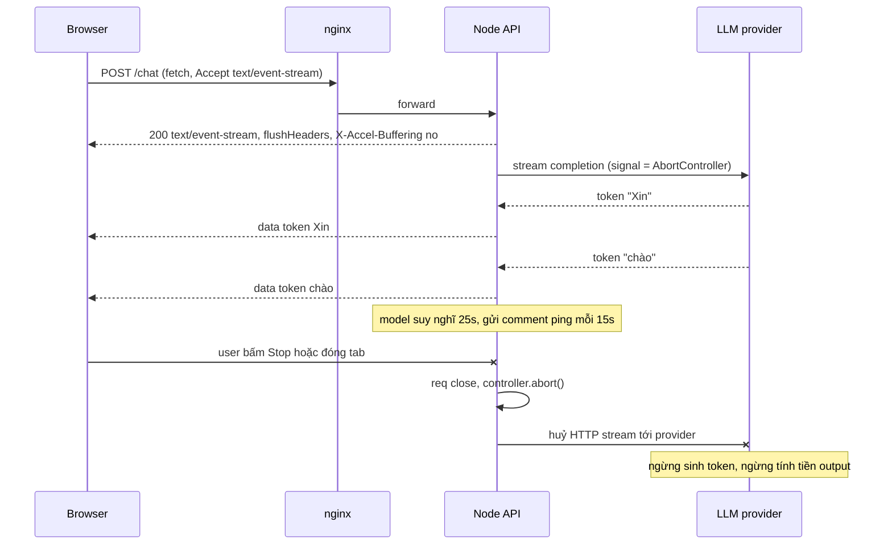
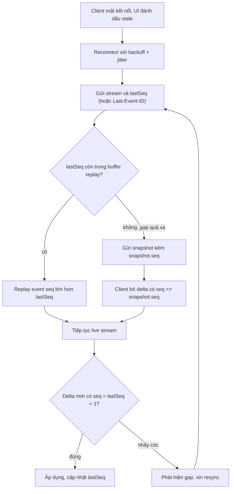
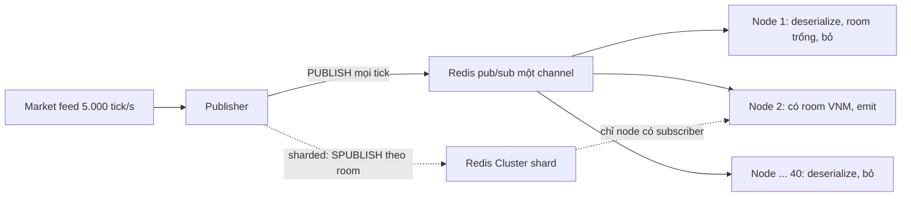

## Bối cảnh & vấn đề

Một sản phẩm có hai tính năng realtime. Thứ nhất là **chat LLM**: user gõ câu hỏi, câu trả lời hiện ra từng token. Ở local chạy mượt; lên production thì câu trả lời hiện **cả khối sau 20 giây**, và hoá đơn model cao hơn hẳn số câu trả lời thực sự hoàn thành. Thứ hai là **bảng giá chứng khoán** trên Socket.IO: 100k client, 2.000 mã. Lúc mở cửa thị trường, memory server nhảy từ 400 MB lên 3 GB, vài client thấy giá trễ 20 giây, và sau khi WiFi chập chờn 30 giây, client hiện **số dư tài khoản sai** cho tới khi refresh.

Những triệu chứng này không phải bug của một dòng code. Chúng đến từ việc một kết nối realtime sống **lâu** và đi qua **nhiều tầng** (CDN, LB, nginx, middleware, Node, Redis), mỗi tầng có buffer, timeout và giả định riêng. Một request HTTP thường kết thúc trong 200 ms nên các giả định đó vô hại; một stream sống 30 phút thì mọi buffer, mọi idle timeout, mọi lần deploy đều trở thành sự cố.

Bài này nối tiếp [bài download và export](/tracks/scenario-files/learn/download-range-export): cùng là "response dài", nhưng ở đây dữ liệu **sinh ra theo thời gian** chứ không có sẵn. Thứ tự: chọn SSE hay WebSocket, giao thức SSE và các tầng buffer, huỷ upstream LLM, reconnect không mất event, slow consumer và conflation, fan-out khi scale nhiều node, và half-open connection.

**Interview angle:** interviewer ít khi hỏi API Socket.IO. Họ hỏi "cái gì xảy ra khi mạng xấu, khi deploy, khi 40 node, khi client chậm", tức là failure mode của kết nối dài.

## Khái niệm

### SSE (Server-Sent Events)

**SSE** là một HTTP response bình thường với `Content-Type: text/event-stream` không bao giờ kết thúc ngay: server ghi từng **event** dạng text, mỗi event là các dòng `field: value` và kết thúc bằng một dòng trống. Các field: `data:` (nội dung), `event:` (tên event), `id:` (định danh để resume), `retry:` (ms chờ trước khi reconnect). Dòng bắt đầu bằng `:` là **comment**, client bỏ qua, dùng làm heartbeat.

```text
retry: 3000
id: 1842
event: order-updated
data: {"orderId":"o_1","status":"shipped"}

: ping
```

Browser có sẵn `EventSource`: tự reconnect, tự gửi header **`Last-Event-ID`** chứa `id` cuối cùng đã nhận. Vì là HTTP, SSE đi qua cookie, auth, LB, HTTP/2 như mọi request khác. Hạn chế: `EventSource` chỉ làm `GET` và không set header tuỳ ý (không gửi được `Authorization: Bearer`, không gửi body), nên chat LLM thường dùng `fetch()` POST rồi tự parse `text/event-stream` từ `response.body`.

### WebSocket và Socket.IO

**WebSocket** bắt đầu bằng HTTP `Upgrade`, sau đó là kênh **hai chiều** full-duplex gửi frame nhị phân hoặc text. Không có khái niệm event id, reconnect hay room: tất cả phải tự xây. **Socket.IO** là thư viện trên WebSocket (với fallback HTTP long-polling) thêm: reconnect tự động, heartbeat ping/pong, **room** (nhóm socket để broadcast), acknowledgement, và **adapter** để broadcast qua nhiều node. Socket.IO có giao thức riêng, nên client WebSocket thuần không nói chuyện được với server Socket.IO.

### SSE hay WebSocket cho LLM (câu 006)

Một câu trả lời LLM là luồng **một chiều** server → client cho mỗi câu hỏi; câu hỏi của user là một `POST` bình thường. Vì vậy **SSE (hoặc fetch streaming)** là đủ: đơn giản, dùng lại toàn bộ hạ tầng HTTP (auth, rate limit, logging, LB), không cần sticky session. Chọn **WebSocket** khi thực sự cần hai chiều liên tục trên cùng kênh: voice realtime, collaborative editing, interrupt giữa chừng với độ trễ thấp, hoặc server đẩy nhiều loại event không gắn với một request. Dù chọn gì, cả hai đều cần ba thứ: tắt buffering ở proxy, heartbeat, và **huỷ upstream LLM call** khi client bỏ đi.

**Interview angle:** trả lời trong một phút: "một chiều theo request → SSE; hai chiều liên tục → WebSocket; cả hai phải xử lý buffering, heartbeat, cancel".

### Buffering

**Buffering** là việc một tầng giữ bytes lại để gửi theo khối lớn, tối ưu throughput. Với response thường đó là tốt; với stream thì là thảm hoạ vì token bị giữ tới khi buffer đầy hoặc response kết thúc. Các thủ phạm: nginx `proxy_buffering on` (mặc định), middleware `compression()` gom chunk để nén hiệu quả, CDN và một số API Gateway buffer toàn bộ response (REST API Gateway không stream; cần Lambda response streaming, Function URL hoặc ALB, verify).

### Sequence number, snapshot và replay

**Sequence number (seq)** là số tăng đơn điệu gắn vào mỗi event của một stream (ví dụ stream số dư của account `a_9`), cấp từ **nguồn** chứ không từ từng gateway node. Client nhớ `lastSeq`. Khi reconnect, server **replay** các event có seq lớn hơn từ một buffer (Redis Stream, Kafka) nếu khoảng thiếu còn trong buffer; nếu không, gửi **snapshot** (trạng thái hiện tại kèm seq) rồi delta tiếp. Ví dụ: client `lastSeq = 1840`, buffer giữ 1700–1900 → replay 1841–1900; client `lastSeq = 900` → gửi snapshot `{balance: 12.500.000, seq: 1900}`.

### Slow consumer và conflation

**Slow consumer** là client đọc chậm hơn tốc độ server gửi (mạng 3G, máy yếu, tab ở background). Server không thể "chờ" một client mà không làm chậm các client khác, nên message xếp trong **buffer của từng socket** (engine.io `writeBuffer`, rồi TCP send buffer). **Conflation** là gộp các update của cùng một key, chỉ giữ giá trị mới nhất: thay vì gửi 50 tick của mã VNM trong một giây, gửi giá mới nhất mỗi 250 ms. Chỉ áp dụng được cho dữ liệu **last value wins** (giá, trạng thái hiển thị); không áp dụng cho event mà mỗi cái đều có nghĩa (lệnh khớp, thay đổi số dư).

### Half-open connection

**Half-open connection** là khi một phía đã "chết" (điện thoại đổi từ WiFi sang 4G, NAT timeout xoá mapping) nhưng không có gói FIN/RST nào tới phía kia. Server vẫn thấy socket mở, đếm vào metric, giữ memory, và `emit` vào buffer; client có thể cũng chưa biết mình mất kết nối nên không reconnect. TCP keepalive của OS mặc định chờ khoảng 2 giờ mới thăm dò, quá chậm. Chỉ **heartbeat ở tầng application** mới phát hiện kịp.

## Cơ chế hoạt động

### LLM streaming qua SSE: bytes, buffer và huỷ



Đọc sơ đồ theo ba điểm. **Một là header gửi sớm**: `res.flushHeaders()` ngay khi bắt đầu, để client nhận `200` và biết kết nối sống trước khi token đầu tiên tới (time-to-first-token có thể vài giây). **Hai là mỗi tầng phải chuyển tiếp ngay**: `X-Accel-Buffering: no` bảo nginx không buffer response này; middleware nén phải loại trừ `text/event-stream` hoặc gọi `res.flush()` sau mỗi write. **Ba là huỷ phải lan tới provider**: khi browser đóng, Node thấy `req`/`res` `close`, gọi `abort()` trên controller đã truyền vào SDK, SDK đóng HTTP stream tới provider và provider ngừng sinh. Thiếu bước này, model vẫn sinh hết 2.000 token cho một người đã rời đi: đó chính là "bill cao hơn số câu trả lời hoàn thành".

Heartbeat comment `: ping` giữ kết nối không bị coi là idle. ALB mặc định idle timeout 60 giây, nginx `proxy_read_timeout` mặc định 60 giây: model "suy nghĩ" 70 giây mà không gửi gì là bị cắt im lặng.

### Reconnect: replay hay snapshot (câu 039)



Vòng này giải quyết lỗi "số dư sai sau khi WiFi rớt 30 giây": trong 30 giây đó có ba lệnh khớp, client không nhận, và sau reconnect chỉ nhận delta mới nên số dư lệch vĩnh viễn. Với seq, client biết chính xác mình thiếu gì. Có hai bẫy tinh tế. Snapshot và live stream chạy song song, nên delta có thể tới **trước** snapshot hoặc **trùng** với nội dung snapshot; quy tắc "bỏ delta có seq ≤ snapshot.seq" và buffer delta tới khi có snapshot xử lý cả hai. Và seq phải cấp ở **nguồn** (service account, Kafka partition offset), vì nếu mỗi gateway node tự đánh số thì reconnect sang node khác là số không khớp.

**Socket.IO Connection State Recovery** (v4.6+) khôi phục room và gửi lại packet bị lỡ trong `maxDisconnectionDuration`, nhưng chỉ khi adapter hỗ trợ (adapter dựa trên Redis Streams hỗ trợ, adapter Redis pub/sub cổ điển thì không, verify) và nó hoạt động ở tầng transport, không thay thế seq ở tầng nghiệp vụ.

**Interview angle:** nói "snapshot + seq + bỏ delta cũ" và "seq cấp từ nguồn" là đủ phân biệt câu trả lời senior với "Socket.IO tự reconnect rồi".

### Fan-out qua nhiều node với Redis adapter



Redis adapter dạng pub/sub gửi **mọi** broadcast tới **mọi** node; mỗi node nhận, deserialize, rồi mới biết room đó không có socket local. Từ 4 lên 40 node, mỗi tick bị giao 40 lần thay vì 4: Redis CPU tăng tuyến tính, còn CPU mỗi node **không giảm** vì mỗi node vẫn xử lý toàn bộ luồng tick (câu 040). Redis pub/sub thường còn chạy fan-out trên một thread. Fix: **sharded pub/sub** (Redis 7 `SSUBSCRIBE`/`SPUBLISH`; `@socket.io/redis-adapter` có `createShardedAdapter`, verify) để node chỉ subscribe channel của room có client local; hoặc gateway tự subscribe topic theo symbol (NATS subject, Kafka) khi có client đầu tiên vào room và huỷ khi người cuối rời đi. Giảm lượng ở nguồn cũng hiệu quả: conflate ở publisher còn 4–10 update/s mỗi symbol, gom nhiều symbol vào một message.

## Ví dụ thực tế

### Endpoint LLM SSE đúng chuẩn (câu 042)

```ts
app.post("/chat", async (req, res) => {
  res.set({
    "Content-Type": "text/event-stream",
    "Cache-Control": "no-cache, no-transform",      // no-transform: proxy đừng nén/biến đổi
    "X-Accel-Buffering": "no",                       // nginx: không buffer route này
  });
  res.flushHeaders();

  const ac = new AbortController();
  let completed = false;
  res.on("close", () => { if (!completed) ac.abort(); });   // client bỏ đi
  const ping = setInterval(() => res.write(": ping\n\n"), 15_000);

  let tokens = 0;
  try {
    const stream = await llm.stream({ messages: req.body.messages, signal: ac.signal });
    for await (const chunk of stream) {
      tokens++;
      const ok = res.write(`data: ${JSON.stringify({ t: chunk.text })}\n\n`);
      if (!ok) await once(res, "drain");             // tôn trọng backpressure của client chậm
    }
    res.write("event: done\ndata: {}\n\n");
    completed = true;
    res.end();
  } catch (e: any) {
    if (ac.signal.aborted) log.info("chat_cancelled", { tokens });  // đo token bị bỏ
    else if (!res.writableEnded) { res.write(`event: error\ndata: ${JSON.stringify({ code: "upstream" })}\n\n`); res.end(); }
  } finally { clearInterval(ping); }
});
```

Với `compression()` trong Express, thêm `filter` loại trừ `text/event-stream`, hoặc gọi `res.flush()` sau mỗi write (verify theo version middleware). Config nginx tương ứng nếu không muốn dựa vào header:

```nginx
location /chat {
  proxy_pass http://api;
  proxy_buffering off;
  proxy_read_timeout 300s;        # lớn hơn thời gian sinh dài nhất
  proxy_http_version 1.1;
}
```

Phía client dùng `fetch` để POST và gửi `Authorization`, rồi tự parse SSE:

```ts
const ac = new AbortController();
stopButton.onclick = () => ac.abort();              // huỷ fetch → server thấy close
const res = await fetch("/chat", { method: "POST", body: JSON.stringify({ messages }),
  headers: { "Content-Type": "application/json", Authorization: `Bearer ${token}` }, signal: ac.signal });
const reader = res.body!.pipeThrough(new TextDecoderStream()).getReader();
let buf = "";
for (;;) {
  const { value, done } = await reader.read();
  if (done) break;
  buf += value;
  let i;
  while ((i = buf.indexOf("\n\n")) >= 0) {           // một event kết thúc bằng dòng trống
    const evt = buf.slice(0, i); buf = buf.slice(i + 2);
    const data = evt.split("\n").filter((l) => l.startsWith("data: ")).map((l) => l.slice(6)).join("\n");
    if (data) render(JSON.parse(data).t);
  }
}
```

Kiểm tra nhanh bằng curl (output minh hoạ, không phải log chạy thật): `-N` tắt buffer của curl; nếu token hiện ra cùng lúc sau 20 giây thì có tầng nào đó đang buffer.

```text
$ curl -N -X POST https://api.example.com/chat -H "Content-Type: application/json" -d '{"messages":[...]}'
data: {"t":"Xin"}

data: {"t":" chào"}

: ping

event: done
data: {}
```

Gỡ lỗi "cả khối sau 20 giây" bằng cách đo từng chặng: curl thẳng vào pod (bỏ qua LB), rồi qua nginx, rồi qua CDN. Chặng đầu tiên token bị gom là chặng có buffer.

### SSE dashboard: tab thứ 7 và deploy mất event (câu 026)

Trên **HTTP/1.1**, browser giới hạn khoảng **6 connection mỗi host** (Chrome, Firefox). Mỗi `EventSource` giữ một connection mãi, nên tab thứ 7 không mở được SSE, và mọi XHR khác tới cùng host trong tab đó cũng xếp hàng. Fix: bật **HTTP/2** ở edge (multiplex nhiều stream trên một connection, giới hạn thường ~100 stream), hoặc dùng một connection chung cho các tab qua `SharedWorker`/`BroadcastChannel`.

Mất event sau deploy xảy ra vì server không gửi `id:`, nên browser không có `Last-Event-ID` để gửi khi reconnect; và dù có, server cũng không lưu event gần đây. Fix phía server:

```ts
app.get("/events", async (req, res) => {
  res.set({ "Content-Type": "text/event-stream", "Cache-Control": "no-cache", "X-Accel-Buffering": "no" });
  res.flushHeaders();
  res.write(`retry: ${3000 + Math.floor(Math.random() * 2000)}\n\n`);   // jitter: tránh reconnect storm
  const last = req.get("Last-Event-ID");
  const missed = last ? await redis.xrange(`events:${req.user.tenantId}`, `(${last}`, "+", "COUNT", 1000) : [];
  if (last && missed.length === 1000) res.write(`event: resync\ndata: {}\n\n`);  // gap quá xa → client tải snapshot
  for (const [id, fields] of missed) res.write(`id: ${id}\ndata: ${fields[1]}\n\n`);
  // ... subscribe live, ghi mỗi event với id = Redis Stream id
});
```

Redis Stream với `XADD ... MAXLEN ~ 10000` (hoặc giữ theo thời gian, ví dụ 5 phút) làm buffer replay; id của Stream tăng đơn điệu nên dùng thẳng làm `id:` của SSE.

### Socket.IO: conflation cho client chậm (câu 038)

5.000 tick/s × 10.000 client là 50 triệu message/s nếu gửi hết: không khả thi. Mỗi `socket.emit` xếp message vào buffer của socket đó; client chậm làm buffer phình (400 MB → 3 GB) và message cũ vẫn gửi theo thứ tự, nên client thấy giá trễ 20 giây. Fix bằng conflation + room theo symbol + ngắt client quá chậm:

```ts
const latest = new Map<string, Map<string, Tick>>();     // socketId → symbol → tick mới nhất

feed.on("tick", (t: Tick) => {
  for (const id of io.sockets.adapter.rooms.get(`sym:${t.symbol}`) ?? []) {
    let m = latest.get(id); if (!m) latest.set(id, (m = new Map()));
    m.set(t.symbol, t);                                   // ghi đè: last value wins
  }
});

setInterval(() => {                                       // flush 4 lần/giây
  for (const [id, m] of latest) {
    const s = io.sockets.sockets.get(id);
    if (!s) { latest.delete(id); continue; }
    const buffered = (s.conn as any).writeBuffer?.length ?? 0;   // nội bộ engine.io, verify theo version
    if (buffered > 200) { s.disconnect(true); latest.delete(id); continue; }  // client quá chậm
    s.volatile.emit("prices", [...m.values()].map((t) => [t.symbol, t.price, t.ts]));  // payload gọn
    m.clear();
  }
}, 250);
```

`volatile.emit` bỏ message nếu transport chưa sẵn sàng, thay vì xếp hàng. Mỗi client nhận tối đa 4 message/giây bất kể feed nhanh cỡ nào, và mỗi message chỉ chứa symbol client đã subscribe (`socket.join("sym:VNM")`). Event **lệnh khớp và số dư** thì không bao giờ conflate hay volatile: chúng đi kênh riêng có seq và replay như sơ đồ ở trên.

### Heartbeat và half-open (câu 041)

Gateway báo 80k connection nhưng chỉ 30k user active: phần chênh là half-open. Socket.IO có ping/pong sẵn (`pingInterval` 25 s, `pingTimeout` 20 s mặc định, verify); với `ws` thuần phải tự làm:

```ts
const wss = new WebSocketServer({ server });
wss.on("connection", (ws) => { (ws as any).alive = true; ws.on("pong", () => ((ws as any).alive = true)); });
setInterval(() => {
  for (const ws of wss.clients) {
    if (!(ws as any).alive) { ws.terminate(); continue; }   // không pong từ lần trước → chết
    (ws as any).alive = false; ws.ping();
  }
}, 25_000);                                                  // < ALB idle timeout 60 s
```

Phía client cũng phải tự phát hiện: không nhận ping hoặc message nào trong N giây thì đóng và reconnect, vì client cũng có thể đang half-open. `terminate()` (không phải `close()`) vì `close()` chờ handshake đóng từ phía đã chết. Metric nên tách: connections mở, sessions đã auth và active, lý do disconnect, độ trễ pong.

## Thiết kế: market data 100k client trong một quý (câu 049)

Đầu vào: Socket.IO, 100k client, 2.000 symbol, p99 3 giây lúc mở cửa, bill gấp đôi.

**Đo trước khi sửa.** Gắn timestamp vào message ở từng chặng (feed → publisher → Redis → gateway → client ack mẫu) để biết latency nằm ở đâu. Đo outbound message/s và bytes/client, buffered bytes mỗi socket, traffic Redis adapter, tỉ lệ connection churn, và phân rã bill (compute, egress, Redis).

**Quick wins (2–4 tuần).** Conflation 4–10 Hz mỗi symbol mỗi client; chỉ gửi symbol đã subscribe; payload gọn (mảng thay vì object có key dài, delta, msgpack parser); ép `transports: ["websocket"]` cho client hỗ trợ để bỏ long-polling (bỏ luôn nhu cầu sticky session); cân nhắc tắt `permessage-deflate` vì nó tốn CPU và memory mỗi connection.

**Kiến trúc (phần còn lại của quý).** Tách **market data** (lossy, last value) khỏi **account events** (lossless, seq + replay + snapshot service). Fan-out theo topic bằng sharded pub/sub hoặc NATS để node chỉ nhận symbol có client local. Gateway stateless, autoscale theo connections và outbound msg/s chứ không theo CPU. Ngắt client chậm theo ngưỡng buffer.

**Rollout.** SLO p99 dưới 500 ms; shadow traffic; canary theo phần trăm client; feature flag cho tần số conflation; so sánh chi phí với dịch vụ managed (API Gateway WebSocket, vendor pub/sub) theo đơn vị connection-minute và message.

## Trade-offs & lựa chọn thay thế

| Tiêu chí | SSE / fetch streaming | WebSocket thuần | Socket.IO | Long-polling |
|---|---|---|---|---|
| Chiều | Server → client | Hai chiều | Hai chiều | Mô phỏng hai chiều |
| Qua hạ tầng HTTP | Tự nhiên | Cần Upgrade, LB hỗ trợ | Cần Upgrade hoặc sticky cho polling | Tự nhiên |
| Reconnect + resume | Có sẵn (`Last-Event-ID`) | Tự làm | Reconnect có, recovery tuỳ adapter | Tự làm |
| Giới hạn HTTP/1.1 6 conn | Bị ảnh hưởng | Không | Không (khi dùng WS) | Bị ảnh hưởng |
| Binary | Không (text) | Có | Có | Có |
| Hợp khi | LLM token, notification, dashboard | Game, voice, protocol riêng | Chat, room, prototype nhanh | Môi trường chặn WS |

| Dữ liệu | Chiến lược khi client chậm | Khi reconnect |
|---|---|---|
| Lossy, last value (giá, presence) | Conflate, volatile, drop | Snapshot hiện tại là đủ |
| Lossless (lệnh, số dư, tin nhắn) | Không drop; ngắt client nếu quá chậm | seq + replay, gap xa thì snapshot |

**Chọn SSE** khi luồng một chiều gắn với request hoặc người dùng; nó rẻ nhất về vận hành. **Chọn WebSocket thuần** khi cần hiệu năng và kiểm soát protocol, chấp nhận tự xây reconnect và resume. **Socket.IO** cho tốc độ phát triển (room, ack, adapter), đổi lại phải hiểu adapter và buffer nội bộ khi scale. Quan trọng hơn chọn transport là **phân loại dữ liệu lossy hay lossless** từ đầu, vì nó quyết định chiến lược backpressure và reconnect.

## Edge cases & failure modes

- **Reconnect storm sau deploy**: 100k client reconnect cùng giây làm gateway và auth service sập. Backoff có jitter phía client, `retry:` ngẫu nhiên phía server, drain node từ từ khi deploy.
- **Delta tới trước snapshot**: buffer delta tới khi có snapshot, rồi bỏ delta có seq ≤ snapshot.seq.
- **Seq cấp theo node**: reconnect sang node khác thì số không còn ý nghĩa; seq phải từ nguồn.
- **Idle timeout ở LB**: ALB 60 s, nginx `proxy_read_timeout` 60 s; heartbeat phải nhỏ hơn idle timeout của **mọi** tầng.
- **Compression gom chunk**: `compression()` không loại trừ `text/event-stream` thì token tới cả khối.
- **Retry LLM giữa chừng**: rớt kết nối rồi gửi lại cả câu hỏi là sinh lại từ đầu và trả tiền hai lần; lưu partial output theo message id để client resume.
- **Tab ở background**: browser throttle timer, xử lý message chậm; client trở thành slow consumer mà không hề có mạng xấu.
- **Long-polling không sticky**: Socket.IO polling với nhiều node mà không sticky session thì handshake lỗi "Session ID unknown".
- **Auth hết hạn trong kết nối dài**: token 15 phút nhưng socket sống 8 giờ; cần re-auth định kỳ hoặc ngắt khi token bị thu hồi.
- **Một Redis cho mọi thứ**: adapter fan-out chiếm hết CPU Redis làm chậm cả cache và session; tách instance cho pub/sub.

## Pitfalls

- ❌ Dùng WebSocket cho mọi thứ "realtime" → ✅ luồng một chiều theo request dùng SSE/fetch streaming, đơn giản và đi qua hạ tầng HTTP.
- ❌ Không huỷ LLM call khi client đóng → ✅ `res.on("close")` gọi `abort()` trên `AbortController` truyền vào SDK; log token bị huỷ.
- ❌ Để nginx/compression mặc định cho route stream → ✅ `X-Accel-Buffering: no`, `proxy_buffering off`, loại trừ `text/event-stream` khỏi nén.
- ❌ Gửi SSE không có `id:` → ✅ gửi `id:` mỗi event, lưu buffer replay, xử lý `Last-Event-ID`.
- ❌ `emit` mọi tick cho mọi client → ✅ room theo symbol, conflation, volatile, ngắt client quá chậm.
- ❌ Conflate cả event số dư → ✅ chỉ conflate dữ liệu last value; event nghiệp vụ dùng seq + replay.
- ❌ Scale node khi Redis adapter là nút thắt → ✅ sharded pub/sub hoặc subscribe theo topic chỉ khi có client local.
- ❌ Tin metric "80k connections" → ✅ heartbeat hai chiều, `terminate()` khi không pong, đếm sessions active riêng.
- ❌ Dựa vào TCP keepalive của OS → ✅ heartbeat tầng application nhỏ hơn idle timeout của LB.

## Câu chuyện kinh nghiệm: kể theo STAR (câu 058)

Câu behavioral "kể lần stream realtime hỏng" chấm ở chỗ bạn có **số liệu** và **cơ chế**. Khung gợi ý: **Situation**: loại dữ liệu (giá, trạng thái đơn, notification), số connection, triệu chứng (giá trễ, số dư sai sau reconnect, memory tăng lúc cao điểm). **Task**: SLO cần giữ (p99 latency, không mất event quan trọng). **Action**: instrument timestamp theo chặng và buffered bytes, giả lập mạng xấu bằng network throttling, thêm seq + snapshot cho dữ liệu lossless, conflation cho dữ liệu lossy, căn heartbeat với idle timeout của LB. **Result**: con số trước và sau (p99 từ 3 s xuống 300 ms, memory ổn định, hết ticket "số dư sai"). Kết bằng một bài học thiết kế: phân loại lossy và lossless ngay từ đầu.

## Tóm tắt

- Một chiều theo request (LLM token, notification) → SSE/fetch streaming; hai chiều liên tục → WebSocket/Socket.IO.
- Stream qua nhiều tầng: tắt buffering ở nginx, compression, CDN/API Gateway; `flushHeaders` sớm; heartbeat nhỏ hơn idle timeout.
- Client đóng thì huỷ upstream LLM bằng `AbortController`, nếu không vẫn trả tiền token không ai đọc.
- SSE resume bằng `id:` + `Last-Event-ID` + buffer replay; HTTP/1.1 giới hạn ~6 connection/host, dùng HTTP/2.
- Reconnect đúng: seq cấp từ nguồn, replay nếu gap nhỏ, snapshot nếu gap lớn, bỏ delta cũ hơn snapshot.
- Slow consumer: buffer từng socket phình; conflation, room theo symbol, volatile, ngắt client quá chậm; chỉ cho dữ liệu lossy.
- Redis adapter pub/sub fan-out tới mọi node; scale bằng sharded pub/sub hoặc subscribe theo topic.
- Half-open: heartbeat hai chiều tầng application, `terminate()` khi không pong, đo sessions active thay vì số socket.
