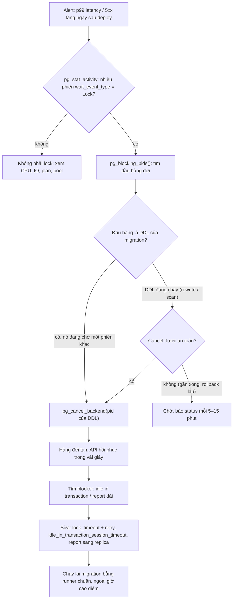
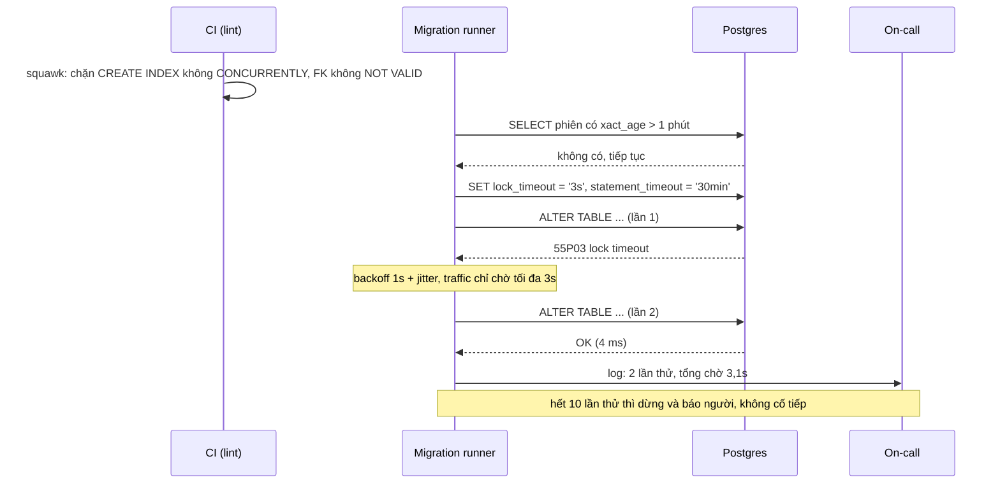

## Bối cảnh & vấn đề

Bài này là **playbook** (kịch bản xử lý) cho họ câu hỏi "migration này làm sập production, vì sao và sửa thế nào". Lý thuyết nền (lock level, lock queue, các pha của `CREATE INDEX CONCURRENTLY`, index INVALID, `NOT VALID`) đã có ở [Zero-downtime schema migrations](/tracks/sql-postgres/learn/zero-downtime-migrations) và [Locking & concurrency control](/tracks/sql-postgres/learn/locking-concurrency). Ở đây ta dùng lại kiến thức đó theo góc nhìn người trực: nhìn triệu chứng, chẩn đoán trong 2 phút, dập lửa, rồi sửa quy trình để không lặp lại.

Một tình huống điển hình: 10:02 pipeline chạy migration `ALTER TABLE orders ADD COLUMN channel text`. Trên staging câu này mất 5 ms. Trên production, trong vòng vài giây mọi API chạm vào `orders` timeout, pool connection 20/20 của mỗi pod đầy, health check fail, Kubernetes bắt đầu restart pod (càng làm tệ hơn vì pod mới lại mở connection và cũng xếp hàng). Không có câu nào "chậm" theo nghĩa CPU: DB gần như rảnh. Mọi thứ đang **chờ lock**.

Tình huống thứ hai, cùng họ: một migration Knex thêm index `(tenant_id, status, created_at)` chạy 2 giây trên staging, nhưng chặn mọi INSERT vào `orders` 6 phút trên production. Thứ ba: thêm foreign key từ `order_items` (900M row) sang `orders` làm checkout treo 12 phút. Thứ tư: `ADD COLUMN id2 uuid NOT NULL DEFAULT gen_random_uuid()` khoá bảng 40 phút trong khi `ADD COLUMN created_by text DEFAULT 'system'` của đồng nghiệp chỉ mất 5 ms.

Bốn sự cố này có chung một gốc: **câu DDL lấy một lock mạnh hơn mức traffic chịu được, hoặc giữ lock đó lâu hơn mức traffic chịu được, hoặc phải chờ để lấy lock trong khi chặn người khác**. Playbook vì thế xoay quanh ba câu hỏi cho mỗi statement: lấy lock gì, giữ bao lâu, chờ bao lâu.

## Khái niệm

### Ba câu hỏi cho mỗi DDL: lock gì, giữ bao lâu, chờ bao lâu

**Lock mode** quyết định ai bị chặn. `ACCESS EXCLUSIVE` (đa số `ALTER TABLE`) chặn cả `SELECT`; `SHARE` (`CREATE INDEX` thường) cho đọc nhưng chặn mọi ghi; `SHARE ROW EXCLUSIVE` (`ADD FOREIGN KEY`) chặn ghi trên **cả hai bảng**; `SHARE UPDATE EXCLUSIVE` (`CREATE INDEX CONCURRENTLY`, `VALIDATE CONSTRAINT`) không chặn đọc ghi thường. Bảng xung đột đầy đủ ở [locking](/tracks/sql-postgres/learn/locking-concurrency).

**Thời gian giữ** phụ thuộc DDL có phải đọc hoặc ghi lại cả bảng không. Thêm cột nullable chỉ sửa catalog (mili giây). Thêm cột với default volatile phải **rewrite** bảng (thời gian tỉ lệ với kích thước bảng). Thêm FK phải **scan** bảng con để kiểm tra. **Thời gian chờ** phụ thuộc có transaction nào đang giữ lock xung đột không: một report query 10 phút, một phiên `idle in transaction` bị bỏ quên, một `pg_dump` đang chạy.

Một DDL an toàn phải ngắn ở **cả ba** chiều, hoặc dùng mode nhẹ đủ để không ai quan tâm nó chạy bao lâu. **Interview angle:** trả lời theo khung "lock gì / giữ bao lâu / chờ bao lâu" cho thấy bạn phân tích được mọi DDL lạ, không chỉ thuộc lòng vài trường hợp.

### Lock queue và vì sao `SELECT` cũng bị chặn

Khi `ALTER` xin `ACCESS EXCLUSIVE` mà chưa được cấp, nó vào **hàng đợi lock** của bảng. Request đến sau phải tương thích với cả lock đang giữ **và** lock đang chờ phía trước, nên `SELECT` mới (cần `ACCESS SHARE`) xếp sau `ALTER`. Kết quả: một phiên idle cộng một DDL "instant" bằng một outage toàn bảng. Đây là mấu chốt của câu scenario-migration-028; đọc kỹ sơ đồ ở [bài lý thuyết](/tracks/sql-postgres/learn/zero-downtime-migrations).

Phép tính cần nói được bằng số: API timeout 5 giây, pool 20 connection mỗi pod. Mỗi request chạm `orders` chiếm một connection và chờ. Nếu một pod nhận 50 request/giây thì sau 0,4 giây pool đã đầy, các request tiếp theo chờ connection ở phía app. Nghĩa là **chỉ cần chờ lock khoảng một giây là đủ cạn pool**, không cần tới 5 giây.

### `lock_timeout` khác `statement_timeout`

`lock_timeout` hủy statement khi nó **chờ lấy một lock** quá N ms (lỗi `55P03 lock_not_available`, message `canceling statement due to lock timeout`). `statement_timeout` hủy statement khi **tổng thời gian chạy** (gồm cả chờ) quá N ms (lỗi `57014 query_canceled`). Với DDL, cái nguy hiểm là thời gian **chờ**, vì trong lúc chờ nó chặn mọi người phía sau. Nên `lock_timeout` ngắn (1–5 giây) là lá chắn chính, còn `statement_timeout` dài (vài phút tới vài chục phút) để giới hạn bước `VALIDATE` hay backfill chạy quá lâu.

Đặt ở đâu? **Session của migration** (`SET lock_timeout = '3s'` ngay đầu) hoặc role riêng (`ALTER ROLE migrator SET lock_timeout = '3s'`). Đừng đặt global cho app: app cũng có những câu chờ lock hợp lệ (`SELECT ... FOR UPDATE` chờ vài trăm ms), và `lock_timeout` global thấp biến chúng thành lỗi. Tương đương ở engine khác: SQL Server `SET LOCK_TIMEOUT 3000`, MySQL `lock_wait_timeout` (cho metadata lock của DDL, mặc định tới 1 năm (verify)).

**Interview angle:** red flag là "đặt `statement_timeout` là đủ": `statement_timeout = 15min` vẫn để DDL chờ lock 15 phút và chặn traffic suốt thời gian đó.

### Fast default và default volatile

Từ PG 11, `ADD COLUMN ... DEFAULT <biểu thức non-volatile>` không rewrite bảng: Postgres tính giá trị **một lần**, lưu vào `pg_attribute.attmissingval`, và trả nó cho các row cũ khi đọc. Hằng số (`'system'`, `0`) và hàm STABLE như `now()` (tính một lần lúc ALTER, mọi row cũ nhận cùng timestamp) đều nhanh. Hàm **VOLATILE** (`gen_random_uuid()`, `clock_timestamp()`, `random()`) phải cho mỗi row một giá trị khác nên Postgres rewrite cả bảng dưới `ACCESS EXCLUSIVE`. Đó là toàn bộ câu trả lời cho scenario-migration-009; phần chạy thật bên dưới đo đúng khác biệt này.

Cách làm đúng cho cột uuid NOT NULL: thêm cột nullable (instant), `ALTER COLUMN id2 SET DEFAULT gen_random_uuid()` (chỉ áp cho row **mới**, không đụng row cũ), backfill row cũ theo batch ([bài 02](/tracks/scenario-migration/learn/expand-contract-backfill)), rồi NOT NULL qua `CHECK (id2 IS NOT NULL) NOT VALID` → `VALIDATE` → `SET NOT NULL` (PG 12+ dùng CHECK hợp lệ làm bằng chứng, bỏ qua scan) → drop CHECK.

### `NOT VALID` + `VALIDATE` cho FK và CHECK

`ADD CONSTRAINT ... FOREIGN KEY` mặc định vừa thêm constraint vừa **kiểm tra mọi row cũ** trong cùng một statement, giữ `SHARE ROW EXCLUSIVE` trên bảng con và bảng cha suốt thời gian scan, nên INSERT/UPDATE/DELETE trên cả hai bảng bị chặn. `NOT VALID` tách ra: bước thêm chỉ sửa catalog và bắt đầu áp constraint cho row **mới** (ngay lập tức, row mới vi phạm bị từ chối), bước `VALIDATE CONSTRAINT` scan row cũ chỉ với `SHARE UPDATE EXCLUSIVE` ở bảng con và `ROW SHARE` ở bảng cha, không chặn ghi.

Trước khi validate, phải tìm **orphan row** (row con trỏ tới cha không tồn tại), vì `VALIDATE` gặp orphan đầu tiên là fail toàn bộ. Và đừng quên index trên `order_items(order_id)`: không có nó, mỗi `DELETE` ở `orders` phải seq scan bảng con để kiểm tra FK.

### `CREATE INDEX CONCURRENTLY` và migration tool

`CREATE INDEX` thường giữ `SHARE` suốt thời gian build: đọc được, ghi bị chặn. `CONCURRENTLY` không chặn ghi nhưng **không được chạy trong transaction block** vì nó tự commit giữa các pha. Các tool bọc mỗi migration trong transaction theo mặc định (Knex, TypeORM, node-pg-migrate, Flyway (verify cho từng tool)), nên lỗi `CREATE INDEX CONCURRENTLY cannot run inside a transaction block` là dấu hiệu bạn cần **tắt transaction cho riêng file đó**: Knex `export const config = { transaction: false }`, TypeORM `transaction = false` trên class migration (verify theo version), node-pg-migrate `pgm.noTransaction()`.

Đừng "sửa" lỗi bằng cách bỏ chữ `CONCURRENTLY`: lỗi biến mất trên staging, còn production bị chặn ghi vài phút. Và sau CIC luôn kiểm tra `pg_index.indisvalid`, vì CIC thất bại để lại index INVALID mà mọi INSERT vẫn phải cập nhật (chi tiết ở [bài lý thuyết](/tracks/sql-postgres/learn/zero-downtime-migrations)).

### Online DDL ở MySQL và SQL Server

**MySQL 8 (InnoDB)** có online DDL: `ALGORITHM=INSTANT` cho ADD COLUMN (8.0.12+, ở vị trí bất kỳ từ 8.0.29 (verify)), `ALGORITHM=INPLACE, LOCK=NONE` cho index. "Online" vẫn cần **metadata lock** độc quyền ngắn ở đầu và cuối, nên MySQL cũng có lock queue y hệt Postgres: một transaction dài giữ MDL làm DDL chờ, và mọi query sau DDL chờ theo. Thay đổi nặng thì dùng **gh-ost** (tạo bảng bóng, copy row theo chunk, đọc binlog để áp thay đổi, throttle theo replica lag, cutover có thể hoãn tới khi người vận hành cho phép) hoặc **pt-online-schema-change** (dùng trigger).

**SQL Server**: `CREATE INDEX ... WITH (ONLINE = ON)` chỉ có ở Enterprise / Azure SQL (verify theo edition), `RESUMABLE = ON` cho phép tạm dừng và chạy tiếp (2017+ cho rebuild, 2019+ cho create (verify)), `WAIT_AT_LOW_PRIORITY` để thao tác online nhường lock thay vì chen hàng. Thêm cột NOT NULL với default hằng là metadata-only trên Enterprise 2012+ (verify).

Câu chốt cho cả ba engine: **"online" không có nghĩa là không lock**, mà là lock mạnh chỉ giữ rất ngắn ở hai đầu. Nên vẫn cần timeout và retry.

### Guardrail thay cho trí nhớ

Ba sự cố trong một quý (scenario-migration-052) không phải do kỹ sư kém, mà do quy trình phụ thuộc vào việc **mỗi người nhớ** hết các luật trên. Guardrail là cơ chế tự động chặn lỗi trước khi nó tới production: linter migration trong CI (ví dụ **squawk** cho Postgres), migration runner chuẩn tự đặt timeout và retry, test migration trên dữ liệu cỡ production, template PR. Mỗi postmortem thêm đúng một rule. Phần ví dụ có một runner và một bộ rule cụ thể.

## Cơ chế hoạt động

### Runbook khi migration làm sập API



Đọc sơ đồ từ trên xuống. Bước đầu là phân biệt "chờ lock" với "quá tải": nếu phần lớn phiên có `wait_event_type = 'Lock'` thì đây là lock queue, còn nếu CPU hay IO cao thì là chuyện khác. `pg_blocking_pids(pid)` trả về những pid đang chặn một phiên; đi ngược chuỗi tới **đầu hàng**. Trong sự cố lock queue điển hình, đầu hàng là chính câu DDL đang **chờ**, nên cancel nó là đủ: nó chưa làm gì, cancel không mất gì, và hàng đợi tan ngay. Đừng kill ngẫu nhiên các query API bị chặn: chúng là nạn nhân, kill chúng không giải phóng hàng đợi.

Nếu DDL đã được cấp lock và đang rewrite bảng (default volatile, `ALTER TYPE`), cancel sẽ rollback phần đã làm, thường nhanh vì Postgres chỉ bỏ file mới. Quyết định cancel hay chờ phụ thuộc thời gian còn lại; với rewrite 40 phút thì gần như luôn cancel. Sau khi dập lửa mới tìm nguyên nhân gốc và sửa quy trình.

### Migration an toàn đi qua runner chuẩn



Runner làm ba việc mà kỹ sư hay quên: kiểm tra transaction dài trước khi bắt đầu (nếu có thì chờ hoặc dừng), đặt timeout cho session, và retry riêng lỗi `55P03` với backoff có jitter. Giới hạn số lần thử là quan trọng: nếu bảng bận liên tục 10 lần liền, có thể có một job dài đang chạy, và cố tiếp chỉ tạo thêm 10 lần nghẽn 3 giây. Lúc đó dừng và để người quyết định.

## Ví dụ thực tế

Các con số dưới đây chạy thật trên **PostgreSQL 17.11** (Docker, `postgres:17`, laptop đang chạy nhiều container khác nên thời gian tuyệt đối chỉ để so sánh). Bảng `orders` có 3M row (249 MB), `order_items` có 6M row (473 MB). Script Node dùng `pg` 8.

### Lock queue: không có và có `lock_timeout`

Một phiên report mở transaction, đọc `orders` rồi bỏ đó (`idle in transaction`). Migration chạy `ALTER TABLE orders ADD COLUMN channel text`. Năm "API call" (`SELECT ... WHERE id = $1`, mỗi call có `statement_timeout = 5s`) đến 300 ms sau.

```text
=== ALTER with lock_timeout = 0 (default) ===
 pid | blocked_by | state               | wait   | query
  91 | []         | idle in transaction | Client | SELECT count(*) FROM orders WHERE status = 'p…
  94 | [ 91 ]     | active              | Lock   | ALTER TABLE orders ADD COLUMN channel text
  96 | [ 94 ]     | active              | Lock   | SELECT id, status FROM orders WHERE id = $1
  97 | [ 94 ]     | active              | Lock   | SELECT id, status FROM orders WHERE id = $1
  ... (5 API probes, all blocked_by 94)
API probes: 5010ms canceling statement due to statement timeout  (x5)
ALTER ok after 5381ms

=== ALTER with lock_timeout = 2s ===
API probes: [ '1692ms ok', '1692ms ok', '1691ms ok', '1691ms ok', '1692ms ok' ]
ALTER failed after 2006ms: canceling statement due to lock timeout (code 55P03)
```

Cột `blocked_by` kể toàn bộ câu chuyện: các `SELECT` bị chặn bởi **pid 94 (ALTER)**, không phải pid 91 (report). Không có `lock_timeout`, cả năm API call timeout sau 5 giây, và ALTER chỉ chạy được khi report commit. Có `lock_timeout = 2s`, ALTER tự rút sau 2006 ms, API call chỉ chậm 1,7 giây rồi thành công. Runner retry ALTER sau đó.

Query chẩn đoán dùng trong sự cố thật, lọc riêng phiên đang chờ lock:

```sql
SELECT pid, pg_blocking_pids(pid) AS blocked_by, state,
       now() - xact_start AS xact_age, left(query, 60) AS query
FROM pg_stat_activity
WHERE datname = current_database() AND wait_event_type = 'Lock'
ORDER BY xact_start;

-- dập lửa: cancel đầu hàng (DDL đang chờ), không phải nạn nhân
SELECT pg_cancel_backend(94);
```

### DDL dưới một writer liên tục

Một vòng lặp INSERT vào bảng (mỗi 10 ms một row) chạy trong khi DDL thực thi. Cột cuối là **độ trễ INSERT tệ nhất** mà writer thấy, tức đúng thứ người dùng cảm nhận.

```text
ADD COLUMN created_by text DEFAULT 'system'            ddl < 150 ms | no lock visible after 150 ms | worst insert 12 ms
ADD COLUMN id2 uuid NOT NULL DEFAULT gen_random_uuid() ddl 10837 ms | AccessExclusiveLock | worst insert 10825 ms
CREATE INDEX (plain)                                    ddl 4826 ms  | ShareLock            | worst insert 4813 ms
CREATE INDEX CONCURRENTLY                               ddl 6160 ms  | ShareUpdateExclusive | worst insert 110 ms
ADD FOREIGN KEY (validating, 6M rows)                   ddl 10366 ms | ShareRowExclusive on both tables | worst insert 10373 ms
ADD FOREIGN KEY ... NOT VALID                           ddl 2 ms     | worst insert 9 ms
VALIDATE CONSTRAINT                                     ddl 10069 ms | ShareUpdateExclusive (child), RowShare (parent) | worst insert 92 ms
CIC inside BEGIN: CREATE INDEX CONCURRENTLY cannot run inside a transaction block
```

Ba cặp so sánh là ba câu phỏng vấn. Default `'system'` xong trước cả lần lấy mẫu lock đầu tiên (150 ms; đo riêng bằng `\timing` một default hằng khác mất 12 ms), còn `gen_random_uuid()` mất 10,8 giây và writer bị chặn **đúng 10,8 giây**: bảng bị rewrite, xác nhận bằng `pg_relation_filenode('orders')` đổi từ `16385` sang `16417` (file mới), trong khi fast default không đổi filenode. `CREATE INDEX` thường chặn writer suốt 4,8 giây; `CONCURRENTLY` chạy lâu hơn (6,2 giây) nhưng writer chỉ thấy tối đa 110 ms. FK validating chặn insert vào `order_items` 10,4 giây; tách `NOT VALID` (2 ms) + `VALIDATE` (10 giây, writer tối đa 92 ms) cho cùng kết quả mà không ai bị chặn. Thời gian scan tỉ lệ với số row: với 900M row thay vì 6M, "10 giây" thành cỡ chục phút, đúng bậc độ lớn của "12 phút" trong đề bài.

Catalog cho thấy cơ chế fast default:

```sql
SELECT attname, atthasmissing, attmissingval
FROM pg_attribute
WHERE attrelid = 'orders'::regclass AND attname IN ('source', 'placed_at');
```

```text
  attname  | atthasmissing |           attmissingval
-----------+---------------+-----------------------------------
 placed_at | t             | {"2026-10-01 03:54:43.715333+00"}
 source    | t             | {web}
```

`placed_at ... DEFAULT now()` lưu đúng một timestamp: mọi row cũ đều "được tạo" vào lúc chạy ALTER. Nếu business cần giá trị thật cho row cũ, đó là việc của backfill, không phải của default.

### Orphan row làm VALIDATE thất bại

Chèn 312 row `order_items` trỏ tới order không tồn tại (mô phỏng bug cũ), rồi làm theo hai bước:

```text
ALTER TABLE order_items ADD CONSTRAINT order_items_order_fk
  FOREIGN KEY (order_id) REFERENCES orders(id) NOT VALID;      -- Time: 2.114 ms
ALTER TABLE order_items VALIDATE CONSTRAINT order_items_order_fk;
ERROR:  insert or update on table "order_items" violates foreign key constraint "order_items_order_fk"
DETAIL:  Key (order_id)=(900000003) is not present in table "orders".
Time: 8138.107 ms

SELECT count(*) AS orphans FROM order_items oi
LEFT JOIN orders o ON o.id = oi.order_id WHERE o.id IS NULL;   -- 312

INSERT INTO order_items (order_id, sku, qty) VALUES (999999999, 'SKU-Y', 1);
ERROR:  insert or update on table "order_items" violates foreign key constraint "order_items_order_fk"
```

Hai điều đáng chú ý. VALIDATE fail sau 8 giây scan mà không chặn ai, và có thể chạy lại khi dữ liệu đã sạch. Constraint `NOT VALID` **đã chặn** orphan mới ngay từ lúc thêm (INSERT cuối bị từ chối), nên số orphan không tăng thêm trong lúc bạn dọn. Việc với 312 row là quyết định nghiệp vụ, không phải kỹ thuật: export ra bảng `order_items_orphans` để audit, rồi xoá hoặc gán vào một order "unknown" tuỳ yêu cầu kế toán.

### Sửa migration Knex chặn ghi 6 phút

```ts
// migrations/20260910_orders_status_idx.ts (fixed)
import type { Knex } from "knex";

export const config = { transaction: false }; // CIC cannot run in a transaction block

export async function up(knex: Knex) {
  await knex.raw("SET lock_timeout = '3s'");
  await knex.raw("SET statement_timeout = '0'"); // the build itself may take minutes
  await knex.raw(`CREATE INDEX CONCURRENTLY IF NOT EXISTS orders_tenant_status_created_idx
                  ON orders (tenant_id, status, created_at)`);
  const { rows } = await knex.raw(`SELECT indisvalid FROM pg_index
    WHERE indexrelid = 'orders_tenant_status_created_idx'::regclass`);
  if (!rows[0]?.indisvalid) {
    await knex.raw("DROP INDEX CONCURRENTLY IF EXISTS orders_tenant_status_created_idx");
    throw new Error("index build left an INVALID index; dropped it, rerun the migration");
  }
}

export async function down(knex: Knex) {
  await knex.raw("DROP INDEX CONCURRENTLY IF EXISTS orders_tenant_status_created_idx");
}
```

Đây là code minh hoạ (chưa chạy với Knex trong bài này; câu lệnh SQL bên trong đã chạy thật ở trên). Ba thay đổi so với bản gốc: raw SQL với `CONCURRENTLY` vì `t.index()` sinh `CREATE INDEX` thường; tắt transaction cho file này; kiểm tra `indisvalid` vì `IF NOT EXISTS` sẽ bỏ qua một index INVALID cùng tên. `SET` ở đây an toàn vì Knex giữ một connection cho migration không có transaction (verify với pool của bạn; qua PgBouncer transaction mode thì `SET` không dính, xem [connection pooling](/tracks/sql-postgres/learn/connection-pooling)).

Câu follow-up "CIC chạy 40 phút như bị treo": CIC phải **chờ mọi transaction có snapshot cũ hơn** kết thúc giữa các pha, kể cả transaction trên bảng khác. Kiểm tra `pg_stat_activity` tìm transaction dài, và `pg_stat_progress_create_index` để xem nó đang ở pha nào (`waiting for old snapshots`, `building index`...).

### Bộ guardrail cho team 25 người

```ts
// migrate.ts (minh hoạ): the only way migrations run in CI/CD
const RULES = [
  { re: /create\s+(unique\s+)?index\s+(?!concurrently)/i, msg: "use CREATE INDEX CONCURRENTLY" },
  { re: /foreign\s+key[\s\S]*references(?![\s\S]*not\s+valid)/i, msg: "add FK with NOT VALID, VALIDATE later" },
  { re: /\b(drop\s+column|rename\s+column|drop\s+table)\b/i, msg: "destructive: needs 'contract' label + DB reviewer" },
  { re: /alter\s+column\s+\w+\s+(set\s+data\s+)?type/i, msg: "ALTER TYPE rewrites the table: use expand/contract" },
  { re: /default\s+(gen_random_uuid|clock_timestamp|random)\(/i, msg: "volatile default rewrites the table" },
];
export function lint(sql: string, labels: string[]): string[] {
  return RULES.filter((r) => r.re.test(sql))
    .filter((r) => !(r.msg.startsWith("destructive") && labels.includes("contract")))
    .map((r) => r.msg);
}
```

Regex đơn giản ở trên chỉ để minh hoạ ý tưởng; thực tế dùng **squawk** (parse SQL thật, có sẵn rule `require-concurrent-index-creation`, `adding-foreign-key-constraint`, `ban-drop-column`, `changing-column-type`... (verify tên rule)) và để linter chạy trên SQL **đã render** từ ORM, không chỉ file TS. Phần còn lại của guardrail:

- **Runner chuẩn**: luôn `lock_timeout` + retry `55P03` (code ở [bài lý thuyết](/tracks/sql-postgres/learn/zero-downtime-migrations)), log thời gian chờ lock, chạy như Job trước rollout chứ không trong `main()` của pod.
- **App role không có quyền DDL**; migration chạy bằng role `migrator` riêng với timeout mặc định.
- **Test trên dữ liệu cỡ production**: clone ẩn danh hằng tuần, pipeline đo thời gian và lock mode của mỗi migration và fail nếu một bước giữ lock mạnh quá 1 giây.
- **Template PR**: bước nào của expand/contract, rows ước lượng, cách rollback, có cần backfill job không.
- **Ngoại lệ có kiểm soát** cho hotfix: label `migration-override` cần hai approver, tự động tạo ticket review sau sự cố. Linter không bị tắt, chỉ được bypass có dấu vết.

Đo hiệu quả bằng số incident do migration mỗi quý, thời gian chờ lock p99 của migration, và tỉ lệ migration pass lint lần đầu.

### Kể lại một migration hỏng (câu hành vi)

scenario-migration-056 hỏi một câu chuyện thật. Khung [STAR](/tracks/behavioral/learn/star-starr) với các mốc kỹ thuật của bài này:

- **S**: bảng nào, bao nhiêu row, QPS, migration gì (ví dụ thêm FK vào bảng 200M row để chặn orphan).
- **T**: vai trò của bạn: người viết migration, người trực, hay lead review.
- **A**: phát hiện qua alert gì sau bao lâu; bước dập lửa (`pg_cancel_backend` DDL, rollback deploy, tắt flag); giao tiếp (kênh incident, cập nhật mỗi 15 phút); root cause (FK validating giữ `SHARE ROW EXCLUSIVE` trong 9 phút scan).
- **R**: ảnh hưởng bằng số (12 phút checkout chậm, 0 dữ liệu mất), và sau khi sửa (`NOT VALID` + `VALIDATE`, 0 phút chặn).
- **Reflection**: guardrail **bạn** thêm (rule lint, runner chuẩn), và vì sao trước đó chưa có (staging quá nhỏ để lộ vấn đề).

Không bịa số. Nếu là ước lượng, nói "khoảng", và nói rõ phần việc của bạn so với của team.

## Trade-offs & lựa chọn thay thế

| Thay đổi | Cách nguy hiểm | Cách an toàn | Giá phải trả |
| --- | --- | --- | --- |
| Thêm cột | `ADD COLUMN ... DEFAULT gen_random_uuid()` | Cột nullable + `SET DEFAULT` + backfill + NOT NULL qua CHECK | Nhiều bước, backfill job |
| Thêm index | `CREATE INDEX` | `CREATE INDEX CONCURRENTLY` ngoài transaction | Chậm hơn, có thể để lại INVALID |
| Thêm FK / CHECK | `ADD CONSTRAINT` validating | `NOT VALID` rồi `VALIDATE` | Dọn orphan trước, hai migration |
| DDL bất kỳ | Không timeout | `lock_timeout` 1–5s + retry jitter | Migration có thể fail và phải chạy lại |
| Đổi lớn ở MySQL | `ALTER` trực tiếp | gh-ost / pt-osc | Gấp đôi dung lượng bảng tạm, cutover riêng |
| Maintenance window | Chấp nhận downtime | Dùng khi bảng nhỏ, có giờ thấp điểm thật | Downtime đã báo trước |

Khi nào chọn gì: với bảng nhỏ (vài trăm nghìn row) và DDL vài trăm ms, `lock_timeout` + retry là đủ, không cần cầu kỳ. Với bảng lớn có traffic ghi liên tục, mọi thao tác phải scan hoặc rewrite đều chuyển sang biến thể concurrent/not-valid, hoặc expand/contract. Chọn tool online (gh-ost) khi engine không có biến thể an toàn cho thay đổi đó, hoặc khi bạn cần **throttle và hoãn cutover** theo replica lag. Và đôi khi một maintenance window 10 phút vào giờ thấp điểm rẻ hơn ba tuần làm expand/contract (xem [bài 03](/tracks/scenario-migration/learn/database-cutover-cdc) về khi nào chọn downtime).

## Edge cases & failure modes

- **Retry DDL làm nghẽn lặp lại**: mỗi lần thử chặn traffic tối đa `lock_timeout`. 10 lần × 3 giây trong giờ cao điểm là 30 giây latency rải rác. Giới hạn số lần, tăng backoff, và dừng hẳn khi có transaction dài.
- **`lock_timeout` không cứu được rewrite**: nó chỉ giới hạn thời gian **chờ**. Khi đã lấy được `ACCESS EXCLUSIVE` và bắt đầu rewrite 40 phút, timeout không còn tác dụng; chỉ `statement_timeout` hoặc cancel tay mới dừng được.
- **DDL trên bảng cha partitioned**: lock lan xuống mọi partition; một partition bị giữ bởi query dài cũng đủ làm DDL chờ.
- **Autovacuum chống wraparound**: phiên `autovacuum: VACUUM ... (to prevent wraparound)` không tự nhường lock cho DDL như autovacuum thường, nên DDL có thể chờ nó rất lâu.
- **Migration chạy từ nhiều pod**: mỗi replica tự chạy migrate lúc start, N phiên cùng xin lock, và tool có thể chạy cùng migration hai lần. Chạy migration như Job riêng, có advisory lock.
- **CIC bị pipeline kill**: job deploy timeout 10 phút kill process giữa chừng, để lại index INVALID. Chạy CIC trong job không có timeout ngắn và kiểm tra `indisvalid`.
- **FK validate và bảng cha đang bị ghi nhiều**: `VALIDATE` giữ `ROW SHARE` trên bảng cha, xung đột với `ACCESS EXCLUSIVE` của một DDL khác trên bảng cha; đừng chạy hai migration trên hai bảng liên quan cùng lúc.

## Pitfalls

- ❌ Chỉ đặt `statement_timeout` → ✅ `lock_timeout` ngắn cho DDL, vì nguy hiểm nằm ở thời gian **chờ** lock, trong lúc đó mọi query phía sau bị chặn.
- ❌ Kill các query API đang bị chặn → ✅ cancel **đầu hàng** (thường là DDL đang chờ), vì nạn nhân không giữ lock gì cả.
- ❌ Bỏ `CONCURRENTLY` để hết lỗi transaction block → ✅ tắt transaction cho riêng migration đó.
- ❌ "Thêm cột có default luôn rewrite bảng" → ✅ chỉ default volatile mới rewrite (PG 11+); trả lời sai câu này là red flag thường gặp.
- ❌ `ADD FOREIGN KEY` thẳng trên bảng lớn → ✅ `NOT VALID` + dọn orphan + `VALIDATE`, và có index trên cột FK.
- ❌ Tin staging: "chạy 2 giây trên staging" → ✅ đo trên bản sao cỡ production; thời gian giữ lock tỉ lệ với số row.
- ❌ Viết thêm một trang wiki sau mỗi sự cố → ✅ thêm một rule tự động (lint, runner), vì 25 người không ai nhớ hết wiki.
- ❌ Coi "online DDL" của MySQL/SQL Server là không lock → ✅ vẫn có metadata lock ngắn ở hai đầu, vẫn cần timeout.

## Tóm tắt

- Với mỗi DDL hỏi ba câu: **lock mode gì, giữ bao lâu, chờ bao lâu**.
- Lock queue: DDL đang chờ chặn mọi query đến sau; chẩn đoán bằng `pg_blocking_pids()`, dập lửa bằng cancel đầu hàng.
- `lock_timeout` (1–5 giây, session của migration) là lá chắn chính; `statement_timeout` chỉ giới hạn tổng thời gian.
- Fast default (PG 11+) cho default non-volatile; `gen_random_uuid()` rewrite bảng. Đo được: 12 ms so với 10,8 giây trên 3M row.
- Index: `CONCURRENTLY` ngoài transaction, kiểm tra `indisvalid`. FK/CHECK: `NOT VALID` + `VALIDATE`, dọn orphan trước.
- MySQL/SQL Server "online" vẫn có lock ngắn; gh-ost cho thay đổi nặng có throttle và cutover hoãn được.
- Biến kiến thức thành guardrail: lint CI, runner chuẩn, test trên dữ liệu thật, role tách quyền, ngoại lệ có dấu vết.
