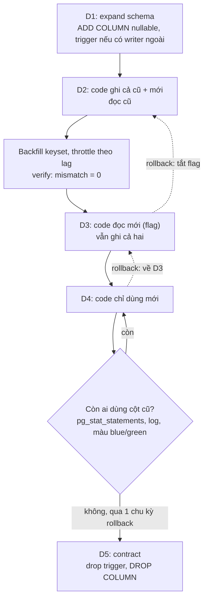
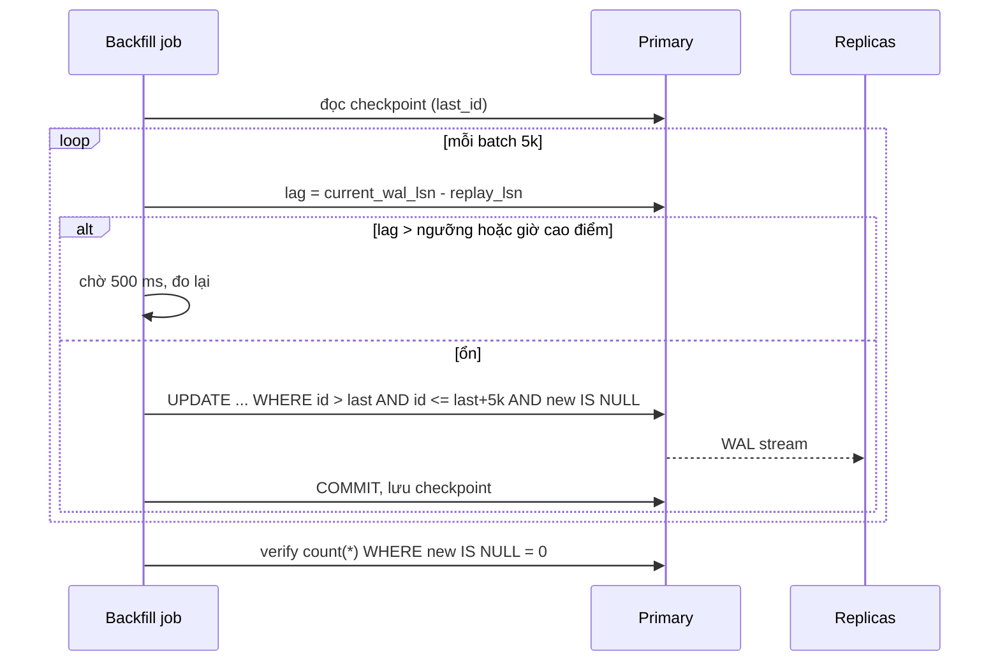

## Bối cảnh & vấn đề

Bài này là playbook cho họ câu hỏi "đổi cấu trúc dữ liệu mà app vẫn chạy". Lý thuyết nền đã có ở [Zero-downtime schema migrations](/tracks/sql-postgres/learn/zero-downtime-migrations) (lock, backfill theo batch, expand → contract), [Migration trong pipeline](/tracks/devops-cicd/learn/migrations-in-pipeline) (Job, thứ tự deploy) và [Backward compatibility](/tracks/microservices/learn/backward-compatibility) (tolerant reader). Ở đây ta ghép chúng thành các runbook cụ thể và đo bằng số thật. Phần lock của từng DDL ở [bài 01](/tracks/scenario-migration/learn/ddl-under-traffic).

Câu chuyện mở đầu: một PR đổi `users.name` thành `users.full_name` và sửa toàn bộ code trong **cùng một deploy**. Kubernetes rolling update thay pod dần trong 3–4 phút. Nếu migration chạy trước rollout, mọi pod cũ còn `SELECT name` và trả 500 `column "name" does not exist`. Nếu migration chạy sau, pod mới lỗi ngược lại. Nếu rollout fail và tự rollback, code cũ quay về với một schema đã đổi: rollback cũng hỏng. Không có câu SQL nào "chậm" cả; vấn đề là **tương thích**.

Ba sự cố cùng họ: (1) backfill `orders.total_cents` bằng một script `OFFSET` trong một transaction làm primary 95% CPU, replica lag 20 phút; (2) TypeORM `synchronize: true` "tự đồng bộ" một property đổi tên bằng `DROP COLUMN` và mất 3 năm dữ liệu; (3) blue/green dùng chung DB, màu xanh lá drop một cột, switch về màu xanh dương thì mọi trang order lỗi. Gốc chung: **một bước thay đổi hai phía cùng lúc** (schema và code, hoặc ghi và đọc), hoặc làm một việc lớn trong một nhát không chia nhỏ, không đo và không lùi được.

## Khái niệm

### Expand–contract (parallel change)

**Expand–contract** là cách đổi một thứ đang được dùng bằng ba pha: **expand** thêm cái mới song song cái cũ (cột, bảng, field), **migrate** chuyển dần writer, dữ liệu cũ và reader sang cái mới, **contract** xoá cái cũ khi chắc chắn không còn ai dùng. Mỗi pha là một deploy riêng và mỗi deploy chỉ thay **một phía**: hoặc schema, hoặc code. Lý do: trong rolling deploy luôn có một khoảng thời gian code N-1 và N cùng chạy trên cùng một schema, nên schema ở mọi thời điểm phải phục vụ được cả hai.

Với rename `name` → `full_name`, bản an toàn gồm khoảng năm deploy: (1) thêm `full_name` nullable; (2) code ghi cả hai cột, vẫn đọc `name`; (3) backfill row cũ, verify; (4) code đọc `full_name`, vẫn ghi cả hai; (5) code chỉ dùng `full_name`; (6) release sau đó mới `DROP COLUMN name`. Deploy 1–5 đều rollback được bằng cách quay về code trước, vì schema chưa mất gì. Chỉ bước 6 là một chiều, nên nó đi sau một chu kỳ rollback.

**Interview angle:** red flag kinh điển là "chạy lúc 2 giờ sáng cho ít người dùng"; câu hỏi không phải về traffic mà về việc code N-1 và N cùng tồn tại. Một red flag khác: nói `RENAME COLUMN` nguy hiểm vì rewrite bảng. Nó chỉ sửa catalog; nguy hiểm là tương thích.

### Thứ tự migration so với rollout

Migration nên chạy như **một bước riêng trước rollout** (Kubernetes Job, Helm pre-upgrade hook, bước pipeline), không chạy trong `main()` của mỗi pod: 10 replica cùng start thì 10 phiên cùng xin lock, tool có thể chạy cùng file hai lần, và một migration lỗi làm crash-loop cả deployment. Quy tắc phân loại:

- **Trước code** (cùng release): thay đổi *additive*: thêm cột nullable, thêm bảng, thêm index `CONCURRENTLY`, thêm constraint `NOT VALID`. Code cũ không biết tới nên vô hại.
- **Sau code** (release sau): thay đổi *destructive*: drop cột, drop bảng, `SET NOT NULL` cho cột mà code cũ không ghi, thu hẹp kiểu. Chỉ làm khi không còn pod, worker, cron hay màu blue/green nào dùng cái cũ.

Câu follow-up "Job migration thành công nhưng rollout fail và tự rollback, bạn đang ở trạng thái nào?": schema đã expand, code về v1. Trạng thái này **an toàn** nếu migration của release đúng là additive. Đó chính là lý do quy tắc tồn tại. Chi tiết pipeline ở [Migration trong pipeline](/tracks/devops-cicd/learn/migrations-in-pipeline).

### Forward-only và rollback

**Forward-only** nghĩa là không chạy `down` migration khi sự cố; sửa bằng một migration mới (roll forward). Lý do: `down` của một expand thường là `DROP COLUMN`/`DROP TABLE` vừa nhận dữ liệu thật từ v2, nên chạy nó là mất dữ liệu; nó còn lấy `ACCESS EXCLUSIVE` đúng lúc hệ thống đang có sự cố. Rollback đúng là **rollback code, giữ schema**.

Rủi ro thật của rollback code nằm ở **dữ liệu dạng mới** mà v1 không hiểu. Ví dụ v2 ghi enum `partially_refunded`; v1 đọc vào một `switch` không có nhánh đó, hoặc zod `z.enum([...])` strict, và trang order lỗi. Phòng bằng thứ tự reader-trước-writer: release A dạy mọi reader chấp nhận giá trị mới (tolerant reader, nhánh default), release B mới bắt đầu ghi giá trị mới sau feature flag. Khi đó tắt flag là rollback, và dữ liệu đã ghi vẫn đọc được. Xem [tolerant reader](/tracks/microservices/learn/backward-compatibility).

**Interview angle:** "Bạn có rollback migration không?" → "Không, rollback code; migration trong release luôn additive; down migration chỉ chạy khi chắc chắn chưa có dữ liệu có giá trị". Sau đó nêu luôn rủi ro enum mới để cho thấy bạn nghĩ tới dữ liệu chứ không chỉ schema.

### Backfill: keyset, batch, idempotent, tự điều tiết

**Backfill** là điền dữ liệu cho cột/bảng mới cho các row cũ. Bốn tính chất bắt buộc: **keyset** theo PK (`WHERE id > $last ORDER BY id LIMIT n`) thay vì `OFFSET`, vì `OFFSET x` phải đọc và bỏ x row trước (O(n²) cả job); **commit mỗi batch**, vì một transaction cho cả bảng giữ row lock tới cuối, chặn VACUUM dọn dead tuple, và rollback ở phút cuối là mất hết; **idempotent** (`AND new_col IS NULL`) để chạy lại sau crash; **set-based** (một `UPDATE` cho cả batch) thay vì một round-trip mỗi row.

Thứ năm là **throttle theo tín hiệu**. Mỗi UPDATE trong Postgres tạo tuple mới và WAL (có cả full-page image sau mỗi checkpoint). Replica phải replay đúng lượng WAL đó; nếu backfill sinh WAL nhanh hơn tốc độ replay, **replica lag** tăng và người dùng đọc từ replica thấy dữ liệu cũ (bug read-your-writes). Sleep cố định không đủ vì tải thay đổi theo giờ; job phải đọc `pg_stat_replication` (lag theo byte hoặc `replay_lag`), CPU, và tự dừng khi vượt ngưỡng. Nền lý thuyết ở [Replication & scaling](/tracks/sql-postgres/learn/replication-scaling).

Điều kiện tiên quyết hay bị quên: **code phải dual-write trước khi backfill bắt đầu**. Nếu không, một row được backfill lúc 10:00 rồi bị app sửa `total` lúc 10:05 sẽ có `total_cents` sai mãi mãi, vì backfill không quay lại row đã có giá trị.

### Đồng bộ ở DB khi không kiểm soát mọi writer

Khi có writer bạn **không deploy được** (app mobile cũ gọi API cũ, cron job của team khác, integration của partner ghi thẳng DB), dual-write trong app không đủ: writer ngoài chỉ biết cột cũ. Giải pháp là đặt logic đồng bộ ở **DB bằng trigger** `BEFORE INSERT OR UPDATE`: nếu chỉ cột cũ đổi thì suy ra cột mới; nếu cột mới đổi thì ghép lại cột cũ. So sánh `OLD` với `NEW` để biết phía nào đổi, tránh vòng lặp. Trigger ẩn logic và thêm vài micro-giây mỗi write, nhưng nó bắt được **mọi** đường ghi, kể cả `psql` của một người vận hành.

Dữ liệu không tách được thì không đoán. "Nguyen Van An" theo thứ tự họ-đệm-tên, "Cher" một từ, "Maria de la Cruz" họ nhiều từ: tách theo khoảng trắng đầu tiên sai cho cả ba. Đánh dấu `needs_review` và để quy tắc nghiệp vụ hoặc người dùng tự sửa.

### `synchronize` của ORM và quyền DDL

TypeORM `synchronize: true` so entity với schema lúc app start và tự chạy DDL cho khớp. Đổi tên property `refCode` → `referralCode` thì nó thấy một cột thừa và một cột thiếu, nên sinh `DROP COLUMN "refCode"` + `ADD "referralCode"`: dữ liệu mất, không có câu hỏi nào. Nhiều pod start cùng lúc còn race DDL. Prisma có bẫy tương tự khi đổi tên field (`migrate dev` sinh DROP + ADD nếu không sửa tay file SQL (verify theo version)).

Sửa gốc gồm ba lớp: `synchronize: false` ở mọi môi trường ngoài local; migration file được generate rồi **đọc và sửa SQL** (rename phải là `RENAME COLUMN` hoặc expand–contract); và **app role không có quyền DDL**, migration chạy bằng role `migrator`. Lớp thứ ba quan trọng nhất vì nó chặn cả những lỗi chưa ai nghĩ tới.

**Interview angle:** câu trả lời chỉ đổ lỗi cho TypeORM là chưa đủ; interviewer chờ bạn nói "app không nên có quyền DROP", và cách khôi phục cột từ PITR (restore sang instance tạm, copy theo PK, xem [bài 05](/tracks/scenario-migration/learn/durability-chain)).

### Blue/green với DB dùng chung

Blue/green chạy hai môi trường code song song và chuyển traffic bằng load balancer; switch back là điểm mạnh của nó. Nhưng nếu hai màu dùng **chung DB**, schema phải phục vụ cả hai màu trong suốt thời gian còn khả năng switch back. Drop cột là contract, nên chỉ làm khi màu cũ đã bị huỷ hẳn. Worker và consumer cũng phải theo quy tắc này, và chỉ một màu được chạy job định kỳ. Xem [Deployment strategies](/tracks/devops-cicd/learn/deployment-strategies-rollback).

### Rollout dữ liệu theo tenant

Với SaaS shared-schema 2.000 tenant, tách hai việc: **schema change** (một lần, additive, toàn bảng) và **data migration + behaviour switch** (theo tenant). Bảng trạng thái `tenant_migration(tenant_id, step, status, checked_at, error)` ghi mỗi tenant đang ở đâu; feature flag theo tenant quyết định tenant đọc/ghi đường mới. Bắt đầu từ tenant nội bộ, rồi tenant nhỏ, đo thời gian theo số row để dự đoán tenant lớn, chạy tenant lớn nhất riêng vào giờ thấp điểm của họ. Lợi ích là **blast radius** nhỏ và rollback theo tenant bằng flag; giá là code giữ hai đường lâu hơn và phải dọn flag. Nền ở [Per-tenant operations](/tracks/multi-tenancy/learn/per-tenant-operations).

## Cơ chế hoạt động

### Expand–contract qua sáu deploy



Mỗi mũi tên đứt là một đường lui rẻ: tắt flag hoặc deploy lại version trước, không đụng schema. Nút quyết định trước contract là nơi các team hay vội: phải có **bằng chứng** không còn reader/writer dùng cột cũ (query trong `pg_stat_statements` có nhắc tới cột, log theo client version, màu blue/green cũ đã huỷ, consumer của team khác). Chỉ bước cuối là không lùi được, nên nó đi riêng và đi muộn.

### Vòng lặp backfill tự điều tiết



Job không có tốc độ cố định; tốc độ là kết quả của việc **replica theo kịp được bao nhiêu**. Checkpoint lưu sau mỗi commit để crash rồi chạy lại từ đúng chỗ, và `new IS NULL` làm cho việc chạy lại một batch đã xong là no-op. Ngưỡng nên đặt theo SLO đọc (ví dụ lag < 5 giây hoặc < 32 MB), và có giới hạn cứng "dừng hẳn và báo người" nếu chờ quá lâu.

## Ví dụ thực tế

Chạy thật trên **PostgreSQL 17.11** (Docker), một primary và hai streaming standby `s1`, `s2`. Bảng `orders` có 2M row (398 MB). Script Node dùng `pg` 8. Laptop chạy nhiều container khác, nên thời gian tuyệt đối chỉ để so sánh.

### Vì sao script backfill gốc chậm dần và đốt CPU

`OFFSET` phải đi qua mọi row phía trước. `EXPLAIN (ANALYZE, BUFFERS)` cho batch cuối:

```text
-- LIMIT 50000 OFFSET 1950000
Limit (actual rows=50000)
  Buffers: shared hit=22328 read=41900
  ->  Index Scan using orders_pkey on orders (actual rows=2000000)
Execution Time: 1094.625 ms

-- WHERE id > 1950000 ORDER BY id LIMIT 50000   (keyset)
Limit (actual rows=50000)
  Buffers: shared hit=1086 read=1
  ->  Index Scan using orders_pkey on orders (actual rows=50000)
        Index Cond: (id > 1950000)
Execution Time: 16.230 ms
```

Batch cuối của `OFFSET` đọc **2.000.000 row và 64K buffer** để lấy 50K row; keyset đọc đúng 50K row và 1K buffer. Trên bảng 300M row, tổng số row đã đọc của cả job `OFFSET` là cỡ n²/2: đây là "chậm dần mỗi batch". Round-trip mỗi row cũng đắt:

```text
=== 5,000 rows: one UPDATE per row vs one set-based UPDATE ===
per-row:   6244 ms (5000 round-trips)
set-based: 290 ms (1 round-trip)
```

### Một UPDATE khổng lồ vs keyset có throttle

Cùng một việc (điền cột bigint cho 2M row), hai cách. Trong lúc chạy keyset, script tạm dừng replay trên `s2` (`pg_wal_replay_pause()`) 6 giây để mô phỏng một replica bị chậm:

```text
=== one giant UPDATE for all rows ===
giant UPDATE: 61429 ms, WAL 1101 MB, max replica lag seen 79 MB, n_dead_tup 2000009
app single-row UPDATE during it: 5025 ms 9 ok, 1 timed out (canceling statement due to statement timeout)

=== keyset backfill, 5k/batch, commit per batch, throttle on replica lag ===
[t+4s] pausing replay on s2
[t+6s] throttle: lag s1=0 MB s2=32 MB > 32 MB, waiting
[t+11s] resumed replay on s2
[t+53s] throttle: lag s1=27 MB s2=32 MB > 32 MB, waiting
done: 2000000 rows, 400 batches, 91969 ms, WAL 846 MB, max replica lag seen 33 MB, throttle waits 18, worst app UPDATE 622 ms, n_dead_tup 1057220
```

Đọc kết quả. UPDATE khổng lồ nhanh hơn về tổng thời gian (61 s so với 92 s), nhưng: mọi row đã chạm bị **khoá tới khi commit** (một trong mười UPDATE ngẫu nhiên của app timeout sau 5 s; càng về cuối tỉ lệ càng cao), 2M dead tuple xuất hiện cùng lúc và VACUUM không dọn được cho tới khi commit, lag replica không bị giới hạn (79 MB ở lần chạy này, 229 MB ở lần trước), và nếu cancel ở giây 60 thì mất cả 60 giây công. Keyset chậm hơn vì sleep và throttle, nhưng lag **bị chặn ở ~32 MB** đúng như ngưỡng: khi `s2` dừng replay, job tự đứng chờ; khi `s2` chạy lại, job tiếp tục. Lần throttle ở giây 53 trùng một checkpoint (WAL tăng vì full-page writes), job cũng tự xử lý. Dead tuple chỉ còn 1M vì autovacuum đã dọn được giữa các batch.

Trong một sự cố thật (đề bài 031: lag 90 s, disk +150 GB), thêm hai thứ vào vòng lặp: theo dõi `pg_replication_slots` (một slot của CDC bị dừng giữ WAL vô hạn, đặt `max_slot_wal_keep_size`), và tránh update cột có index để giữ **HOT update** (update không phải sửa index).

### Tách `name` với writer không kiểm soát

Trigger hai chiều, hàm `split_name` đánh dấu mọi tên không đúng hai từ cho người xem lại, và backfill bỏ qua trigger bằng một biến session (`SET LOCAL app.backfill = 'on'`), vì backfill tự tính đầy đủ ba cột:

```sql
CREATE FUNCTION split_name(n text, OUT f text, OUT l text, OUT review boolean)
LANGUAGE sql IMMUTABLE AS $$
  SELECT split_part(n, ' ', 1),
         nullif(substr(n, length(split_part(n, ' ', 1)) + 2), ''),
         n !~ '^\S+ \S+$'
$$;

CREATE FUNCTION customers_sync_name() RETURNS trigger LANGUAGE plpgsql AS $$
DECLARE s record;
BEGIN
  IF current_setting('app.backfill', true) = 'on' THEN RETURN NEW; END IF;
  IF TG_OP = 'INSERT' AND NEW.first_name IS NULL AND NEW.last_name IS NULL
     OR TG_OP = 'UPDATE' AND NEW.name IS DISTINCT FROM OLD.name
        AND NEW.first_name IS NOT DISTINCT FROM OLD.first_name
        AND NEW.last_name  IS NOT DISTINCT FROM OLD.last_name THEN
    s := split_name(NEW.name);                       -- old writer touched name only
    NEW.first_name := s.f; NEW.last_name := s.l; NEW.name_needs_review := s.review;
  ELSIF TG_OP = 'INSERT'
     OR NEW.first_name IS DISTINCT FROM OLD.first_name
     OR NEW.last_name  IS DISTINCT FROM OLD.last_name THEN
    NEW.name := concat_ws(' ', NEW.first_name, NEW.last_name);  -- new writer
    NEW.name_needs_review := false;
  END IF;
  RETURN NEW;
END $$;

INSERT INTO customers (name) VALUES ('Le Minh');                       -- partner (old)
INSERT INTO customers (first_name, last_name) VALUES ('Hoa', 'Pham');   -- new app
UPDATE customers SET name = 'Nguyen Van Binh' WHERE id = 1;              -- cron (old)
UPDATE customers SET last_name = 'Cruz Lopez' WHERE id = 3;              -- new app
```

```text
 id |       name       | first_name | last_name  | review
----+------------------+------------+------------+--------
  1 | Nguyen Van Binh  | Nguyen     | Van Binh   | t
  2 | Cher             | Cher       |            | t
  3 | Maria Cruz Lopez | Maria      | Cruz Lopez | f
  4 | Tran Thi Bich    | Tran       | Thi Bich   | t
  5 | Le Minh          | Le         | Minh       | f
  6 | Hoa Pham         | Hoa        | Pham       | f
```

Cả bốn đường ghi đều để lại ba cột nhất quán. Row 1, 2, 4 được đánh dấu review: "Nguyen" là họ chứ không phải tên, nên tách tự động là sai, và hệ thống thừa nhận điều đó thay vì đoán. Lần chạy đầu tiên của demo này có một bug đáng kể: backfill không bỏ qua trigger, nhánh "writer mới" chạy và reset `review = false` cho mọi row. Bài học: **trigger cũng chạy cho chính backfill của bạn**, nên test backfill cùng trigger.

Follow-up "writer cũ và writer mới sửa cùng row trong cùng giây": hai UPDATE bị row lock xếp hàng; ở READ COMMITTED, UPDATE thứ hai chạy lại trên version mới nhất và trigger thấy `OLD` là kết quả của UPDATE thứ nhất. Kết quả là **last writer wins cho cả row**, nhất quán nhưng có thể làm mất ý định của writer đầu. Thường chấp nhận được với tên khách hàng; với dữ liệu tiền thì cần optimistic locking (`version`).

### `orders.id` int → bigint không downtime

Chạy trên bảng `inv` 1M row và bảng con `inv_items` 2M row, sequence đã đặt ở 2.147.483.000 (gần giới hạn int4 2.147.483.647). Các bước expand: cột `id_new bigint` và `inv_id_new bigint`, trigger copy giá trị cho row mới, backfill, `CREATE UNIQUE INDEX CONCURRENTLY` trên `id_new`, NOT NULL qua `CHECK ... NOT VALID` + `VALIDATE`. Cutover là một transaction ngắn:

```sql
BEGIN;
SET LOCAL lock_timeout = '3s';
LOCK TABLE inv, inv_items IN ACCESS EXCLUSIVE MODE;
ALTER TABLE inv_items DROP CONSTRAINT inv_items_inv_id_fkey;
ALTER TABLE inv DROP CONSTRAINT inv_pkey;
ALTER TABLE inv ALTER COLUMN id_new SET NOT NULL;          -- valid CHECK => no scan (PG12+)
ALTER TABLE inv ADD CONSTRAINT inv_pkey PRIMARY KEY USING INDEX inv_id_new_uq;
ALTER TABLE inv ALTER COLUMN id DROP DEFAULT;
ALTER SEQUENCE inv_id_seq AS bigint OWNED BY inv.id_new;
ALTER TABLE inv ALTER COLUMN id_new SET DEFAULT nextval('inv_id_seq');
ALTER TABLE inv RENAME COLUMN id TO id_old;
ALTER TABLE inv RENAME COLUMN id_new TO id;
ALTER TABLE inv ALTER COLUMN id_old DROP NOT NULL;
-- same rename dance for inv_items.inv_id_new, then:
ALTER TABLE inv_items ADD CONSTRAINT inv_items_inv_id_fkey
  FOREIGN KEY (inv_id) REFERENCES inv(id) NOT VALID;
DROP TRIGGER inv_sync ON inv;
DROP TRIGGER inv_items_sync ON inv_items;
COMMIT;
ALTER TABLE inv_items VALIDATE CONSTRAINT inv_items_inv_id_fkey;   -- outside, light lock
```

```text
NOTICE:  ALTER TABLE / ADD CONSTRAINT USING INDEX will rename index "inv_id_new_uq" to "inv_pkey"
(19 statements inside the transaction: 0.02–3.4 ms each, COMMIT 5.0 ms, ~25 ms total)
ALTER TABLE  -- VALIDATE CONSTRAINT: 1832.392 ms, outside the lock
INSERT 0 1000
   max_id   | pg_typeof
------------+-----------
 2147484000 | bigint
 seqtypid |       seqmax
----------+---------------------
 bigint   | 9223372036854775807
```

Lock mạnh chỉ giữ khoảng **25 ms**; phần nặng (backfill, build index, validate) đều nằm ngoài. Insert sau cutover vượt qua giới hạn int4 mà không lỗi, và sequence giờ là `bigint`. Hai điểm hay quên: **mọi cột FK trỏ tới** `orders.id` cần cùng điệu nhảy (cả bảng của service khác, cả cột trong JSON, cả Kafka key), và `ALTER SEQUENCE ... AS bigint` vì sequence `serial` có `seqmax` là int4.

Tầng app cũng đổi. `pg` trả `int8` dưới dạng **string** để không mất chính xác:

```text
{ id: '2147484000' } string
{ id: '9007199254740993' } 9007199254740992
```

Dòng thứ hai là lý do: `Number("9007199254740993")` thành `...992` vì vượt 2^53. Giữ id là string trong TS và trong JSON API (`"id": "2147484000"`), hoặc dùng `BigInt` có kiểm soát; đừng `setTypeParser(20, parseInt)` cho cả app. Nếu còn ít ngày, biện pháp tạm là cho sequence chạy sang số âm (`ALTER SEQUENCE ... MINVALUE -2147483648 RESTART -2147483648 INCREMENT 1`) để mua thêm 2,1 tỉ id, chỉ khi app chịu được id âm (minh hoạ, cần test kỹ).

### TypeORM `synchronize` làm mất cột

```ts
// what TypeORM synchronize effectively runs after renaming refCode -> referralCode (minh hoạ)
// ALTER TABLE "customer" DROP COLUMN "refCode"
// ALTER TABLE "customer" ADD "referralCode" character varying NOT NULL
```

Đây là minh hoạ (không chạy TypeORM trong bài này): `synchronize` không biết "đổi tên", chỉ biết "thiếu" và "thừa". Khôi phục: PITR vào instance tạm tại thời điểm trước deploy, `COPY (SELECT id, "refCode" FROM customer)`, rồi `UPDATE ... FROM` vào cột mới theo PK; row tạo sau thời điểm đó không có giá trị cũ để lấy. Phòng ngừa: `synchronize: false`, migration review, lint cấm `DROP COLUMN` không có label `contract`, app role không có quyền DDL.

### Blue/green: màu cũ chết vì cột đã drop

Không có "undo DROP COLUMN". Hai đường: sửa nhanh green và switch lại; hoặc `ADD COLUMN legacy_status text` (nullable, instant) để blue chạy tạm, rồi khôi phục giá trị từ PITR vào instance phụ và copy theo PK. Dữ liệu ghi sau thời điểm drop phải tính lại từ nguồn khác (ví dụ suy ra từ `status` mới). Rule bị phá: contract trong khi màu cũ còn có thể nhận traffic. Phòng ngừa: CI chặn DROP cùng release, checklist "blue còn đọc cột này không", và kiểm tra `pg_stat_statements` không còn query nào nhắc tới cột.

### Rollout theo tenant (minh hoạ)

```ts
// per-tenant backfill driver (minh hoạ)
for (const t of await tenantsOrderedBySize()) {          // internal, small, ..., largest last
  await setStep(t.id, "backfilling");
  await backfillTenant(t.id, { batch: 5000, maxLagBytes: 32 << 20 });
  const bad = await verifyTenant(t.id);                  // count + checksum old vs new
  if (bad > 0) { await setStep(t.id, "failed", `${bad} mismatches`); continue; } // flag stays off
  await flags.enable("orders.new_semantics", { tenant: t.id });
  await setStep(t.id, "switched");
}
```

Tenant 1.437 fail verify thì hệ thống tự động giữ flag tắt cho tenant đó, ghi lý do, và tiếp tục với tenant khác; việc của người là xem mismatch, sửa logic, chạy lại tenant đó. Không có bước nào là "một backfill toàn cục rồi bật flag toàn cục".

## Trade-offs & lựa chọn thay thế

| Tình huống | Cách nhanh nhưng nguy hiểm | Cách an toàn | Giá phải trả |
| --- | --- | --- | --- |
| Rename / split cột | Đổi schema + code cùng deploy | Expand–contract 5–6 deploy | Nhiều tuần, code hai đường |
| Writer ngoài tầm kiểm soát | Dual-write trong app | Trigger đồng bộ hai chiều ở DB | Logic ẩn, cần test, vài µs mỗi write |
| Backfill bảng lớn | Một `UPDATE` cả bảng | Keyset 1k–10k, commit mỗi batch, throttle theo lag | Chậm hơn, cần checkpoint |
| int → bigint | `ALTER COLUMN TYPE bigint` (rewrite + lock) | Cột mới + trigger + backfill + cutover 25 ms | Nhiều bước, cả bảng con |
| Rollback | Chạy `down` migration | Rollback code, schema forward-only | Schema tích luỹ cột chờ contract |
| Rollout data change | Toàn cục một lần | Theo tenant + flag + bảng trạng thái | Flag cleanup, thời gian dài |

Khi nào chọn gì: với bảng nhỏ (dưới vài triệu row) và không có writer ngoài, một maintenance window ngắn hoặc `ALTER COLUMN TYPE` lúc thấp điểm có thể rẻ hơn ba tuần expand–contract; đo trên bản sao cỡ production trước khi quyết định. Trigger chỉ đáng khi có writer bạn không deploy được; nếu mọi writer là code của bạn, dual-write trong app rõ ràng và dễ test hơn. Rollout theo tenant đáng khi thay đổi có rủi ro nghiệp vụ (nghĩa mới của cột, tính tiền), không cần cho một cột thuần kỹ thuật.

## Edge cases & failure modes

- **Backfill chạy trước dual-write**: row bị app sửa sau khi đã backfill có giá trị cũ mãi mãi. Thứ tự đúng: deploy dual-write, rồi mới backfill, rồi verify bằng so sánh cột cũ và mới.
- **Throttle chỉ nhìn replica vật lý**: một logical replication slot (CDC, Debezium) bị dừng giữ WAL vô hạn; disk đầy làm primary dừng. Theo dõi `pg_replication_slots` và đặt `max_slot_wal_keep_size`.
- **`replay_lag` NULL hoặc đứng yên** khi không có WAL mới hoặc replica tạm dừng; đo thêm lag theo byte (`pg_wal_lsn_diff`) như ví dụ trên.
- **Trigger + backfill**: backfill kích hoạt trigger, trigger sửa giá trị mà backfill vừa tính. Dùng biến session để bỏ qua, hoặc viết backfill sao cho trigger cho cùng kết quả.
- **Cutover int → bigint chờ lock**: transaction cutover lấy `ACCESS EXCLUSIVE` trên hai bảng; một transaction dài làm nó chờ và tạo lock queue. `lock_timeout` + retry như [bài 01](/tracks/scenario-migration/learn/ddl-under-traffic).
- **Enum mới khi rollback**: v1 đọc giá trị v2 ghi và crash. Reader-trước-writer.
- **Blue/green worker**: cả hai màu cùng chạy cron và consumer, job chạy hai lần. Chỉ một màu được bật worker (flag hoặc leader lock).
- **Tenant khổng lồ**: một tenant chiếm 40% row làm "rollout theo tenant" thành một backfill lớn; chia tiếp theo khoảng PK bên trong tenant.

## Pitfalls

- ❌ Migration và code dùng schema mới trong cùng deploy → ✅ mỗi deploy chỉ đổi một phía; schema luôn tương thích với N và N-1.
- ❌ Chạy migration trong `main()` của mỗi pod → ✅ Job riêng trước rollout, có advisory lock.
- ❌ `DROP COLUMN` cùng release với việc ngừng dùng cột → ✅ contract ở release sau, khi có bằng chứng không còn ai dùng.
- ❌ Backfill `OFFSET`, một transaction, update từng row → ✅ keyset, commit mỗi batch, set-based, `new IS NULL`, checkpoint.
- ❌ Chỉ tăng sleep giữa các batch → ✅ throttle theo tín hiệu (lag byte/giây, CPU, giờ cao điểm) và có điểm dừng hẳn.
- ❌ Chạy `down` migration khi rollback → ✅ rollback code, roll forward schema.
- ❌ `synchronize: true` ở production, app role có quyền DDL → ✅ migration review + role `migrator` riêng.
- ❌ Tách tên theo khoảng trắng đầu tiên cho mọi row → ✅ rule rõ ràng + `needs_review` cho row không chắc.
- ❌ Đổi `orders.id` mà quên cột FK và client JS → ✅ liệt kê mọi nơi tham chiếu, id dạng string trong JSON.

## Tóm tắt

- Expand → migrate → contract: mỗi deploy chỉ đổi một phía, mọi bước trước contract đều rollback được bằng code.
- Additive đi trước code, destructive đi sau ở release riêng; migration chạy như Job trước rollout.
- Rollback = rollback code, schema forward-only; rủi ro thật là dữ liệu dạng mới (enum) mà v1 không hiểu.
- Backfill: keyset + commit mỗi batch + idempotent + set-based + throttle theo lag. Đo được: keyset giữ lag ≤ 33 MB, UPDATE khổng lồ khoá row tới commit và tạo 2M dead tuple cùng lúc.
- Writer ngoài tầm kiểm soát → trigger hai chiều ở DB; dữ liệu mơ hồ → `needs_review`, không đoán.
- int → bigint: cột mới + trigger + backfill + index concurrently + cutover ~25 ms; nhớ FK, sequence, và `pg` trả int8 là string.
- Blue/green dùng chung DB: không contract khi màu cũ còn có thể nhận traffic.
- Data change rủi ro: rollout theo tenant với bảng trạng thái và flag theo tenant.
