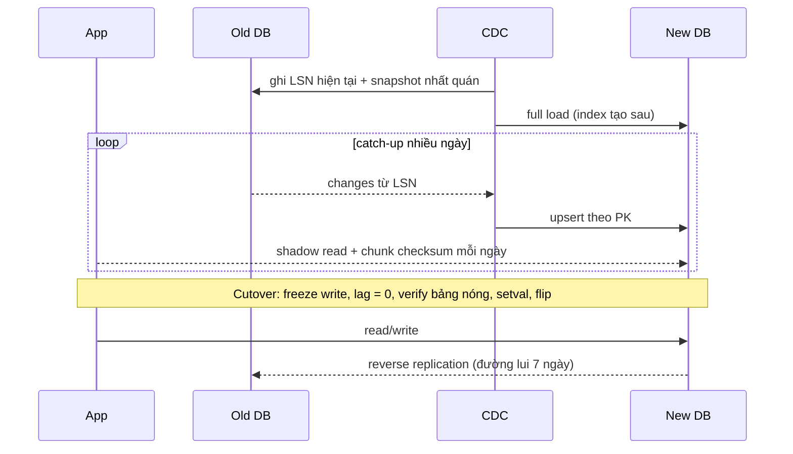
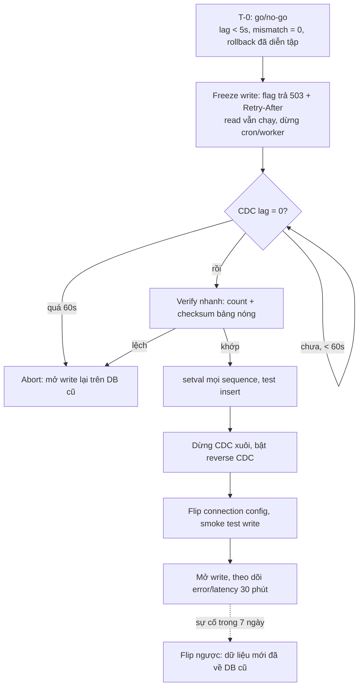

## Bối cảnh & vấn đề

Bài này là playbook cho "chuyển cả database sang chỗ khác mà không dừng business": SQL Server sang Postgres, Postgres tự quản sang Aurora, cluster cũ sang cluster mới. Lý thuyết nền về CDC, outbox và dual write đã có ở [Đồng bộ dữ liệu khi migrate](/tracks/microservices/learn/data-sync-migration) và [Dual write, outbox, CDC](/tracks/messaging-kafka/learn/outbox-cdc-sagas); logical replication và replication slot ở [Replication & scaling](/tracks/sql-postgres/learn/replication-scaling). Ở đây ta chọn công cụ, chứng minh dữ liệu giống nhau và viết runbook cutover.

Câu chuyện mở đầu: một team chuyển 2 TB từ SQL Server sang Postgres. CDC chạy hai tuần, row count khớp từng bảng, họ cutover vào tối thứ Bảy. Phút đầu tiên mọi INSERT vào `orders` lỗi `duplicate key value violates unique constraint "orders_pkey"`. Sửa xong lỗi đó thì sáng thứ Hai có user đăng ký được hai tài khoản `Alice@x.com` và `alice@x.com`, và báo cáo doanh thu theo ngày lệch một ngày cho các đơn sau 17 giờ. Không lỗi nào lộ ra bởi row count.

Ba bài học của câu chuyện là ba phần của bài: CDC chỉ copy **dữ liệu**, không copy **trạng thái** (sequence, identity); count bằng nhau không chứng minh **giá trị** bằng nhau; và hai engine khác nhau ở **ngữ nghĩa** (collation, time zone), không chỉ ở cú pháp.

## Khái niệm

### Change data capture (CDC)

**CDC** đọc change log của database (Postgres WAL qua logical decoding, MySQL binlog, SQL Server CDC tables / transaction log) và phát ra từng insert/update/delete **theo thứ tự commit**. So với export hằng đêm, CDC có hai lợi thế: bản đích chỉ trễ vài giây thay vì một ngày, nên cutover chỉ cần freeze tới khi lag = 0; và nó thấy cả **delete**, thứ mà hai lần export so sánh với nhau dễ bỏ sót.

Mọi CDC đều theo khuôn **snapshot + stream**: ghi lại vị trí log hiện tại (LSN), chụp snapshot nhất quán tại vị trí đó, copy snapshot, rồi stream thay đổi **từ đúng LSN đó**. Nhờ vậy không có khe hở giữa snapshot và stream. Ranh giới có thể bị **lặp** (một thay đổi vừa nằm trong snapshot vừa được stream, hoặc được stream lại sau restart), nên sink phải **upsert theo PK** (idempotent), không insert thuần. Postgres native logical replication tự làm khuôn này: `CREATE SUBSCRIPTION` tạo slot, copy bảng và chuyển sang streaming.

**Interview angle:** follow-up "làm sao không mất thay đổi giữa snapshot và stream?" cần câu trả lời có chữ **LSN** và chữ **idempotent upsert**. Mô tả CDC như "trigger poll bảng mỗi phút" là red flag.

### Dual write từ app

**Dual write** là app ghi DB cũ rồi ghi DB mới trong cùng request. Nghe đơn giản nhưng **không atomic**: ghi thứ nhất thành công, ghi thứ hai timeout là hai DB lệch; retry có thể tạo bản trùng; hai request đồng thời có thể ghi hai DB **theo thứ tự khác nhau**, nên giá trị cuối cùng khác nhau. Thêm nữa, phải sửa **mọi** đường ghi (job, script, admin tool, service khác, stored procedure), sót một đường là lệch âm thầm, và vẫn phải backfill dữ liệu cũ riêng.

Khi buộc phải dual write (không có quyền đọc log, DB managed không bật được CDC), thiết kế để **phát hiện và sửa được**: DB cũ là source of truth duy nhất, ghi DB mới là best-effort qua outbox/queue có retry, mỗi row có `updated_at`/version để sink bỏ bản cũ, và reconciliation theo chunk chạy liên tục. Xem phân tích sâu ở [Đồng bộ dữ liệu khi migrate](/tracks/microservices/learn/data-sync-migration).

### Bốn công cụ và khi nào dùng

- **`pg_dump`/`pg_restore`**: chính xác, đơn giản, nhưng downtime ≈ thời gian dump + restore + build index. 3 TB là nhiều giờ.
- **Native logical replication** (publication/subscription): Postgres → Postgres, theo commit order, khác major version được (PG 13 → 17), ít thành phần. Giới hạn: không replicate **DDL, sequence, large object**; bảng cần PK hoặc `REPLICA IDENTITY`; initial copy nặng; slot giữ WAL nếu subscriber chậm. Bản PG 19 bắt đầu có đồng bộ sequence cho logical replication (verify); với các bản hiện hành vẫn phải `setval` tay.
- **AWS DMS**: managed, khác engine được, có full load + CDC và **data validation**. Nhưng type mapping và LOB mode dễ sai, mặc định không tạo secondary index, FK, default, sequence đầy đủ (verify theo version), debug khó.
- **Debezium** (Kafka Connect): log-based, nhiều source, event đi qua Kafka nên nhiều sink cùng dùng được; giá là vận hành Kafka Connect, offset, schema history.

Với Postgres 13 tự quản → Aurora/RDS PostgreSQL: chọn logical replication, `pg_dump --schema-only` trước, tạo secondary index **sau** initial copy (copy nhanh hơn), `setval` ở cutover. Kiểm tra extension có trên Aurora không, parameter group, connection limit. DMS hợp hơn khi khác engine, khi cần validation managed, hoặc khi team không muốn vận hành slot.

### Debezium cho SQL Server: cái gì vẫn có thể sai

SQL Server cần bật **CDC cho database và từng bảng**; agent job đọc transaction log và ghi vào change table; Debezium đọc change table theo LSN. Offset (LSN) lưu trong Kafka Connect nên restart tiếp tục đúng chỗ, at-least-once. Những gì vẫn hỏng: **CDC retention** (cleanup job mặc định giữ 3 ngày (verify)) ngắn hơn thời gian connector dừng → mất change, phải snapshot lại; **DDL** không tự áp: thêm cột vào bảng đang capture thì capture instance cũ không có cột đó, phải tạo capture instance mới và connector chuyển sang; bảng không có PK; type mapping (`datetimeoffset`, `money`, `uniqueidentifier`, `bit`); transaction log phình khi CDC chậm. **Incremental snapshot** (signal table) cho phép snapshot lại một bảng theo chunk mà không dừng stream.

### Verify: count, checksum theo chunk, shadow read

Count bằng nhau chưa đủ. Bốn tầng, mỗi tầng rẻ hơn tầng sau:

1. **Count theo chunk** (theo dải PK, tenant hoặc ngày) để khoanh vùng lệch.
2. **Checksum theo chunk**: hash của các cột đã **chuẩn hoá** (timestamp về UTC cùng độ chính xác, numeric cùng scale, text cùng collation và trim) cho mỗi dải PK, tính ở cả hai bên. Chunk lệch mới diff từng row.
3. **Sample diff** qua code app: đọc cùng một entity từ hai DB, map sang object, so sánh.
4. **Shadow read**: app đọc cả hai, trả kết quả cũ, log khác biệt.

Verify chạy khi CDC còn chạy, nên một chunk vừa bị sửa có thể lệch "do lag". Quy tắc: so lại các chunk lệch sau vài phút; chỉ lệch lặp lại mới là bug.

**Interview angle:** "checksum chỉ lệch ở các row có cột `datetime2`" → nghi ngay độ chính xác (`datetime2(7)` có 100 ns, Postgres `timestamp` có micro-giây, nên làm tròn) hoặc time zone khi convert.

### Sequence, identity và id range

CDC và DMS copy **giá trị** của cột `id`, nhưng sequence ở DB đích vẫn ở giá trị khởi tạo. INSERT đầu tiên lấy `id = 1` và đụng row đã copy. Fix ngay trong freeze window: với mỗi sequence, `setval` tới `max(id)` cộng khoảng đệm, rồi test insert. Nếu còn **reverse replication** về DB cũ để rollback, hai phía cùng sinh id thì phải tách **dải id** (DB mới nhảy lên +1 tỉ) hoặc dùng UUID, để dữ liệu chảy ngược không đụng nhau.

### Collation và time zone

SQL Server mặc định `SQL_Latin1_General_CP1_CI_AS`: **case-insensitive**. Unique index trên `email` chặn `Alice@x.com` khi đã có `alice@x.com`, và `WHERE email = @e` không phân biệt hoa thường. Postgres mặc định case-sensitive: unique không còn chặn, login bằng email khác hoa thường fail. Fix: unique index trên `lower(email)` và query cũng dùng `lower()`, hoặc `citext`, hoặc ICU nondeterministic collation (PG 12+; `LIKE` trên nondeterministic collation chỉ hỗ trợ từ PG 18 (verify)). Sau đó dọn các duplicate đã tạo.

`datetime`/`datetime2` không có offset. Nếu dữ liệu cũ là giờ local (UTC+7) mà connector giả định UTC khi đổ vào `timestamptz`, mọi timestamp lệch 7 giờ, và group theo ngày lệch một ngày cho đơn sau 17 giờ. Xác định zone thật của dữ liệu cũ trước khi convert; `datetimeoffset` → `timestamptz`. Các khác biệt ngữ nghĩa khác: `money` → `numeric(19,4)`, `bit` → `boolean`, trailing space (`'a ' = 'a'` đúng trong SQL Server), empty string vs NULL từ tool.

### Khi nào chọn downtime

Zero-downtime có chi phí: CDC phải vận hành, code hai đường nhiều tuần, người trực, rủi ro bug khi dữ liệu ở trạng thái trung gian. Một **maintenance window** đáng chọn khi dump/restore dưới 15–30 phút, có khung thấp điểm thật (B2B nội địa lúc 2 giờ sáng), SLA cho phép maintenance báo trước, hoặc team nhỏ không đủ người vận hành CDC. Bảo vệ bằng số: "30 phút Chủ nhật, 0,3% traffic tuần, đổi lấy 6 tuần engineering" so với "checkout mất X tiền mỗi phút". Downtime vẫn cần rehearsal, rollback plan và go/no-go.

**Interview angle:** một senior nói được khi nào **không** cần zero-downtime; "luôn phải zero-downtime" là red flag về judgment.

## Cơ chế hoạt động

### Từ snapshot tới cutover và đường lui



Phần dài nhất (nhiều ngày) diễn ra khi business vẫn chạy bình thường trên DB cũ; phần có downtime chỉ là đoạn Note ở giữa. Reverse replication là thứ biến "flip config" thành thao tác hai chiều: sau cutover, mọi write ở DB mới được mang về DB cũ, nên rollback chỉ là flip ngược mà không mất dữ liệu ghi sau cutover.

### Runbook cutover dưới 5 phút



Hai nhánh Abort là điểm quan trọng nhất: runbook phải định nghĩa trước **ai quyết định** và **ngưỡng nào thì dừng**, vì ở phút thứ 3 của một cutover không ai nên tranh luận. Freeze phải gồm cả background job và cron, không chỉ API. Thời gian thực tế: freeze vài giây, chờ lag về 0 khoảng 10–30 giây, verify bảng nóng 30–60 giây, `setval` cho 300 bảng vài giây, flip và smoke test 1–2 phút.

## Ví dụ thực tế

Chạy thật: nguồn **PostgreSQL 16.15**, đích **PostgreSQL 17.11** (Docker, cùng network), native logical replication, bảng `orders` 300K row. Đây là kịch bản "self-managed PG cũ → PG mới" (câu 050); với SQL Server → Postgres thì CDC tool khác nhưng các bước verify, sequence và cutover giống hệt.

### Snapshot + stream và checksum theo chunk

```sql
-- source (PG 16)
CREATE PUBLICATION mig FOR TABLE orders;
-- target (PG 17): schema created first with pg_dump --schema-only
CREATE SUBSCRIPTION mig
  CONNECTION 'host=old-db user=postgres password=... dbname=postgres' PUBLICATION mig;
-- NOTICE:  created replication slot "mig" on publisher

-- after the initial copy, live changes on the source:
INSERT INTO orders (email, amount_cents) VALUES ('late@x.com', 999);
UPDATE orders SET amount_cents = 1 WHERE id = 5;
DELETE FROM orders WHERE id = 6;

-- the same verification query on both sides
SELECT id / 100000 AS chunk, count(*),
       md5(string_agg(concat_ws('|', id, email, amount_cents,
           to_char(created_at AT TIME ZONE 'UTC', 'YYYY-MM-DD HH24:MI:SS.US')), ',' ORDER BY id))
FROM orders GROUP BY 1 ORDER BY 1;
```

```text
== source 16.15                                   == target 17.11
 chunk | count  | md5                              chunk | count  | md5
     0 |  99998 | 39ce3d6da56475c9f20bc282e85223a8     0 |  99998 | 39ce3d6da56475c9f20bc282e85223a8
     1 | 100000 | 0ff98681e5a91848a0b5e9f54c48dbc8     1 | 100000 | 0ff98681e5a91848a0b5e9f54c48dbc8
     2 | 100000 | 6bd9f00922d5e6c0006a8a4e0ba90887     2 | 100000 | 6bd9f00922d5e6c0006a8a4e0ba90887
     3 |      2 | cabbcc06c1bff3d96b5d183c436dc5fd     3 |      2 | cabbcc06c1bff3d96b5d183c436dc5fd

pg_subscription_rel: srsubstate = r (ready, streaming)
```

Chunk 0 có 99.998 row vì id 0 không tồn tại và id 6 đã bị xoá: delete đi qua CDC đúng như mong đợi. Insert muộn nằm ở chunk 3. Khác major version không là vấn đề với logical replication. Chuẩn hoá trong `concat_ws` là phần quan trọng: timestamp được đưa về UTC với định dạng cố định, nên hai bên dù có `TimeZone` khác nhau vẫn so được.

Tiếp theo, giả lập một bug lệch 7 giờ trên **một row** (id 42) ở đích. Count vẫn bằng nhau, checksum thì không:

```text
target: chunk 0 | count 99998 | 39ce3d6da56475c9f20bc282e85223a8
source: chunk 0 | count 99998 | df1171aa960618980faa700e076a3a87
```

Khi một chunk lệch, chia đôi dải PK và lặp lại (tìm kiếm nhị phân) cho tới chunk vài trăm row, rồi diff từng row. Với 1,2 tỉ row, chunk 100K cho 12.000 hash mỗi bên, chạy song song trên replica.

### Sequence chưa được copy

```text
-- target, right after disabling the subscription (cutover)
INSERT INTO orders (email, amount_cents) VALUES ('first-after-cutover@x.com', 100);
ERROR:  duplicate key value violates unique constraint "orders_pkey"
DETAIL:  Key (id)=(1) already exists.

SELECT last_value FROM orders_id_seq;   -- 1
```

Câu sinh `setval` cho **mọi** cột dùng sequence (cả `serial` lẫn `GENERATED ... AS IDENTITY`, vì `pg_get_serial_sequence` trả sequence của cả hai), chạy bằng `\gexec`:

```sql
SELECT format('SELECT setval(%L, (SELECT coalesce(max(%I), 0) + 1000 FROM %I.%I), false);',
              pg_get_serial_sequence(format('%I.%I', n.nspname, c.relname), a.attname),
              a.attname, n.nspname, c.relname)
FROM pg_class c
JOIN pg_namespace n ON n.oid = c.relnamespace
JOIN pg_attribute a ON a.attrelid = c.oid AND a.attnum > 0 AND NOT a.attisdropped
WHERE c.relkind = 'r' AND n.nspname = 'public'
  AND pg_get_serial_sequence(format('%I.%I', n.nspname, c.relname), a.attname) IS NOT NULL
\gexec
```

```text
 setval
--------
 301001

INSERT ... RETURNING id;   -- 301001
```

Trong runbook, bước này nằm **sau** khi lag = 0 và **trước** khi mở write; khoảng đệm 1.000 (hoặc một dải tách biệt hẳn khi có reverse replication) bảo vệ trước những row đến muộn. Sau đó so `last_value` với `max(id)` cho mọi sequence như một check tự động.

### Collation: tái hiện hành vi case-insensitive (minh hoạ)

```sql
-- make Postgres enforce what SQL Server's CI collation enforced
CREATE UNIQUE INDEX CONCURRENTLY users_email_lower_uq ON users (lower(email));
SELECT id FROM users WHERE lower(email) = lower($1);
-- or: CREATE COLLATION ci (provider = icu, locale = 'und-u-ks-level2', deterministic = false);
```

Trước khi tạo unique index phải dọn duplicate đã sinh ra (gộp tài khoản là quyết định nghiệp vụ). Verify lẽ ra đã bắt được lỗi này bằng một bước rẻ: chạy `SELECT lower(email), count(*) ... HAVING count(*) > 1` trên đích, và một test "đăng ký email khác hoa thường" trong shadow traffic.

## Trade-offs & lựa chọn thay thế

| Cách | Downtime | Consistency | Độ phức tạp | Rủi ro chính | Hợp khi |
| --- | --- | --- | --- | --- | --- |
| Dump/restore | Giờ, tỉ lệ data size | Tuyệt đối | Thấp | Window không đủ | DB nhỏ, có maintenance window |
| Native logical replication | Giây–phút | Theo commit order | Thấp–TB | Không DDL/sequence, slot giữ WAL | PG → PG (kể cả khác major) |
| AWS DMS | Giây–phút | Tốt, có validation | TB | Type/LOB mapping, thiếu index/sequence | Khác engine, muốn managed |
| Debezium + Kafka | Giây–phút | Theo commit order, at-least-once | Cao | Vận hành Connect, retention, DDL | Nhiều sink, đã có Kafka |
| Dual write từ app | Giây | Yếu, không atomic | TB, rải khắp code | Lệch âm thầm, ordering | Không đọc được log, có reconciliation mạnh |

Khi nào chọn gì: cùng engine Postgres thì logical replication trước tiên vì ít thành phần nhất. Khác engine thì DMS nếu ở AWS và schema đơn giản, Debezium nếu cần stream cho nhiều hệ khác hoặc đã có Kafka. Dual write chỉ khi không có lựa chọn log-based, và kèm reconciliation. Downtime window khi dữ liệu nhỏ hoặc team không đủ người vận hành CDC: đây là lựa chọn kỹ thuật hợp lệ, không phải thất bại.

## Edge cases & failure modes

- **Replication slot giữ WAL**: subscriber hoặc connector dừng, slot không tiến, WAL của nguồn tăng tới khi đầy disk và primary dừng. Đặt `max_slot_wal_keep_size`, alert theo `pg_replication_slots`, và drop slot khi bỏ migration.
- **DDL trong lúc migrate**: logical replication không mang DDL; thêm cột ở nguồn mà đích chưa có thì apply lỗi và subscription dừng. Freeze DDL, hoặc áp ở đích **trước**, rồi ở nguồn.
- **Bảng không có PK**: UPDATE/DELETE không replicate được (hoặc cần `REPLICA IDENTITY FULL`, rất chậm). Kiểm kê trước.
- **Mismatch ở phút thứ 3 của cutover**: không "fix nhanh rồi đi tiếp". Abort theo runbook, mở write trên DB cũ, điều tra sau; người có quyền quyết định đã được chỉ định trước.
- **Reverse replication không được test**: lúc cần rollback mới phát hiện type mapping ngược (`boolean` → `bit`) lỗi. Diễn tập rollback trước go/no-go.
- **Connection cũ**: flip config nhưng pool giữ connection tới DB cũ; app tiếp tục ghi DB cũ (bị freeze → lỗi) hoặc tệ hơn là ghi thành công nếu freeze chỉ ở tầng app. Đặt DB cũ `default_transaction_read_only = on` hoặc revoke quyền ghi khi flip.
- **Retention CDC của SQL Server** ngắn hơn kỳ nghỉ cuối tuần của connector: mất change, phải snapshot lại; alert khi connector lag tiến gần retention.

## Pitfalls

- ❌ Coi row count bằng nhau là xong → ✅ checksum theo chunk trên cột đã chuẩn hoá, sample diff, shadow read.
- ❌ Quên sequence/identity → ✅ `setval` sinh tự động cho mọi sequence trong freeze window, test insert, so `last_value` với `max(id)`.
- ❌ Dual write "vì đơn giản hơn" → ✅ CDC theo commit order; dual write chỉ khi buộc phải, kèm reconciliation.
- ❌ Insert thuần ở sink → ✅ upsert theo PK, vì ranh giới snapshot/stream và restart gây lặp.
- ❌ Chỉ dịch cú pháp (`TOP` → `LIMIT`) → ✅ kiểm tra ngữ nghĩa: collation, time zone, precision, trailing space, empty string.
- ❌ Cutover không có đường lui → ✅ reverse replication + dải id tách biệt, giữ DB cũ sync N ngày.
- ❌ Freeze chỉ API → ✅ freeze cả cron, worker, admin tool; DB cũ read-only khi flip.
- ❌ Tạo đủ index trước full load → ✅ load trước, index sau (CONCURRENTLY nếu đích đã nhận đọc).

## Tóm tắt

- CDC = snapshot tại một LSN + stream từ đúng LSN đó; sink upsert theo PK vì ranh giới có thể lặp.
- Dual write không atomic và phải sửa mọi đường ghi; chỉ dùng khi không có CDC, kèm reconciliation.
- PG → PG: logical replication (không DDL, không sequence); khác engine: DMS hoặc Debezium.
- Verify bốn tầng: count theo chunk, checksum theo chunk trên cột chuẩn hoá, sample diff, shadow read. Đo được: count 99.998 = 99.998 nhưng md5 khác vì một row lệch 7 giờ.
- Sequence không được copy: `duplicate key (id)=(1)` ngay insert đầu; `setval` sinh tự động cho mọi bảng.
- Collation CI → CS và time zone là bug ngữ nghĩa mà count không bao giờ thấy.
- Runbook cutover: go/no-go, freeze cả job, lag = 0, verify, setval, reverse CDC, flip, có nhánh abort và người quyết định.
- Downtime window là lựa chọn hợp lệ khi dữ liệu nhỏ; bảo vệ nó bằng số.
