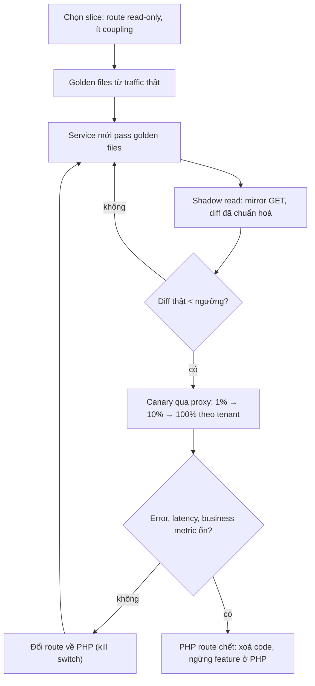
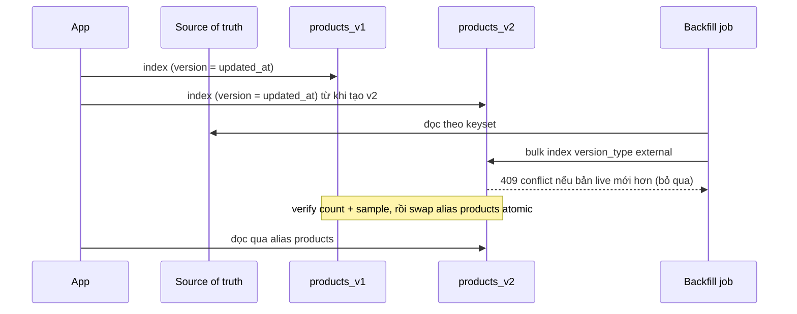

## Bối cảnh & vấn đề

Bài này gom những migration **không phải** schema Postgres: thay một hệ thống legacy, đổi format API mà client cũ vẫn phụ thuộc, đổi mapping Elasticsearch, chuyển S3 bucket, nâng cấp cách lưu password. Lý thuyết nền nằm rải ở nhiều track: [Strangler fig và ACL](/tracks/microservices/learn/strangler-fig-acl), [Versioning và deprecation](/tracks/api-design/learn/versioning-evolution), [Reindex không downtime](/tracks/nosql-search/learn/reindex-alias-bulk), [S3 và CloudFront](/tracks/aws/learn/s3-cloudfront), [Password hashing](/tracks/web-security/learn/passwords-login-abuse). Ở đây ta dùng chúng theo góc nhìn "đổi mà không ai bị vỡ".

Câu chuyện mở đầu: để kiểm thử service Node mới thay cho monolith PHP, team mirror 100% traffic production sang nó. Kết quả so sánh rất đẹp. Ngày hôm sau, khách hàng phàn nàn nhận **hai email xác nhận** cho mỗi đơn: service mới cũng xử lý `POST /orders` được mirror và gửi email thật. Cùng tuần, một partner trong số 40 partner dùng XML báo lỗi parse sau khi endpoint chuyển sang Node, dù XML mới "hợp lệ với schema".

Chủ đề chung: hệ thống cũ có **hợp đồng ngầm** mà không ai viết ra: side effect của mỗi request, thứ tự element XML, cách biểu diễn null, tên index, URL của object, định dạng hash. Migration an toàn là migration **làm hợp đồng ngầm thành tường minh** (test, adapter, alias, version), rồi chuyển dần có đo đạc và có đường lui.

## Khái niệm

### Strangler fig

**Strangler fig** đặt một proxy (Nginx, Envoy, ALB rule, API gateway) trước hệ cũ, rồi chuyển **từng route hoặc từng tenant** sang hệ mới, tới khi hệ cũ không còn traffic. Ưu điểm: mỗi bước nhỏ, rollback bằng cách đổi route, business vẫn chạy. Nhược điểm: giai đoạn chuyển tiếp dài (thường nhiều tháng), hai codebase cùng tồn tại, và **ownership dữ liệu** phải rõ. Bắt đầu bằng route read-only, ít rủi ro, có test tốt; routing theo feature flag (% user hoặc tenant) để canary.

Trong giai đoạn đầu, service mới thường đọc/ghi **cùng DB** với monolith nhưng chỉ ghi những bảng nó sở hữu; tách DB sau bằng CDC khi boundary đã ổn ([bài 03](/tracks/scenario-migration/learn/database-cutover-cdc)). Hai hệ cùng ghi một bảng mà không có quy tắc owner là cách nhanh nhất để có hai bộ business rule cãi nhau. Cơ chế facade, kill switch, ACL ở [bài lý thuyết](/tracks/microservices/learn/strangler-fig-acl).

**Interview angle:** "rewrite toàn bộ rồi đổi DNS ngày launch" là red flag; interviewer muốn nghe routing ở đâu, slice đầu tiên là gì, và ai sở hữu dữ liệu trong lúc hai hệ cùng tồn tại.

### Characterization test và adapter

**Characterization test** (golden file) ghi lại hành vi **thực tế** của hệ cũ, kể cả hành vi sai, từ traffic thật: request vào, response ra. Hệ mới phải cho cùng output trên cùng input trước khi nhận traffic. Với 40 partner parse XML, hành vi cần giữ ở mức byte tại những điểm partner parse: tên và thứ tự element, namespace, định dạng số (`12.50` hay `12.5`), ngày, cách biểu diễn null (thẻ rỗng `<note/>` hay vắng mặt), encoding và BOM.

**Adapter** giữ một core model chung và nhiều cách trình bày: `Accept: application/xml` (hoặc route `/v1`) đi qua `toLegacyXml`, JSON đi qua `toJsonV2`. Cách này tránh hai logic nghiệp vụ song song; chỉ lớp trình bày là nhân đôi.

### Shadow traffic chỉ cho read

**Shadow traffic** gửi bản sao request thật tới hệ mới, so sánh response, nhưng vẫn trả kết quả của hệ cũ. Quy tắc: mặc định chỉ mirror **GET/read**. Muốn test write thì hệ mới chạy **dry-run** với sandbox (email/payment stub, DB riêng, topic riêng), hoặc chỉ so output của hàm tính toán mà không commit. Mirror phải **fire-and-forget**: lỗi hay latency của hệ mới không được ảnh hưởng response thật. So sánh phải bỏ field động (timestamp, request id) và chuẩn hoá thứ tự mảng không mang nghĩa; nếu không, 4% mismatch toàn là nhiễu và không ai đọc báo cáo nữa.

### Deprecation có đo đạc

Retire `/v1` theo năm bước: **đo** ai còn gọi (log theo API key, client version, app version); **thông báo máy đọc được** bằng header `Deprecation` (RFC 9745) và `Sunset: <HTTP-date>` (RFC 8594) cùng `Link` tới tài liệu migrate; với **mobile**, dùng min-version/force-update từ config server vì app cũ ngoài kia không tự cập nhật; **brownout** (tắt v1 vài phút theo lịch để lộ client còn phụ thuộc); cuối cùng trả `410 Gone` kèm hướng dẫn. Trong suốt thời gian đó, v1 nên là **adapter mỏng** gọi logic v2. Khách hàng top-10 xin gia hạn: thương lượng ngày mới, cho họ endpoint riêng hoặc allowlist theo API key, không giữ v1 mở cho tất cả.

### Canary khi đổi format dữ liệu

Canary chỉ rollback được nếu dữ liệu v2 **ghi ra** vẫn đọc được bởi v1 và mọi consumer khác. Nếu v2 ghi shape JSON mới vào cột `jsonb` dùng chung và topic Kafka của team khác, tắt canary không thu hồi được những row và message đã ghi. Nên tách **reader trước writer**: release A làm mọi reader hiểu cả shape cũ và mới (tolerant reader); release B mới bật writer shape mới sau flag. Với Kafka: schema registry với compatibility BACKWARD/FULL, field mới optional, không đổi nghĩa field cũ, hoặc `schemaVersion` trong envelope, hoặc topic mới chạy song song. Đo canary cả phía **consumer** (lỗi deserialize, DLQ), không chỉ HTTP error rate của pod canary. Team consumer không deploy trong một tháng → writer chờ một tháng, hoặc ghi song song topic cũ và mới.

### Elasticsearch: alias, dual-index, external version

**Alias** là tên logic trỏ tới một hoặc nhiều index; app đọc/ghi `products`, không bao giờ `products_v1`. Mapping và analyzer của một field không đổi được trên index đã có, nên đổi mapping = build `products_v2` rồi **swap alias atomic** bằng một request `_aliases` gồm `remove` + `add`. Không có alias thì đổi index phải deploy app, rollback cũng phải deploy.

`_reindex` copy theo snapshot (scroll) lúc nó chạy. Write, update và **delete** xảy ra trong vài giờ reindex không có trong v2: doc đã xoá vẫn còn, giá cũ không được cập nhật, doc mới thiếu. Quy trình đúng: tạo v2; bật **dual-index** (ghi cả v1 và v2) **trước** khi backfill; backfill từ **source of truth** (DB hoặc Kafka) với `version_type: external` (version = `updated_at` hoặc version của row), để bản backfill cũ hơn bị từ chối thay vì đè bản live mới hơn; verify count và sample so với DB; swap alias; giữ v1 vài ngày. External version làm **thứ tự** giữa backfill và live write không còn quan trọng: bản có version cao hơn luôn thắng. Delete trong lúc backfill cần tombstone hoặc giữ version của doc đã xoá (verify chi tiết theo version ES). Demo chạy thật race này ở [bài reindex](/tracks/nosql-search/learn/reindex-alias-bulk).

### S3: replication, batch replication, inventory

Chuyển 300 TB / 2 tỉ object giữa region/account khi app vẫn ghi: bật **versioning** cả hai bucket (bắt buộc cho replication); **S3 Replication** cho object **mới**; **S3 Batch Replication** cho object có sẵn (hoặc Batch Operations copy, DataSync). App đọc theo kiểu **dual-read**: thử bucket mới, miss thì fallback bucket cũ và log miss. Verify bằng **S3 Inventory** hai bên (key, size, checksum, version) join trong Athena. ETag của multipart upload không phải MD5 của nội dung nên không so trực tiếp được; dùng **additional checksums** (CRC32C, SHA-256) hoặc checksum app tự lưu. Chú ý chi phí request (2 tỉ PUT), KMS key giữa account, object ownership, delete marker không replicate mặc định (verify theo cấu hình). Replication metrics báo 12.000 object `FAILED`: lấy danh sách từ inventory/replication status, xem nguyên nhân (KMS permission, object lock), sửa, rồi chạy Batch Replication lại cho đúng danh sách đó.

### Nâng cấp hash password mà không bắt reset

5M tài khoản lưu MD5 không salt. Không có password gốc nên không rehash offline được. Hai bước: (1) **wrap ngay** cho mọi user: lưu `argon2id(md5_hash)` và đánh dấu scheme `argon2(md5)`; MD5 lộ ra không còn dùng được và không phải chờ ai đăng nhập; (2) **rehash-on-login**: verify theo scheme hiện tại, thành công thì tính `argon2id(password)` và chuyển scheme sang `argon2`. Sau N tháng, user không đăng nhập vẫn được bảo vệ bởi lớp wrap; có thể buộc reset cho nhóm này. Lưu tham số trong chuỗi hash (PHC format) để nâng cấp tiếp. Tham số và bẫy ở [Password hashing](/tracks/web-security/learn/passwords-login-abuse).

**Interview angle:** câu follow-up "vì sao wrap ngay tốt hơn chờ login?" → vì phần lớn tài khoản không hoạt động không bao giờ login, nên chỉ rehash-on-login để họ trên MD5 trần vô thời hạn.

## Cơ chế hoạt động

### Một slice của strangler fig



Mỗi slice đi hết vòng này trước khi slice sau bắt đầu chuyển traffic (có thể chuẩn bị song song). Kill switch là đổi route ở proxy, không phải deploy, nên rollback mất vài giây. Đo tiến độ bằng **% traffic đã chuyển**, không bằng % code đã viết lại; slice đã chuyển thì ngừng thêm feature vào phía PHP, nếu không hai hệ cứ lệch dần.

### Reindex có dual-index và external version



Ghi live vào v2 bắt đầu **trước** backfill, nên không có khoảng hở. Backfill đọc DB tại thời điểm T1 có thể ghi một bản cũ hơn bản live đã ghi lúc T2 > T1; external version khiến ES từ chối bản cũ đó với lỗi 409 version conflict, và job coi 409 là "đã có bản mới hơn", không phải lỗi. Swap alias là một request atomic; v1 giữ lại vài ngày, rollback = swap ngược.

## Ví dụ thực tế

### Wrap MD5 và rehash-on-login với argon2id của Node

Node 24 có `crypto.argon2Sync` sẵn (đang experimental (verify)), không cần package native. Tham số theo mức tối thiểu của OWASP: m = 19 MiB, t = 2, p = 1.

```ts
// pw.mjs (Node 24.21)
import { argon2Sync, createHash, randomBytes, timingSafeEqual } from "node:crypto";
const P = { parallelism: 1, tagLength: 32, memory: 19456, passes: 2 };
const md5 = (s) => createHash("md5").update(s).digest("hex");
function hash(secret) {
  const nonce = randomBytes(16);
  const tag = argon2Sync("argon2id", { message: secret, nonce, ...P });
  return `$argon2id$v=19$m=${P.memory},t=${P.passes},p=1$${nonce.toString("base64url")}$${tag.toString("base64url")}`;
}
function check(phc, secret) {
  const [, , , , salt, tag] = phc.split("$");
  const t = argon2Sync("argon2id", { message: secret, nonce: Buffer.from(salt, "base64url"), ...P });
  return timingSafeEqual(t, Buffer.from(tag, "base64url"));
}
const user = { email: "a@x.com", scheme: "md5", hash: md5("correct horse") };
// step 1: offline wrap for every row, no password needed
user.hash = hash(user.hash); user.scheme = "argon2(md5)";
// step 2: on login
function login(u, pw) {
  const ok = u.scheme === "argon2" ? check(u.hash, pw) : check(u.hash, md5(pw));
  if (ok && u.scheme !== "argon2") { u.hash = hash(pw); u.scheme = "argon2"; }
  return ok;
}
console.log("login wrong pw:", login(user, "nope"), user.scheme);
console.log("login right pw:", login(user, "correct horse"), user.scheme);
console.log("login again   :", login(user, "correct horse"), user.scheme);
```

```text
wrap: 20 ms/user -> argon2(md5) $argon2id$v=19$m=19456,t=2,p=1$8c2jqO9yB...
login wrong pw: false argon2(md5)
login right pw: true argon2
login again   : true argon2
```

Sai password không đổi gì; đúng password lần đầu nâng scheme lên `argon2`; lần sau verify trực tiếp. Chi phí wrap: 20 ms × 5M user ≈ 100.000 giây CPU, tức khoảng **28 CPU-giờ** trên một core; chạy như backfill theo batch trên 8 worker thì một buổi chiều, và đó là lý do không làm nó trong một transaction migration. Trong DB, giữ cột `scheme` (hoặc đọc prefix PHC) và update theo keyset như [bài 02](/tracks/scenario-migration/learn/expand-contract-backfill). Lưu ý `md5(pw)` trong lớp wrap phải là **đúng** biểu diễn cũ (hex thường, có trim hay không, encoding) — đây chính là một "hợp đồng ngầm" cần characterization test với vài tài khoản thật.

### Adapter XML và golden test (minh hoạ)

```ts
app.get("/api/orders/:id", async (req, res) => {
  const order = await orders.get(req.params.id);               // one core model
  if (req.accepts(["json", "xml"]) === "xml") {
    res.set("Deprecation", "@1767225600");                      // RFC 9745: structured date
    res.set("Sunset", "Wed, 30 Jun 2027 00:00:00 GMT");          // RFC 8594
    res.set("Link", '</docs/migrate-v2>; rel="deprecation"');
    res.type("application/xml").send(toLegacyXml(order));       // byte-compatible with PHP
  } else {
    res.json(toJsonV2(order));
  }
});

// golden test: captured PHP responses replayed against the adapter
for (const g of loadGolden("orders-xml/*.json")) {
  test(g.name, () => expect(toLegacyXml(g.order)).toBe(g.phpResponseBody));
}
```

Đây là minh hoạ. So sánh `toBe` trên chuỗi, không phải "XML tương đương về cấu trúc", là cố ý: partner parse bằng regex hoặc theo thứ tự element sẽ vỡ vì những khác biệt mà schema validator bỏ qua. Partner duy nhất bị lỗi trong câu chuyện mở đầu thường rơi vào: thứ tự element, `<note/>` thay vì vắng thẻ, `12.5` thay vì `12.50`, timezone trong ngày, hoặc BOM.

### Shadow comparator bỏ nhiễu (minh hoạ)

```ts
const IGNORE = new Set(["requestId", "generatedAt", "serverTime"]);
function normalize(v: unknown): unknown {
  if (Array.isArray(v)) return v.map(normalize).sort((a, b) => JSON.stringify(a).localeCompare(JSON.stringify(b)));
  if (v && typeof v === "object")
    return Object.fromEntries(Object.entries(v).filter(([k]) => !IGNORE.has(k)).sort().map(([k, x]) => [k, normalize(x)]));
  return v;
}
// only for GET; fire-and-forget, never awaited by the user request
if (req.method === "GET") void mirror(req).then((n) => diff(normalize(old), normalize(n))).catch(log);
```

Sort mảng chỉ đúng cho mảng không mang nghĩa thứ tự; danh sách có `ORDER BY` thì giữ thứ tự và coi lệch thứ tự là bug thật. Báo cáo theo endpoint và theo field, để 4% mismatch được tách thành "3,8% là `generatedAt`" và "0,2% là `discount` làm tròn khác", và chỉ con số sau đáng giờ của ai đó.

## Trade-offs & lựa chọn thay thế

| Bài toán | Cách big-bang | Cách từng bước | Giá của cách từng bước |
| --- | --- | --- | --- |
| Monolith PHP → Node | Rewrite + đổi DNS | Strangler qua proxy, slice theo route/tenant | Hai hệ chạy song song nhiều tháng |
| XML → JSON cho 40 partner | Email + đổi theo ngày | Adapter + golden test + Sunset header | Duy trì adapter tới khi traffic = 0 |
| Test hệ mới | Mirror mọi request | Mirror GET, dry-run cho write | Không thấy bug write qua mirror |
| Đổi format dữ liệu | Canary writer ngay | Reader trước, writer sau flag | Thêm một release, chờ team khác |
| Đổi mapping ES | `_reindex` rồi swap | Dual-index + backfill external version | Indexer phải ghi hai index |
| S3 bucket mới | `aws s3 sync` + đếm object | Replication + Batch Replication + Inventory | Chi phí request, cấu hình IAM/KMS |
| Hash password | Bắt mọi user reset | Wrap ngay + rehash-on-login | Code hai scheme vài tháng |

Khi nào big-bang chấp nhận được: hệ nhỏ, ít client và client kiểm soát được (nội bộ, cùng deploy), hoặc chi phí chạy song song lớn hơn rủi ro. Module PHP ít đổi, ít lỗi có thể **để yên** và không bao giờ viết lại; nói rõ điều kiện dừng là một phần của chiến lược 18 tháng.

## Edge cases & failure modes

- **Session/auth giữa hai hệ**: PHP dùng session file, Node dùng JWT; user bị logout khi route chuyển. Dùng session store chung hoặc proxy dịch cookie sang token.
- **Mirror làm quá tải hệ cũ**: service mới gọi ngược API của PHP cho mỗi request mirror, gấp đôi tải. Giới hạn % mirror và rate limit.
- **Brownout trúng giờ cao điểm của một client lớn**: lịch brownout theo múi giờ của client, báo trước.
- **Elasticsearch delete trong lúc backfill**: doc đã xoá ở DB nhưng backfill đọc trước đó ghi lại vào v2. Dùng version cho cả delete, hoặc chạy pass "xoá doc không còn trong DB" trước khi swap.
- **S3 object ghi trong lúc chuyển**: object mới replicate bất đồng bộ (phần lớn trong vài giây tới vài phút; RTC có SLA 15 phút (verify)); dual-read với fallback che khoảng trễ này.
- **Rehash-on-login khi DB replica lag**: login đọc replica thấy scheme cũ sau khi đã nâng cấp; verify vẫn đúng nếu logic xử lý cả hai scheme, nên đừng xoá nhánh cũ quá sớm.
- **Consumer của team khác không deploy được**: canary writer phải chờ; hoặc publish song song topic cũ và mới có hạn chót.

## Pitfalls

- ❌ Rewrite toàn bộ rồi đổi DNS → ✅ strangler theo slice, rollback bằng route.
- ❌ Mirror endpoint ghi vào DB/email/payment thật → ✅ chỉ GET, write chạy dry-run có stub.
- ❌ "XML hợp lệ với schema là đủ" → ✅ golden test so byte ở những gì partner parse.
- ❌ Tắt v1 đúng ngày đã thông báo mà không đo → ✅ đo theo client, brownout, rồi 410 khi traffic ≈ 0.
- ❌ Canary writer format mới trước khi reader hiểu nó → ✅ reader trước, writer sau flag; đo lỗi ở consumer.
- ❌ App dùng tên index thật → ✅ alias từ ngày đầu, swap atomic.
- ❌ `_reindex` một lần rồi swap → ✅ dual-index trước, backfill từ DB với external version.
- ❌ So số lượng object hoặc ETag multipart → ✅ Inventory + additional checksums, join hai bên.
- ❌ Chỉ rehash-on-login → ✅ wrap mọi hash MD5 ngay, rehash dần khi login.

## Tóm tắt

- Legacy có hợp đồng ngầm (side effect, format, tên, URL); migration an toàn làm chúng thành test, adapter, alias, version.
- Strangler fig: proxy + slice theo route/tenant + golden test + shadow read + canary + kill switch; dữ liệu có một owner rõ.
- Shadow traffic chỉ cho read; write chạy dry-run; so sánh sau khi bỏ field động.
- Deprecation: đo → `Deprecation`/`Sunset` header → force-update mobile → brownout → 410.
- Đổi format dữ liệu: reader trước, writer sau; đo canary ở cả consumer.
- ES: alias, dual-index trước backfill, external version để bản cũ không đè bản mới, swap atomic.
- S3: versioning + Replication + Batch Replication, dual-read, verify bằng Inventory và checksum.
- Password: wrap `argon2id(md5)` ngay (đo được 20 ms/user, ~28 CPU-giờ cho 5M), rehash-on-login sau.
