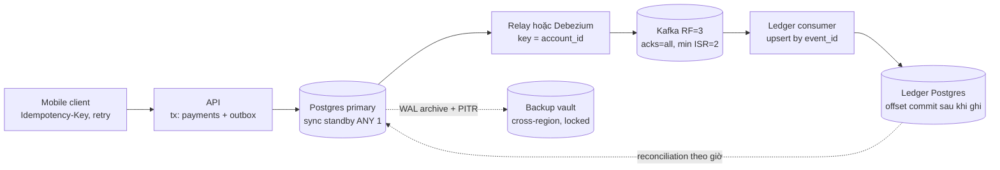
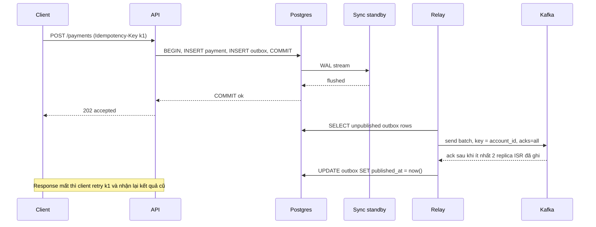
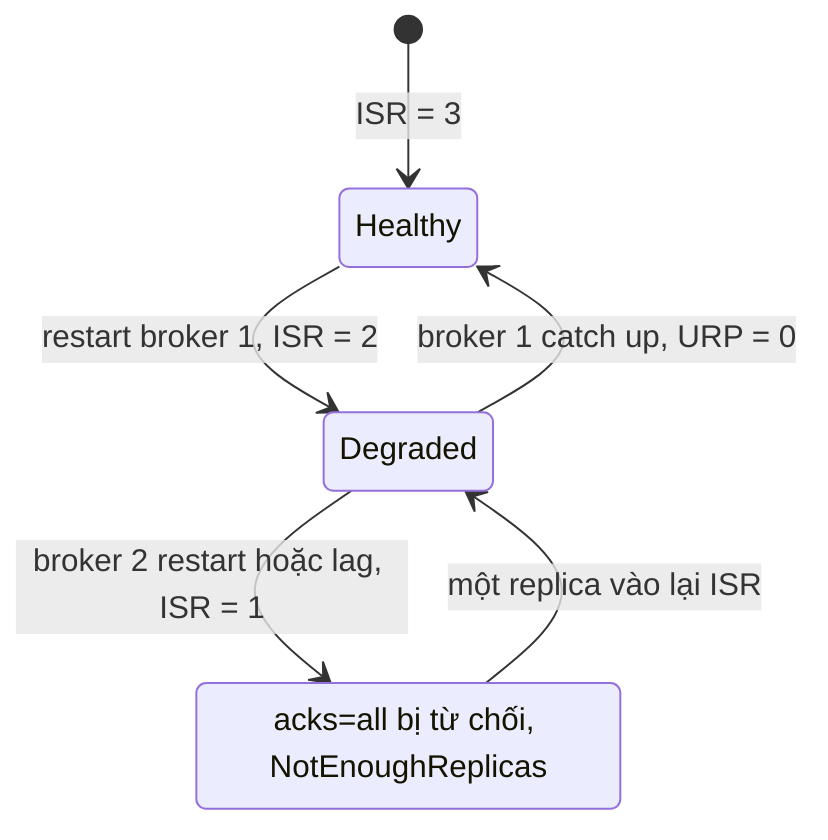

## Bối cảnh & vấn đề

Bài này là playbook cho câu hỏi khó nhất của mọi pipeline tiền: "làm sao chứng minh **không mất** một giao dịch nào?". Lý thuyết nền đã có ở các track khác: WAL và fsync ở [Storage & WAL](/tracks/sql-postgres/learn/storage-wal), standby ở [Replication & scaling](/tracks/sql-postgres/learn/replication-scaling), ISR ở [Replication & durability trong Kafka](/tracks/messaging-kafka/learn/replication-durability), outbox ở [Outbox, CDC, sagas](/tracks/messaging-kafka/learn/outbox-cdc-sagas). Ở đây ta ghép chúng thành **một chuỗi** và tìm mắt xích yếu.

Câu chuyện mở đầu: order API trả `202 Accepted` trong 8 ms lúc cao điểm. Một pod bị OOM-killed. Hôm sau CSKH nhận 600 khiếu nại: khách thấy "đã nhận đơn", nhưng đơn không có trong Postgres, không có trong Kafka, không có ở đâu cả. Kafka có `acks=all`, RF=3; Postgres có Multi-AZ; backup chạy mỗi đêm. Mọi thành phần đều "durable", nhưng chuỗi thì không, vì API **ack trước khi dữ liệu nằm ở chỗ durable đầu tiên**.

Bài học: durability là thuộc tính của **cả chuỗi** từ client tới storage cuối, không phải của từng hộp. Chuỗi bền bằng mắt xích yếu nhất, và "zero data loss" chỉ có nghĩa khi ta nói rõ **loại sự cố nào** (mất pod, mất node, mất AZ, mất region, bug xoá dữ liệu) và **chứng minh** được bằng reconciliation, không phải bằng sơ đồ kiến trúc.

## Khái niệm

### RPO và RTO: hai con số phải chốt đầu tiên

**RPO** (Recovery Point Objective) là lượng dữ liệu tối đa được phép mất, đo bằng thời gian: RPO = 5 phút nghĩa là sau sự cố có thể mất tối đa 5 phút giao dịch gần nhất. **RTO** (Recovery Time Objective) là thời gian tối đa hệ thống được phép ngừng phục vụ. "Zero data loss, zero downtime" là RPO = 0, RTO = 0, và không ai mua được cái đó với mọi loại sự cố; việc của kỹ sư là đổi câu khẩu hiệu thành một bảng số theo từng loại sự cố.

Hai con số kéo thiết kế theo hai hướng khác nhau. RPO = 0 cho sự cố mất node đòi **synchronous replication** (Postgres sync standby, Kafka `acks=all` + `min.insync.replicas=2`), idempotent retry, và nguyên tắc không ack trước khi durable; giá là thêm một network round trip mỗi commit. RPO = 5 phút thì async replica + WAL archive là đủ. RTO vài giây cần automatic failover multi-AZ và client tự reconnect; RTO 1 giờ thì restore từ snapshot cũng được.

Quan trọng nhất: replication cho RPO ≈ 0 với **mất phần cứng**, nhưng vô dụng với **lỗi logic**. `UPDATE accounts SET balance = 0` thiếu `WHERE` được replicate sang standby trong vài mili-giây. Chỉ **PITR** (point-in-time recovery từ base backup + WAL archive) cứu được loại này, với RPO tính bằng "lúc ta phát hiện ra".

| Loại sự cố | Cơ chế bảo vệ | RPO điển hình | RTO điển hình |
| --- | --- | --- | --- |
| Pod/process chết | No ack until durable, client retry | 0 | giây |
| Mất node DB | Sync standby / Multi-AZ | 0 | 1–2 phút |
| Mất AZ | Replica/broker trải 3 AZ | 0 | phút |
| Mất region | Cross-region replica/backup (async) | giây–phút | phút–giờ |
| Bug/người xoá dữ liệu | PITR, backup immutable | tới thời điểm trước lỗi | giờ |

**Interview angle:** câu follow-up kinh điển là "replication cho RPO≈0, vậy sao không cứu được deploy lỗi xoá row?". Trả lời được "replication copy cả lỗi, backup mới quay ngược thời gian" là tín hiệu tốt.

### No ack until durable

Nguyên tắc: hệ thống chỉ được nói "đã nhận" (HTTP 200/202, Kafka ack, offset commit) **sau khi** dữ liệu đã nằm ở một nơi sống sót qua loại sự cố ta cam kết. RAM của một pod không phải nơi như vậy. Buffer trong một `setInterval`, một hàng đợi in-memory, hay `fire-and-forget` `producer.send()` không `await` đều vi phạm nguyên tắc này: chúng đổi durability lấy vài mili-giây latency.

Phía client là nửa còn lại của nguyên tắc. Nếu server crash **sau** khi ghi durable nhưng **trước** khi trả response, client thấy timeout và sẽ retry; không có **Idempotency-Key** thì retry tạo đơn trùng. Vì vậy "no ack until durable" luôn đi cùng "retry an toàn": client sinh key một lần cho mỗi ý định (một lần bấm "Thanh toán"), server có unique index trên key, lần retry thứ hai trả lại kết quả của lần đầu.

**Interview angle:** graceful shutdown (bắt `SIGTERM`, flush buffer rồi thoát) giúp khi deploy nhưng **không** cứu OOM-kill hay `kill -9`. Người chỉ đề xuất graceful shutdown cho bug 600 đơn là chưa thấy gốc vấn đề.

### synchronous_commit trong Postgres

`synchronous_commit` quyết định Postgres chờ tới đâu trước khi trả `COMMIT` thành công:

- `off`: trả OK trước khi WAL được flush xuống disk local. Crash có thể mất các commit trong khoảng tới khoảng 3 × `wal_writer_delay` (mặc định 200 ms, nên khoảng 600 ms) (verify). Database **không corrupt**: WAL vẫn nhất quán, chỉ là các commit cuối biến mất như chưa từng xảy ra.
- `local`: chờ flush WAL local, không chờ standby.
- `on` (mặc định): flush local; nếu `synchronous_standby_names` khác rỗng thì chờ thêm standby **flush** WAL xuống disk của nó. Mất primary không mất commit đã ack.
- `remote_write`: chờ standby nhận và ghi vào OS cache (chưa fsync). Mất cả hai máy cùng lúc mới mất.
- `remote_apply`: chờ standby **apply** WAL, nên đọc ngay từ standby thấy dữ liệu vừa ghi (read-your-writes trên replica).

Hai điều hay bị hiểu sai: streaming replication **mặc định là async** (không đặt `synchronous_standby_names` thì `on` chỉ là flush local), và `synchronous_commit` đặt được **theo transaction**: log ít quan trọng dùng `SET LOCAL synchronous_commit = off` để không trả giá round trip, còn bảng `payments` giữ `on`.

Rủi ro của sync: với `FIRST 1 (s1)` và chỉ một sync standby, standby chết thì mọi commit **treo** chờ, app timeout hàng loạt. Dùng hai standby với `ANY 1 (s1, s2)`: commit chờ bất kỳ một trong hai, mất một con vẫn ghi được.

### Multi-AZ không phải read replica, và cả hai không phải backup

Trên RDS, **read replica** dùng replication **async**, mục đích là scale đọc; primary chết thì replica có thể thiếu vài giây dữ liệu, promote là thao tác tay và endpoint đổi. **Multi-AZ DB instance** có một standby ở AZ khác nhận replication **synchronous**, không phục vụ đọc, failover tự động qua **cùng DNS endpoint** (thường 1–2 phút (verify)). **Multi-AZ DB cluster** có hai standby đọc được, commit chờ ít nhất một standby ack, failover nhanh hơn (verify theo engine/version).

"Có replica nên không lo mất dữ liệu" sai ở hai tầng: replica async vẫn mất dữ liệu khi primary chết, và mọi replica đều copy cả `DELETE` sai. Thay đổi đúng: bật Multi-AZ cho RPO = 0 khi mất node/AZ; giữ automated backup với PITR (retention 7–35 ngày); copy snapshot sang **account/region khác** có khoá chống xoá; phía app dùng endpoint DNS, TTL thấp, pool tự reconnect và retry khi failover. Pod Node giữ IP cũ nhiều phút sau failover thường là do connection pool giữ socket cũ hoặc DNS bị cache trong process.

### PITR và restore drill

**PITR** khôi phục database tới một thời điểm bất kỳ bằng cách lấy base backup rồi replay WAL archive tới `recovery_target_time`. Chuỗi WAL phải **liên tục**: một file WAL thiếu (vì `archive_command` từng fail) là mọi thời điểm sau đó không restore được. Lỗi này im lặng cho tới ngày cần restore.

Backup chưa từng restore là một **giả thuyết**. Câu trả lời trung thực cho CTO là "chưa restore thử thì chưa biết", rồi dựng **restore drill tự động**: định kỳ restore tới một timestamp cụ thể vào instance tạm, chạy smoke query (row mới nhất có `created_at` gần mục tiêu, count bảng chính), đo thời gian restore thật (đó mới là RTO thật), alert nếu fail, xoá instance. Kèm theo: theo dõi `pg_stat_archiver.failed_count`, backup ở vault có lock chống xoá (S3 Object Lock, AWS Backup Vault Lock), và runbook ghi rõ ai quyết định restore.

Với "UPDATE thiếu WHERE 20 phút trước": **không** PITR đè lên production (mất 20 phút write hợp lệ của mọi bảng khác). Restore sang **instance phụ** tới thời điểm ngay trước lệnh sai, rồi copy đúng các row bị hỏng của bảng đó về production bằng `UPDATE ... FROM` theo PK, có kiểm tra row nào đã được sửa hợp lệ sau đó.

### Transactional outbox, làm cho đúng

**Outbox** giải bài toán "ghi DB và publish event" không atomic: app ghi row business và row `outbox` trong **cùng một transaction**; một **relay** đọc outbox và publish sang Kafka. Event tồn tại khi và chỉ khi row business tồn tại. Relay là at-least-once: publish xong mà crash trước khi đánh dấu thì lần sau publish lại, nên consumer dedupe theo `event_id`.

Hai bug hay gặp khi scale relay lên nhiều replica:

- **Mất event vì high-water mark**: `id` lấy từ sequence lúc INSERT, nhưng transaction commit theo thứ tự khác. Tx A lấy id 100 và commit chậm, tx B lấy id 101 commit trước. Relay đọc `id > last`, thấy 101, lưu `last = 101`; khi A commit, id 100 nằm **dưới** mốc và không bao giờ được đọc. Fix: poll `WHERE published_at IS NULL` với partial index, không dùng checkpoint theo id.
- **Sai thứ tự**: `FOR UPDATE SKIP LOCKED` chia các row của **cùng một order** cho nhiều relay chạy song song; `kafka.send` thiếu **key** nên event rơi vào partition khác nhau. Fix: key = `aggregate_id`, mỗi relay sở hữu một nhóm aggregate (`hash(aggregate_id) % N`, advisory lock theo shard), hoặc chỉ một relay leader.

**CDC** (Debezium với outbox event router) đọc WAL theo **commit order** nên tránh được cả hai bug, đổi lại phải vận hành Kafka Connect và replication slot.

### Kafka: acks, ISR và min.insync.replicas

**ISR** (in-sync replicas) là tập replica của một partition đang theo kịp leader. Với `acks=all`, leader chỉ ack khi **mọi** replica trong ISR đã ghi; `min.insync.replicas=2` thêm điều kiện ISR phải có ít nhất 2 thành viên, nếu không producer nhận `NotEnoughReplicasException`. Bộ ba RF=3, `min.insync.replicas=2`, `acks=all` nghĩa là mỗi message đã ack nằm trên ít nhất 2 broker, và cluster chịu mất một broker mà vẫn ghi được.

Thêm `enable.idempotence=true` để retry của producer không tạo duplicate trong partition, và `unclean.leader.election.enable=false` để một replica **ngoài** ISR (thiếu dữ liệu) không bao giờ được bầu làm leader. Bật unclean election là chấp nhận mất các message đã ack để đổi lấy availability, chỉ hợp cho dữ liệu kiểu metrics.

**Interview angle:** `NotEnoughReplicasException` khi rolling upgrade **không** có nghĩa config sai; đó là config đang làm đúng việc. Hạ `min.insync.replicas` xuống 1 để "hết lỗi" là red flag.

### Reconciliation: cách duy nhất để chứng minh

Mọi knob ở trên giảm xác suất mất; **reconciliation** là thứ **đo** xem có mất hay không. Định nghĩa một **invariant** so được ở cả nguồn và sink, ví dụ count + sum(amount) + max(updated_at) theo (tenant, giờ). Chạy trên **cửa sổ đã đóng** (giờ trước, cộng độ trễ an toàn 15 phút) để lag bình thường không bị báo là lệch. Lệch thì drill down: chia nhỏ cửa sổ, so danh sách id hoặc hash theo bucket id, tìm đúng row thiếu/sai, rồi **re-emit** event cho các id đó từ nguồn. Re-emit an toàn vì sink idempotent và chỉ áp bản có version mới hơn.

## Cơ chế hoạt động

### Chuỗi durability từ client tới ledger



Đọc sơ đồ theo câu hỏi "nếu hộp này chết ngay sau khi nhận dữ liệu, dữ liệu còn ở đâu?". Client giữ payment cho tới khi nhận ack, nên API chết thì client retry với cùng key. API chỉ ack sau khi transaction (payment + outbox) commit trên primary **và** sync standby, nên primary chết thì standby có đủ. Relay chết thì row outbox vẫn còn và được publish lại. Kafka mất một broker thì message đã ack còn trên ít nhất một broker khác trong ISR. Ledger consumer chết trước khi commit offset thì message được giao lại và upsert theo `event_id` bỏ bản trùng. Mũi tên nét đứt là hai lưới an toàn cho thứ replication không cứu được: PITR cho lỗi logic, reconciliation để phát hiện mọi lỗ hổng còn lại.

### Một request đi qua chuỗi



Thứ tự trong sơ đồ là toàn bộ hợp đồng: `202` chỉ đi ra sau `flushed` từ standby. Đoạn từ relay trở đi là **bất đồng bộ** so với client, nên Kafka chậm hay sập không làm API lỗi; outbox hấp thụ sự cố đó, đổi lại downstream trễ. Relay đánh dấu `published_at` **sau** khi Kafka ack; crash giữa hai bước tạo duplicate, không tạo mất mát.

### Trạng thái của một partition khi rolling upgrade



Ở trạng thái `Degraded`, ghi vẫn thành công vì ISR = 2 ≥ `min.insync.replicas`. Lỗi trong câu chuyện xảy ra khi người vận hành restart broker tiếp theo **trước khi** broker trước catch up: partition rơi vào `Rejecting`. Runbook đúng: restart từng broker, chờ **under-replicated partitions = 0** rồi mới sang broker kế tiếp, dùng controlled shutdown, và trải replica qua 3 AZ (rack awareness) để một sự cố AZ chỉ lấy đi một replica.

## Ví dụ thực tế

Các đoạn dưới là **minh hoạ** (không chạy trong bài này); output được ghi theo hành vi đã biết của Postgres/Kafka để đọc cùng code.

### Bug 600 đơn và bản sửa

```ts
// BUG: acked before durable
const queue: Order[] = [];
setInterval(async () => {
  const batch = queue.splice(0, 500);
  if (batch.length) await producer.send({ topic: "orders", messages: batch.map(toMsg) });
}, 1000);
app.post("/orders", (req, res) => {
  queue.push(validate(req.body));
  res.status(202).json({ status: "accepted" });
});
```

Ba lỗi chồng lên nhau: order chỉ nằm trong RAM tới 1 giây (lâu hơn khi Kafka chậm); queue không giới hạn nên chính nó gây OOM khi Kafka chậm; lỗi `send` trong `setInterval` thành unhandled rejection và batch đã `splice` ra thì mất luôn. Bản sửa ghi durable trong transaction rồi mới ack:

```ts
app.post("/orders", async (req, res) => {
  const key = req.header("Idempotency-Key");
  if (!key) return res.status(400).json({ error: "Idempotency-Key required" });
  const order = validate(req.body);
  const result = await db.transaction(async (tx) => {
    const existing = await tx.query(
      "SELECT id, status FROM orders WHERE idempotency_key = $1", [key]);
    if (existing.rows[0]) return existing.rows[0];          // retry returns the first result
    const { rows } = await tx.query(
      "INSERT INTO orders (idempotency_key, payload, status) VALUES ($1, $2, 'accepted') RETURNING id, status",
      [key, order]);
    await tx.query(
      "INSERT INTO outbox (event_id, aggregate_id, topic, payload) VALUES (gen_random_uuid(), $1, 'orders', $2)",
      [rows[0].id, order]);
    return rows[0];
  });
  res.status(202).json(result);                              // only after COMMIT
});
```

```text
# illustrative: same key twice, second call after a client timeout
POST /orders  Idempotency-Key: k-7f3  -> 202 {"id": 9001, "status": "accepted"}
POST /orders  Idempotency-Key: k-7f3  -> 202 {"id": 9001, "status": "accepted"}
SELECT count(*) FROM orders WHERE idempotency_key = 'k-7f3';  -- 1
```

Hai request đồng thời cùng key vẫn có thể cùng không thấy `existing`; unique index trên `idempotency_key` biến lần INSERT thứ hai thành lỗi `23505`, app bắt lỗi đó và đọc lại row. Latency tăng từ 8 ms lên khoảng 10–20 ms (một commit có sync standby cùng region), đổi lại không còn "accepted nhưng không tồn tại".

### Relay outbox an toàn với nhiều replica

```sql
CREATE TABLE outbox (
  id           bigserial PRIMARY KEY,
  event_id     uuid NOT NULL UNIQUE,
  aggregate_id bigint NOT NULL,
  topic        text NOT NULL,
  payload      jsonb NOT NULL,
  created_at   timestamptz NOT NULL DEFAULT now(),
  published_at timestamptz
);
-- small index that only holds unpublished rows
CREATE INDEX outbox_unpublished ON outbox (id) WHERE published_at IS NULL;
```

```ts
// each of N relays owns shard = hash(aggregate_id) % N, so one aggregate has one publisher
async function relayOnce(shard: number, shards: number) {
  await db.transaction(async (tx) => {
    const { rows } = await tx.query(
      `SELECT id, event_id, aggregate_id, topic, payload FROM outbox
        WHERE published_at IS NULL AND mod(aggregate_id, $2) = $1
        ORDER BY id LIMIT 500 FOR UPDATE SKIP LOCKED`, [shard, shards]);
    if (!rows.length) return;
    await producer.send({                       // idempotent producer, acks=all
      topic: rows[0].topic,
      messages: rows.map((r) => ({ key: String(r.aggregate_id), value: JSON.stringify(r.payload),
                                   headers: { event_id: r.event_id } })),
    });
    await tx.query("UPDATE outbox SET published_at = now() WHERE id = ANY($1)", [rows.map((r) => r.id)]);
  });
}
```

Không còn checkpoint theo id nên tx commit muộn vẫn được thấy ở lần poll sau. Lock giữ trong transaction nên `SKIP LOCKED` thật sự có tác dụng; bản lỗi gốc chạy `SELECT ... FOR UPDATE` ngoài transaction nên lock nhả ngay sau statement. (Code giả định mọi row trong batch cùng topic; thực tế group theo topic.) Thứ tự giữa các aggregate có thể đổi, nhưng các event của **một** aggregate luôn đi qua một relay, một key, một partition.

### Outbox phình 80M row

Triệu chứng: relay trễ 25 phút, query poll mất 4 giây. Chẩn đoán bằng ba câu:

```sql
SELECT now() - min(created_at) AS outbox_age FROM outbox WHERE published_at IS NULL;
SELECT n_live_tup, n_dead_tup, last_autovacuum FROM pg_stat_user_tables WHERE relname = 'outbox';
EXPLAIN SELECT id FROM outbox WHERE published_at IS NULL ORDER BY id LIMIT 500;
```

```text
-- illustrative
 outbox_age | 00:25:13
 n_live_tup 80412339 | n_dead_tup 11873002 | last_autovacuum 2 days ago
 Seq Scan on outbox  (rows=80412339)  Filter: (published_at IS NULL)
```

Nguyên nhân: không ai xoá row đã publish, không có partial index, update `published_at` sinh dead tuple nhanh hơn autovacuum dọn, và relay gửi từng message một. Thứ tự sửa **không mất event**: tạo partial index `CONCURRENTLY`; chuyển sang publish batch; xoá row đã publish theo batch nhỏ (`DELETE ... WHERE id IN (SELECT id ... WHERE published_at < now() - interval '1 day' LIMIT 10000)`) hoặc partition outbox theo ngày rồi `DROP` partition cũ; tune autovacuum riêng cho bảng (`autovacuum_vacuum_scale_factor = 0.01`). **Tuyệt đối không `TRUNCATE`** để đuổi kịp: đó là xoá đúng những event chưa publish.

### Reconciliation theo cửa sổ đã đóng

```sql
-- run the same shape on the source (replica) and on each sink
SELECT tenant_id, date_trunc('hour', created_at AT TIME ZONE 'UTC') AS h,
       count(*) AS n, sum(amount_cents) AS total, max(updated_at) AS last_upd
FROM orders
WHERE created_at >= $1 AND created_at < $2      -- closed window: [now-2h, now-1h-15min)
GROUP BY 1, 2;
```

```text
-- illustrative diff of source vs warehouse
 tenant | hour             | n_src | n_wh | total_src  | total_wh
 42     | 2026-10-06 14:00 |  1210 | 1209 | 98 412 300 | 98 312 300
```

Một row thiếu ở tenant 42, giờ 14:00. Drill down theo bucket `id % 64`, tìm ra id thiếu, tra DLQ (thường thấy event bị đẩy vào DLQ do lỗi mapping), rồi re-emit từ nguồn. Ghi kết quả mỗi lần chạy vào bảng audit: mismatch rate, số row tự sửa, tuổi của lệch.

### Knob cho cả chuỗi

```properties
# producer
acks=all
enable.idempotence=true
delivery.timeout.ms=120000
# topic
replication.factor=3
min.insync.replicas=2
unclean.leader.election.enable=false
# consumer
enable.auto.commit=false        # commit offset after the DB write
```

```text
# postgresql.conf on the payments primary
synchronous_commit = on
synchronous_standby_names = 'ANY 1 (s1, s2)'
archive_mode = on
```

## Trade-offs & lựa chọn thay thế

### Ghi Postgres và read model: 2PC, dual write, outbox, CDC

| Cách | Atomic? | Thứ tự | Vận hành | Hợp khi |
| --- | --- | --- | --- | --- |
| Dual write từ app | Không | Có thể đảo | Thấp nhưng sửa mọi đường ghi | Hầu như không; chỉ kèm reconciliation mạnh |
| 2PC / XA | Có | Có | Coordinator, lock khi chờ, blocking | Các resource đều hỗ trợ XA (Postgres + MySQL), throughput thấp |
| Outbox + relay poll | Có (cùng DB) | Theo aggregate nếu key đúng | Relay, dọn bảng | Mặc định cho hầu hết hệ thống |
| Outbox + CDC (Debezium) | Có | Commit order | Kafka Connect, slot, offset | Throughput cao, đã có Kafka |
| CDC trên bảng business | Có | Commit order | Như trên | Không sửa được code ghi; chấp nhận event mang hình dạng bảng |

2PC có thật (`PREPARE TRANSACTION` trong Postgres, XA ở MySQL/SQL Server) và cho atomic giữa nhiều resource, nhưng coordinator chết khi đang prepared là các bên giữ lock cho tới khi có người can thiệp, và đa số NoSQL (MongoDB, DynamoDB, Elasticsearch) không tham gia XA. Với Postgres + MongoDB read model, chọn outbox (poll hoặc CDC), sink upsert `WHERE version < incoming`, đo relay lag, và cho chính user vừa đặt hàng đọc từ Postgres (read-your-writes) trong vài chục giây đầu.

### Độ mạnh durability và giá phải trả

| Lựa chọn | Mất gì khi sự cố | Giá |
| --- | --- | --- |
| `synchronous_commit=off` | ~vài trăm ms commit khi crash | Latency thấp nhất |
| `on`, không sync standby | Commit chưa sang replica khi mất primary | Một fsync |
| `on` + `ANY 1 (s1, s2)` | Không mất khi mất một máy | +1 RTT liên AZ (~1–2 ms) |
| `remote_apply` | Như trên, thêm read-your-writes trên standby | Chờ apply, chậm hơn |
| Kafka `acks=1` | Message chưa sang follower khi leader chết | Nhanh hơn |
| Kafka `acks=all`, min ISR 2 | Không mất khi mất một broker | Từ chối ghi khi ISR < 2 |

Khi nào chọn gì: dữ liệu tiền, ledger, đơn hàng dùng hàng dưới của mỗi bảng; event analytics, log, metrics dùng `synchronous_commit=off` per-transaction và `acks=1` là hợp lý. Không phải mọi bảng trong cùng một DB cần cùng mức, và đặt per-transaction cho phép trả giá đúng chỗ.

## Edge cases & failure modes

- **Sync standby duy nhất chết**: với `FIRST 1 (s1)`, mọi commit treo; app thấy timeout, không phải lỗi rõ ràng. Dùng `ANY 1` với hai standby và alert theo `pg_stat_replication.sync_state`.
- **Kafka ack nhưng response HTTP mất**: client timeout, retry với cùng Idempotency-Key; server phải tìm thấy kết quả cũ. Nếu dedupe chỉ nằm ở consumer, client vẫn thấy lỗi dù đơn đã tạo.
- **Rolling upgrade quá nhanh**: hai broker cùng ngoài ISR, producer bị từ chối. Với outbox, API vẫn trả 202 và relay retry; không có outbox thì API phải trả 503 + `Retry-After`, không phải 500.
- **Consumer commit offset trước khi ghi DB**: crash giữa hai bước là mất. `enable.auto.commit=true` với xử lý async là dạng ẩn của lỗi này.
- **Poison message**: consumer bỏ qua để chạy tiếp là mất dữ liệu có chủ đích; phải vào DLQ có alert và đường replay, và reconciliation phải đếm cả DLQ.
- **Out-of-order update ở sink**: event cũ tới sau ghi đè bản mới; sink phải so version (`WHERE version < incoming`) chứ không upsert mù.
- **WAL archive có lỗ**: `archive_command` fail vài giờ, không ai thấy; PITR qua khoảng đó thất bại. Alert `pg_stat_archiver.failed_count` và kiểm tra trong restore drill.
- **Reconciliation báo động giả**: so cửa sổ chưa đóng hoặc group theo ngày ở hai time zone khác nhau. Luôn group theo UTC và chừa độ trễ an toàn.

## Pitfalls

- ❌ Trả 202 sau khi đẩy vào queue in-memory → ✅ ack sau khi commit Postgres (order + outbox) hoặc sau `await` Kafka `acks=all`; vì RAM của pod không sống qua OOM.
- ❌ "Có read replica nên an toàn" → ✅ Multi-AZ cho mất node, PITR + backup cross-account cho lỗi logic; vì replica async thiếu dữ liệu và mọi replica copy cả lệnh sai.
- ❌ Backup chạy hai năm, chưa restore lần nào → ✅ restore drill tự động có đo thời gian; vì backup chưa restore là giả thuyết.
- ❌ Relay checkpoint `id > last_id` → ✅ poll `published_at IS NULL` với partial index; vì sequence không theo commit order.
- ❌ Publish outbox không key → ✅ key = aggregate id, một publisher cho mỗi aggregate; vì khác partition là mất thứ tự.
- ❌ Hạ `min.insync.replicas` về 1 khi gặp `NotEnoughReplicasException` → ✅ chờ URP = 0 giữa các broker, producer retry đủ lâu, outbox làm buffer; vì lỗi đó là durability đang hoạt động.
- ❌ `TRUNCATE` outbox để relay đuổi kịp → ✅ partial index, batch publish, xoá row **đã** publish theo batch.
- ❌ Tin Kafka transactions cho exactly-once tới tận DB → ✅ at-least-once + idempotent sink (upsert theo `event_id`, hoặc lưu offset cùng transaction với dữ liệu).

## Tóm tắt

- Chốt RPO/RTO **theo từng loại sự cố**; replication cứu mất phần cứng, chỉ PITR cứu lỗi logic.
- **No ack until durable** + Idempotency-Key: ack sau commit, retry không tạo trùng; graceful shutdown không cứu OOM.
- `synchronous_commit=on` chỉ chờ standby khi có `synchronous_standby_names`; dùng `ANY 1 (s1, s2)` để mất một standby không dừng ghi.
- Read replica async không phải HA, Multi-AZ không phải backup; restore drill tự động mới chứng minh được backup.
- Outbox: cùng transaction, poll `published_at IS NULL`, key theo aggregate, dọn bảng bằng batch delete hoặc drop partition.
- Kafka: RF=3, `min.insync.replicas=2`, `acks=all`, idempotent producer, unclean election tắt; `NotEnoughReplicas` khi upgrade là đúng thiết kế.
- Consumer commit offset sau khi ghi, sink upsert theo `event_id` và version, poison vào DLQ chứ không bỏ.
- Reconciliation theo cửa sổ đã đóng (count, sum, max updated_at), drill down và re-emit tự động là bằng chứng của "zero data loss".
