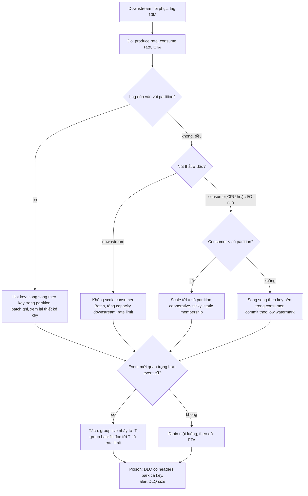
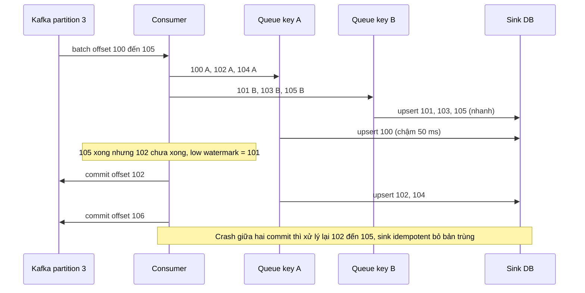
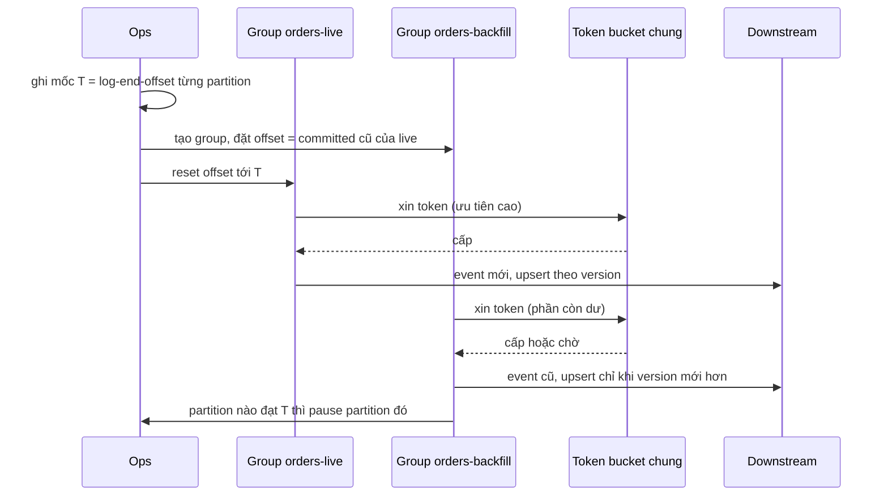

## Bối cảnh & vấn đề

Bài này là playbook cho tình huống "downstream sập 3 giờ, topic dồn 10 triệu message, giờ làm sao đuổi kịp mà không mất gì và không phá thứ tự". Lý thuyết nền: partition và key ở [Keys, partitioning & ordering](/tracks/messaging-kafka/learn/keys-partitioning-ordering), consumer group và lag ở [Consumer groups, offsets & lag](/tracks/messaging-kafka/learn/consumer-groups-offsets-lag), rebalance ở [Rebalance & liveness](/tracks/messaging-kafka/learn/rebalance-liveness), DLQ ở [Errors, retries & DLQ](/tracks/messaging-kafka/learn/errors-retries-dlq). Bài [chuỗi durability](/tracks/scenario-migration/learn/durability-chain) lo phần "không mất khi ghi vào Kafka"; bài này lo phần **đọc ra**.

Câu chuyện mở đầu: payment provider sập 3 giờ, consumer `orders` retry rồi dừng, lag lên 10M trên topic 12 partition. Khi provider sống lại, team làm ba việc liên tiếp trong 20 phút: scale consumer từ 6 lên 48 pod, tăng topic từ 12 lên 48 partition, và bỏ qua offset của "một message cứ lỗi mãi". Kết quả: throughput chỉ tăng gấp đôi, lag nhảy vọt mỗi lần scale; đơn mới nhận "payment captured" trước "order created"; provider vừa hồi phục bị dồn tải và sập lần hai; và một đơn hàng biến mất cùng message bị skip.

Mỗi hành động đều có vẻ hợp lý, và mỗi hành động đều vi phạm một ràng buộc của Kafka. Playbook này đi theo thứ tự ngược lại: **đo trước** (ETA, lag theo partition, nút thắt ở đâu), rồi mới chọn đòn bẩy phù hợp với ràng buộc ordering, durability và sức chịu của downstream.

## Khái niệm

### ETA của backlog và điều kiện để drain được

Lag giảm với tốc độ **consume − produce**, không phải tốc độ consume. Backlog 10M, producer 2.000 msg/s, consumer 3.000 msg/s: ETA = 10.000.000 / (3.000 − 2.000) = 10.000 giây ≈ **2,8 giờ**, với điều kiện cả hai tốc độ giữ nguyên. Nếu giờ cao điểm producer lên 3.000 msg/s thì hiệu số bằng 0 và backlog **không bao giờ** giảm; đó là câu trả lời quan trọng nhất cho PM, không phải con số 2,8.

Trần throughput của một consumer group là `min(số partition × throughput mỗi consumer, capacity của downstream)`. Vế thứ hai hay bị quên: consumer nhanh gấp 4 lần mà DB đích đã 90% CPU thì chỉ chuyển sự cố từ Kafka sang DB. Trước khi scale bất cứ thứ gì, kiểm tra năm điều: lag **theo partition** (đều hay dồn), consumer nghẽn ở đâu (CPU, latency downstream, rebalance liên tục), downstream còn headroom không, có cần thứ tự theo key không, và message cũ còn giá trị không.

**Interview angle:** người đề xuất "thêm partition và consumer" ngay mà chưa đo gì là red flag; người nói "ETA = backlog / (consume − produce), và nó vô hạn nếu hiệu số ≤ 0" là đang trả lời như người đã trực sự cố.

### Lag theo partition và hot key

**Consumer lag** của một partition là `log-end-offset − committed offset`. Tổng lag 10M có thể là 12 partition mỗi cái ~830K (consumer chậm đều, nghẽn ở downstream hoặc CPU), hoặc 3 partition mỗi cái 3M còn lại gần 0 (**hot key**: một tenant hay một sản phẩm flash sale chiếm phần lớn traffic, vì cùng key luôn vào cùng partition). Hai trường hợp cần hai cách chữa khác nhau.

Lag dồn vào vài partition nghĩa là thêm consumer **không giúp gì**: partition nóng vẫn chỉ có một consumer. Cách chữa nằm ở bên trong partition đó (song song theo key, batch ghi downstream) hoặc ở tầng thiết kế key (thêm salt cho key quá nóng nếu thứ tự cho phép).

### Một partition, một consumer

Trong một consumer group, mỗi partition được gán cho **đúng một** consumer tại một thời điểm. Đây là cách Kafka giữ thứ tự trong partition mà không cần lock phân tán. Hệ quả: topic 12 partition thì tối đa 12 consumer làm việc; scale lên 48 pod là 36 pod ngồi chơi, tốn tiền và còn gây hại.

Cái hại là **rebalance**. Mỗi pod mới join group kích hoạt rebalance; với **eager protocol** (mặc định cũ), mọi consumer phải dừng, commit, thả hết partition rồi nhận lại. Scale từ 6 lên 48 pod dần dần là hàng chục rebalance liên tiếp, mỗi lần dừng cả group vài giây tới vài chục giây, nên lag nhảy lên đúng lúc ta muốn nó giảm. **Cooperative-sticky assignor** (KIP-429) chỉ di chuyển những partition cần chuyển, và **static membership** (`group.instance.id`) cho pod restart quay lại mà không gây rebalance (verify mức hỗ trợ theo client: KafkaJS không hỗ trợ cooperative rebalancing).

### Offset commit là lời hứa "đã xử lý xong"

Commit offset N nghĩa là "mọi message trước N của partition này đã xử lý **durable**". Commit sớm hơn thực tế là mất message: Kafka vẫn giữ chúng, nhưng group sẽ không bao giờ đọc lại. Commit muộn hơn chỉ gây xử lý lặp, và lặp thì chữa được bằng idempotency (`ON CONFLICT (event_id) DO NOTHING`, upsert theo version).

Bẫy phổ biến trong KafkaJS: `autoCommit: true` kết hợp `eachBatchAutoResolve: true` resolve offset của cả batch **ngay khi `eachBatch` trả về**. Nếu handler chỉ đẩy message vào buffer RAM và flush sau, offset đã đi trước dữ liệu. Pod OOM-killed là các message trong buffer biến mất khỏi góc nhìn của group, dù vẫn nằm nguyên trên topic.

### Song song theo key bên trong partition

Kafka chỉ đảm bảo thứ tự **trong partition**, nhưng nghiệp vụ thường chỉ cần thứ tự **trong cùng key** (cùng order id). Một partition chứa hàng nghìn key khác nhau, và message của key A không cần chờ message của key B. Đó là đòn bẩy lớn nhất khi số partition cố định: trong mỗi partition, chia message theo key vào các hàng đợi riêng, chạy N key song song, mỗi key tuần tự.

Phần khó là commit. Message ở offset 105 (key B) có thể xong trước offset 100 (key A). Chỉ được commit tới **low watermark**: offset liên tục thấp nhất mà mọi message trước nó đã xong. Crash lúc đó thì 101–105 bị xử lý lại, và sink idempotent hấp thụ. Java có sẵn Confluent Parallel Consumer với key-ordering mode; Node phải tự viết hoặc dùng mẫu batch + nhóm theo key.

**Interview angle:** `Promise.all` trên cả batch là sai thứ tự; commit `batch.lastOffset()` trước khi mọi message xong là mất message. Interviewer hay hỏi cả hai trong cùng một câu.

### Tăng partition giữa backlog phá thứ tự

Partitioner mặc định tính `partition = murmur2(key) % numPartitions` (KafkaJS `DefaultPartitioner` tương thích với Java (verify)). Đổi 12 thành 48 thì **cùng key giờ rơi vào partition khác**. Message cũ của order X vẫn nằm trong partition cũ, sau 830K message đang chờ; message mới của X vào partition mới, gần như trống, được xử lý ngay. Event mới đi **trước** event cũ, nên downstream thấy "payment captured" trước "order created".

Thêm hai hệ quả: số partition **không giảm được** (muốn về lại phải tạo topic mới); và state gắn với partition (Kafka Streams state store, compacted topic theo key) bị lệch. Nếu bắt buộc tăng: dừng producer, drain hết, tăng partition, mở lại; hoặc tạo topic mới nhiều partition hơn và chuyển producer/consumer có kiểm soát.

### Poison message và DLQ

**Poison message** là message không bao giờ xử lý được (JSON sai schema, tham chiếu không tồn tại). Retry vô hạn gây **head-of-line blocking**: cả partition dừng sau nó, trong khi các partition khác vẫn chạy, nên triệu chứng là lag của **đúng một** partition đứng yên và log lặp cùng một lỗi mỗi 30 giây.

Cách xử lý đúng là phân loại lỗi: **transient** (timeout, 503, deadlock) thì retry có backoff hoặc qua retry topic; **permanent** (validation, schema) thì gửi sang **DLQ** (dead-letter queue, một topic riêng) kèm headers (lỗi, topic, partition, offset gốc), commit và đi tiếp. Skip tay offset rồi quên là mất dữ liệu có chủ đích. Nếu thứ tự theo key quan trọng, khi một message bị park thì các message **sau cùng key** cũng phải park (hoặc chặn key đó), vì xử lý "order shipped" khi "order created" nằm trong DLQ là tạo trạng thái sai.

### Ưu tiên traffic mới

Một consumer group xử lý theo offset, nên event mới phải chờ sau 10M event cũ. Khi người dùng quan tâm event mới hơn nhiều (trạng thái đơn đang giao, thông báo vừa xảy ra), ta **tách luồng**: ghi mốc T (offset hiện tại theo từng partition), cho group chính **nhảy tới T** để phục vụ traffic mới ngay, và tạo một **group backfill** riêng đọc từ offset cũ tới T với rate limit thấp hơn.

Điều kiện an toàn: event cũ và mới không cần thứ tự giữa nhau, **hoặc** sink so version (`WHERE version < incoming`) để event cũ tới muộn không ghi đè trạng thái mới hơn. Và có những event hết giá trị: push notification "đơn của bạn đang được chuẩn bị" gửi trễ 3 giờ gây phiền hơn là giúp; drop có log là lựa chọn nghiệp vụ hợp lệ.

## Cơ chế hoạt động

### Runbook drain backlog



Thứ tự của runbook là điểm chính: **đo** trước, **xác định nút thắt** sau, rồi mới chọn đòn bẩy. Hai nhánh hay bị bỏ qua: nút thắt ở downstream thì thêm consumer chỉ làm downstream sập lần nữa; consumer đã bằng số partition thì đòn bẩy còn lại là song song **bên trong** consumer, không phải thêm pod hay thêm partition. Tăng partition không xuất hiện trong runbook vì nó phá thứ tự của chính backlog đang drain.

### Consumer song song theo key và commit theo low watermark



Mỗi key có một hàng đợi tuần tự, các key chạy song song. Offset commit trong Kafka là "offset **tiếp theo** cần đọc", nên khi 100 và 101 xong ta commit 102. Lúc key B đã xong 105, consumer vẫn không được commit 106 vì 102 và 104 của key A chưa xong. Đổi lại, crash chỉ gây xử lý lặp, không gây mất.

### Tách luồng live và backfill



Group backfill phải **dừng đúng ở T**: mỗi partition có mốc riêng, consumer so offset của message với mốc và `pause` partition khi chạm tới, để không xử lý lại phần mà group live đã làm. Token bucket chung là thứ bảo vệ downstream vừa hồi phục (cache lạnh, connection pool nhỏ): tổng hai luồng không vượt capacity, và luồng live luôn được ưu tiên. Thứ tự reset quan trọng: tạo group backfill với offset cũ **trước** khi reset group live, nếu không sẽ mất mốc bắt đầu.

## Ví dụ thực tế

Các đoạn dưới là **minh hoạ** (không chạy trong bài này); output được viết theo định dạng của công cụ Kafka để đọc cùng code. API theo KafkaJS v2 (verify tên option theo version client đang dùng).

### Đo lag theo partition

```bash
kafka-consumer-groups.sh --bootstrap-server kafka:9092 --describe --group orders-svc
```

```text
# illustrative
GROUP       TOPIC   PARTITION  CURRENT-OFFSET  LOG-END-OFFSET  LAG      CONSUMER-ID
orders-svc  orders  0          4120331         4131002         10671    c-1
orders-svc  orders  1          3988210         3999540         11330    c-1
orders-svc  orders  2          1201000         4410022         3209022  c-2
orders-svc  orders  7          1188450         4398761         3210311  c-4
orders-svc  orders  9          1179002         4402113         3223111  c-5
...         (other partitions: lag < 15000)
```

Ba partition (2, 7, 9) chiếm gần như toàn bộ 10M. Đây là hot key, không phải "consumer chậm": thêm pod không chạm tới vấn đề. Bước tiếp theo là xem key nào chiếm partition 2 (sample message, hoặc metric theo tenant ở producer) và áp dụng song song theo key cho các partition đó.

### Bug commit trước khi durable và bản sửa

```ts
// BUG: offsets resolved when eachBatch returns, data still in RAM
await consumer.run({
  autoCommit: true,
  eachBatchAutoResolve: true,
  eachBatch: async ({ batch }) => {
    for (const m of batch.messages) buffer.push(JSON.parse(m.value!.toString()));
    if (buffer.length >= 5000) await db.insertOrders(buffer.splice(0));
  },
});
```

Mỗi batch chỉ vài trăm message nên hầu hết batch trả về mà chưa flush; offset đã commit vượt qua tới 4.999 message chỉ nằm trong RAM. OOM-kill lấy đi 1.800 message trong buffer lúc đó. Bản sửa ghi durable rồi mới resolve:

```ts
await consumer.run({
  autoCommit: false,
  eachBatchAutoResolve: false,
  eachBatch: async ({ batch, resolveOffset, commitOffsetsIfNecessary, heartbeat }) => {
    const rows = batch.messages.map((m) => ({
      eventId: m.headers?.event_id?.toString() ?? `${batch.partition}-${m.offset}`,
      ...JSON.parse(m.value!.toString()),
    }));
    // INSERT ... ON CONFLICT (event_id) DO NOTHING, one transaction per batch
    await db.insertOrdersIdempotent(rows);
    resolveOffset(batch.lastOffset());
    await commitOffsetsIfNecessary();
    await heartbeat();
  },
});
```

Crash sau `insertOrdersIdempotent` nhưng trước commit thì batch được giao lại, `ON CONFLICT` bỏ bản trùng. Để khôi phục 1.800 message đã mất: tìm thời điểm crash từ log pod, dừng consumer, rồi reset offset của group về trước thời điểm đó và replay. Replay an toàn chính vì sink giờ đã idempotent:

```bash
kafka-consumer-groups.sh --bootstrap-server kafka:9092 --group orders-svc --topic orders \
  --reset-offsets --to-datetime 2026-10-06T14:05:00.000 --dry-run
# review the plan, then rerun with --execute (the group must have no active members)
```

### Song song theo key với low watermark

```ts
import pLimit from "p-limit";

const limit = pLimit(32);   // cap concurrency at what the downstream can take

eachBatch: async ({ batch, resolveOffset, commitOffsetsIfNecessary, heartbeat, isRunning }) => {
  const byKey = new Map<string, typeof batch.messages>();
  for (const m of batch.messages) {
    const k = m.key?.toString() ?? "";
    const list = byKey.get(k) ?? [];
    list.push(m);
    byKey.set(k, list);
  }
  const done = new Set<string>();
  const offsets = batch.messages.map((m) => m.offset);   // ascending within the partition
  let committedIdx = -1;

  const advance = async () => {
    while (committedIdx + 1 < offsets.length && done.has(offsets[committedIdx + 1])) committedIdx++;
    if (committedIdx >= 0) { resolveOffset(offsets[committedIdx]); await commitOffsetsIfNecessary(); }
  };

  await Promise.all([...byKey.values()].map((msgs) => limit(async () => {
    for (const m of msgs) {                    // sequential per key
      if (!isRunning()) return;
      await handleIdempotent(m);               // 50 ms downstream call, upsert by event_id
      done.add(m.offset);
      await advance();
      await heartbeat();
    }
  })));
}
```

```text
# illustrative, one partition, 50 ms per message, ~800 distinct keys per batch
sequential:        ~20 msg/s per partition  x 12 = ~240 msg/s
per-key, conc 32:  ~600 msg/s per partition x 12 = ~7,200 msg/s  (until the downstream limit)
```

Từ 20 lên khoảng 600 msg/s mỗi partition là 30 lần, đủ cho yêu cầu "nhanh gấp 20" mà không thêm partition nào. Trần thật là capacity downstream; vì vậy `pLimit` phải đặt theo con số đó, không theo CPU của consumer. Với hot key (một key có 200K message), song song theo key không giúp được key đó: nó vẫn tuần tự. Lựa chọn còn lại là xử lý key đó theo batch (gộp nhiều event thành một lần ghi) hoặc xem lại liệu nghiệp vụ có thật cần thứ tự chặt cho key đó không.

### Poison message vào DLQ

```ts
class PermanentError extends Error {}

async function handleWithDlq(m: KafkaMessage, partition: number) {
  try {
    const order = OrderSchema.parse(JSON.parse(m.value!.toString()));   // zod validation
    await upsertOrder(order);
  } catch (err) {
    const permanent = err instanceof PermanentError || err instanceof SyntaxError || err instanceof ZodError;
    if (!permanent) throw err;                 // transient: let retry/backoff handle it
    await producer.send({
      topic: "orders.dlq",
      messages: [{ key: m.key, value: m.value, headers: {
        error: String(err).slice(0, 500), source_topic: "orders",
        source_partition: String(partition), source_offset: m.offset } }],
    });
    await parkedKeys.add(m.key!.toString());   // later messages of this key go to the DLQ too
  }
}
```

Message vào DLQ là đã **durable** ở nơi khác (producer `acks=all`), nên commit offset gốc không làm mất gì. Sau khi sửa (schema, mapping), replay DLQ **theo thứ tự offset gốc** của từng key, rồi bỏ key khỏi danh sách park. Gốc rễ thường là producer không validate schema: Schema Registry với compatibility check chặn được loại lỗi này từ đầu.

## Trade-offs & lựa chọn thay thế

| Đòn bẩy | Tăng throughput | Giữ thứ tự theo key | Rủi ro | Hợp khi |
| --- | --- | --- | --- | --- |
| Scale consumer tới = số partition | Tới N partition | Có | Rebalance khi scale | Consumer < partition, nghẽn ở CPU consumer |
| Scale consumer > số partition | Không | Có | Pod idle, rebalance | Không bao giờ để tăng throughput |
| Song song theo key trong consumer | 10–50 lần | Có | Code commit phức tạp | Nghẽn ở I/O chờ downstream, nhiều key |
| Batch ghi downstream | 5–20 lần | Có (giữ thứ tự trong batch) | Batch lỗi cả cụm | Sink hỗ trợ bulk (DB, ES) |
| Tăng partition giữa backlog | Về lâu dài | **Không** | Đảo thứ tự, không giảm lại được | Chỉ khi đã drain hoặc không cần thứ tự |
| Topic mới nhiều partition | Về lâu dài | Có nếu chuyển đổi có kiểm soát | Vận hành hai topic | Cần tăng song song lâu dài |
| Tách live + backfill | Không tăng tổng, giảm latency event mới | Có nếu sink so version | Mốc T sai, chồng xử lý | Event mới quan trọng hơn event cũ |
| Drop event hết giá trị | Rất lớn | N/A | Mất dữ liệu có chủ đích | Notification, cache invalidation cũ |

Khi nào chọn gì: lag dồn vài partition thì song song theo key và xử lý hot key riêng. Lag đều mà consumer ít hơn partition thì scale tới bằng partition với cooperative-sticky. Consumer đã bằng partition và nghẽn ở I/O thì song song theo key cộng batch. Downstream là nút thắt thì không có đòn bẩy nào ở Kafka giúp được, chỉ có rate limit và tăng capacity downstream. Tách luồng khi trải nghiệm người dùng phụ thuộc event mới; drop khi event cũ thật sự vô giá trị và nghiệp vụ đã đồng ý bằng văn bản.

## Edge cases & failure modes

- **Downstream hồi phục rồi sập lại**: drain ở tốc độ tối đa ngay khi provider sống lại; cache lạnh và pool nhỏ khiến nó gục. Ramp-up dần (10% → 50% → 100% capacity), circuit breaker, token bucket chung cho mọi luồng.
- **Batch dài vượt `sessionTimeout`**: xử lý 500 message × 50 ms = 25 giây mà không heartbeat thì broker coi consumer chết, rebalance, batch bị giao cho consumer khác và xử lý lặp. Gọi `heartbeat()` trong vòng lặp, giảm batch size hoặc tăng timeout.
- **Rebalance giữa chừng với song song theo key**: partition bị thu hồi khi còn message in-flight; nếu consumer cũ vẫn ghi sau khi consumer mới đã bắt đầu, hai bên ghi cùng key. Kiểm tra `isRunning()`, chờ in-flight xong trong handler revoke, và dựa vào version ở sink.
- **Retention xoá backlog**: topic `retention.ms` 3 ngày mà sự cố kéo dài hơn thì message cũ bị xoá trước khi được đọc. Tăng retention **ngay** khi sự cố bắt đầu (thay đổi được online), alert khi lag tính theo thời gian tiến gần retention.
- **Reset offset khi group còn member**: `--reset-offsets --execute` bị từ chối khi group đang active; dừng consumer trước. Reset sai mốc là mất (tiến quá xa) hoặc xử lý lặp lớn (lùi quá xa).
- **DLQ tự nó lỗi**: producer DLQ không `acks=all` hoặc DLQ topic không tồn tại; message vừa không được xử lý, vừa không vào DLQ, mà offset đã commit. Gửi DLQ phải durable trước khi commit, giống mọi sink khác.
- **Group backfill vượt quá T**: quên pause theo mốc, backfill xử lý cả phần live đã làm; vô hại nếu idempotent, nhưng tốn gấp đôi tải downstream đúng lúc nó yếu nhất.

## Pitfalls

- ❌ Trả lời PM "2,8 giờ" và dừng ở đó → ✅ ETA = backlog / (consume − produce), kèm điều kiện "vô hạn nếu cao điểm produce ≥ consume"; vì hiệu số mới quyết định.
- ❌ Scale 48 pod cho topic 12 partition → ✅ tối đa 12 consumer, phần còn lại là song song bên trong consumer; vì mỗi partition chỉ có một consumer trong group.
- ❌ Tăng partition để drain nhanh → ✅ không đổi partition khi đang có backlog cần thứ tự; vì `murmur2(key) % N` đổi theo N và event mới vượt event cũ.
- ❌ `autoCommit` + buffer RAM → ✅ resolve/commit sau khi ghi durable, sink idempotent; vì commit là lời hứa đã xử lý xong.
- ❌ `Promise.all` cả batch rồi commit `lastOffset()` → ✅ tuần tự theo key, commit theo low watermark; vì cả thứ tự và durability đều phải giữ.
- ❌ Skip tay offset của message lỗi → ✅ DLQ có headers, park cả key, replay sau khi sửa; vì skip là xoá dữ liệu.
- ❌ Drain hết tốc lực ngay khi downstream sống lại → ✅ ramp-up với token bucket, ưu tiên luồng live; vì downstream vừa hồi phục là mắt xích yếu nhất.
- ❌ Giảm partition sau khi drain xong → ✅ tạo topic mới nếu cần; vì Kafka không giảm partition được.

## Tóm tắt

- ETA = backlog / (consume − produce); hiệu số ≤ 0 lúc cao điểm là không bao giờ drain. Trần throughput = min(partition × tốc độ mỗi consumer, capacity downstream).
- Đọc lag **theo partition**: đều là consumer/downstream chậm, dồn vài partition là hot key.
- Mỗi partition một consumer: pod > partition chỉ idle và gây rebalance; dùng cooperative-sticky, static membership.
- Commit offset chỉ sau khi ghi durable; at-least-once + sink idempotent, replay bằng `--reset-offsets --to-datetime`.
- Song song theo key bên trong partition, commit theo low watermark: nhanh 20–30 lần mà giữ thứ tự theo key.
- Không tăng partition giữa backlog: cùng key đổi partition, event mới vượt event cũ, và không giảm lại được.
- Poison message: phân loại transient/permanent, DLQ durable có headers, park cả key, replay theo thứ tự.
- Ưu tiên traffic mới bằng tách group live (nhảy tới T) và group backfill có rate limit, sink so version để event cũ không đè event mới.
