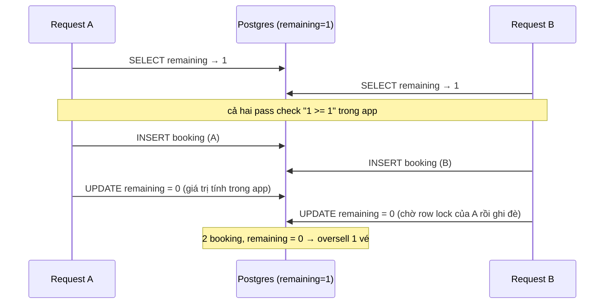
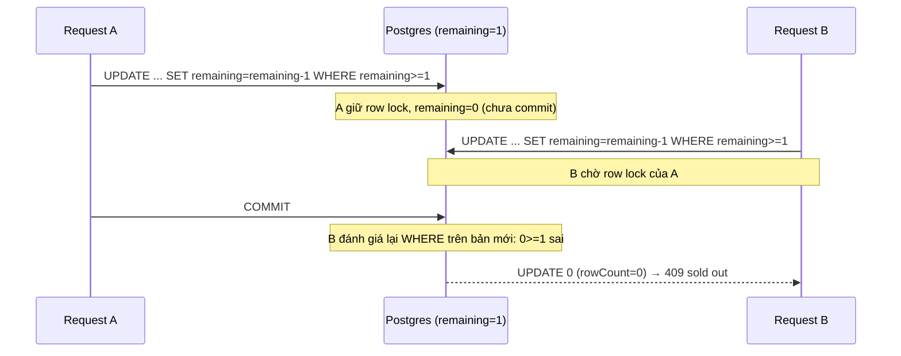
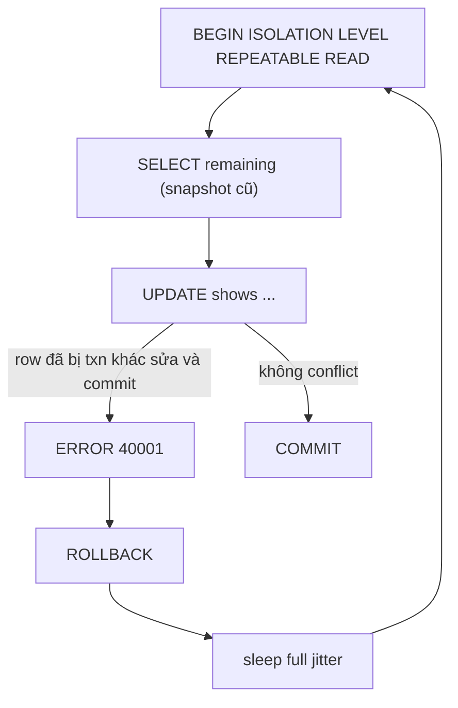
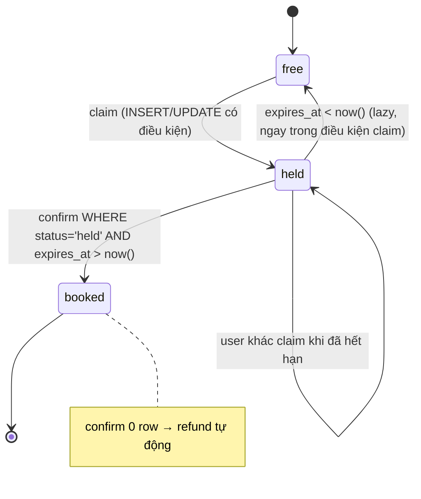

## Bối cảnh & vấn đề

Sáng mở bán vé một show 100 ghế. 10 phút sau, CS báo: hệ thống đã phát **105 vé**, năm khách đến nơi không có chỗ ngồi. Log không có error nào; mọi request đều trả `200`. Code checkout trông "đúng" khi đọc từng dòng:

```ts
// minh hoạ — code gây oversell
const show = await db.show.findUnique({ where: { id } });   // đọc remaining = 1
if (show.remaining < qty) throw new SoldOutError();           // check trong app
await db.booking.create({ data: { showId: id, userId } });
await db.show.update({ where: { id }, data: { remaining: show.remaining - qty } }); // ghi giá trị đã tính
```

Cùng một họ bug xuất hiện dưới nhiều tên: **oversell** tồn kho trong flash sale, voucher một lần bị redeem năm lần, promo code bị phát trùng, hai người cùng giữ ghế F12, ngân sách quảng cáo bị tiêu vượt. Và cùng một họ "fix sai" hay gặp: thêm `async-mutex` trong Node, bọc trong transaction mà không nói isolation level nào, thêm Redis lock cho mọi thứ.

Bài này là **playbook** cho họ scenario đó: triệu chứng → tái hiện → root cause → các lựa chọn fix kèm đánh đổi → cách chứng minh đã fix. Lý thuyết nền đã có ở track khác, bài này link tới thay vì dạy lại: [isolation levels](/tracks/sql-postgres/learn/isolation-levels), [locking & concurrency control](/tracks/sql-postgres/learn/locking-concurrency), [race condition trong code async](/tracks/os-concurrency/learn/race-conditions-async), và phần thiết kế tổng thể ở [checkout & payments](/tracks/system-design/learn/checkout-payments).

Mọi con số trong bài đo thật trên máy local: PostgreSQL 17.11 và Redis 7.4.11 trong Docker, Node 24.21 với `pg` và `ioredis`, pool 20–50 connection. Con số tuyệt đối phụ thuộc máy; **tỉ lệ** giữa các cách mới là thứ đáng nhớ.

## Khái niệm

### Invariant nghiệp vụ

**Invariant** là câu mà hệ thống không bao giờ được vi phạm, phát biểu bằng ngôn ngữ nghiệp vụ: "số vé đã bán ≤ sức chứa", "mỗi voucher redeem tối đa một lần", "mỗi `(show, seat)` tối đa một booking active". Bước đầu tiên của mọi scenario concurrency là **viết invariant ra**, vì fix đúng là fix đặt invariant vào nơi có atomicity, còn test đúng là test assert invariant đó sau khi bắn song song.

Ví dụ: với seat map, invariant không phải "remaining ≥ 0" mà là "unique trên `(show_id, seat_id)` trong các booking active". Hai invariant khác nhau dẫn tới hai cơ chế khác nhau (counter vs claim row cụ thể).

**Interview angle:** người phỏng vấn đánh giá cao ứng viên nói invariant trước khi nói công nghệ.

### Read-modify-write và check-then-act

**Read-modify-write race** xảy ra khi app đọc một giá trị, tính giá trị mới trong app rồi ghi lại; giữa "đọc" và "ghi" có một khoảng thời gian mà request khác chen vào đọc cùng giá trị cũ. **Check-then-act** là biến thể: app kiểm tra điều kiện (`if (!v.redeemedAt)`) rồi hành động; điều kiện có thể đã sai vào lúc hành động.

Điểm quan trọng: khoảng hở này **tồn tại bất kể ngôn ngữ**. Với Node, mỗi `await` là chỗ event loop nhường cho request khác chạy. Với nhiều pod, request chạy song song thật trên nhiều máy. Nên câu "Node single-threaded nên không race" chỉ đúng cho **một đoạn code đồng bộ không có await**.

### Lost update

**Lost update** là hậu quả cụ thể của read-modify-write khi hai transaction cùng ghi một **giá trị tuyệt đối** đã tính từ bản đọc cũ: A và B cùng đọc `remaining = 50`, cùng ghi `49`, một lần trừ bị mất. Kết quả kép: số booking tăng 2, remaining chỉ giảm 1. Bài [isolation levels](/tracks/sql-postgres/learn/isolation-levels) giải thích lost update ở mức isolation; ở đây ta đo nó.

### Atomic conditional UPDATE

**Atomic conditional UPDATE** đưa điều kiện của invariant vào `WHERE` của chính câu ghi: `UPDATE shows SET remaining = remaining - $qty WHERE id = $1 AND remaining >= $qty`. DB kiểm tra và ghi trong một lệnh, dưới row lock, nên không có khoảng hở. App đọc `rowCount` (MySQL: `affectedRows`, SQL Server: `@@ROWCOUNT`): `1` là thành công, `0` là hết vé.

Vì sao nó đúng ở READ COMMITTED: khi UPDATE thứ hai gặp row đang bị transaction khác khoá, nó **chờ**; khi transaction kia commit, Postgres **đánh giá lại `WHERE` trên phiên bản mới nhất của row** (EvalPlanQual) rồi mới ghi. Nếu `remaining` đã về 0, điều kiện sai, `rowCount = 0`.

### Optimistic và pessimistic lock

**Optimistic lock** ghi kèm điều kiện "chưa ai sửa kể từ khi tôi đọc": `WHERE id = $1 AND version = $old`, `0 row` nghĩa là có conflict và app retry từ đầu. Hợp cho logic phức tạp không gói được vào một câu UPDATE và conflict hiếm. **Pessimistic lock** khoá row ngay lúc đọc (`SELECT ... FOR UPDATE`), người khác chờ tới khi commit. Hợp khi conflict nhiều và giữa đọc và ghi có nhiều bước. Chi tiết cơ chế ở [locking & concurrency control](/tracks/sql-postgres/learn/locking-concurrency).

### NOWAIT và SKIP LOCKED

Hai biến thể của `FOR UPDATE` thay đổi hành vi khi row đang bị khoá. **`NOWAIT`** báo lỗi ngay `55P03 lock_not_available` thay vì chờ: hợp khi bạn cần **đúng một row cụ thể** và muốn fail fast (admin sửa order đang được xử lý). **`SKIP LOCKED`** bỏ qua row đang bị khoá và lấy row kế tiếp: hợp khi bạn cần **bất kỳ** row nào thỏa điều kiện (promo code còn trống, job trong queue, ghế bất kỳ trong khu B).

### Reservation (hold) có hạn

**Reservation** giữ tài nguyên cho một user trong thời gian có hạn (`expires_at`), để user hoàn tất bước chậm (thanh toán) mà không tranh với người khác. Đặc điểm cốt lõi: hết hạn phải **tự động có hiệu lực trong chính điều kiện claim** (`OR expires_at < now()`), không phụ thuộc cron chạy đúng giờ. Cron/sweeper chỉ dọn dẹp và cung cấp số liệu.

### Hot row và sharded counter

**Hot row** là một row nhận rất nhiều write đồng thời: tồn kho của SKU flash sale, `campaign_budget.spent`, counter view. Mọi UPDATE trên row đó giữ row lock **tới commit**, nên throughput tối đa ≈ `1 / thời gian giữ lock`. Nếu transaction giữ lock 20 ms thì trần là ~50 txn/s cho row đó, bất kể bạn có bao nhiêu pod hay CPU.

**Sharded counter** chia một counter thành N row `(id, shard)`; mỗi write chọn một shard, đọc tổng bằng `SUM`. Contention chia cho N, đổi lại việc kiểm "tổng ≤ cap" chính xác tuyệt đối khó hơn.

| Khái niệm | Câu nhớ nhanh |
|---|---|
| Invariant | Viết ra trước khi chọn công nghệ |
| Read-modify-write | Đọc → tính trong app → ghi: có khoảng hở |
| Atomic conditional UPDATE | Điều kiện nằm trong `WHERE`, đọc `rowCount` |
| `NOWAIT` / `SKIP LOCKED` | Row cụ thể fail fast / row bất kỳ không chờ |
| Hold | `expires_at` + hết hạn lazy trong điều kiện claim |
| Hot row | Throughput ≈ 1 / thời gian giữ lock |

## Cơ chế hoạt động

### Interleaving gây oversell

Sơ đồ dưới là đúng thứ tự sự kiện trong sự cố 105 vé, rút gọn còn hai request khi chỉ còn một ghế:



Điều đáng chú ý: **transaction không cứu được**. Mỗi câu SELECT ở READ COMMITTED thấy snapshot mới nhất đã commit lúc câu đó chạy, và không có gì ngăn B đọc trước khi A ghi. UPDATE của B có chờ row lock của A, nhưng nó ghi một **hằng số** (`0`) mà app đã tính, nên việc chờ không thay đổi kết quả.

### Atomic UPDATE: chờ rồi đánh giá lại



Đây là lý do card 001 gọi atomic UPDATE là "fix nhỏ nhất": một câu SQL, không thêm dependency, không retry, và DB làm phần khó. Thêm `CHECK (remaining >= 0)` làm lưới cuối: nếu một code path khác quên điều kiện, DB vẫn từ chối với `23514 check_violation` thay vì âm thầm âm kho.

### REPEATABLE READ: phát hiện rồi bắt app làm lại

Ở REPEATABLE READ, cả transaction dùng **một snapshot** chụp ở câu lệnh đầu tiên. Khi B định UPDATE row mà A đã sửa và commit **sau** snapshot của B, Postgres không ghi đè được (sẽ là lost update) nên huỷ B với `ERROR: could not serialize access due to concurrent update`, SQLSTATE **`40001`**. Không oversell nữa, nhưng giờ app có một loại lỗi mới phải xử lý: **retry toàn bộ transaction** từ câu đầu, với snapshot mới.



Lưu ý: REPEATABLE READ của Postgres chặn **lost update** nhưng **không** chặn **write skew** (hai transaction đọc chung một tập, ghi vào hai row khác nhau, cùng phá một invariant). Ví dụ booking: quy tắc "mỗi show tối đa 2 suất VIP comp", hai admin cùng đếm thấy 1, mỗi người INSERT một row mới; không row nào bị ghi chung nên RR cho qua cả hai, kết quả 3. Chặn được bằng SERIALIZABLE (SSI) hoặc khoá tường minh row cha (`SELECT ... FROM shows WHERE id=$1 FOR UPDATE`). MySQL InnoDB REPEATABLE READ thì khác: plain SELECT không báo lỗi lost update, cần `FOR UPDATE` (verify theo phiên bản).

### Claim ghế cụ thể bằng partial unique index

Seat map đổi bài toán từ "trừ counter" sang "claim một row cụ thể". Unique index trên `(show_id, seat_id)` **chỉ trong các trạng thái active** là cách gọn nhất: index được kiểm tra khi INSERT, request thứ hai chờ request đầu commit rồi nhận `23505 unique_violation`.

```sql
CREATE UNIQUE INDEX uq_active_seat ON seat_holds (show_id, seat_id)
  WHERE status IN ('held', 'booked');
-- SQL Server: filtered index cũng có WHERE; MySQL không có partial index → generated column + unique
```

Đặt nhiều ghế trong một lần (`{F10, F11}`) phải claim trong **một transaction** và theo **thứ tự seat_id tăng dần**; nếu không, hai user cùng giữ `{F10,F11}` và `{F11,F10}` có thể deadlock (cơ chế ở [bài 02](/tracks/scenario-reliability/learn/locks-deadlocks-jobs)). Một ghế fail thì rollback cả nhóm: user không muốn "nửa cặp ghế".

### Hold, hết hạn và payment về trễ



Hold đúng khi **cả hai cạnh** đều có điều kiện thời gian: claim coi hold hết hạn là free, và confirm từ chối hold đã hết hạn. Nếu chỉ dựa vào cron để chuyển `held → free`, có 2 lỗi: cron chậm thì ghế bị khoá oan, và payment về trễ vẫn confirm thành công trên một ghế đã thuộc người khác.

## Ví dụ thực tế

### Tái hiện oversell: 300 người mua, 100 ghế

Script bắn 300 request đồng thời, mỗi request mua 1 vé, pool 50 connection. Bốn biến thể của cùng một checkout (code đầy đủ chạy trong scratch dir, rút gọn ở đây):

```ts
// naive: đọc → check → ghi hằng số đã tính, trong transaction READ COMMITTED
await c.query('BEGIN');
const { rows } = await c.query('SELECT remaining FROM shows WHERE id = 1');
if (rows[0].remaining < 1) return 'soldout';
await sleep(2);                                   // "logic khác", một await bất kỳ
await c.query('INSERT INTO bookings (show_id, user_id) VALUES (1, $1)', [u]);
await c.query('UPDATE shows SET remaining = $1 WHERE id = 1', [rows[0].remaining - 1]);
await c.query('COMMIT');

// atomic: điều kiện trong WHERE
const r = await c.query('UPDATE shows SET remaining = remaining - 1 WHERE id = 1 AND remaining >= 1');
if (r.rowCount === 0) return 'soldout';
await c.query('INSERT INTO bookings (show_id, user_id) VALUES (1, $1)', [u]);
```

Output đo được:

```text
naive (READ COMMITTED)         results={"ok":300}                    booked=300 remaining=94  (3150 ms)
same code, REPEATABLE READ     results={"40001":285,"ok":15}         booked=15  remaining=85  (1054 ms)
REPEATABLE READ + retry 40001  results={"ok":100,"soldout":200}      attempts=1313 booked=100 remaining=0 (3177 ms)
SELECT ... FOR UPDATE          results={"ok":100,"soldout":200}      attempts=300  booked=100 remaining=0 (1822 ms)
atomic conditional UPDATE      results={"ok":100,"soldout":200}      booked=100 remaining=0  (2079 ms)
```

Đọc kết quả:

- **Naive** bán **300 vé cho 100 ghế** và `remaining` còn 94: lost update làm counter gần như không giảm, nên check không bao giờ chặn. Đây là phiên bản cực đoan của "105/100": trong production, khoảng hở ngắn hơn nên tỉ lệ oversell nhỏ hơn, nhưng cơ chế y hệt.
- **Cùng code ở REPEATABLE READ, không retry**: không oversell, nhưng 285/300 request nhận `40001` (user thấy 500) và chỉ bán được **15 vé** dù còn 85 ghế. Đây là câu trả lời cho card 010: "đúng, nhưng app phải xử lý 40001".
- **RR + retry** đúng và bán đủ 100, nhưng tốn **1313 attempt** cho 300 request (4.4x số transaction) vì contention cao làm conflict liên tục. Optimistic/snapshot kém khi conflict nhiều.
- **`FOR UPDATE`** và **atomic UPDATE** đều đúng với đúng 300 attempt. Atomic ngắn gọn hơn và không cần đọc trước.

### Voucher redeem 5 lần trong "Node single-thread"

Card 027: cùng user bắn 5 request redeem một voucher. `applyCredit` giả lập service ngoài chậm 30 ms.

```ts
// naive: check-then-act qua await
const { rows: [v] } = await pool.query('SELECT * FROM vouchers WHERE code = $1', [code]);
if (!v || v.redeemed_at) return 409;
await applyCredit(u, v.amount);                    // await → nhường event loop
await pool.query('UPDATE vouchers SET redeemed_at = now() WHERE code = $1', [code]);

// atomic claim TRƯỚC side effect
const r = await pool.query(`UPDATE vouchers SET redeemed_at = now(), redeemed_by = $2
  WHERE code = $1 AND redeemed_at IS NULL RETURNING amount`, [code, u]);
if (r.rowCount === 0) return 409;
await applyCredit(u, r.rows[0].amount, `voucher:${code}`);   // side effect có idempotency key
```

```text
voucher naive         statuses=200,200,200,200,200 credits=5 total=250
voucher atomic claim  statuses=200,409,409,409,409 credits=1 total=50
```

Chỉ **một process Node**, vẫn cộng 250 thay vì 50. Cả 5 request chạy `SELECT` trước khi request đầu tiên tới được `UPDATE`, vì mỗi request dừng ở `await applyCredit`. Fix claim atomic **trước** side effect; side effect sau đó phải idempotent theo `voucher:{code}`, và nếu nó fail thì retry/compensate, không để voucher "đã dùng" mà không có credit. `async-mutex` sửa được trong 1 process nhưng sai ngay khi có 2 pod.

### Promo code pool: FOR UPDATE vs NOWAIT vs SKIP LOCKED

Card 011: 2000 code trong pool, 500 request claim đồng thời, pool 20 connection.

```sql
UPDATE promo_codes SET user_id = $1, claimed_at = now()
WHERE id = (SELECT id FROM promo_codes WHERE user_id IS NULL
            ORDER BY id FOR UPDATE SKIP LOCKED LIMIT 1)
RETURNING code;
```

```text
promo FOR UPDATE              {"got_code":500}               in 1655 ms
promo FOR UPDATE NOWAIT       {"55P03":326,"got_code":174}   in 2941 ms
promo FOR UPDATE SKIP LOCKED  {"got_code":500}               in 668 ms
```

- Plain `FOR UPDATE`: mọi request nhắm cùng row đầu tiên, xếp hàng chờ nhau; sau khi được lock, Postgres kiểm lại điều kiện và đi tiếp sang row kế, nên cuối cùng vẫn đúng 500 code nhưng chậm gấp ~2.5 lần vì về bản chất là **tuần tự**.
- `NOWAIT`: 326/500 request lỗi `55P03` vì đụng row đang bị khoá. Sai công cụ cho bài toán "bất kỳ row nào".
- `SKIP LOCKED`: nhanh nhất, không ai chờ ai.

Còn câu follow-up "một user bắn 2 request thì có lấy 2 code không?": có, SKIP LOCKED sẽ vui vẻ đưa hai code khác nhau. Invariant "1 user 1 code mỗi campaign" cần **unique `(campaign_id, user_id)`** riêng (partial `WHERE user_id IS NOT NULL`).

### Hai người cùng giữ ghế F12, và payment phút thứ 11

```text
seat F12 x10 concurrent: { '23505': 9, held: 1 }
user 2 claims expired hold: [ { id: 11, user_id: 2 } ]
user 1 payment at minute 11 -> confirm rowCount = 0 => refund
```

Mười INSERT đồng thời vào cùng `(show 1, F12)`: một thắng, chín nhận `23505` mà app map sang `409 seat taken`. Với hold đã hết hạn, user 2 claim lại được bằng `UPDATE ... WHERE status='held' AND expires_at < now()`; khi payment của user 1 về muộn, câu confirm có điều kiện `expires_at > now()` trả 0 row và flow chuyển sang **refund tự động** (compensation), không ghi đè booking của user 2.

Câu follow-up "hiển thị thời gian còn lại mà không tin đồng hồ client": server trả `expiresInMs` (tính bằng đồng hồ server) thay vì `expires_at` tuyệt đối; client đếm ngược từ lúc nhận response. Lệch đồng hồ client không ảnh hưởng, chỉ có độ trễ mạng vài trăm ms.

### Flash sale: chặn 20,000 request trước DB

Card 033: 500 sản phẩm, 20k request. Script Lua chạy atomic trong Redis (Redis thực thi script đơn luồng, không request nào chen giữa):

```lua
-- KEYS[1]=stock KEYS[2]=buyers  ARGV[1]=user ARGV[2]=qty
if redis.call('SISMEMBER', KEYS[2], ARGV[1]) == 1 then return -1 end
local s = tonumber(redis.call('GET', KEYS[1]) or '0')
if s < tonumber(ARGV[2]) then return 0 end
redis.call('DECRBY', KEYS[1], ARGV[2])
redis.call('SADD', KEYS[2], ARGV[1])
return 1
```

```text
flash sale Lua: 20000 calls in 746 ms -> { '0': 19000, '1': 500, '-1': 500 } stock left = 0 buyers = 500
```

Đúng 500 người thắng; 19,000 bị từ chối ngay trong Redis (`0` = hết hàng), 500 request lặp của cùng user bị chặn (`-1`). DB chỉ cần nhận ~500 write qua queue/worker, mỗi write vẫn dùng atomic UPDATE + unique `(sale_id, user_id)` làm lưới an toàn. Con số 746 ms cho 20k lệnh là trên laptop, một client; con số kiểu "~100k ops/s mỗi node" là ước lượng phổ biến (verify trên hạ tầng thật).

### Hot row: 400 transaction trên một counter

Card 034. Mỗi transaction cộng 1 vào `campaign_budget.spent` và có một bước I/O 20 ms (giả lập HTTP call hoặc nhiều query):

```text
counter first, then 20ms I/O inside txn    400 txns in 22205 ms  p50=10823ms p99=22075ms
20ms I/O first, counter last               400 txns in 2555 ms   p50=1642ms  p99=2550ms
counter first + 20ms I/O, 16 shards        400 txns in 2836 ms   p50=1340ms  p99=2737ms
```

Dòng đầu là `Lock: transactionid` trong `pg_stat_activity` mà card mô tả: lock được giữ suốt 20 ms I/O, nên 400 txn × ~55 ms ≈ 22 s, p99 22 giây. Chỉ **đổi thứ tự** (update counter cuối cùng, ngay trước commit) đã nhanh **8.7 lần**, vì thời gian giữ lock chỉ còn một câu UPDATE. Sharded counter cho kết quả tương tự ngay cả khi vẫn update trước I/O, vì contention chia cho 16.

**Bug thật phát hiện khi đo:** lần chạy đầu, tổng `SUM(spent)` của 16 shard là **209** thay vì 400. Nguyên nhân là câu SQL mẫu:

```sql
-- SAI: random() là VOLATILE, được tính lại cho TỪNG row khi lọc WHERE
UPDATE campaign_budget_shards SET spent = spent + 1
WHERE campaign_id = 1 AND shard = floor(random() * 16)::int;
```

```text
rowCount distribution with random() in WHERE (1000 runs): { '0': 363, '1': 374, '2': 172, '3': 74, '4': 16, '5': 1 }
rowCount distribution with shard chosen in app:           { '1': 1000 }
```

36% lần update **không trúng shard nào** (lý thuyết `(15/16)^16 ≈ 35.6%`), số khác trúng 2–5 shard. Fix: chọn shard trong app và truyền tham số (`shard = $2` với `$2 = Math.floor(Math.random() * 16)`), hoặc tính một lần trong CTE. Đây là ví dụ tốt cho câu "chứng minh đã fix": chỉ assert `SUM(spent) == số request` mới bắt được.

## Trade-offs & lựa chọn thay thế

| Kỹ thuật | Throughput khi contention cao | Độ phức tạp | Khi nào dùng | Rủi ro chính |
|---|---|---|---|---|
| Atomic conditional UPDATE | Cao, nhưng serialize trên 1 row | Thấp | Counter/tồn kho, voucher, mặc định đầu tiên | Hot row khi spike lớn |
| Unique (partial) constraint | Cao | Thấp | Claim row cụ thể: ghế, 1 user 1 code | Phải map `23505` → 409 rõ ràng |
| `SELECT ... FOR UPDATE` | Trung bình | Trung bình | Nhiều bước đọc/ghi cần nhất quán | Giữ lock lâu, deadlock, pool cạn |
| `FOR UPDATE SKIP LOCKED` | Cao | Trung bình | Lấy row **bất kỳ**: pool code, job queue, ghế bất kỳ | Không dùng cho row cụ thể, không dùng cho báo cáo |
| REPEATABLE READ / SERIALIZABLE | Kém khi conflict nhiều | Trung bình | Logic nhiều bước, conflict hiếm, cần chặn write skew (SERIALIZABLE) | Retry storm, app phải retry cả txn |
| Optimistic version | Kém khi conflict nhiều | Trung bình | Edit form, document, conflict hiếm | Starvation |
| Redis Lua pre-decrement | Rất cao | Cao | Flash sale, chặn 99% request trước DB | Lệch DB, cần reservation TTL + reconcile |
| Sharded counter | Cao | Trung bình | Counter nóng, budget cho phép vượt nhẹ | Kiểm cap chính xác khó, đọc tổng tốn hơn |
| Mutex in-process | — | Thấp | Gần như không bao giờ cho correctness | Sai khi có 2 pod |

**Chọn thế nào.** Bắt đầu từ storage: nếu invariant viết được thành một câu UPDATE có điều kiện hoặc một unique constraint, dừng ở đó. Chỉ lên `FOR UPDATE` khi giữa đọc và ghi có logic không đưa vào SQL được, và giữ transaction ngắn. Chọn RR/SERIALIZABLE khi conflict hiếm và bạn sẵn sàng viết retry wrapper (thực tế: SERIALIZABLE cho các quy tắc kiểu write skew). Redis Lua và sharded counter là **thay đổi kiến trúc**, chỉ khi đo được hot row là nút thắt; khi đó DB vẫn giữ lưới an toàn cuối.

**Stadium 50k ghế, 1M user (card 049)** ghép các mảnh trên: **waiting room** (token có chữ ký, cho vào theo tốc độ hệ thống chịu được, vd 2k user/phút) biến spike 1M thành dòng đều; seat map đọc từ cache stale vài giây; hold bằng partial unique index, **shard theo section** để contention không dồn vào một chỗ; hết hạn lazy + sweeper; payment với idempotency key theo hold ([bài 03](/tracks/scenario-reliability/learn/double-charge-idempotency)); payment trễ → refund. Resource tranh chấp nhất thường là **các ghế đẹp nhất** (hàng đầu, giữa sân khấu): ở 10x tải, hầu hết claim vào các ghế đó nhận `23505` rất nhanh (rẻ), nên hệ thống vẫn sống nếu UI gợi ý ghế thay thế thay vì để user retry mù.

## Edge cases & failure modes

- **Hot row ở on-sale lớn**: atomic UPDATE đúng nhưng mọi request xếp hàng trên một row lock. Đo `pg_stat_activity` với `wait_event = 'transactionid'`, rút ngắn transaction trước khi nghĩ tới shard.
- **Transaction chứa I/O ngoài**: HTTP call trong transaction nhân thời gian giữ lock lên 10–100 lần (đo ở trên: 8.7x). Luật: không gọi mạng ra ngoài khi đang giữ row lock.
- **Hold hết hạn chỉ bằng cron**: cron trễ 5 phút là ghế bị khoá oan 5 phút; cron chết là ghế khoá vĩnh viễn. Hết hạn phải nằm trong điều kiện claim.
- **Payment thành công sau khi hold hết hạn**: confirm phải có điều kiện; 0 row → refund + thông báo, hoặc "grace period" khi user đã chuyển sang trang provider.
- **Redis và DB lệch**: Redis failover sang replica chưa nhận 200 lần `DECRBY` cuối (replication bất đồng bộ) → Redis tưởng còn 200 sản phẩm → oversell nếu DB không có lưới. Phát hiện bằng reconciliation `redis_stock + reserved + sold == initial` và cảnh báo khi lệch.
- **SKIP LOCKED và user trùng**: SKIP LOCKED phân phát row khác nhau cho hai request của cùng user; invariant per-user cần unique riêng.
- **`random()` trong WHERE**: hàm VOLATILE được tính lại cho từng row; sharded counter mất 36% update (đo ở trên).
- **Retry 40001 không giới hạn**: dưới contention cao, RR + retry tốn 4.4x attempt; không có cap và jitter thì thành retry storm ngay trong DB.
- **Bulk claim không theo thứ tự**: claim `{F10,F11}` và `{F11,F10}` đồng thời → deadlock `40P01` (bài 02).

## Pitfalls

- ❌ `if (stock > 0)` trong app rồi UPDATE, "vì đã có transaction" → ✅ điều kiện trong `WHERE` + `rowCount`; transaction ở READ COMMITTED không đóng khoảng hở giữa SELECT và UPDATE (đo: 300 vé cho 100 ghế).
- ❌ "Node single-thread nên không race" → ✅ mỗi `await` là điểm chen; nhiều pod là song song thật (đo: 5 credit từ 1 voucher trong 1 process).
- ❌ Fix bằng `async-mutex`/lock in-process → ✅ fix ở storage; mutex chỉ đúng trong một process.
- ❌ Lên REPEATABLE READ mà không retry → ✅ retry cả transaction khi `40001` (và `40P01`), có cap + full jitter; hoặc dùng atomic UPDATE cho đơn giản.
- ❌ `FOR UPDATE LIMIT 1` cho pool code → ✅ `SKIP LOCKED`; `NOWAIT` chỉ cho row cụ thể.
- ❌ Một global lock cho cả show → ✅ unique `(show_id, seat_id)` partial; lock hạt mịn theo ghế.
- ❌ Redis là source of truth cho tồn kho → ✅ Redis chặn trước, DB có atomic UPDATE + unique, reconcile định kỳ.
- ❌ Thêm read replica để chữa write contention → ✅ replica không nhận write; rút ngắn txn, shard counter.
- ❌ Gọi side effect (credit, email) **trước** khi claim thành công → ✅ claim atomic trước, side effect idempotent sau.

## Kiểm chứng sau khi fix

Fix concurrency không được chứng minh bằng "code review thấy ổn". Ba lớp bằng chứng:

1. **Test song song assert invariant** trên DB thật (Testcontainers): bắn 200–500 request cùng resource bằng `Promise.all`/autocannon/k6, assert `booked <= capacity`, `SUM(credits) == voucher.amount`, `SUM(shards) == số request`. Test này bắt được cả bug `random()` mà review bỏ sót.
2. **Metric production**: tỉ lệ `409 sold out`, số `40001/40P01`, thời gian chờ lock (`log_lock_waits = on`), p99 của endpoint checkout.
3. **Invariant query định kỳ** như canary: `SELECT show_id FROM bookings GROUP BY show_id HAVING count(*) > (SELECT capacity ...)`; bất kỳ row nào trả về là page on-call.

## Tóm tắt

- Mọi oversell bắt đầu bằng **read-modify-write/check-then-act**; khoảng hở tồn tại ở mọi `await` và mọi pod, transaction ở READ COMMITTED không đóng được nó.
- Fix nhỏ nhất: **`UPDATE ... WHERE remaining >= $qty`** + `rowCount`, thêm `CHECK (remaining >= 0)`; ghế cụ thể dùng **partial unique index**.
- REPEATABLE READ chặn lost update bằng `40001` nhưng bắt app **retry cả transaction**, và tốn nhiều attempt khi contention cao; không chặn write skew.
- Lấy **row bất kỳ** → `SKIP LOCKED`; row cụ thể fail fast → `NOWAIT` (`55P03`).
- Hold cần `expires_at` trong **cả claim lẫn confirm**; payment về trễ → refund.
- Hot row: throughput ≈ 1 / thời gian giữ lock → update counter cuối transaction, không I/O trong txn, rồi mới shard (và đừng để `random()` trong `WHERE`).
- Flash sale: Redis Lua chặn trước DB, reservation TTL, DB giữ lưới an toàn, **reconcile** Redis vs DB.
- Chứng minh bằng test song song assert invariant + metric + invariant query định kỳ.
