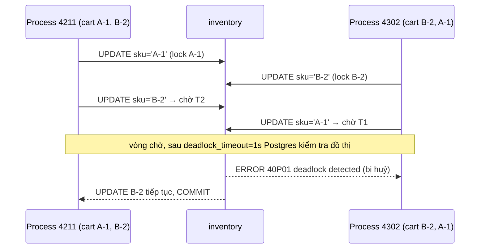
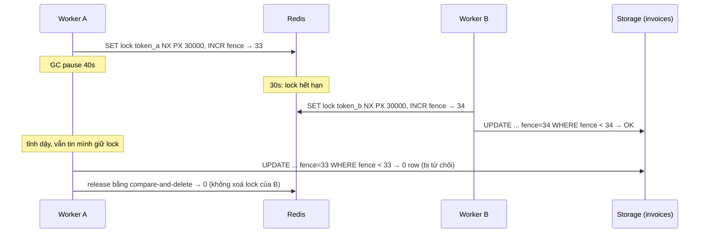
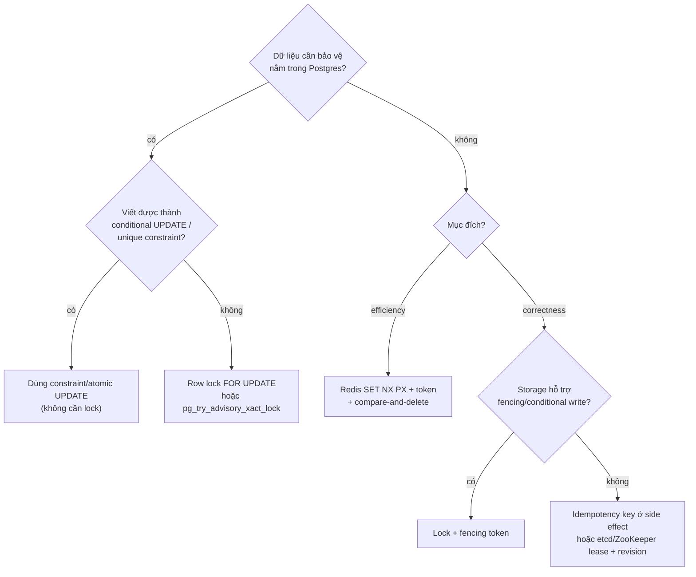

## Bối cảnh & vấn đề

Ba sự cố, cùng một tuần, cùng một gốc là "lock được dùng sai chỗ":

1. Checkout error rate nhảy lên 3% lúc giờ cao điểm. Postgres log đầy `ERROR: deadlock detected`. Đội đề xuất "hạ isolation level xuống".
2. Một worker lấy Redis lock `lock:invoice:42` TTL 30s rồi render và gửi hoá đơn. Một lần GC pause 40s, khách nhận **hai** hoá đơn.
3. CronJob billing đêm qua chạy hai lần, một số khách bị charge hai lần. Đội đề xuất "thêm `concurrencyPolicy: Forbid`" và coi như xong.

Mỗi đề xuất trên đều sai hoặc thiếu. Bài này đi qua từng họ scenario theo khung **triệu chứng → tái hiện → root cause → fix → kiểm chứng**. Lý thuyết nền nằm ở track khác và được link thay vì dạy lại: [locking & concurrency control](/tracks/sql-postgres/learn/locking-concurrency), [deadlock & locking ở database](/tracks/os-concurrency/learn/deadlock-db-locking), [lease, lock & fencing token](/tracks/distributed-systems/learn/leases-locks-fencing), [distributed lock với Redis](/tracks/caching/learn/distributed-locks), [cache stampede](/tracks/caching/learn/stampede-protection).

Mọi output dưới đây đo thật: PostgreSQL 17.11 (`deadlock_timeout = 1s`, `log_lock_waits = off` mặc định), Redis 7.4.11, Node 24.21.

## Khái niệm

### Deadlock và lock ordering

**Deadlock** là vòng chờ: transaction A giữ lock X và chờ lock Y, B giữ Y và chờ X; không ai tiến được. Postgres không ngăn deadlock, nó **phát hiện**: khi một session chờ lock lâu hơn `deadlock_timeout` (mặc định 1s), nó kiểm tra đồ thị chờ, nếu thấy vòng thì huỷ **một** transaction với `40P01 deadlock_detected`. Transaction còn lại tiếp tục.

Cách phòng chuẩn là **lock ordering**: mọi code path khoá các tài nguyên theo **cùng một thứ tự toàn cục** (vd `sku` tăng dần, `account_id` tăng dần). Không thể có vòng chờ nếu mọi người đi cùng một chiều. Deadlock row-lock **không liên quan isolation level**: READ COMMITTED vẫn giữ row lock tới commit, nên "hạ isolation" không chữa được.

### Lease và lock có TTL

**Lease** là lock có thời hạn: người giữ được quyền trong `ttl`, hết hạn thì người khác lấy. TTL tồn tại để lock không bị kẹt vĩnh viễn khi người giữ chết. Cái giá: người giữ **có thể vẫn đang chạy** khi lease hết hạn (GC pause, event loop block, network partition, VM bị suspend), và nó không biết điều đó. Lúc đó có hai người cùng tin mình giữ lock.

Ví dụ: `SET lock:invoice:42 <token> NX PX 30000`; worker bị pause 40s; giây thứ 30 lock hết hạn; worker B lấy lock; giây thứ 40 worker A tỉnh dậy và gửi hoá đơn, không hề biết B cũng đang gửi.

### Token ngẫu nhiên và compare-and-delete

Lock Redis phải có value là **token ngẫu nhiên của người giữ**, và release bằng Lua script "chỉ DEL nếu value còn là token của tôi". Nếu release bằng `DEL` trơn, người giữ cũ (lock đã hết hạn) sẽ **xoá lock của người mới**, mở cửa cho người thứ ba. GET rồi DEL từ Node cũng không đủ: giữa hai lệnh lock có thể hết hạn và bị người khác lấy.

### Fencing token

**Fencing token** là số tăng dần cấp kèm mỗi lần lấy lock (`INCR lock:invoice:42:fence`, hoặc revision của etcd). Mọi write vào storage mang theo token, và **storage từ chối token cũ hơn token đã thấy**: `UPDATE invoices SET ..., fence = $t WHERE id = 42 AND fence < $t`. Đây là thứ biến lock từ "thường đúng" thành "đúng": khi A tỉnh dậy với token 1 mà B đã ghi với token 2, write của A bị từ chối. Fencing cần storage hợp tác; side effect ra ngoài (email, gọi API) không có fencing, nên cần idempotency key thay thế.

### Advisory lock của Postgres

**Advisory lock** là lock theo một số nguyên tuỳ ý (`pg_try_advisory_lock(hashtext('billing'))`), Postgres không gắn nó với row nào. Hai loại: **session-level** (giữ tới khi gọi unlock hoặc session đóng) và **transaction-level** (`pg_try_advisory_xact_lock`, tự nhả khi commit/rollback). Không có TTL nên không "hết hạn giữa chừng"; session chết thì lock tự nhả. Bẫy lớn: session-level lock **hỏng với PgBouncer transaction mode**, vì mỗi transaction có thể chạy trên một server connection khác (chi tiết ở [connections & PgBouncer](/tracks/sql-postgres/learn/connection-pooling)).

### Efficiency lock vs correctness lock

Kleppmann phân biệt hai mục đích. **Efficiency lock** tránh làm trùng việc tốn kém (rebuild cache, gửi report); thỉnh thoảng hai người cùng làm thì tốn thêm chút tài nguyên, không sai dữ liệu. **Correctness lock** bảo vệ invariant; hai người cùng làm là sai (double charge, hai hoá đơn). Redis lock (kể cả Redlock) chấp nhận được cho efficiency; cho correctness cần fencing ở storage hoặc làm bằng chính constraint của DB.

### Concurrent run vs re-run

Hai thứ khác nhau mà sự cố "cron chạy hai lần" hay gộp: **concurrent run** (hai instance chạy cùng lúc) và **re-run** (chạy lại tuần tự sau khi lần đầu đã xong một phần hoặc đã xong). Lock (advisory, `concurrencyPolicy: Forbid`) chỉ chặn được loại đầu. Chống loại sau cần **idempotency theo business key**: `UNIQUE (customer_id, billing_period)`.

## Cơ chế hoạt động

### Đọc một deadlock log

Log trong card 025:

```text
ERROR:  deadlock detected
DETAIL:  Process 4211 waits for ShareLock on transaction 918273; blocked by process 4302.
         Process 4302 waits for ShareLock on transaction 918270; blocked by process 4211.
         Process 4211: UPDATE inventory SET qty = qty - 1 WHERE sku = 'B-2'
         Process 4302: UPDATE inventory SET qty = qty - 1 WHERE sku = 'A-1'
CONTEXT:  while updating tuple (12,7) in relation "inventory"
```

"Waits for **ShareLock on transaction** X" nghĩa là: tôi cần update một tuple mà transaction X đang giữ row lock, nên tôi chờ X kết thúc (mỗi transaction giữ ExclusiveLock trên chính transaction id của nó; người chờ xin ShareLock trên id đó). Ghép lại:



Pattern code gây ra nó: update các dòng theo **thứ tự item trong giỏ hàng**, hai giỏ cùng chứa A-1 và B-2 nhưng thứ tự ngược nhau. Fix: sort theo `sku` trước khi update, hoặc một câu `SELECT ... WHERE sku = ANY($1) ORDER BY sku FOR UPDATE` rồi mới update.

Câu follow-up về sort: `['B-2','A-1'].sort()` đúng cho string SKU. Nhưng `[10, 9].sort()` trong JS cho `[10, 9]` vì default sort so sánh **chuỗi** (`"10" < "9"`); trong khi SQL `ORDER BY id` sắp theo số (`9, 10`). Nếu một code path sort trong JS bằng default sort và code path khác dựa vào `ORDER BY id`, thứ tự lại không nhất quán và deadlock quay lại. Dùng `sort((a, b) => a - b)` cho số. (Snippet `[fromId, toId].sort()` trong note Notion có đúng lỗi này.)

### Lock hết hạn giữa GC pause



Diagram cho thấy hai lớp phòng thủ độc lập: **compare-and-delete** giữ cho lock của B không bị A xoá, và **fencing** giữ cho write của A không ghi đè B. Thiếu lớp thứ hai, cả hai worker đều gửi hoá đơn. Tăng TTL lên 5 phút chỉ làm sự cố hiếm hơn và làm recovery khi worker chết chậm hơn 5 phút; nó không loại bỏ cơ chế.

### Chọn công cụ lock



## Ví dụ thực tế

### Tái hiện deadlock checkout và fix bằng sort

200 checkout đồng thời, mỗi giỏ có A-1 và B-2, một nửa theo thứ tự `[A-1, B-2]`, một nửa `[B-2, A-1]`, mỗi update cách nhau 5 ms (logic khác trong transaction):

```ts
async function checkout(items: string[], sort: boolean) {
  const list = sort ? [...items].sort() : items;     // SKU là string → default sort đúng
  await c.query('BEGIN');
  for (const sku of list) {
    await c.query('UPDATE inventory SET qty = qty - 1 WHERE sku = $1', [sku]);
    await sleep(5);
  }
  await c.query('COMMIT');
}
```

```text
ERROR: deadlock detected
DETAIL: Process 568 waits for ShareLock on transaction 6992; blocked by process 565.
Process 565 waits for ExclusiveLock on tuple (0,6) of relation 16533 of database 5; blocked by process 574.
Process 574 waits for ShareLock on transaction 6985; blocked by process 556.
Process 556 waits for ExclusiveLock on tuple (0,5) of relation 16533 of database 5; blocked by process 568.
cart order  : {"ok":4,"40P01":196} in 99403 ms
sorted by sku: {"ok":200} in 10955 ms
```

Hai điều đáng chú ý. Thứ nhất, dưới tải cao, vòng chờ có thể dài hơn 2 process: ở đây 4 process, xen giữa là **`ExclusiveLock on tuple`** (lock tạm mà Postgres dùng để xếp hàng những người cùng chờ một tuple). Thứ hai, **196/200** transaction bị huỷ và cả batch mất **99 giây**, vì mỗi vòng chờ tốn ít nhất `deadlock_timeout` = 1s trước khi được phát hiện. Sort theo sku: **0 deadlock**, 200/200 thành công. Chạy lại với 40 transaction: `{"ok":9,"40P01":31}` trong 20.7 s so với `{"ok":40}` trong 6.1 s.

### Money transfer: bốn lỗi trong một hàm

Card 044, chạy 40 transfer đồng thời (một nửa 1→2, một nửa 2→1), `fraudService.check` giả lập 50 ms:

```ts
// bản lỗi: lock from → HTTP call → lock to; retry mọi lỗi, không backoff
return retry(() => db.tx(async (tx) => {
  await tx.query('SELECT * FROM accounts WHERE id = $1 FOR UPDATE', [from]);
  await fraudService.check(from, to, amount);          // giữ row lock trong lúc gọi HTTP
  await tx.query('SELECT * FROM accounts WHERE id = $1 FOR UPDATE', [to]);
  /* 2 UPDATE */
}), { retries: 5, retryOn: () => true });
```

```ts
// bản sửa
await fraudService.check(from, to, amount);             // 1. HTTP NGOÀI transaction
for (let attempt = 1; ; attempt++) {
  try {
    return await db.tx(async (tx) => {
      const ins = await tx.query(                        // 4. idempotency theo transfer key
        'INSERT INTO transfers (idem_key, from_id, to_id, amount) VALUES ($1,$2,$3,$4) ON CONFLICT DO NOTHING',
        [key, from, to, amount]);
      if (ins.rowCount === 0) return 'duplicate';
      await tx.query(                                    // 2. khoá cả hai trong MỘT câu, theo id
        'SELECT id FROM accounts WHERE id = ANY($1::int[]) ORDER BY id FOR UPDATE', [[from, to]]);
      const d = await tx.query(                          // 4. check số dư trong WHERE
        'UPDATE accounts SET balance = balance - $2 WHERE id = $1 AND balance >= $2', [from, amount]);
      if (d.rowCount === 0) throw new InsufficientFunds();  // lỗi nghiệp vụ: KHÔNG retry
      await tx.query('UPDATE accounts SET balance = balance + $2 WHERE id = $1', [to, amount]);
      return 'ok';
    });
  } catch (e: any) {
    if (!['40P01', '40001'].includes(e.code) || attempt === 3) throw e;   // 3. chỉ retry lỗi concurrency
    await sleep(Math.random() * Math.min(1000, 50 * 2 ** attempt));       //    full jitter
  }
}
```

```text
buggy: {"ok":11,"40P01":29} attempts=215 in 434769 ms
fixed: {"ok":40} attempts=40 in 5841 ms
{ total: 200000 }
```

Bản lỗi: 215 attempt cho 40 transfer, **29 transfer vẫn thất bại** sau 6 lần thử, tổng **7 phút**. Retry không backoff làm hai bên thua lại gặp nhau đúng lúc, deadlock lặp lại đồng bộ; mỗi vòng tốn 1s phát hiện cộng 50 ms giữ lock trong HTTP call. Bản sửa: 40/40, không deadlock, không retry. Tổng tiền vẫn 200,000 (invariant bảo toàn). SQL Server: cùng pattern với `WITH (UPDLOCK, ROWLOCK)` và retry **error 1205**.

### Redis lock: DEL trơn xoá lock của người khác, fencing chặn write cũ

TTL 300 ms; A "pause" 500 ms; B tới ở 350 ms; C tới ở 550 ms (ngay sau khi A release):

```text
A: got lock, fence=1
B: got lock, fence=2
A: release -> 1 (plain DEL)          ← A xoá lock của B
C: got lock, fence=3                 ← B và C cùng "giữ" lock
C: release -> 1 (plain DEL)
B: release -> 0 (plain DEL)
---
A: got lock, fence=4
B: got lock, fence=5
C: lock busy                         ← compare-and-delete giữ lock của B
A: release -> 0 (compare-and-delete)
B: release -> 0 (compare-and-delete)
```

Ngay cả bản compare-and-delete, A và B **vẫn chồng nhau** trong khoảng 350–500 ms: đó là giới hạn của mọi lease. Lớp chặn cuối là fencing ở storage:

```ts
const write = (fence: number, body: string) => pool.query(
  'UPDATE invoices SET body = $2, fence = $1 WHERE id = 42 AND fence < $1', [fence, body]);
```

```text
B (fence=2) writes -> 1
A wakes up (fence=1) writes -> 0
[ { id: 42, body: 'from B', fence: '2' } ]
```

Script release an toàn (Lua, atomic trong Redis):

```lua
if redis.call('GET', KEYS[1]) == ARGV[1] then return redis.call('DEL', KEYS[1]) else return 0 end
```

### Cron billing: lock chặn chạy song song, không chặn chạy lại

```ts
const { rows: [{ got }] } = await c.query(`SELECT pg_try_advisory_lock(hashtext('billing')) AS got`);
if (!got) return 'skipped (lock held)';
for (const customer of customers) {
  await c.query(`INSERT INTO invoices_bill VALUES ($1, '2026-09', 100)`, [customer]);
}
await c.query(`SELECT pg_advisory_unlock(hashtext('billing'))`);
```

```text
[ 'pod-1: billed 5', 'pod-2: skipped (lock held)' ]
job retry after crash (sequential): billed 5
invoices without unique: 10
run-1: billed 5
job retry after crash (sequential): billed 0
invoices with UNIQUE(customer_id, period): 5
```

Advisory lock làm đúng việc của nó: pod-2 bỏ qua khi pod-1 đang chạy. Nhưng khi Job được chạy lại (pod fail, `backoffLimit` mặc định 6, hoặc controller tạo thêm Job), lần chạy sau **lấy lock thành công** vì lần trước đã nhả, và bill lại từ đầu: 10 invoice cho 5 khách. Chỉ `UNIQUE (customer_id, billing_period)` + `ON CONFLICT DO NOTHING` (và idempotency key `bill:{customer}:{period}` khi gọi payment provider) mới làm lần chạy lại thành no-op.

Một chi tiết thú vị khi đo: lần chạy đầu tiên, hai "pod" đều bill 5, vì pod-2 mất hơn 100 ms để mở connection mới (SCRAM auth) nên chỉ tới lúc pod-1 đã xong và nhả lock. "Concurrent" trên giấy, tuần tự trong thực tế, và lock vô dụng. Đây chính là lý do idempotency là fix gốc.

Config CronJob vẫn nên chặt (verify các default theo phiên bản Kubernetes):

```yaml
spec:
  schedule: "0 2 * * *"
  timeZone: "Asia/Ho_Chi_Minh"
  concurrencyPolicy: Forbid        # mặc định Allow
  startingDeadlineSeconds: 600
  jobTemplate:
    spec:
      backoffLimit: 2              # mặc định 6 lần retry pod
```

Job crash ở khách thứ 25,000/50,000: lần chạy lại duyệt lại toàn bộ danh sách nhưng 25,000 khách đầu gặp conflict (no-op, nhanh); muốn nhanh hơn thì lưu checkpoint `last_customer_id` và tiếp tục từ đó, nhưng checkpoint chỉ là tối ưu, unique constraint mới là đảm bảo.

### Cache rebuild lock: polling đệ quy

Card 035 (đoạn code cũng có trong note Notion): 500 request cùng miss một key, `queryDB` 400 ms.

```text
recursive 50ms poll (Notion)   500 concurrent misses: redis GETs=2739, DB calls=1, 597 ms
singleflight + bounded wait    500 concurrent misses: redis GETs=500, DB calls=1, 531 ms
```

Lock vẫn chặn được DB (1 call), nhưng 500 waiter poll mỗi 50 ms tạo **5.5x** số GET; ở 5,000 waiter và rebuild 1s là ~100k GET/s vào Redis. Các lỗi khác của đoạn code: không token (DEL xoá lock của người khác khi `queryDB` > 10s), không `finally` (queryDB throw → mọi người chờ 10s), đệ quy không giới hạn (treo tới timeout), không stale fallback. Bản sửa: singleflight in-process (mỗi pod chỉ một promise rebuild), token + compare-and-delete trong `finally`, chờ có giới hạn (10 lần ≈ 500–1000 ms có jitter) rồi fallback, và giữ bản stale (key phụ TTL dài hoặc stale-while-revalidate) để waiter trả ngay. Cơ chế chi tiết ở [cache stampede](/tracks/caching/learn/stampede-protection).

## Trade-offs & lựa chọn thay thế

| Công cụ | Tự nhả khi người giữ chết | Có thể hết hạn giữa chừng | Chi phí | Khi nào dùng | Bẫy |
|---|---|---|---|---|---|
| Constraint / conditional UPDATE | Không cần | Không | Thấp nhất | Mặc định cho dữ liệu trong DB | Phải map lỗi `23505`/`rowCount=0` |
| Row lock `FOR UPDATE` | Có (txn kết thúc) | Không | Giữ connection + lock | Nhiều bước trong 1 DB | Deadlock, I/O trong txn |
| `pg_try_advisory_xact_lock` | Có | Không | Giữ connection suốt txn | Singleton job, đã có Postgres | Work dài = txn dài |
| Advisory session lock | Có (session đóng) | Không | Giữ một connection | Leader cho worker dài | Hỏng với PgBouncer transaction mode |
| Redis `SET NX PX` + token | Có (TTL) | **Có** | Rất thấp | Efficiency lock, dedupe việc tốn kém | Cần fencing nếu là correctness |
| Redlock (5 node) | Có (TTL) | **Có** | Cao | Hầu như không cần | Không giải quyết GC pause; giả định thời gian |
| etcd/ZooKeeper lease | Có | Có, nhưng có revision để fence | Vận hành cụm đồng thuận | Leader election, coordination thật | Thêm hệ thống |

**Phản biện "lock service chung bằng Redlock" (card 052).** Hỏi lại mục đích: phần lớn "concurrent update" là dữ liệu trong một DB và giải quyết tốt hơn ngay tại DB (conditional UPDATE, version, unique, `SKIP LOCKED`, advisory). Cho correctness, Redlock dựa trên giả định về thời gian (clock drift, pause, network delay có giới hạn); Kleppmann chỉ ra rằng không có fencing token thì không an toàn, antirez phản biện rằng giả định đó chấp nhận được trong thực tế. Kết luận thực dụng: cần fencing ở storage, hoặc hệ đồng thuận có revision. Một service lock bắt buộc cho mọi team còn là single point of failure và coupling. Đề xuất thay thế: guideline + thư viện nhỏ ("dùng constraint trước; nếu cần Redis lock thì đây là helper có token, compare-and-delete và fencing"). Một case thật cần lock ngoài DB: điều phối việc trên tài nguyên không phải DB, vd đảm bảo chỉ một worker gọi API rate-limited của partner cho một tenant, hoặc chỉ một pod chạy migration file trên S3; ngay cả khi đó, side effect vẫn nên idempotent.

## Edge cases & failure modes

- **Deadlock với hơn 2 transaction**: vòng chờ 4 process như output trên; đọc log theo từng cặp "waits for ... blocked by".
- **Deadlock giữa row lock và FK**: INSERT vào bảng con lấy `FOR KEY SHARE` trên row cha; UPDATE row cha đồng thời có thể tạo vòng (chi tiết ở [locking & concurrency](/tracks/sql-postgres/learn/locking-concurrency)).
- **Retry 40P01 không jitter**: hai bên thua retry cùng lúc, deadlock lặp lại (đo: 29/40 transfer thất bại sau 6 lần).
- **Lock hết hạn giữa work**: GC pause, `await` một call chậm, event loop block bởi JSON lớn; lease nào cũng có cửa sổ này.
- **Redis failover**: replica chưa nhận lệnh `SET` lock được promote; người khác lấy được lock ngay. Fencing token (INCR) cũng có thể bị lùi nếu INCR chưa replicate: fencing tốt nhất là số do **storage** sinh hoặc xác nhận (vd `version` trong chính row).
- **Advisory lock + PgBouncer transaction mode**: lock lấy trên server connection 1, unlock chạy trên connection 2 → lock kẹt tới khi connection 1 đóng. Dùng `xact` lock hoặc session mode cho worker đó.
- **CronJob tạo 0 hoặc 2 Job**: controller có thể bỏ lịch (vd quá `startingDeadlineSeconds`) hoặc tạo Job trùng trong vài tình huống; docs Kubernetes yêu cầu job phải idempotent (verify chi tiết theo phiên bản).
- **Lock đúng, side effect sai**: gửi email nằm ngoài storage có fencing; cần idempotency key theo `invoice_id` ở dịch vụ email.

## Pitfalls

- ❌ Hạ isolation level để chữa deadlock row-lock → ✅ lock ordering, transaction ngắn, retry `40P01` có jitter; row lock tồn tại ở mọi isolation level.
- ❌ `[fromId, toId].sort()` với id số → ✅ `sort((a, b) => a - b)` hoặc để SQL `ORDER BY id FOR UPDATE` làm.
- ❌ HTTP call trong transaction đang giữ row lock → ✅ gọi trước hoặc sau transaction.
- ❌ `retryOn: () => true` → ✅ chỉ retry `40P01`/`40001` (SQL Server: 1205), tối đa ~3 lần, full jitter; lỗi nghiệp vụ không retry.
- ❌ Release Redis lock bằng `DEL` → ✅ token ngẫu nhiên + Lua compare-and-delete, trong `finally`.
- ❌ Tăng TTL lên 5 phút để chữa GC pause → ✅ fencing token ở storage + idempotent side effect.
- ❌ Gọi Redlock là "an toàn cho correctness" → ✅ hỏi efficiency hay correctness; correctness cần fencing hoặc consensus.
- ❌ Chỉ dựa vào `concurrencyPolicy: Forbid` hoặc advisory lock cho billing → ✅ unique theo business key + idempotency key với provider.
- ❌ Unit test với DB mock để "test race" → ✅ test song song trên DB thật.

## Kiểm chứng sau khi fix

Card 056 hỏi cách bắt bug concurrency trước production. Công cụ theo thứ tự hiệu quả:

1. **Test song song có assert invariant** trên DB thật (Testcontainers/docker): như các script trong bài, bắn 40–500 request cùng resource rồi assert `SUM(balance)` không đổi, `invoices = số khách`, `deadlocks = 0`. Mock DB không bao giờ tái hiện được row lock hay `40P01`.
2. **Ép interleaving**: thay vì hy vọng race xảy ra, chèn barrier/hook giữa "đọc" và "ghi" trong test (hai transaction cùng đọc rồi mới cho ghi), hoặc `pg_sleep` trong test; với lock, giả lập pause bằng `sleep > TTL` như demo ở trên.
3. **Inject lỗi ở điểm giữa**: kill process giữa job, gửi message hai lần, provider timeout sau khi đã xử lý; property-based test cho state machine (fast-check).
4. **Review checklist**: có read-modify-write không? lock có token và fencing không? retry ở đâu, retry lỗi nào? side effect có key không?
5. **Production**: bật `log_lock_waits = on`, alert theo số `40P01`/phút, và invariant query định kỳ (invoice trùng theo `(customer, period)`).

Với bug voucher của [bài 01](/tracks/scenario-reliability/learn/oversell-hot-row): test song song và interleaving bắt được; unit test có mock và review "Node single-thread" thì không.

## Tóm tắt

- Deadlock = vòng chờ; Postgres phát hiện sau `deadlock_timeout` (1s) và huỷ một bên với `40P01`. Fix: **lock ordering**, transaction ngắn, không I/O trong txn, retry đúng lỗi có jitter.
- Đọc log: "ShareLock on transaction X" = chờ X nhả row lock; ghép các cặp để thấy vòng.
- Mọi lease đều có thể hết hạn khi người giữ vẫn chạy → **token + compare-and-delete** để không xoá lock người khác, **fencing token ở storage** để chặn write cũ.
- Redis lock/Redlock cho **efficiency**; **correctness** cần fencing, consensus, hoặc tốt nhất là constraint của DB.
- Advisory lock: không TTL, tự nhả khi session chết, nhưng hỏng với PgBouncer transaction mode (dùng `xact`).
- Lock chặn **chạy song song**, không chặn **chạy lại**; billing cần `UNIQUE (customer_id, period)` + idempotency key.
- Cache rebuild lock cần singleflight, chờ có giới hạn, stale fallback và `finally`.
- Chứng minh bằng test song song trên DB thật + ép interleaving + metric lock wait/deadlock.
