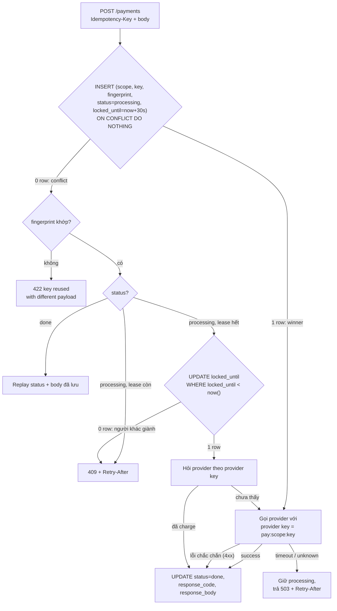
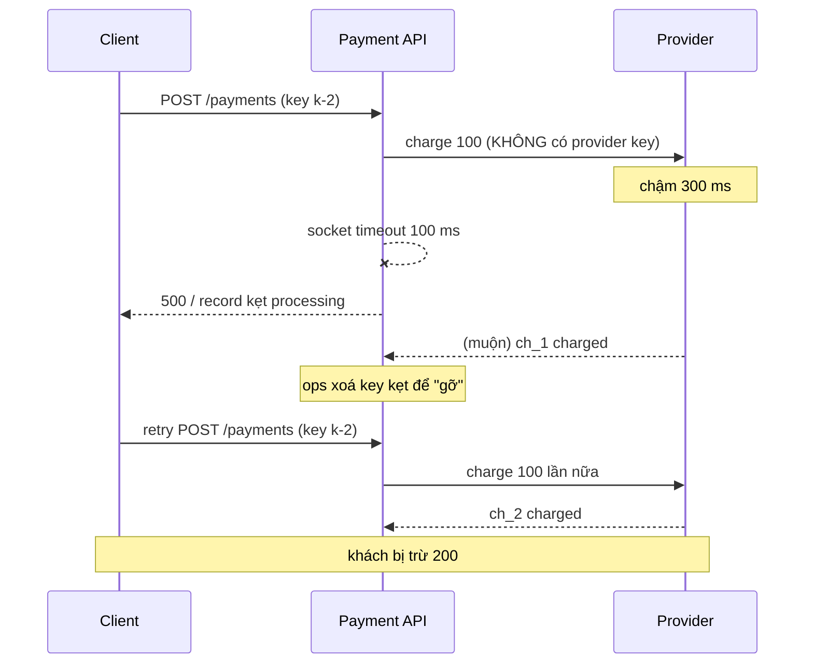
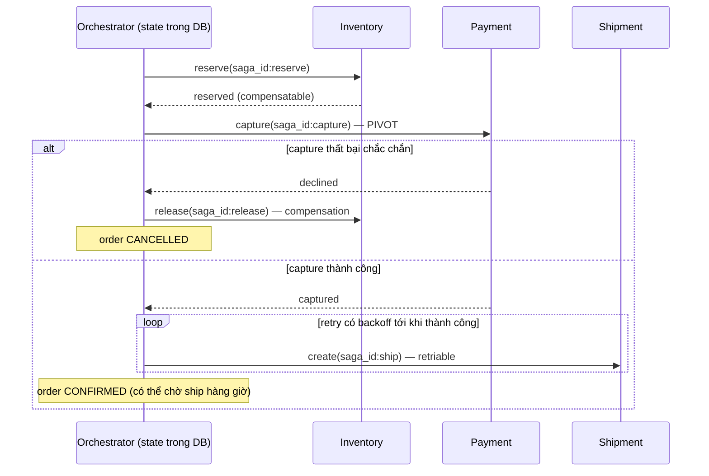
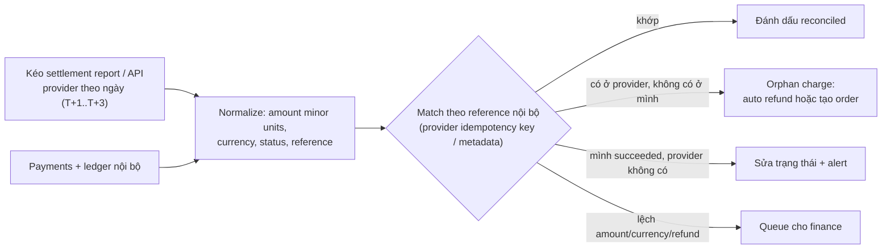

## Bối cảnh & vấn đề

Ticket support: "Tôi bị trừ tiền hai lần cho đơn A1." Product đã "fix" tuần trước bằng cách disable nút Pay sau click đầu. Tuần này vẫn có ticket. Log cho thấy hai mẫu khác nhau:

- Mẫu 1: `POST /payments` timeout ở phía mobile sau 10s, app tự retry với request mới. Server xử lý cả hai.
- Mẫu 2: API có idempotency middleware, nhưng server gọi payment provider bị **socket timeout**, đánh dấu payment `failed`, user bấm thử lại, provider charge lần hai. Lần đầu không hề fail; nó chỉ chậm.

Và một sự cố thứ ba sau khi đội thêm middleware: vài payment "kẹt" mãi ở `processing`, client retry nhận `409` vĩnh viễn, ops viết cron xoá key kẹt để "gỡ", và lần xoá đó lại gây double charge.

Bài này là playbook cho họ scenario "cùng một thao tác tiền bị làm hai lần": từ nút bấm, middleware, gọi provider, tới saga và reconciliation. Lý thuyết nền đã có ở [Idempotency key cho POST](/tracks/api-design/learn/idempotency), [Idempotency và exactly-once](/tracks/distributed-systems/learn/idempotency-delivery), [2PC, saga và compensation](/tracks/distributed-systems/learn/distributed-transactions-saga) và [checkout & payments](/tracks/system-design/learn/checkout-payments); ở đây ta tập trung vào **chẩn đoán và sửa** một implementation cụ thể. Mọi output đo thật: Node 24.21, PostgreSQL 17.11, provider giả lập trong cùng process (có hỗ trợ idempotency key, có thể "chậm" để gây timeout).

## Khái niệm

### Nguồn trùng lặp

Một thao tác có thể tới server nhiều lần từ rất nhiều nguồn: double-click, hai tab, reload trang, SDK/HTTP client tự retry khi timeout, mobile mất mạng rồi gửi lại, proxy hoặc load balancer retry, job retry, attacker gọi thẳng API. **Disable nút** chỉ chặn nguồn đầu tiên. Quan trọng hơn: **timeout phía client không có nghĩa server chưa xử lý**; request có thể đã charge xong và chỉ response bị mất. Nên correctness phải nằm ở server. Disable nút vẫn nên giữ, vì nó là UX tốt, chỉ không phải cơ chế đúng.

### Idempotency key

**Idempotency key** là ID do client sinh cho **một thao tác nghiệp vụ** (không phải cho một HTTP attempt), gửi trong header `Idempotency-Key`, giữ nguyên qua mọi lần retry. Server lưu key cùng kết quả; lần sau thấy key thì trả lại kết quả cũ thay vì làm lại. Nơi sinh key: khi user **bắt đầu thao tác** (mở màn checkout cho order A1, hoặc lúc click lần đầu) và lưu lại (state/localStorage) để retry dùng lại. Sinh key mới cho mỗi attempt thì idempotency vô nghĩa.

### Fingerprint và scope

**Fingerprint** là hash của các trường xác định thao tác (method, path, body đã chuẩn hoá), lưu cùng key. Cùng key mà fingerprint khác là **lỗi client** (bug sinh key hoặc dùng key cố định); server phải trả **422** thay vì replay. Không có fingerprint, server replay response "charge 100" cho request "charge 250", client tin đã charge 250, dữ liệu lệch âm thầm. Không đưa vào fingerprint các trường biến động (timestamp, trace id), nếu không retry hợp lệ bị coi là body khác.

**Scope** là không gian tên của key: `(tenant_id hoặc user_id, key)`. Key global làm key của user A va chạm với user B, và tệ hơn, user B có thể nhận replay response của user A.

### Trạng thái record và lease

Record có ít nhất ba trạng thái: `processing` (đang có người làm), `done` (đã có kết quả cuối, kể cả lỗi chắc chắn như `card_declined`), và vùng mờ "processing nhưng người làm đã chết". **Lease** (`locked_until`) phân biệt hai trường hợp sau: còn hạn thì request khác nhận `409` + `Retry-After`; hết hạn thì một request được phép **giành lại** (bằng conditional UPDATE, chỉ một người thắng) và tiếp tục.

### Timeout là kết quả thứ ba

Một call ra ngoài có ba kết quả, không phải hai: **success**, **failure chắc chắn** (4xx có nghĩa), và **unknown** (timeout, connection reset sau khi gửi). Unknown không được map sang failed. Hướng xử lý duy nhất đúng: hỏi lại bằng **cùng provider idempotency key** (provider trả kết quả lần đầu) hoặc tra cứu theo reference nội bộ, rồi mới quyết định.

### Provider idempotency key

Key của API mình không bảo vệ được call ra provider. Phải truyền một key **riêng, ổn định** xuống provider, thường derive từ ID nội bộ: `pay:{payment_id}` hoặc `pay:{scope}:{client_key}`. Key này phải giống hệt ở mọi lần retry và mọi lần recovery; đổi key là provider coi như charge mới.

### Recovery point

**Recovery point** (mô hình "atomic phases" của Stripe/Brandur) là cột ghi lại tiến độ của request: `created → provider_called → charged → done`. Khi một request giành lại lease, nó đọc recovery point và tiếp tục từ đó thay vì làm lại từ đầu. Mỗi phase là một transaction cục bộ; phase gọi ra ngoài thì dùng provider key để an toàn khi lặp.

### Pivot transaction trong saga

Trong **saga** (chuỗi transaction cục bộ + compensation), bước **pivot** là bước mà sau nó saga chỉ được đi tiếp (retry tới khi thành công), không được compensate. Với checkout, pivot là **capture payment**: trước nó là các bước compensatable (reserve inventory → release), sau nó là các bước retriable (create shipment). Đặt pivot sai chỗ (charge trước, reserve sau) là tự tạo ra refund không cần thiết.

## Cơ chế hoạt động

### Flow idempotency đúng



Ba điểm làm flow này đúng. Thứ nhất, **INSERT ... ON CONFLICT là câu đầu tiên**, không có SELECT trước nó; unique constraint quyết định ai thắng, không có khoảng hở. Thứ hai, mọi nhánh conflict đều phân biệt `done` và `processing`, không bao giờ trả body rỗng. Thứ ba, timeout **không** chuyển record sang failed; nó để record ở `processing` với lease, và lần retry kế tiếp (hoặc sweeper) đi nhánh recovery.

### Timeline của một double charge



Lỗi nằm ở hai chỗ: không truyền provider key (nên provider không thể nhận ra lần hai là lặp), và coi "xoá key" là cách recovery (nên server quên rằng mình đã gọi provider).

### Saga checkout



Mỗi step và mỗi compensation mang idempotency key `saga_id:step` vì orchestrator sẽ retry chúng. Command gửi đi qua **outbox** ([outbox, CDC và saga](/tracks/messaging-kafka/learn/outbox-cdc-sagas)) để việc cập nhật state saga và việc gửi message không lệch nhau. "Reserved, chưa bán" là **semantic lock**: saga khác nhìn thấy hàng đang được giữ chứ không coi là còn.

## Ví dụ thực tế

### Middleware trong note: bốn lỗi, đo từng cái

Card 031 lấy nguyên đoạn code từ note Notion:

```ts
async function pay(req: Request) {
  const key = req.headers['idempotency-key'] as string;
  const existing = await db.idempotency.findByKey(key);
  if (existing) return existing.response;            // replay
  const inserted = await db.idempotency.insertIfAbsent(key, 'processing');
  if (!inserted) throw new ConflictError('in progress');
  const result = await chargeGateway(req.body);
  await db.idempotency.update(key, 'done', result);
  return result;
}
```

Chạy bản này và bản sửa (flow ở trên) với cùng một bộ test: 20 request đồng thời cùng key; cùng key nhưng amount khác; provider chậm 300 ms trong khi client timeout 100 ms.

```text
[notion] 20 concurrent, same key: responses={"200":2,"409":10,"200(empty body)":8} provider charges=1
[notion] same key, amount 250: code=200 body={"id":"ch_1","amount":100}
[notion] provider timeout: 1st=throw:ETIMEDOUT retry=200 body=null record=processing provider charges=1
[notion] after deleting stuck key, retry=200 provider charges=2 (double charge)

[good] 20 concurrent, same key: responses={"201":5,"409":15} provider charges=1
[good] same key, amount 250: code=422 body={"error":"idempotency key reused with different payload"}
[good] provider timeout: 1st=503 retry=201 body={"id":"ch_1","amount":100} (recovered) record=done provider charges=1
```

Đối chiếu với từng lỗi:

1. **Replay record đang processing**: 8/20 request nhận `200` với **body rỗng** (`existing.response` là null khi status còn `processing`). Client có thể hiểu là thành công, hoặc crash khi parse. Bản sửa phân nhánh theo status: `done` → replay **status code và body**; `processing` → `409` + `Retry-After`.
2. **Không fingerprint**: cùng key, amount 250 → bản cũ trả `200` với charge 100 cũ. Bản sửa trả `422`.
3. **Kẹt processing vĩnh viễn**: provider timeout → `chargeGateway` throw → record `processing` mãi; mọi retry nhận body null. Không có lease nên không ai được phép recover.
4. **Không provider key**: ops xoá key kẹt → retry → **provider charges = 2**. Bản sửa: lần đầu trả `503` (unknown), retry sau khi lease hết hạn giành lại record, **hỏi provider bằng provider key**, thấy `ch_1` đã có, hoàn tất record với status `recovered`: **1 charge**.

Ghi chú khi đo: lần chạy đầu tiên, bản cũ trả 20/20 `200` đầy đủ, vì mỗi connection mới mất hàng trăm ms (SCRAM auth trong Docker) nên các request vô tình chạy tuần tự. Sau khi warm pool, race lộ ra. Test concurrency phải warm pool, nếu không nó "pass" vì sai lý do.

### Schema và code chính của bản sửa

```sql
CREATE TABLE idempotency_keys (
  scope          text        NOT NULL,          -- tenant/user
  key            text        NOT NULL,
  fingerprint    text        NOT NULL,          -- sha256(method, path, normalized body)
  status         text        NOT NULL,          -- processing | done
  recovery_point text        NOT NULL DEFAULT 'created',
  locked_until   timestamptz NOT NULL,
  response_code  int,
  response_body  jsonb,
  provider_ref   text,
  created_at     timestamptz NOT NULL DEFAULT now(),
  PRIMARY KEY (scope, key)
);
-- lớp phòng thủ cuối, độc lập với key: mỗi order tối đa một payment thành công
CREATE UNIQUE INDEX uq_payment_order_succeeded ON payments (order_id) WHERE status = 'succeeded';
```

```ts
// rút gọn từ script đã chạy
const ins = await pool.query(
  `INSERT INTO idempotency_keys (scope, key, fingerprint, status, locked_until)
   VALUES ($1, $2, $3, 'processing', now() + interval '30 seconds') ON CONFLICT DO NOTHING`,
  [scope, key, fp]);
if (ins.rowCount === 0) {
  const r = await getRecord(scope, key);
  if (r.fingerprint !== fp) return reply(422, { error: 'idempotency key reused with different payload' });
  if (r.status === 'done') return reply(r.response_code, r.response_body);
  const take = await pool.query(
    `UPDATE idempotency_keys SET locked_until = now() + interval '30 seconds'
     WHERE scope = $1 AND key = $2 AND status = 'processing' AND locked_until < now()`, [scope, key]);
  if (take.rowCount === 0) return reply(409, { error: 'in progress' }, { 'Retry-After': '1' });
  const found = await provider.findByIdempotencyKey(`pay:${scope}:${key}`);
  if (found) return finish(scope, key, found);
}
try {
  const charge = await provider.charge({ amount, idempotencyKey: `pay:${scope}:${key}` }, { timeoutMs: 10_000 });
  return finish(scope, key, charge);
} catch (e) {
  if (isDefiniteFailure(e)) return finishWithError(scope, key, e);    // 4xx của provider: lưu như done
  return reply(503, { error: 'payment pending' }, { 'Retry-After': '2' }); // unknown: giữ processing
}
```

### Record kẹt 20 phút sau OOM kill

Card 032: pod bị OOM-kill giữa request, record `processing` 20 phút, client retry nhận 409. Recovery có ba thành phần:

```sql
-- 1. Giành lại lease: chỉ một request/sweeper thắng
UPDATE idempotency_keys
SET locked_until = now() + interval '60 seconds', attempt = attempt + 1
WHERE scope = $1 AND key = $2 AND status = 'processing' AND locked_until < now()
RETURNING recovery_point, provider_ref;

-- 2. Sweeper cho record mà client không quay lại
SELECT scope, key FROM idempotency_keys
WHERE status = 'processing' AND locked_until < now() - interval '5 minutes'
ORDER BY created_at LIMIT 100 FOR UPDATE SKIP LOCKED;
```

Rồi đi tiếp **từ recovery point**: `created` → chưa gọi provider, gọi với provider key; `provider_called` → hỏi provider bằng key/reference, có charge thì hoàn tất, không có thì charge (vẫn cùng key, an toàn). Metric "số record `processing` quá 5 phút" + alert. Đừng xoá record kẹt: như đo ở trên, xoá là quên rằng đã gọi provider.

Nếu provider **không** có idempotency key và **không** có API tra cứu theo reference (follow-up của card 032): không có cách an toàn để retry tự động. Chuyển payment sang `unknown`, **không retry**, chờ webhook hoặc settlement report (reconciliation) để biết sự thật, và hiển thị cho user "đang xác nhận thanh toán". Đây cũng là tiêu chí chọn provider.

### Bản ghi idempotency nói "processing", provider nói chưa từng thấy key

Follow-up của card 014. Có hai khả năng: request chết **trước** khi tới provider (crash, network fail trước khi gửi), hoặc provider chưa ghi nhận xong (eventual consistency phía provider). Với provider hỗ trợ idempotency key đúng nghĩa, cách an toàn là **gửi charge lại với cùng key**: nếu lần đầu đã tới, provider replay; nếu chưa, charge mới đúng một lần. Không bao giờ gửi với key mới.

### Reconciliation 0.1%

Card 051: payment của mình và settlement report của provider lệch ~0.1% mỗi tháng. Job định kỳ:



Charge tồn tại ở provider mà không có order: mặc định an toàn là **auto refund** (khách không nhận được gì cho khoản tiền đó), trừ khi có đủ dữ liệu để tạo order đúng (giỏ hàng đã lưu, tồn kho còn) và business muốn giữ doanh thu. Thay đổi trạng thái tiền nên ghi vào **ledger append-only** (double-entry) thay vì update tại chỗ để audit được. Mục tiêu dài hạn không phải reconcile giỏi hơn mà là kéo 0.1% về gần 0 bằng cách sửa nguyên nhân gốc (provider key, lease recovery, webhook dedupe); reconciliation là lưới an toàn cuối.

### Kể story STAR (card 057)

Khung trả lời cho "kể lần bạn fix bug duplicate processing":

- **S**: triệu chứng có số. "~0.3% order bị charge hai lần, 40 ticket/tuần, chi phí refund và chargeback."
- **T**: vai trò. "Tôi on-call và owner của payment service."
- **A**: tái hiện (correlation id trong log cho thấy hai request cùng order cách nhau 10s; test song song tái hiện được), root cause (client retry khi timeout + server không truyền key xuống provider), fix theo lớp (idempotency key có fingerprint và lease → provider key → unique `payments(order_id) WHERE succeeded` → script dọn dữ liệu cũ và refund).
- **R**: số sau fix ("duplicate về 0 trong 8 tuần"), test và alert mới (test song song trong CI, alert record processing > 5 phút).
- **Reflection**: vì sao lọt (review chỉ đọc happy path, test không có concurrency), đổi quy trình gì (checklist "side effect có key không?").

Red flag là không giải thích được **interleaving chính xác** gây bug. Xem thêm cách kể story sự cố ở [Incidents & áp lực](/tracks/behavioral/learn/incidents-pressure).

## Trade-offs & lựa chọn thay thế

| Lớp phòng thủ | Chặn được | Không chặn được | Chi phí |
|---|---|---|---|
| Disable nút / debounce | Double-click | Retry của SDK, 2 tab, attacker | Gần 0 |
| Idempotency key (có fingerprint, scope, lease) | Mọi retry mang cùng key | Client sinh key mới mỗi attempt | Một bảng + logic |
| Provider idempotency key | Double charge khi timeout/recovery | Provider không hỗ trợ | Gần 0 nếu provider hỗ trợ |
| Business unique constraint | Hai payment thành công cho một order, kể cả từ code path khác | Charge ở provider đã xảy ra | Một index |
| Webhook + reconciliation | Mọi thứ lọt qua các lớp trên (phát hiện sau) | Không ngăn, chỉ phát hiện và sửa | Job + vận hành |

**Lưu key ở đâu.** Bảng Postgres cùng DB với payment cho phép ghi record và payment trong cùng transaction, là lựa chọn mặc định. Redis nhanh hơn nhưng mất atomicity với DB và có thể mất key khi failover; chỉ hợp cho dedupe best-effort. TTL ~24h (Stripe giữ key ít nhất 24h, verify) là cân bằng giữa dung lượng và cửa sổ retry hợp lý.

**Orchestration vs choreography cho saga.** Flow tiền nhiều bước, cần timeout và audit → orchestration (state machine trong DB hoặc Temporal). Flow ít bước, ít coupling → choreography bằng event. 2PC xuyên ba service bị loại vì giữ lock xuyên mạng, coordinator là single point of failure và payment provider không tham gia 2PC.

## Edge cases & failure modes

- **Commit-but-lost-ack**: server commit xong, response mất → client retry → phải được replay, không làm lại. Đây là lý do record `done` lưu cả status code lẫn body.
- **Lỗi chắc chắn vs không chắc**: `card_declined` (4xx) lưu như `done` để retry nhận đúng lỗi đó; timeout/5xx giữ `processing` để reconcile. Lưu nhầm timeout thành lỗi cuối = user không bao giờ thanh toán lại được bằng key đó, hoặc tệ hơn, client sinh key mới và charge lần hai.
- **Lease ngắn hơn timeout của call**: lease 5s, provider timeout 10s → request thứ hai giành lease trong khi request đầu vẫn đang chờ provider → hai người cùng gọi provider (an toàn nhờ provider key, nhưng lãng phí). Lease phải dài hơn timeout tối đa của request.
- **Fingerprint quá chặt**: hash cả `timestamp` hoặc `trace_id` → retry hợp lệ bị 422.
- **Key global**: va chạm giữa tenant, rò response của người khác.
- **Shipment down 6 giờ sau capture** (follow-up 050): saga đã qua pivot nên không refund; order ở `PAID_AWAITING_SHIPMENT`, retry có backoff với alert sau N giờ, khách thấy "đang chuẩn bị giao". Compensation chỉ khi business quyết định huỷ (vd quá SLA 48h) và khi đó là refund chủ động có thông báo.
- **Compensation fail** (refund lỗi): retry vô hạn có backoff + alert + manual queue; không bao giờ "bỏ qua".

## Pitfalls

- ❌ Chấp nhận "disable nút" là fix → ✅ correctness ở server: idempotency key + business unique constraint + provider key.
- ❌ Sinh idempotency key mới cho mỗi HTTP attempt → ✅ một key cho một thao tác, giữ qua mọi retry.
- ❌ SELECT key rồi mới INSERT → ✅ INSERT ... ON CONFLICT là câu đầu; conflict mới đọc record.
- ❌ Replay `existing.response` không xem status → ✅ `done` → replay code + body; `processing` → 409 + `Retry-After`.
- ❌ Không fingerprint, key global → ✅ fingerprint body chuẩn hoá, scope theo tenant/user, 422 khi lệch.
- ❌ Timeout → đánh dấu failed, cho user thử lại → ✅ unknown: hỏi provider bằng cùng key hoặc reconcile.
- ❌ Retry với provider key mới, hoặc không truyền key xuống provider → ✅ provider key ổn định derive từ ID nội bộ.
- ❌ Cron xoá key kẹt để client làm lại từ đầu → ✅ lease + recovery point + hỏi provider (đo: xoá key = 2 charge).
- ❌ Capture payment ở bước đầu saga, hoặc đề xuất 2PC → ✅ compensatable trước, pivot ở giữa, retriable sau.
- ❌ Reconciliation là script SQL chạy một lần → ✅ job định kỳ có phân loại, auto-fix loại an toàn, metric theo loại lệch.

## Kiểm chứng sau khi fix

- **Test song song**: 20–50 request cùng key → assert provider charge = 1, không response nào body rỗng.
- **Fault injection**: provider giả chậm hơn client timeout → assert retry được `recovered` và charge = 1; kill process sau khi gọi provider → assert sweeper hoàn tất.
- **Metric**: số `422`, `409`, record `processing` > 5 phút, tỉ lệ `unknown` payment, số orphan charge trong reconciliation (mục tiêu → 0).
- **Invariant query**: `SELECT order_id FROM payments WHERE status='succeeded' GROUP BY 1 HAVING count(*) > 1` phải luôn rỗng (unique index đảm bảo, query xác nhận).

## Tóm tắt

- Trùng lặp đến từ rất nhiều nguồn; **timeout không có nghĩa chưa xử lý**. Disable nút là UX, không phải correctness.
- Idempotency key: một key cho một thao tác, **scope** theo tenant/user, **fingerprint** body (422 khi lệch), TTL ~24h.
- **INSERT ... ON CONFLICT trước**, conflict mới đọc; phân nhánh `done` (replay code + body) vs `processing` (409 + `Retry-After`).
- **Lease + recovery point** cho record kẹt; không xoá record, không chuyển timeout thành failed.
- Luôn truyền **provider idempotency key ổn định**; retry/recovery dùng cùng key.
- Business unique constraint (`payments(order_id) WHERE succeeded`) là lớp cuối độc lập.
- Saga: compensatable → **pivot (capture)** → retriable; mỗi step có key `saga_id:step`, gửi qua outbox.
- Reconciliation định kỳ với settlement report là lưới an toàn; mục tiêu là sửa nguyên nhân gốc để lệch về 0.
