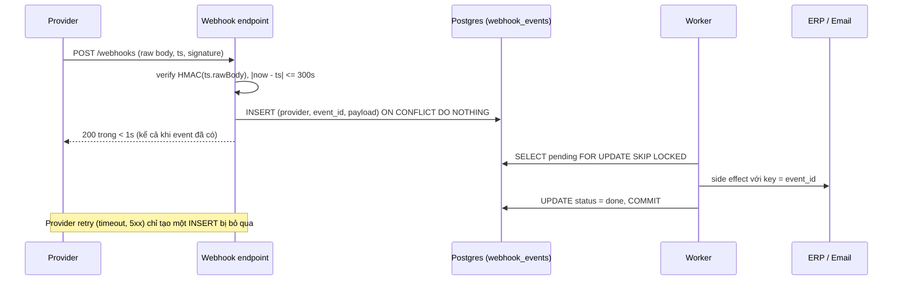
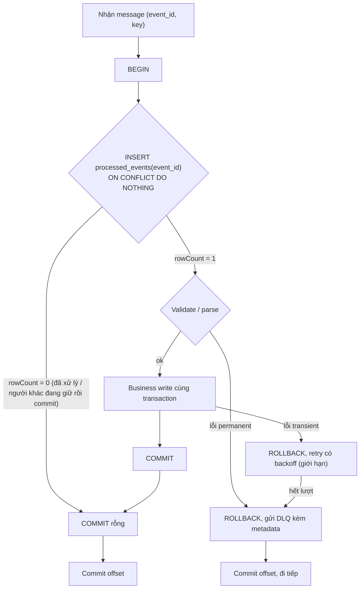
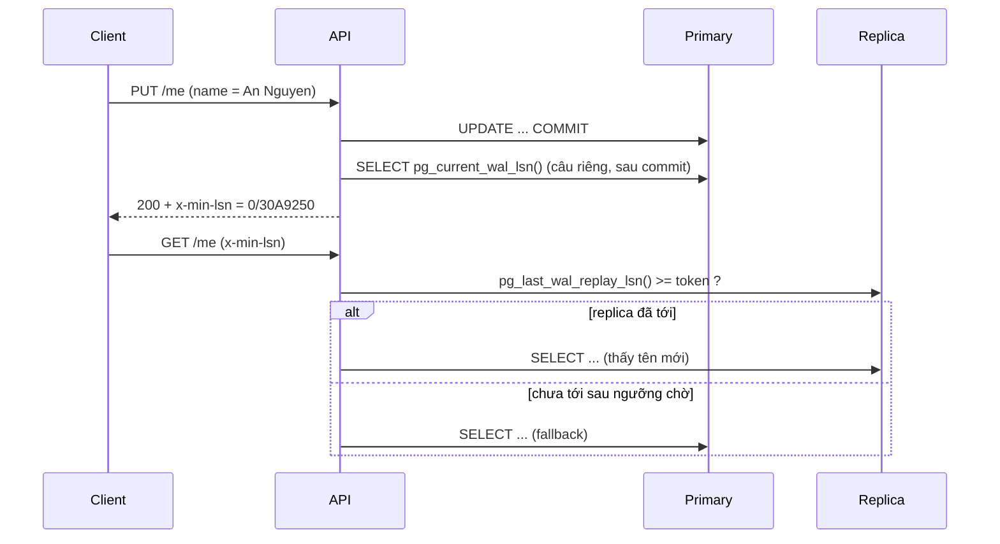

## Bối cảnh & vấn đề

Bốn ticket rơi vào cùng một tuần, của cùng một hệ thống order:

- **Webhook payment xử lý 3–4 lần.** Provider gọi `POST /webhooks/payments`, handler cập nhật order, gửi email, gọi ERP, mất khoảng 15 giây. Provider timeout ở 10 giây và retry. Khách nhận 4 email "Thanh toán thành công", ERP có 4 phiếu thu.
- **Lag tăng mãi ở partition 7.** Các partition khác bình thường. Log lặp lại `SyntaxError: Unexpected token` mỗi vài giây.
- **`OrderShipped` được xử lý trước `OrderPaid`.** Thay đổi duy nhất trong sprint: consumer chuyển sang `Promise.all` cho cả batch "để tăng throughput".
- **"Tôi đổi tên, F5 thì thấy tên cũ."** Write vào primary, read từ replica.

Bốn triệu chứng có cùng gốc: hệ thống phân tán giao message theo **at-least-once** (ít nhất một lần, có thể nhiều lần), không có thứ tự toàn cục, và không có "đọc ngay thấy ngay" giữa các node. Code viết như thể mọi thứ chạy đúng một lần, đúng thứ tự, trên một máy, nên mỗi giả định sai lộ ra thành một bug.

Bài này là playbook chẩn đoán và sửa. Lý thuyết nền được dạy kỹ ở [delivery semantics & idempotency](/tracks/messaging-kafka/learn/delivery-semantics-idempotency), [errors, retries & DLQ](/tracks/messaging-kafka/learn/errors-retries-dlq), [keys, partitioning & ordering](/tracks/messaging-kafka/learn/keys-partitioning-ordering), [webhooks](/tracks/api-design/learn/webhooks-realtime), [consistency models](/tracks/distributed-systems/learn/consistency-models) và [replication](/tracks/sql-postgres/learn/replication-scaling); ở đây ta đo thật từng bug. Môi trường: Node 24.21, PostgreSQL 17.11 (một primary + một streaming replica cấu hình `recovery_min_apply_delay = '2s'` để tái hiện lag ổn định), Express 5.

## Khái niệm

### Ba delivery semantics và vị trí của commit

**Delivery semantics** mô tả số lần một message được *xử lý* khi có crash. Với Kafka consumer, nó được quyết định gần như hoàn toàn bởi **thứ tự giữa "xử lý" và "commit offset"**. Commit offset trước rồi xử lý: crash giữa chừng thì sau restart consumer đọc tiếp từ offset đã commit, message đang xử lý dở bị **mất** — đó là **at-most-once**. Xử lý xong rồi commit: crash giữa "xử lý xong" và "commit" thì message được đọc lại — **at-least-once**, nên handler phải chịu được trùng.

**Exactly-once** của Kafka (idempotent producer + transactions + `isolation.level=read_committed`) chỉ bao phủ đường **Kafka → Kafka**: đọc topic, ghi topic, commit offset trong cùng transaction. Ngay khi side effect đi ra Postgres, email hay HTTP, ta quay về at-least-once + dedup. Chi tiết ở [idempotent producer & transactions](/tracks/messaging-kafka/learn/idempotent-producer-transactions).

Auto-commit làm mờ ranh giới này. KafkaJS với `eachMessage` mặc định commit offset của message *sau khi* handler resolve (theo `autoCommitInterval`/`autoCommitThreshold`), còn Java client với `enable.auto.commit=true` commit theo chu kỳ trong `poll()` (verify theo client và version). Hiểu client của mình commit **cái gì, khi nào** là câu hỏi đầu tiên khi điều tra duplicate hoặc mất message.

**Interview angle:** card 006 hỏi "commit trước rồi xử lý, crash thì sao". Trả lời đủ: mất message, at-most-once; đổi thứ tự thành at-least-once; và chọn theo nghiệp vụ — email marketing có thể chấp nhận at-most-once, payment thì at-least-once + dedup.

### Idempotent consumer

**Idempotent consumer** là consumer mà xử lý cùng một message N lần cho cùng kết quả như một lần. Cách phổ quát: mỗi event mang **event id** ổn định (do producer sinh, giữ nguyên qua retry), consumer ghi id vào bảng `processed_events` có **unique constraint**, và ghi đó nằm **trong cùng transaction** với business write. Nếu commit thì cả hai cùng có; nếu rollback thì cả hai cùng không — không có trạng thái "đã ghi business nhưng chưa đánh dấu".

Điểm mấu chốt là *thứ tự* trong transaction: câu `INSERT ... ON CONFLICT DO NOTHING` phải là **câu đầu tiên**. Unique index biến nó thành điểm tuần tự hoá: transaction thứ hai cùng event id sẽ **chờ** transaction đầu commit hoặc rollback, rồi nhận `rowCount = 0` (đã có) hoặc chèn được (người đầu rollback). Một `SELECT exists` riêng phía trước không có tính chất này — nó là check-then-act với khoảng hở.

### Poison message và DLQ

**Poison message** là message không bao giờ xử lý thành công dù retry bao nhiêu lần: JSON hỏng, schema mới mà consumer chưa hiểu, reference tới entity không tồn tại. Vì Kafka consumer xử lý tuần tự trong một partition, một poison message mà handler cứ throw và retry sẽ **chặn cả partition** (head-of-line blocking): lag partition đó tăng vô hạn, các partition khác chạy bình thường. Đây chính là chữ ký của ticket 2.

**DLQ (dead-letter queue)** là topic/bảng nơi message "không xử lý được" được chuyển tới kèm metadata, để consumer commit offset và đi tiếp mà **không mất dữ liệu**. Phân loại lỗi là bước quyết định: lỗi **permanent** (parse, validation) → DLQ ngay; lỗi **transient** (timeout DB, 503) → retry có giới hạn và backoff, hết lượt mới DLQ.

### Ordering trong Kafka

Kafka chỉ đảm bảo thứ tự **trong một partition**, và message cùng key luôn vào cùng partition (khi số partition không đổi). Nhưng đảm bảo đó dừng ở việc *giao* message theo thứ tự; nếu consumer *xử lý* song song thì thứ tự hoàn thành phụ thuộc vào latency của từng handler. `Promise.all` trên cả batch là cách nhanh nhất để mất ordering.

Retry cũng phá ordering theo hai cách. Phía consumer: retry topic hoặc DLQ đưa message lỗi ra khỏi dòng chính, message sau cùng key được xử lý trước. Phía producer: retry với nhiều request in-flight mà **không** bật idempotence có thể đảo thứ tự batch; idempotent producer (`enable.idempotence=true`, mặc định từ Java client 3.0) giữ thứ tự với `max.in.flight.requests.per.connection ≤ 5` (verify theo client; KafkaJS có ràng buộc riêng).

### Webhook là at-least-once từ bên ngoài

**Webhook** là HTTP callback từ provider. Provider không biết handler của bạn đã làm xong hay chưa; nó chỉ biết có nhận được **2xx trong thời hạn** hay không. Timeout, 5xx, connection reset → retry, thường theo lịch kéo dài nhiều giờ hoặc nhiều ngày. Vì vậy handler chậm hơn timeout của provider là **tự tạo ra duplicate**: mỗi retry chạy lại toàn bộ side effect.

Mô hình đúng là **ack nhanh**: verify chữ ký → ghi raw event với `UNIQUE(provider, event_id)` → trả 2xx trong 1–2 giây → worker xử lý async. Bảng `webhook_events` vừa là chỗ dedup vừa là **outbox/inbox**: worker poll bằng `FOR UPDATE SKIP LOCKED`, nên không có khoảng hở "insert xong nhưng enqueue fail".

### Chữ ký HMAC, timestamp và replay

Provider ký **raw bytes** của body bằng HMAC-SHA256 với secret chung. Server phải tính HMAC trên **đúng những byte đó**, không phải trên `JSON.stringify(req.body)` — parse rồi stringify lại làm đổi khoảng trắng, cách viết số (`100.50` → `100.5`), escape unicode (`é` → `é`). So sánh chữ ký bằng `crypto.timingSafeEqual` để không rò thông tin qua thời gian so sánh, và nhớ hàm này **throw** khi hai buffer khác độ dài.

Chữ ký đúng chưa đủ: attacker có thể **replay** một request hợp lệ cũ. Vì vậy chuỗi ký phải chứa **timestamp** (`${ts}.${body}`) và server từ chối khi lệch quá tolerance (thường 5 phút); trong cửa sổ đó, dedup theo event id chặn nốt.

### Replica lag và read-your-writes

Streaming replication của Postgres mặc định **bất đồng bộ**: primary commit rồi trả lời client, replica nhận và **apply WAL** sau đó vài ms tới vài giây (lâu hơn khi write spike hoặc khi replica đang chạy query dài gây replay conflict). Đọc từ replica ngay sau write có thể thấy dữ liệu cũ. **Read-your-writes** là cam kết của một session: người vừa ghi luôn thấy chính write đó, kể cả khi người khác vẫn đọc dữ liệu hơi cũ.

**LSN (Log Sequence Number)** là vị trí trong WAL. Nếu biết LSN của commit, ta hỏi replica `pg_last_wal_replay_lsn() >= token` để biết replica đã apply tới đó chưa — đó là nền của read-your-writes chính xác mà không phải dồn mọi read về primary.

**Interview angle:** câu hỏi replica lag (card 007) là câu dễ; điểm phân loại senior là biết **nhiều mức** fix: response trả object mới, optimistic update phía client, sticky primary N giây, LSN token, và đo `replay_lag`.

## Cơ chế hoạt động

### Webhook: từ request tới side effect



Endpoint chỉ làm hai việc rẻ và có giới hạn thời gian: verify và ghi. Trả 200 cả khi event đã tồn tại — đó là duplicate hợp lệ, trả 4xx sẽ khiến provider tiếp tục retry. Worker là nơi duy nhất có side effect; nó idempotent theo `event_id` cả ở DB (status) lẫn ở downstream (ERP nhận idempotency key, email có bảng `sent_emails(event_id, template)` unique). Nếu worker chết một giờ, event nằm `pending` trong bảng; khi worker sống lại, nó drain theo thứ tự `received_at` với batch giới hạn — không event nào mất vì endpoint đã ghi bền trước khi ack.

### Consumer: claim trước, làm sau, commit offset cuối



Thứ tự "DB commit rồi mới commit offset" giữ at-least-once: crash giữa hai bước chỉ dẫn tới đọc lại, và lần đọc lại gặp `rowCount = 0`. Nhánh DLQ phải **commit offset sau khi DLQ ghi thành công** — nếu không, poison message hoặc bị mất (commit trước, DLQ fail) hoặc chặn partition.

### Read-your-writes bằng LSN



Token đi theo client (cookie hoặc header), nên chỉ user vừa ghi mới phải chờ hoặc fallback; mọi user khác vẫn đọc replica. Ngưỡng chờ ngắn (100–300 ms) vì chờ lâu hơn là đổi latency lấy tải primary — thường không đáng.

## Ví dụ thực tế

### Webhook 15s, provider timeout 10s: 4 lần side effect

Card 022. Tái hiện ở tỉ lệ 1/100 thời gian: provider timeout 100 ms và retry tối đa 3 lần, handler mất 150 ms. Bản `sync` làm side effect trong request; bản `ack-fast` chỉ `INSERT ... ON CONFLICT` vào `webhook_events` rồi trả 200, worker poll `SKIP LOCKED` xử lý sau.

```ts
// ack-fast endpoint (rút gọn từ script đã chạy)
await pool.query(
  `INSERT INTO webhook_events (provider, event_id, payload) VALUES ('psp', $1, $2)
   ON CONFLICT DO NOTHING`, [evt.id, rawBody]);
res.end('ok');
// worker
const { rows } = await c.query(
  `SELECT event_id FROM webhook_events WHERE status = 'pending'
   ORDER BY received_at LIMIT 10 FOR UPDATE SKIP LOCKED`);
```

```text
[sync] provider attempts=4 side effects=email:4 erp_call:4 order_update:4
[ack-fast] provider attempts=1 side effects=email:1 erp_call:1 order_update:1
```

Bản sync không "chậm" theo nghĩa nghiệp vụ — nó *đúng* nhưng mỗi retry của provider chạy lại toàn bộ. Lưu ý handler sync không biết request đã bị provider bỏ: Node vẫn chạy tiếp sau khi socket bị đóng, nên cả 4 lần đều hoàn tất side effect.

### `exists()` ngoài transaction vs `ON CONFLICT` là câu đầu

Card 042. Hai handler cùng nhận `evt-42` (consumer cũ chưa biết mình mất partition trong rebalance, và consumer mới), cộng 100 vào ví. Có độ trễ 30 ms giữa check và write để mô phỏng xử lý.

```ts
// bản trong note
const { rowCount } = await pool.query('SELECT 1 FROM processed_events WHERE event_id=$1', [eventId]);
if (rowCount) return 'skip';
await tx(async (c) => {
  await c.query('UPDATE wallets SET balance = balance + $1 WHERE id = 1', [amount]);
  await c.query('INSERT INTO processed_events (event_id) VALUES ($1)', [eventId]);
});
// bản đúng
return tx(async (c) => {
  const ins = await c.query(
    'INSERT INTO processed_events (event_id) VALUES ($1) ON CONFLICT DO NOTHING', [eventId]);
  if (ins.rowCount === 0) return 'skip';
  await c.query('UPDATE wallets SET balance = balance + $1 WHERE id = 1', [amount]);
  return 'applied';
});
```

```text
[notes, no unique] results=["applied","applied"] balance=200 processed_rows=2
[notes, PK] results=["applied","error 23505 duplicate key value violates unique constraint \"processed_events_pkey\""] balance=100 processed_rows=1
[ON CONFLICT first] results=["applied","skip"] balance=100 processed_rows=1
```

Ba dòng là ba mức độ. Không có unique constraint: cả hai đều thấy `seen=false`, cả hai commit, **ví bị cộng hai lần**. Có primary key nhưng giữ `exists()`: kết quả tiền đúng nhờ constraint, nhưng handler thứ hai **throw 23505**, consumer coi là lỗi, retry, log ồn, alert giả — và nếu side effect ngoài DB (gọi HTTP) đặt trước `INSERT` cuối thì nó đã chạy hai lần. Bản đúng: người thứ hai chờ ở unique index, thấy conflict, trả `skip` sạch sẽ.

Follow-up của card 042 — business write vào Postgres nhưng side effect là publish sang topic khác: đừng publish trong handler; ghi message vào bảng **outbox** cùng transaction, relay (polling hoặc CDC) publish sau, và downstream dedup theo event id. Xem [outbox, CDC & sagas](/tracks/messaging-kafka/learn/outbox-cdc-sagas).

### `Promise.all` đảo thứ tự trong một key

Card 024. Một batch từ cùng partition, đúng thứ tự offset: `order-1:OrderPaid`, `order-2:OrderPaid`, `order-1:OrderShipped`, `order-2:OrderShipped`. `OrderPaid` gọi payment API nên mất 50 ms, `OrderShipped` 5 ms.

```ts
// song song giữa các key, tuần tự trong một key
const byKey = new Map<string, Event[]>();
for (const e of batch) byKey.set(e.key, [...(byKey.get(e.key) ?? []), e]);
await Promise.all([...byKey.values()].map(async (events) => {
  for (const e of events) await apply(e);
}));
```

```text
[Promise.all] order applied: order-1:OrderShipped -> order-2:OrderShipped -> order-1:OrderPaid -> order-2:OrderPaid
[Promise.all] final: {"order-1":{"version":2,"status":"Paid"},"order-2":{"version":2,"status":"Paid"}}
[per-key] order applied: order-1:OrderPaid -> order-2:OrderPaid -> order-1:OrderShipped -> order-2:OrderShipped (59 ms)
[per-key] final: {"order-1":{"version":3,"status":"Shipped"},"order-2":{"version":3,"status":"Shipped"}}
[sequential] 112 ms
[guard] log: order-1:OrderShipped(v3) REJECT, current v1 | order-2:OrderShipped(v3) REJECT, current v1 | order-1:OrderPaid | order-2:OrderPaid
[guard] rejected offsets: [ 12, 13 ]
```

`Promise.all` cho state cuối **sai**: order đã ship nhưng hiển thị "Paid", vì event chậm ghi đè event nhanh. Group theo key giữ đúng thứ tự mà vẫn nhanh gần gấp đôi tuần tự (59 ms vs 112 ms) — throughput đến từ song song **giữa** key. Dòng `[guard]` là lớp phòng thủ thứ hai: consumer kiểm `version` (state machine) và từ chối event không liền kề; event bị từ chối phải được retry sau (hoặc park cả key), không được bỏ qua. Đây là câu trả lời cho follow-up "chịu được out-of-order thay vì ngăn chặn".

Trong KafkaJS, cách tự nhiên là `eachBatch` + group theo key như trên, hoặc `partitionsConsumedConcurrently` (song song giữa partition, tuần tự trong partition). Commit offset của batch chỉ sau khi **mọi** group xong; nếu commit từng message khi group của nó xong thì có thể commit vượt qua message của group khác chưa xong.

### Bug `JSON.stringify` khi verify HMAC

Card 041. Cùng một provider ký 4 body khác nhau về hình thức; route `naive` dùng `express.json()` + `JSON.stringify(req.body)`, route `good` dùng `express.raw()` + timestamp + `timingSafeEqual`.

```ts
app.post('/good', express.raw({ type: 'application/json' }), (req, res) => {
  const ts = Number(req.header('x-timestamp'));
  if (!Number.isFinite(ts) || Math.abs(Date.now() / 1000 - ts) > 300) return res.status(401).send('stale');
  const expected = sign(`${ts}.${req.body.toString('utf8')}`);
  if (!safeEqualHex(req.header('x-signature'), expected)) return res.status(401).send('bad sig');
  res.send('ok');   // sau đó: INSERT webhook_events ON CONFLICT, worker xử lý
});
function safeEqualHex(a: string | undefined, b: string) {
  const x = Buffer.from(a ?? '', 'hex'), y = Buffer.from(b, 'hex');
  return x.length === y.length && crypto.timingSafeEqual(x, y);
}
```

```text
compact  naive=200 good=200
spaced   naive=401 good=200
decimal  naive=401 good=200
unicode  naive=401 good=200
replay 10 min old: 401 stale
timingSafeEqual different length: ERR_CRYPTO_TIMING_SAFE_EQUAL_LENGTH
```

Bản naive chỉ đúng khi provider tình cờ gửi JSON compact — đó là lý do lỗi "ngẫu nhiên" trên production. Danh sách đầy đủ của card 041: HMAC trên body đã parse, `!==` không constant-time, không timestamp nên replay được, không dedup event id, xử lý đồng bộ 5–15s nên provider retry, và tin tuyệt đối payload (với event quan trọng, worker nên **re-fetch** trạng thái từ API của provider). Xoay secret (follow-up): trong giai đoạn chuyển, server chấp nhận chữ ký của **cả hai** secret, provider bắt đầu ký bằng secret mới, sau cửa sổ retry tối đa thì bỏ secret cũ.

### Poison message ở partition 7

Card 023 (minh hoạ, cơ chế thật đã đo ở [errors, retries & DLQ](/tracks/messaging-kafka/learn/errors-retries-dlq)). Consumer bọc handler bằng phân loại lỗi:

```ts
async function handleWithDlq(msg: KafkaMessage, partition: number) {
  try {
    const evt = parseAndValidate(msg.value);          // throw PermanentError khi JSON/schema sai
    await processWithRetry(evt, { attempts: 3 });     // chỉ retry lỗi transient
  } catch (e) {
    await producer.send({ topic: 'orders.dlq', messages: [{
      key: msg.key, value: msg.value,                 // giữ nguyên bytes gốc để replay
      headers: { ...msg.headers, 'x-orig-topic': 'orders', 'x-orig-partition': String(partition),
        'x-orig-offset': msg.offset, 'x-error': String(e).slice(0, 500),
        'x-attempts': '3', 'x-failed-at': new Date().toISOString() } }] });
  }
  // chỉ tới đây mới commit offset
}
```

Metadata trong DLQ (follow-up): topic/partition/offset gốc để truy vết, bytes gốc **không bị parse lại** để replay chính xác, lỗi + stack + số lần thử, header gốc (trace id, schema version), thời điểm. DLQ cần alert khi `size > 0` và công cụ replay có kiểm soát (theo key, theo khoảng offset). Nếu nghiệp vụ cần ordering theo key, gửi một event của `order-1` sang DLQ rồi xử lý event sau của `order-1` sẽ áp state sai — khi đó **park cả key** (mọi event sau của key đó cũng vào hàng chờ cho tới khi event lỗi được xử lý).

### Replica lag và LSN token, kèm một bẫy đã đo

Card 007 và 045. Replica được cấu hình apply trễ 2 giây. Ghi tên mới vào primary rồi đọc replica ngay; sau đó thử read-your-writes với LSN lấy ở hai thời điểm khác nhau.

```ts
// SAI: LSN lấy TRONG transaction của write (trước commit record)
const bad = await primary.query(`WITH u AS (UPDATE users SET display_name='An Nguyen' WHERE id=1 RETURNING 1)
  SELECT pg_current_wal_lsn()::text AS lsn FROM u`);
// ĐÚNG: LSN lấy SAU khi commit (câu riêng, autocommit)
const good = await primary.query(`SELECT pg_current_wal_lsn()::text AS lsn`);
// đọc: chờ replica tới token tối đa maxWaitMs, không thì đọc primary
const ok = await replica.query(`SELECT pg_last_wal_replay_lsn() >= $1::pg_lsn AS ok`, [token]);
```

```text
write committed. lsn inside tx = 0/30A91D8, lsn after commit = 0/30A9250
naive read on replica (+22 ms): An
token=lsn inside tx, wait<=3000ms: {"src":"replica","waited":10,"display_name":"An"}
wait<=200ms: {"src":"primary(fallback)","waited":213,"display_name":"An Nguyen"}
wait<=3000ms: {"src":"replica","waited":1790,"display_name":"An Nguyen"}
pg_stat_replication: {"application_name":"walreceiver","replay_lag":"00:00:02.002115"}
```

Dòng thứ ba là bẫy: LSN lấy **trong** transaction nằm *trước* commit record, nên replica báo "đã tới" mà vẫn trả tên cũ. Token phải lấy **sau khi COMMIT**. Ngưỡng chờ 200 ms quá ngắn so với lag 2s nên fallback primary (đúng dữ liệu); ngưỡng 3s thì replica bắt kịp sau ~1.8s. Trên production, poll LSN của từng replica một lần mỗi ~100 ms và cache, thay vì hỏi replica ở mỗi request.

### Projection CQRS: order mới thiếu 2–3 giây

Card 028. "My orders" đọc từ projection cập nhật qua Kafka. Đây là eventual consistency có chủ đích, nhưng là bug UX. Theo thứ tự rẻ dần:

1. Response của `POST /orders` trả order vừa tạo; client **optimistic insert** vào list (TanStack Query `setQueryData`) và giữ nó ở trạng thái "đang xử lý" cho tới khi list server có nó.
2. Server: request đọc kèm `minVersion` hoặc `lastWriteAt` của user; projection chưa tới thì merge thêm từ write model cho đúng user đó, hoặc chờ ngắn (≤ 500 ms).
3. Đa thiết bị (follow-up): token không nằm trong cookie của thiết bị khác, nên lưu "write gần nhất" **phía server theo user** (Redis `last_write:{userId}` với LSN/version, TTL vài phút) và mọi thiết bị dùng nó.

Nếu lag projection tăng tới phút thì đó là incident thật (consumer chậm hoặc chết): alert theo consumer lag, đừng che bằng UI.

## Trade-offs & lựa chọn thay thế

| Vấn đề | Lựa chọn | Ưu | Nhược | Khi nào |
|---|---|---|---|---|
| Dedup consumer | `processed_events` + `ON CONFLICT` cùng tx | Đúng tuyệt đối trong cùng DB | Một bảng phải dọn theo TTL | Mặc định khi side effect là DB |
| | Thao tác tự nhiên idempotent (`SET status`, upsert theo version) | Không cần bảng | Không áp dụng cho `balance + x` | State machine, projection |
| | Redis `SET NX` | Nhanh | Không atomic với DB, mất khi failover | Best-effort (email, notification) |
| Webhook | Xử lý đồng bộ | Đơn giản | Duplicate khi chậm, provider tắt endpoint | Gần như không bao giờ |
| | Ack nhanh + bảng inbox + worker | Bền, dedup, drain được backlog | Thêm worker, độ trễ vài giây | Mặc định |
| Ordering | Tuần tự toàn partition | Đơn giản nhất | Throughput thấp | Volume nhỏ |
| | Song song giữa key, tuần tự trong key | Throughput cao, giữ ordering | Code phức tạp hơn, commit offset cẩn thận | Mặc định khi cần tốc độ |
| | Version guard / state machine | Chịu được out-of-order từ mọi nguồn | Phải có chỗ chứa event bị từ chối | Luôn nên có làm lớp hai |
| Read-your-writes | Trả object trong response / optimistic UI | Rẻ nhất | Chỉ cho màn hình ngay sau write | Luôn làm |
| | Sticky primary N giây | Dễ | N phải > p99 lag, tăng tải primary | Write ít |
| | LSN token | Chính xác, tải primary thấp | Code routing, poll LSN | Write nhiều, lag biến động |
| | Synchronous replication (`remote_apply`) | Mọi read replica đều mới | Mỗi commit chờ replica, replica chết thì write treo | Hiếm, dữ liệu cực nhạy |

**Chọn thế nào.** Dedup bằng unique constraint trong transaction là câu trả lời mặc định cho mọi consumer có business write vào DB; Redis chỉ cho side effect mà trùng thỉnh thoảng chấp nhận được. Với ordering, đừng chọn giữa "nhanh" và "đúng": song song giữa key cho tốc độ, version guard cho an toàn. Với read-your-writes, luôn làm lớp UI trước vì nó miễn phí, rồi mới tới sticky primary hoặc LSN khi màn hình khác (danh sách, trang chi tiết mở từ link) cũng phải thấy write.

## Edge cases & failure modes

- **Rebalance giữa chừng**: consumer cũ vẫn đang xử lý message của partition đã bị thu hồi, consumer mới nhận lại cùng message. Hai bên chạy đồng thời — đúng kịch bản đã đo; chỉ unique constraint cứu được. Xem [rebalance & liveness](/tracks/messaging-kafka/learn/rebalance-liveness).
- **Người đầu rollback**: ở bản `ON CONFLICT first`, nếu transaction đầu rollback (business lỗi), transaction thứ hai đang chờ sẽ chèn được và xử lý — đây là hành vi đúng, không phải bug.
- **Side effect ngoài DB**: dedup bằng `processed_events` không bao phủ HTTP call; ERP phải nhận idempotency key (`event_id`), email phải có bảng dedup riêng, hoặc đi qua outbox.
- **Dọn `processed_events` quá sớm**: TTL phải dài hơn khoảng thời gian một message có thể được giao lại (retention của topic, thời gian replay DLQ, lịch retry của provider webhook — có provider retry tới 3 ngày, verify).
- **Webhook backlog sau outage**: provider dồn hàng nghìn retry cùng lúc khi endpoint sống lại. Endpoint ack-fast chịu được vì chỉ INSERT; worker drain theo batch giới hạn để không đè DB.
- **Event id không ổn định**: producer sinh id mới mỗi lần retry publish → dedup vô dụng. Id phải sinh một lần cùng với dữ liệu (ví dụ trong outbox row).
- **Replica bị kẹt** (replay conflict, disk đầy): lag tăng không giới hạn, LSN-wait mọi request đều fallback primary → primary quá tải. Cần circuit: lag > ngưỡng thì loại replica khỏi pool và alert.
- **Commit offset vượt**: xử lý song song rồi commit offset cao nhất đã xong, trong khi một offset thấp hơn chưa xong; crash → offset thấp bị **mất**. Chỉ commit tới offset liền mạch cao nhất đã xong.

## Pitfalls

- ❌ Commit offset ngay khi nhận message → ✅ xử lý xong (DB commit) rồi mới commit offset; chấp nhận at-least-once và dedup.
- ❌ `exists()` rồi mới làm → ✅ `INSERT ... ON CONFLICT DO NOTHING` là câu đầu trong transaction, unique constraint quyết định (đo: không constraint = ví cộng 2 lần).
- ❌ Webhook làm hết việc trong request → ✅ verify, INSERT inbox, 200 trong < 1–2s, worker làm phần còn lại.
- ❌ Trả 409/4xx cho webhook trùng → ✅ trả 200; trùng là bình thường, 4xx khiến provider retry tiếp hoặc tắt endpoint.
- ❌ HMAC trên `JSON.stringify(req.body)` → ✅ HMAC trên raw bytes (`express.raw`), timestamp trong chuỗi ký, `timingSafeEqual` có check độ dài.
- ❌ Retry poison message vô hạn → ✅ phân loại permanent/transient, DLQ kèm metadata, alert, replay tool.
- ❌ `Promise.all` cả batch → ✅ song song giữa key, tuần tự trong key, version guard làm lớp hai.
- ❌ Lấy `pg_current_wal_lsn()` trong transaction của write → ✅ lấy sau COMMIT (đo: token sớm làm replica "đã tới" mà vẫn trả dữ liệu cũ).
- ❌ Dồn toàn bộ read về primary để "hết bug" → ✅ chỉ user vừa ghi, chỉ trong cửa sổ ngắn, hoặc theo LSN.

## Tóm tắt

- Mạng giao **at-least-once**; vị trí của commit offset quyết định mất hay trùng. Exactly-once của Kafka dừng ở biên Kafka.
- Idempotent consumer = event id ổn định + `INSERT ... ON CONFLICT` **câu đầu**, cùng transaction với business write, rồi mới commit offset.
- Webhook: verify chữ ký trên **raw body** + timestamp, INSERT inbox unique, **ack trong 1–2s**, worker idempotent làm side effect.
- Poison message chặn cả partition; phân loại lỗi, DLQ kèm metadata đủ để replay, park cả key khi cần ordering.
- Ordering chỉ có trong partition và chỉ khi xử lý tuần tự theo key; retry topic và producer không idempotent cũng phá nó. Version guard là lớp hai.
- Replica async → đọc dữ liệu cũ. Read-your-writes theo bậc: response/optimistic UI → sticky primary → LSN token (lấy **sau COMMIT**) → đo `replay_lag`.
- Projection CQRS chậm là UX bug khi lag nhỏ, là incident khi lag lớn; alert theo consumer lag.
