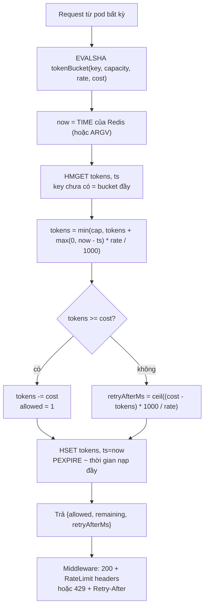
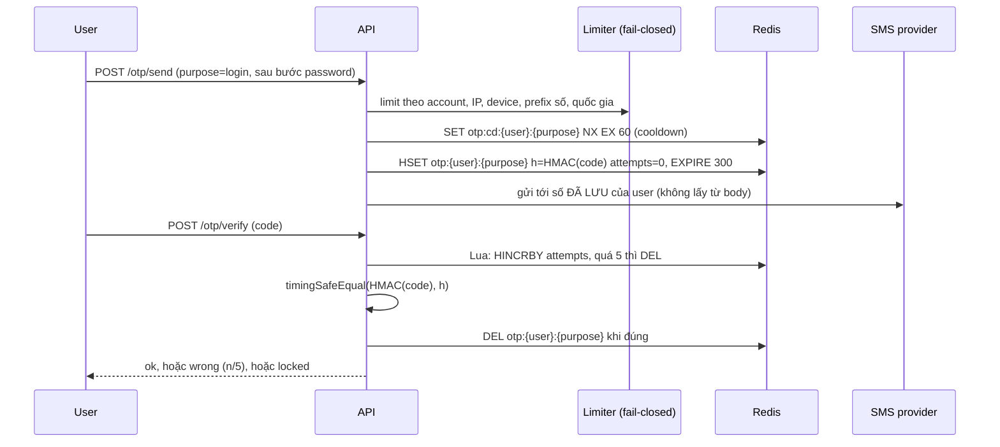

## Bối cảnh & vấn đề

Ba sự cố cùng chạm vào một lớp hạ tầng tưởng như đơn giản — rate limiter:

- Một partner tích hợp nhận `429` nhưng vẫn bắn đều 50 rps, vì response chỉ có status code, không có `Retry-After`, và SDK của họ retry ngay lập tức.
- Limiter "10 token, 1 token/giây" tự viết trên Redis cho **một số user đi qua không giới hạn**, trong khi một số user khác (gọi đều mỗi giây) **bị chặn gần như mãi**. Thêm pod thì lỗi càng rõ.
- Một sáng thứ Hai, hoá đơn SMS tăng **40 lần** sau một đêm. Endpoint gửi OTP bị gọi hàng chục nghìn lần tới dải số premium ở vài quốc gia mà hệ thống không phục vụ, không một mã nào được verify.

Rate limit không phải "đếm request". Nó là quyết định **ai** bị giới hạn (key), **theo hình dạng nào** (burst hay đều), **ở đâu** (gateway, app, outbound client), **atomic** ra sao khi 40 pod cùng đếm, **báo cho client** thế nào, và **khi chính limiter chết thì làm gì**. Với OTP, rate limit còn là kiểm soát an ninh và kiểm soát chi phí.

Lý thuyết thuật toán đã có ở [Rate limiting (API design)](/tracks/api-design/learn/rate-limiting) và [rate limiter phân tán trong circuit breaker/bulkhead](/tracks/distributed-systems/learn/circuit-breaker-bulkhead-shedding); login abuse ở [Passwords & login abuse](/tracks/web-security/learn/passwords-login-abuse); MFA ở [MFA, passkeys & account linking](/tracks/auth-identity/learn/mfa-passkeys-account-linking). Bài này đi theo từng scenario và đo thật trên Redis 7.4.11 với ioredis, Node 24.21.

## Khái niệm

### Key và chiều giới hạn

**Rate limit key** trả lời câu "đếm cho ai": API key, tenant, user, IP, số điện thoại, device, hay tổ hợp. Một chiều duy nhất luôn bị lách: chỉ theo IP thì botnet xoay IP; chỉ theo account thì attacker thử một password trên hàng nghìn account (password spraying). Endpoint nhạy cảm cần **nhiều chiều đồng thời**, mỗi chiều một ngưỡng: login có giới hạn theo account *và* theo IP *và* toàn cục.

### Fixed window

**Fixed window** đếm số request trong khung thời gian cố định theo đồng hồ (`rl:{key}:{floor(now/60s)}`), `INCR` rồi so với limit. Rẻ nhất: một counter, một lệnh. Nhược điểm là **ranh giới**: counter reset ở mốc phút chứ không theo "60 giây gần nhất", nên client gửi 100 request ở giây 00:59 và 100 request ở 01:00 đi qua cả 200 trong khoảng 2 giây — gấp đôi limit. Với quota lớn, không nhạy burst (10k/ngày) thì fixed window vẫn ổn.

### Sliding window log và sliding window counter

**Sliding window log** lưu timestamp từng request (Redis sorted set), đếm số phần tử trong 60 giây gần nhất. Chính xác tuyệt đối, nhưng memory O(n) mỗi key — ổn cho limit nhỏ như login (5 lần/15 phút), tốn kém cho 10k/phút.

**Sliding window counter** ước lượng từ hai counter: `estimate = prev × (1 − elapsed/window) + curr`. Nó giả định request của window trước **phân bố đều**, nên khi request dồn vào cuối window trước, ước lượng thấp hơn thực tế và cho qua nhiều hơn limit thật. Ví dụ của card 017: prev = 80, curr = 30, đã 15 giây vào phút hiện tại → `80 × 0.75 + 30 = 90 < 100` → cho phép. Memory O(1), sai số nhỏ trên traffic thật (Cloudflare báo cáo sai số rất thấp, verify), nên là mặc định rẻ cho quota lớn.

### Token bucket và leaky bucket

**Token bucket** có dung lượng `B` và nạp `r` token/giây; mỗi request lấy một token (hoặc `cost` token), hết token thì bị từ chối. Nó cho phép **burst** tới `B` rồi giữ trung bình `r`. "100 request/phút, burst 20" = `B = 20`, `r = 100/60`. Trạng thái chỉ là hai số (`tokens`, `ts`), refill tính lười khi có request: `tokens = min(B, tokens + elapsed × r)`.

**Leaky bucket** (dạng queue) cho request vào hàng chờ và **xả ra với tốc độ đều**. Nó hợp cho phía **outbound**: partner cho phép đúng 10 rps, ta không muốn bị 429 nên tự xếp hàng và gửi đều 10 rps, hàng chờ có giới hạn để không phình memory.

**Interview angle:** card 015 bắt chọn ba thuật toán cho ba bài toán. Điểm cộng là nói luôn *nơi đặt*: token bucket ở gateway/app theo API key, sliding window log theo account (chỉ đếm **failed** attempts, reset khi thành công) trong app, leaky bucket trong outbound client.

### Atomicity khi nhiều pod cùng đếm

40 pod chia một Redis. Nếu logic là "đọc tokens → tính trong Node → ghi lại" qua hai round-trip, mọi pod đọc cùng `tokens = 1` và cùng cho qua — đúng mẫu read-modify-write race của [bài oversell](/tracks/scenario-reliability/learn/oversell-hot-row). Fix là đẩy toàn bộ logic vào **một Lua script**: Redis chạy script đơn luồng, không lệnh nào chen giữa. Script chỉ đụng một key nên trên Redis Cluster luôn nằm cùng slot.

### Báo cho client: 429, Retry-After, RateLimit

**429 Too Many Requests** (RFC 6585) kèm **`Retry-After`** (giây hoặc HTTP-date, RFC 9110) là tín hiệu mà client và SDK tử tế hiểu. Header quota cho phép client tự điều tiết *trước* khi bị chặn: kiểu cũ `X-RateLimit-Limit/Remaining/Reset`, hoặc draft IETF `RateLimit-Policy` + `RateLimit` (tên và cú pháp trường thay đổi giữa các bản draft, verify). Body JSON nên có `code`, limit nào bị vượt (per key/tenant/IP) để debug. Request bị 429 có nên tính vào quota không (follow-up)? Thường **không** với token bucket (không tốn token), nhưng với endpoint bị lạm dụng như login thì việc tiếp tục bắn khi đã bị chặn nên *kéo dài* lockout.

### Fail-open và fail-closed

Khi limiter (Redis) chết, middleware phải chọn: **fail-open** (cho qua, coi như không có limit) hay **fail-closed** (từ chối, trả 503). Không có câu trả lời chung; quyết định **theo endpoint** bằng cách so chi phí bị lạm dụng với chi phí mất availability. Login, gửi OTP, reset password, endpoint tốn tiền (SMS, LLM, payment) → fail-closed. API đọc thông thường → fail-open kèm **local in-memory limiter** ước lượng `limit / số pod`, để vẫn có trần.

### OTP an toàn

**OTP** (one-time password) 6 số chỉ có 1.000.000 khả năng. An toàn của nó **không** đến từ độ dài mà từ: sinh bằng **CSPRNG** (`crypto.randomInt`), **TTL ngắn** (~5 phút), **single-use**, bind với `user_id + purpose` (mã login không dùng được cho đổi số điện thoại), **giới hạn số lần thử** trên mỗi OTP (5 lần → vô hiệu), **cooldown khi gửi lại**, so sánh constant-time, và lưu **HMAC** thay vì plaintext. Với 5 lần thử, xác suất đoán trúng một OTP là 5/1e6 = 5e-6.

Vì sao hash một mã 6 số nếu brute-force offline mất vài mili-giây (follow-up 047)? Vì dùng **HMAC với secret của server** chứ không phải SHA-256 trần: kẻ đọc được Redis (dump, replica, log) không có secret thì không thể thử offline; còn mã sống chỉ 5 phút. Nó là defense-in-depth rẻ, không phải lớp bảo vệ chính.

### SMS pumping

**SMS pumping / toll fraud (IRSF)** là khi bot gọi endpoint gửi OTP tới dải số premium; kẻ gian chia doanh thu cước với nhà mạng. Chữ ký: số request tăng vọt, tập trung vào vài country code hoặc prefix, số liên tiếp, **conversion (verify/sent) gần 0**. Endpoint gửi OTP là **endpoint tốn tiền**, phải được bảo vệ như payment.

## Cơ chế hoạt động

### Token bucket trong một Lua script



Mọi bước từ đọc tới ghi nằm trong một script, nên 40 pod không thể cùng thấy `tokens = 1`. Refill **fractional** (không `floor`) để không vứt phần lẻ thời gian. `max(0, now - ts)` chống clock chạy lùi. `PEXPIRE` để key của user không còn hoạt động tự biến mất — hết TTL cũng chính là "bucket đã đầy lại", nên không mất tính đúng. Script trả ba số để middleware set header đúng mà không cần round-trip thứ hai.

**Đồng hồ của ai** (follow-up 029)? Dùng `redis.call('TIME')` thì mọi pod chung một nguồn thời gian; clock skew giữa pod không làm sai bucket. Redis 5+ replicate script bằng *effects* (ghi kết quả chứ không chạy lại script), nên ghi sau `TIME` được phép (Redis 7 chỉ còn effects replication, verify). Truyền `now` từ app cũng được nếu NTP ổn, và tiện cho test.

### OTP: gửi và verify



Tăng `attempts` **trước** khi so sánh và trong cùng script với kiểm tra tồn tại, để 50 request verify song song không cùng "lách" qua lần thử thứ 5. Số điện thoại lấy từ profile đã xác minh, không từ request — nếu không, endpoint trở thành dịch vụ gửi SMS miễn phí tới số bất kỳ.

## Ví dụ thực tế

### Fixed window và sliding counter ở ranh giới

Card 016 và 017. Limit 100/phút; 100 request ở 00:59.000–00:59.990 và 100 request ở 01:00.000–01:00.990, chạy trên Redis với đồng hồ giả lập. Sliding counter dùng Lua đọc hai counter + `INCR` atomic.

```ts
redis.defineCommand('swc', { numberOfKeys: 2, lua: `
  local prev = tonumber(redis.call('GET', KEYS[1]) or '0')
  local curr = tonumber(redis.call('GET', KEYS[2]) or '0')
  local est = prev * (1 - tonumber(ARGV[1])) + curr
  if est >= tonumber(ARGV[2]) then return {0, tostring(est)} end
  redis.call('INCR', KEYS[2]); redis.call('PEXPIRE', KEYS[2], ARGV[3])
  return {1, tostring(est)}` });
```

```text
200 requests trong 2s quanh ranh giới phút: fixed window cho qua 200, sliding window counter cho qua 102
card 017: estimate=90 allowed=true
100 req ở 00:59.9 + 200 req ở 01:30: sliding counter cho qua 151 (cửa sổ 60s thật 00:30-01:30 chứa tối đa 100 hợp lệ)
```

Dòng cuối trả lời follow-up của card 017: dồn 100 request vào giây cuối phút trước, đợi tới giữa phút sau — ước lượng coi phút trước "đều" nên chỉ tính 50, và cho thêm 50. Trong cửa sổ 60 giây thật kết thúc ở 01:30 có **150** request. Sai số này chấp nhận được cho quota API, không chấp nhận được cho login (dùng log).

### Mọi bug của token bucket trong card 029

Chạy nguyên đoạn code của card trên Redis 7.4 + ioredis, đồng hồ giả lập:

```ts
async function allow(userId: string): Promise<boolean> {
  const now = Date.now();
  const key = `rl:${userId}`;
  const { tokens, ts } = await redis.hgetall(key);
  const refill = Math.floor((now - ts) / 1000);
  const current = Math.min(10, (tokens ?? 10) + refill);
  if (current < 1) return false;
  await redis.hset(key, { tokens: current - 1, ts: now });
  return true;
}
```

```text
first call on empty key, hgetall = {}
[buggy] new user, 50 requests same ms: allowed=50, stored= {"tokens":"NaN","ts":"1760000000000"}
[buggy] existing user tokens=5, 50 requests: allowed=50, "5"+0 = "50"
[typed, floor] 1 request / 900ms trong 90s, bucket rỗng: allowed=50 (rate đúng: ~90)
[touch ts on every call] 1 req / 900ms trong 90s: allowed=0
[typed] 40 concurrent with tokens=1: allowed=40
TTL of rl:new = -1
```

Đọc từng dòng:

1. **`hgetall` trả `{}` và string.** Key chưa có: `ts` undefined → `now - undefined = NaN` → `current = NaN` → `NaN < 1` là false → cho qua, và **ghi `"NaN"`** vào Redis. Từ đó `"NaN" + 0 = "NaN0"` → `Math.min` trả NaN → cho qua mãi. Mọi user mới đều **không giới hạn**.
2. **Nối chuỗi.** User có `tokens = "5"`: `"5" + 0 = "50"` → `Math.min(10, "50") = 10` → bucket luôn đầy. `??` không giúp vì `""`/`"0"` không phải nullish.
3. **`Math.floor` vứt phần lẻ.** Kể cả sau khi ép kiểu đúng, user gọi đều mỗi 900 ms chỉ được 50/100 request thay vì ~90: mỗi lần cho qua ghi `ts = now` làm mất 0,9 giây đã tích luỹ. Biến thể phổ biến "cập nhật ts ở mọi request kể cả bị chặn" thì user **bị chặn mãi** (0/100) — đó là nhóm "bị chặn vĩnh viễn" của ticket.
4. **Race.** Read rồi write qua hai round-trip: 40 request đồng thời với `tokens = 1` → 40 qua.
5. **Không TTL.** Mỗi user từng gọi để lại một key vĩnh viễn.

Red flag của card là chỉ thấy bug atomicity. Bug kiểu dữ liệu và bug refill nguy hiểm hơn vì chúng sai **ngay cả với một pod**.

### Token bucket Lua đúng (card 030)

```lua
-- KEYS[1] = bucket key; ARGV: capacity, refill_per_sec, cost, now_ms (rỗng = TIME của Redis)
local capacity = tonumber(ARGV[1])
local rate     = tonumber(ARGV[2])
local cost     = tonumber(ARGV[3])
local now      = tonumber(ARGV[4])
if not now then
  local t = redis.call('TIME')
  now = tonumber(t[1]) * 1000 + math.floor(tonumber(t[2]) / 1000)
end
local h = redis.call('HMGET', KEYS[1], 'tokens', 'ts')
local tokens = tonumber(h[1]) or capacity
local ts     = tonumber(h[2]) or now
tokens = math.min(capacity, tokens + math.max(0, now - ts) * rate / 1000)
local allowed, retry_after = 0, 0
if tokens >= cost then tokens = tokens - cost; allowed = 1
else retry_after = math.ceil((cost - tokens) * 1000 / rate) end
redis.call('HSET', KEYS[1], 'tokens', tostring(tokens), 'ts', now)
redis.call('PEXPIRE', KEYS[1], math.ceil(capacity * 1000 / rate) + 1000)
return { allowed, math.floor(tokens), retry_after }
```

```ts
redis.defineCommand('tokenBucket', { numberOfKeys: 1, lua: fs.readFileSync('tokenBucket.lua', 'utf8') });
const [allowed, remaining, retryAfterMs] = await redis.tokenBucket(`rl:api:${apiKey}`, 20, 100 / 60, 1, '');
res.setHeader('RateLimit', `limit=20, remaining=${remaining}`);   // cú pháp theo draft đang dùng (verify)
if (!allowed) return res.status(429).set('Retry-After', String(Math.ceil(retryAfterMs / 1000)))
  .json({ code: 'rate_limited', limit: '100/min burst 20', scope: 'api_key' });
```

```text
40 concurrent, capacity 10: allowed=10, last reply=[0,0,997]
1 req / 900ms trong 90s, bucket rỗng: allowed=90
burst: 25 requests at once -> allowed=20; next reply=[0,0,600] (Retry-After ~ 1 s)
then 10 rps for 60s -> allowed=100 (~100 refill)
PTTL rl:api = 13000 type of tokens field: "1.0067502387301e-12"
avg EVALSHA round-trip (localhost Docker): 0.630 ms
```

Đúng cả bốn tính chất: atomic (10/40), refill fractional (90/100), burst 20 rồi trung bình 100/phút, có TTL. Trường `tokens` là float có sai số `1e-12` — vô hại vì so sánh `>= cost`, nhưng đừng so `== 0`. Round-trip 0,63 ms đo trên localhost Docker; trong cùng AZ thường dưới 1 ms (verify trên hạ tầng của bạn).

Ở 50k rps, Redis thành nút cổ chai (follow-up 030): shard key theo hash qua nhiều node, gom nhiều quyết định vào một pipeline, hoặc **local bucket + đồng bộ định kỳ** (mỗi pod xin trước một lô token từ Redis, tiêu cục bộ, xin tiếp khi gần hết) — đổi độ chính xác lấy số round-trip.

### Redis chết: fail-open với fallback, fail-closed cho OTP

Card 046. Middleware có `commandTimeout: 50`, policy theo route, fallback local bucket `limit / 10 pod`. `docker pause` Redis giữa chừng:

```ts
const POLICY = { 'GET /products': 'open', 'POST /otp/send': 'closed' } as const;
try { /* tokenBucket như trên */ }
catch (e) {
  if (POLICY[route] === 'closed') return { decision: '503', via: `degraded:${e.message}` };
  return localAllow(`${route}:${id}`, Math.floor(capacity / PODS), rate / PODS) ? 'allow' : '429';
}
```

```text
healthy : {"decision":"allow","via":"redis","ms":1.6} {"decision":"allow","via":"redis","ms":0.6}
paused  : GET /products x14 -> allow@52ms,allow@51ms,allow@52ms,allow@51ms,allow@51ms,allow@51ms,allow@51ms,allow@51ms,allow@51ms,allow@52ms,allow@50ms,allow@51ms,allow@51ms,429@51ms
paused  : {"decision":"503","via":"degraded:Command timed out","ms":51.6}
```

Read vẫn có trần (local bucket 10 + refill, request thứ 14 bị 429) và OTP bị chặn an toàn. Nhưng **mỗi request trả giá 50 ms** chờ timeout — với Redis chết lâu, phải bọc limiter trong circuit breaker để bỏ qua Redis ngay, cộng metric + alert "limiter degraded". Khi autoscale đổi số pod (follow-up), lấy số replica hiện tại từ biến môi trường cập nhật định kỳ (hoặc Kubernetes API) và chấp nhận rằng fallback là xấp xỉ; WAF/gateway limit thô vẫn là lớp ngoài cùng.

### Review OTP của card 047

```ts
async function sendOtp(userId: string, phone: string) {
  const code = Math.floor(100000 + Math.random() * 900000).toString();
  await redis.set(`otp:${phone}`, code);
  await sms.send(phone, `Your code is ${code}`);
}
async function verifyOtp(phone: string, code: string) {
  return (await redis.get(`otp:${phone}`)) === code;
}
```

So với bản sửa (HMAC, `user:purpose`, attempts trong Lua, cooldown `SET NX EX 60`, xoá khi đúng):

```text
[buggy] 1 attacker connection: 992 verify/s -> 900k codes in ~15.1 min, 50 parallel ~18 s
send #1: true  send #2 right after: {"ok":false,"reason":"cooldown","retryAfter":60}
stored: {"h":"509e7c9d...8f367d","attempts":"0"} ttl 300
6 wrong then correct: wrong (1/5) | wrong (2/5) | wrong (3/5) | wrong (4/5) | wrong (5/5) | locked | no_active_otp
correct code used for purpose=change_phone: no_active_otp
correct code: ok | reuse same code: no_active_otp
```

Con số 992 verify/s đo thẳng vào Redis (qua HTTP sẽ chậm hơn), nhưng thông điệp rõ: **không giới hạn số lần thử** thì 6 số bị vét trong vài phút. Các lỗi còn lại của bản gốc: `Math.random()` không phải CSPRNG; plaintext, không TTL, không xoá sau khi dùng (reuse); key theo `phone` lấy từ client (gửi OTP tới số bất kỳ, OTP của luồng này dùng được cho luồng khác); không cooldown resend (SMS bombing, pumping); `===` không constant-time. Attempt counter phải **per OTP và per account** (follow-up 008): chỉ per IP thì attacker xoay IP; chỉ per OTP thì attacker yêu cầu OTP mới liên tục — per account cộng cooldown chặn cả hai.

### Hoá đơn SMS x40 (card 048)

Phản ứng theo thứ tự:

1. **Cầm máu** (phút): tắt gửi SMS tới country code không phục vụ (allowlist), hạ limit theo IP/device/prefix số, bật CAPTCHA/Turnstile trước khi gửi, fail-closed nếu limiter lỗi.
2. **Thu hẹp bề mặt** (ngày): chỉ gửi OTP **sau** bước 1 (password đúng hoặc phiên đã xác minh), số lấy từ profile, dùng tính năng fraud guard của SMS provider (tên tính năng tuỳ provider, verify).
3. **Phát hiện tự động trong 15 phút** (follow-up): metric `otp_sent` và `otp_verified` theo country/prefix mỗi 5 phút; alert khi conversion của một prefix < 10% với volume > N, hoặc chi phí theo giờ vượt budget. Hoá đơn tháng là cơ chế phát hiện tệ nhất.
4. **Dài hạn**: ưu tiên TOTP/WebAuthn/email, coi SMS là fallback.

### MFA cho B2B SaaS tài chính (card 054)

Thiết kế (minh hoạ, không có số đo):

- **Factor**: WebAuthn/passkeys làm mặc định (phishing-resistant), TOTP (RFC 6238, bước 30s, cho lệch ±1 bước, chống dùng lại mã trong cùng bước), SMS/email chỉ fallback. NIST 800-63B xếp SMS/PSTN vào loại "restricted" (verify theo phiên bản hiện hành). Admin tenant có thể **bắt buộc** MFA và **cấm** SMS.
- **Recovery** là nơi bị tấn công nhiều nhất: 10 recovery code (hash, single-use), khuyến khích đăng ký ≥ 2 factor, reset qua admin tenant có xác minh, cooldown (ví dụ 24–72h) và notify mọi kênh khi factor bị đổi.
- **Step-up**: đổi tài khoản ngân hàng nhận tiền, export dữ liệu, tạo API key, đổi MFA → yêu cầu xác thực lại trong 5 phút gần nhất (dùng claim `acr`/`amr` nếu qua OIDC).
- **Mất điện thoại và mọi recovery code** (follow-up): quy trình support có xác minh ngoài băng (admin tenant xác nhận, gọi lại số đã đăng ký trong hồ sơ công ty), chờ có thời hạn, notify email cũ, không bao giờ để nhân viên support tự tắt MFA chỉ vì người gọi "nghe hợp lý" — social engineering nhắm đúng chỗ đó.

## Trade-offs & lựa chọn thay thế

| Thuật toán | Chính xác | Memory/key | Burst | Hợp với |
|---|---|---|---|---|
| Fixed window | Thấp ở ranh giới (2x) | 1 counter | Gấp đôi ở mốc | Quota ngày/tháng |
| Sliding window log | Tuyệt đối | O(n) | Không | Login, OTP verify (limit nhỏ) |
| Sliding window counter | Xấp xỉ | 2 counter | Nhẹ | Quota API lớn |
| Token bucket | Tốt | 2 số | Có, tới B | API public có burst |
| Leaky bucket (queue) | Đều tuyệt đối | Queue | Không, xếp hàng | Outbound tới partner |

| Endpoint | Khi limiter chết | Lý do |
|---|---|---|
| `GET` catalog, search | Fail-open + local fallback | Mất availability đắt hơn vài request dư |
| Login, OTP send/verify, reset password | Fail-closed (503) | Brute force, SMS pumping |
| LLM, payment, export | Fail-closed hoặc quota cứng local | Hoá đơn và tài nguyên đắt |

**Đặt ở đâu.** Gateway/WAF: limit thô theo IP, chặn sớm và rẻ, nhưng không biết user/tenant. Application: biết user, tenant, purpose, nên là nơi cho login/OTP và quota theo plan. Outbound client: leaky bucket để không vượt limit của partner. Thường dùng **cả ba**, mỗi lớp một mục đích.

## Edge cases & failure modes

- **Sau proxy**: limit theo IP mà `trust proxy` sai → mọi request có IP của load balancer → mọi user chung một bucket. Xem [trust proxy](/tracks/web-security/learn/passwords-login-abuse).
- **NAT/IPv6**: cả công ty sau một IP bị chặn chung; IPv6 thì attacker có cả /64 — limit theo prefix chứ không theo địa chỉ đơn.
- **Hot key**: một API key lớn dồn mọi request vào một Redis node; tách bucket theo shard hoặc dùng local pre-fetch token.
- **Clock skew** khi truyền `now` từ app: pod lệch giờ làm `elapsed` âm hoặc quá lớn; `max(0, ...)` chặn âm, `TIME` của Redis loại bỏ vấn đề.
- **Script chậm**: Lua chặn Redis trong lúc chạy; giữ script O(1), không duyệt sorted set lớn trong cùng script.
- **Client không tôn trọng `Retry-After`**: chuyển sang chặn ở gateway hoặc tạm khoá key; đừng để app tiêu tài nguyên cho từng request bị từ chối.
- **OTP verify song song**: attempts tăng ngoài script → 50 request đồng thời cùng đọc `attempts = 4` và cùng được thử. Phải tăng trong Lua (hoặc `HINCRBY` trước khi so).
- **Xoá OTP khi gửi lại**: gửi mã mới phải vô hiệu mã cũ (ghi đè key), nếu không attacker có nhiều mã sống cùng lúc để đoán.

## Pitfalls

- ❌ 429 không có `Retry-After` → ✅ 429 + `Retry-After` + header quota + body có `code` và scope.
- ❌ Fixed window cho login → ✅ sliding window log theo account, chỉ đếm lần thất bại, cộng limit theo IP.
- ❌ Read-then-write limiter từ Node → ✅ một Lua script atomic, trả `{allowed, remaining, retryAfterMs}`.
- ❌ Dùng thẳng giá trị `hgetall` → ✅ ép kiểu, xử lý key chưa tồn tại (đo: `"NaN"` và `"5"+0` cho qua không giới hạn).
- ❌ `Math.floor` refill rồi ghi `ts = now` → ✅ refill fractional (đo: 50/100 hoặc 0/100 so với 90/100).
- ❌ Một chính sách fail-open cho mọi route → ✅ policy theo endpoint, local fallback, timeout 20–50 ms, breaker, alert.
- ❌ OTP bằng `Math.random`, plaintext, không TTL, key theo `phone` từ client → ✅ `crypto.randomInt`, HMAC, TTL 5 phút, `user:purpose`, single-use.
- ❌ Không giới hạn lần thử và resend → ✅ 5 lần/OTP + per account, cooldown 60s + tối đa/giờ theo account/IP/số.
- ❌ Phát hiện SMS pumping qua hoá đơn → ✅ metric conversion theo prefix, budget chi phí theo giờ, allowlist quốc gia.

## Tóm tắt

- Chọn thuật toán theo hình dạng traffic: token bucket cho API có burst, sliding log cho login, leaky bucket cho outbound, fixed window cho quota dài.
- Fixed window cho qua **2x** ở ranh giới; sliding counter ước lượng `prev × (1 − elapsed/window) + curr` và có thể bị lách khi traffic dồn cuối window.
- Limiter phân tán = **một Lua script** với refill fractional, `TIME` của Redis, `PEXPIRE`; đo: 10/40 qua, 90/100 đều đặn.
- Báo client bằng **429 + Retry-After** + header quota; client tôn trọng nó với backoff + jitter.
- Fail-open hay fail-closed quyết định **theo endpoint**: đọc thì mở có fallback, login/OTP/endpoint tốn tiền thì đóng.
- OTP: CSPRNG, HMAC, TTL ngắn, single-use, bind `user + purpose`, giới hạn lần thử per OTP và per account, cooldown resend.
- Endpoint gửi SMS là endpoint tốn tiền: allowlist quốc gia, CAPTCHA, metric conversion theo prefix để bắt SMS pumping trong vài phút.
- MFA cho B2B: passkeys/TOTP, SMS chỉ fallback, recovery có cooldown và notify, step-up cho hành động nhạy cảm.
