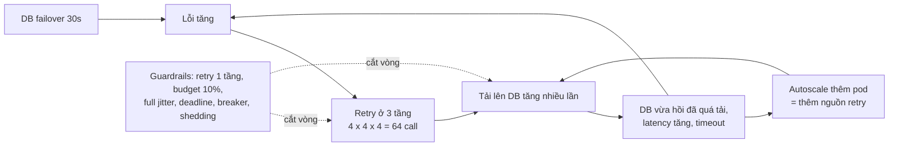
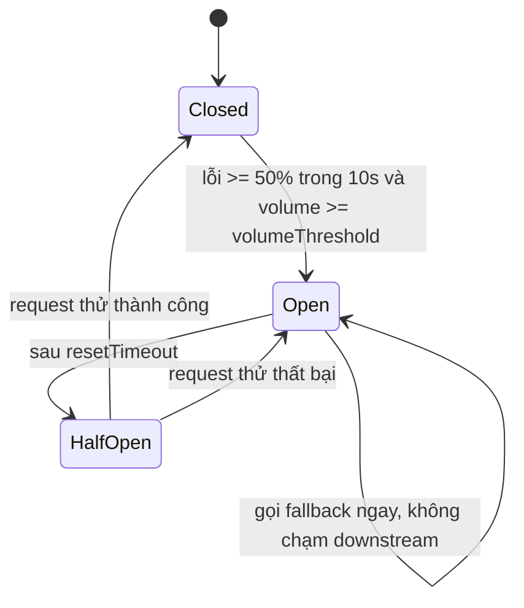
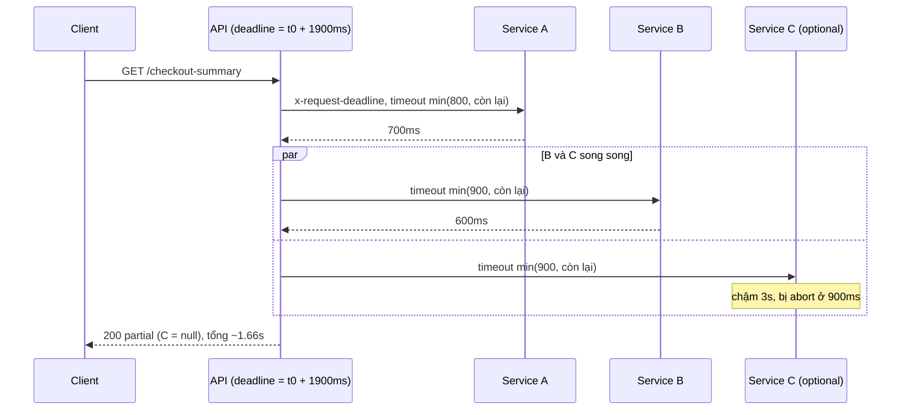

## Bối cảnh & vấn đề

Postmortem của một sự cố: database chính failover mất **30 giây**. Hệ thống mất **20 phút** mới hồi phục. Trace cho thấy mỗi request của user sinh ra tới **64 lần gọi** xuống database. Khi database vừa sống lại, nó nhận lượng tải gấp hàng chục lần bình thường và ngã tiếp; autoscaler thấy latency cao nên thêm pod, mỗi pod mới lại thêm retry. Không có dòng code nào "sai" theo nghĩa thông thường — mỗi service đều có một retry helper "chuẩn" lấy từ note:

```ts
async function callWithRetry<T>(fn: () => Promise<T>, max = 4): Promise<T> {
  for (let i = 0; i < max; i++) {
    try { return await fn(); }
    catch (e) {
      if (!isRetryable(e) || i === max - 1) throw e;
      const base = 2 ** i * 100;          // 100, 200, 400, 800ms
      const jitter = Math.random() * 100;
      await sleep(base + jitter);
    }
  }
  throw new Error('unreachable');
}
```

Retry là công cụ để vượt qua lỗi **transient**: một packet mất, một pod đang restart. Nhưng khi lỗi không transient — dependency quá tải — retry **thêm tải vào đúng chỗ đang quá tải**. Hệ thống rơi vào trạng thái **metastable**: nguyên nhân ban đầu đã hết, nhưng vòng phản hồi (retry → tải → lỗi → retry) tự duy trì sự cố.

Bài này đi qua các guardrail biến "sự cố 30 giây" thành "degrade 30 giây": phân loại lỗi nào được retry, jitter, retry budget, retry ở một tầng, deadline propagation, circuit breaker, bulkhead và load shedding, rồi cách chạy postmortem. Lý thuyết chi tiết ở [Timeouts & retries](/tracks/distributed-systems/learn/timeouts-retries) và [Circuit breaker, bulkhead & load shedding](/tracks/distributed-systems/learn/circuit-breaker-bulkhead-shedding); ở đây tập trung vào số đo và quyết định. Môi trường: Node 24.21, opossum 10.0.0.

## Khái niệm

### Lỗi nào được retry

Retry chỉ an toàn khi đồng thời: lỗi **transient**, operation **idempotent** (hoặc có idempotency key), và **còn deadline/budget**. Áp vào danh sách của card 004:

- **Không retry**: 400, 404, 409 — request sai hoặc xung đột nghiệp vụ, gửi lại vẫn sai. 401: refresh token **một lần** rồi gọi lại, không phải backoff loop.
- **Retry có backoff**: 502, 503, 504, `ECONNRESET`, `ECONNREFUSED`. 429: retry **theo `Retry-After`**, không theo công thức của mình.
- **500**: tuỳ — thường chỉ retry khi operation idempotent, vì 500 có thể xảy ra *sau* khi side effect đã chạy.
- **Timeout trên `POST /payments`**: kết quả **không xác định** (có thể đã charge). Chỉ retry khi có idempotency key được server và provider tôn trọng; nếu không, query trạng thái trước. Chi tiết ở [bài double charge](/tracks/scenario-reliability/learn/double-charge-idempotency).

**Interview angle:** câu trả lời mạnh không phải một danh sách status code mà là quy tắc ba điều kiện, kèm "timeout là kết quả thứ ba".

### Exponential backoff và jitter

**Exponential backoff** tăng thời gian chờ theo lũy thừa (`base × 2^i`) để giảm tần suất thử khi lỗi kéo dài. Nhưng nếu 1.000 client cùng lỗi ở cùng thời điểm và cùng công thức, chúng retry **cùng lúc** — backoff chỉ giãn khoảng cách giữa các đợt sóng, không phá đợt sóng. **Jitter** là thành phần ngẫu nhiên để rải client ra theo thời gian.

Có ba kiểu thường gặp. **Jitter cộng thêm nhỏ** (`base·2^i + random(0, 100ms)`) như helper trên: ở attempt 3, base 800 ms mà jitter chỉ 100 ms — client vẫn dồn vào một cửa sổ hẹp. **Equal jitter**: `t/2 + random(0, t/2)`. **Full jitter** (AWS Architecture Blog): `random(0, min(cap, base·2^i))` — rải đều trên toàn khoảng, tổng work ít nhất khi có tranh chấp.

### Retry budget và retry ở một tầng

**Retry amplification**: mỗi tầng 1 lần gọi + 3 retry = 4 attempt; ba tầng lồng nhau → `4³ = 64` lần gọi xuống tầng cuối cho một request. Hai guardrail cấu trúc: **retry ở một tầng** (thường là tầng gần lỗi nhất, các tầng trên fail fast), và **retry budget** — giới hạn tỉ lệ retry so với request gốc (ví dụ ≤ 10%), cài bằng một token bucket: mỗi request gốc nạp 0,1 token, mỗi retry tốn 1 token, hết token thì không retry. Khi downstream khoẻ, gần như không có retry nên budget không chạm trần; khi downstream chết, retry bị chặn ở ~10% thay vì 300%.

Với 30 pod dùng chung một HTTP client (follow-up 036): budget **cục bộ mỗi pod** là đủ và đơn giản — tỉ lệ là tương đối, nên 30 budget 10% vẫn cho tổng 10%. Không cần Redis cho việc này.

### Deadline propagation

**Timeout** là giới hạn của một lần gọi; **deadline** là thời điểm tuyệt đối mà sau đó *không ai còn cần* kết quả. API có SLO 2 giây thì mọi việc phía dưới phải xong trước `t0 + ~1,9s`. **Deadline propagation** truyền mốc này xuống: mỗi call nhận `timeout = min(per-call timeout, thời gian còn lại)`, và mốc được gửi qua mạng (header như `x-request-deadline: <epoch ms>`, hoặc `grpc-timeout`) để service dưới tự bỏ việc khi không kịp. Không có nó, service dưới tiếp tục làm (và retry) cho một caller đã bỏ đi từ lâu — work vô ích trong đúng lúc hệ thống quá tải.

Trong Node, công cụ là `AbortSignal.timeout(ms)` và `AbortSignal.any([...])` (gộp signal client ngắt với signal deadline; có từ Node 20.3, verify), truyền `signal` vào `fetch`/undici; với Postgres dùng `statement_timeout` hoặc query cancel. Abort phía caller không huỷ work đã gửi tới server khác — nên downstream cũng phải đọc deadline.

### Circuit breaker

**Circuit breaker** theo dõi tỉ lệ lỗi của một downstream. **Closed**: gọi bình thường, đếm lỗi trong cửa sổ trượt. Vượt ngưỡng → **Open**: không gọi nữa, trả fallback ngay (fail fast), tiết kiệm socket và cho downstream thở. Sau `resetTimeout` → **Half-open**: cho một request thử; thành công thì Closed, thất bại thì Open lại.

Tham số quan trọng với opossum: `timeout` (mặc định **10.000 ms** ở v10 — đã kiểm trong source), `errorThresholdPercentage` (mặc định 50), `rollingCountTimeout` (10.000 ms), `resetTimeout` (30.000 ms), `volumeThreshold` (mặc định **0** — nghĩa là một lỗi đầu tiên lúc traffic thấp cũng có thể mở mạch), và `errorFilter` để không tính lỗi 4xx (lỗi của request, không phải dấu hiệu downstream hỏng).

### Bulkhead và load shedding

**Bulkhead** chia tài nguyên thành ngăn riêng cho từng downstream: semaphore/pool riêng (payment 50 concurrent, recommendation 10), để một service chậm không ăn hết socket hoặc DB connection của cả process.

**Load shedding** là chủ động từ chối sớm khi quá tải: khi in-flight vượt N, hoặc event loop lag vượt ngưỡng (ví dụ 200 ms), trả **503 + `Retry-After` ngay lập tức** thay vì nhận request rồi để nó chờ trong hàng đợi tới timeout. Từ chối nhanh rẻ hơn nhiều so với timeout chậm: request bị từ chối tốn micro-giây; request timeout tốn connection, memory, và kết quả bị vứt. Shed theo **ưu tiên**: checkout > cart > browse > recommendation > analytics.

**Goodput** là số request thành công *trong deadline* — thước đo đúng khi quá tải, không phải throughput.

## Cơ chế hoạt động

### Retry storm tự duy trì



Vòng `B → C → D → E → B` là lý do nguyên nhân 30 giây biến thành sự cố 20 phút. Mỗi guardrail cắt vòng ở một chỗ: retry một tầng và budget giảm hệ số nhân ở `C`; jitter dàn tải theo thời gian; deadline loại bỏ work cho caller đã bỏ đi; breaker ngừng gọi hẳn khi lỗi cao; shedding giữ cho phần request được nhận vẫn thành công.

### Circuit breaker: trạng thái



Khi Open, mọi request đi thẳng vào fallback — đó là chỗ quyết định nghiệp vụ: giá cache gần nhất có TTL, ẩn khuyến mãi, hay lỗi rõ ràng. **Không bao giờ** fallback thành "giá 0".

### Deadline qua ba service



C là optional nên khi nó trễ budget, API trả **partial response** (đánh dấu `partial: true`) thay vì fail cả request. B là bắt buộc nên lỗi của B làm fail request — nhưng vẫn trước deadline.

## Ví dụ thực tế

### Đo hệ số nhân: 64, 4 và 1,1

Card 036. Ba tầng `BFF → order-service → data-service → DB`, DB đang lỗi `ECONNREFUSED` liên tục.

```ts
// budget kiểu token bucket: request gốc nạp 0.1 token, mỗi retry tốn 1 token, trần 10
function makeBudget(ratio = 0.1, max = 10) {
  let tokens = max;
  return {
    onRequest() { tokens = Math.min(max, tokens + ratio); },
    tryRetry() { if (tokens >= 1) { tokens -= 1; return true; } return false; },
  };
}
```

```text
mỗi tầng 1 + 3 retry                         users=1 db_calls=64 per_user=64.00
chỉ retry ở tầng gần DB                      users=1 db_calls=4 per_user=4.00
tầng gần DB + retry budget 10%               users=1000 db_calls=1109 per_user=1.11
tầng gần DB + retry budget 10%               users=1000 over 2000ms db_calls=1109 per_user=1.11
tầng gần DB, không budget                    users=1000 over 2000ms db_calls=4000 per_user=4.00
```

64 → 4 → 1,11. Với budget, 1.000 request gốc chỉ sinh 109 retry (10 token ban đầu + 0,1 × 1.000 nạp thêm) — tải lên DB đang ốm gần như bằng tải bình thường. Không budget, DB nhận gấp 4. Đây là con số để đặt lên bàn trong postmortem.

### Jitter: helper trong note vs full jitter

Card 018. Mô phỏng 1.000 client cùng lỗi ở t = 0; server phục vụ tối đa 100 request mỗi slot 100 ms, dư thì 503 và client retry (base 100 ms, cap 10 s, tối đa 10 attempt). Đây là mô phỏng rời rạc chạy thật, không phải gọi mạng:

```ts
const strategies = {
  'no jitter      ': (i) => Math.min(CAP, BASE * 2 ** i),
  'card: +0..100ms': (i) => Math.min(CAP, BASE * 2 ** i) + Math.random() * 100,
  'equal jitter   ': (i) => { const t = Math.min(CAP, BASE * 2 ** i); return t / 2 + Math.random() * t / 2; },
  'full jitter    ': (i) => Math.random() * Math.min(CAP, BASE * 2 ** i),
};
```

```text
no jitter       total_calls= 5500 retry_peak/slot= 900 gave_up=   0 all_done_at=32.7s
card: +0..100ms total_calls= 3711 retry_peak/slot= 900 gave_up=   0 all_done_at=3.5s
equal jitter    total_calls= 3591 retry_peak/slot= 597 gave_up=   0 all_done_at=1.4s
full jitter     total_calls= 3395 retry_peak/slot= 419 gave_up=   0 all_done_at=2.5s
```

Jitter của helper không giảm đỉnh (900 request dồn vào slot kế tiếp, vì `100 + random(0..100)` rơi trọn vào một slot). Full jitter có **tổng work thấp nhất** và **đỉnh retry thấp nhất** — đúng kết luận của AWS Architecture Blog (follow-up 018: vì nó rải đều client trên toàn khoảng `[0, t]` nên số va chạm ở mỗi slot ít nhất). Equal jitter xong sớm hơn trong lần chạy này nhưng tốn nhiều call hơn; khi bài toán là bảo vệ downstream, "ít work" quan trọng hơn. Không jitter: mất 32,7 giây vì cả đàn cùng retry theo từng đợt.

Bản sửa đầy đủ của helper: full jitter có cap; deadline tổng (truyền `AbortSignal`, dừng khi không đủ thời gian cho một attempt nữa); tôn trọng `Retry-After` khi 429/503; retry budget; và chỉ retry khi `fn` idempotent. Code đầy đủ ở [Timeouts & retries](/tracks/distributed-systems/learn/timeouts-retries).

### Deadline propagation trong Node

Card 037. API có SLO 2 giây, gọi A (700 ms) rồi B (600 ms) ‖ C (3.000 ms, optional). Downstream đọc header deadline và dừng khi caller ngắt.

```ts
async function call(url: string, { deadline, perCallMs, parent }: Opts) {
  const remaining = deadline - Date.now();
  const timeout = Math.min(perCallMs, remaining);
  if (timeout <= 50) throw new Error(`skip ${url}: ${remaining}ms left`);
  const signal = AbortSignal.any([parent, AbortSignal.timeout(timeout)]);
  const r = await fetch(url, { signal, headers: { 'x-request-deadline': String(deadline) } });
  if (!r.ok) throw new Error(`${url} -> ${r.status}`);
  return r.json();
}
async function handle(clientSignal: AbortSignal) {
  const t0 = Date.now(), deadline = t0 + 1900;
  const parent = AbortSignal.any([clientSignal, AbortSignal.timeout(1900)]);
  const a = await call(A_URL, { deadline, perCallMs: 800, parent });
  const [b, c] = await Promise.allSettled([
    call(B_URL, { deadline, perCallMs: 900, parent }),
    call(C_URL, { deadline, perCallMs: 900, parent }),
  ]);
  if (b.status === 'rejected') throw b.reason;
  return { ...a, ...b.value, ...(c.status === 'fulfilled' ? c.value : { C: null, partial: true }) };
}
// trong Express: const ac = new AbortController(); res.on('close', () => { if (!res.writableEnded) ac.abort(); });
```

```text
result: {"A":"ok","B":"ok","C":null,"partial":true,"took":1664}
A: done in 700ms | B: done in 600ms | C: aborted after caller gave up
client disconnect -> handler stopped after 302ms: client closed
A: aborted after caller gave up
```

Hai điều được chứng minh: C chậm không kéo request quá 2 giây (partial ở 1.664 ms), và khi client ngắt ở 300 ms, cả handler lẫn **service A ở phía dưới** đều dừng — không có work mồ côi. Ngân sách thời gian trong card: A 800 ms, B‖C 900 ms, dư 200 ms cho serialize và mạng.

### Circuit breaker cho pricing service

Card 019. Pricing có p99 800 ms và thỉnh thoảng chết vài phút. Cấu hình và đo (resetTimeout thu nhỏ còn 1 giây cho demo):

```ts
const breaker = new CircuitBreaker(getPrice, {
  timeout: 1200,                       // trên p99 một chút, không để default 10s
  errorThresholdPercentage: 50,
  rollingCountTimeout: 10_000,
  volumeThreshold: 20,                 // traffic thấp không tự mở mạch
  resetTimeout: 30_000,                // demo dùng 1000
  errorFilter: (e) => e.status >= 400 && e.status < 500,   // 4xx không tính
});
breaker.fallback((sku) => lastGood.has(sku)
  ? { ...lastGood.get(sku), stale: true }                   // giá gần nhất, có TTL
  : Promise.reject(new Error('no price, hide promo')));
for (const ev of ['open', 'halfOpen', 'close']) breaker.on(ev, () => metrics.inc(`pricing_breaker_${ev}`));
```

```text
opossum defaults: {"timeout":10000,"resetTimeout":30000,"errorThresholdPercentage":50,"rollingCountTimeout":10000}
  [event] open at 65ms
low traffic, volumeThreshold=0: opened=true
low traffic, volumeThreshold=20: opened=false
30 x 404: opened=false, failures counted=0
  [event] open at 95ms
outage, 30 requests: {"stale":30}, calls reaching pricing=4
  [event] halfOpen at 1094ms
  [event] close at 1212ms
after resetTimeout, trial -> {"sku":"p1","price":100,"fresh":true}
  [event] open at 1200ms
slow pricing: answered in 1200ms with {"sku":"p1","price":100,"stale":true}
```

Đọc kết quả: với `volumeThreshold` mặc định 0, **1 thành công + 2 lỗi** lúc traffic thấp đã mở mạch; đặt 20 thì không. `errorFilter` giúp 30 lỗi 404 không bị tính (follow-up: 4xx là lỗi của request, không nên mở mạch — trừ 429, thường nên tính vì nó là tín hiệu quá tải). Khi outage, chỉ **4/30** request chạm pricing, phần còn lại nhận giá stale ngay. Pricing treo 5 giây thì user nhận câu trả lời ở 1,2 giây thay vì 10 giây của default. Breaker phải **theo từng downstream** (thậm chí từng endpoint), không dùng chung một breaker cho cả HTTP client.

### Load shedding khi tải gấp 3

Card 053. Server có "DB pool" 10 slot × 50 ms = capacity ~200 rps; bắn ~600 rps trong 3 giây, client timeout 1 giây. So sánh không shedding với shedding khi in-flight ≥ 30.

```ts
http.createServer(async (req, res) => {
  if (inflight >= maxInflight) { res.writeHead(503, { 'retry-after': '1' }).end(); return; }  // rẻ, sớm
  inflight++;
  try { await pool.run(() => query()); res.end('ok'); } finally { inflight--; }
});
```

```text
no shedding   200=301 503=0 timeout=1499 p50_ok=567ms p99_ok=993ms
shed at 30    200=691 503=1109 timeout=0 p50_ok=150ms p99_ok=188ms
```

Không shedding: hàng đợi phình, **83% request timeout**, chỉ 301 thành công, và server vẫn tốn công xử lý request mà client đã bỏ. Có shedding: **goodput tăng hơn gấp đôi** (691), p99 của request được nhận là 188 ms, phần bị từ chối nhận 503 trong vài ms và có `Retry-After` để quay lại. Thà từ chối nhanh một phần còn hơn làm chậm tất cả.

Thiết kế Black Friday đầy đủ: pre-scale trước sự kiện (đừng trông vào autoscale 4 phút), feature flag tắt recommendations/reviews, shed theo priority (header hoặc route), bulkhead cho từng downstream, breaker + timeout per downstream, waiting room cho peak, load test 3–4x với dependency thật. Để retry của client không vô hiệu hoá shedding (follow-up): 503 luôn kèm `Retry-After`, SDK của mình dùng full jitter + budget, và gateway giới hạn rate theo client.

### Postmortem retry storm (card 055)

Khung chạy (minh hoạ):

1. **Blameless, timeline từ dữ liệu**: khi nào DB chậm, khi nào retry ratio tăng, khi nào autoscale, vì sao alert muộn — lấy từ metric, trace, deploy log, không từ trí nhớ.
2. **Tìm cơ chế, không tìm người**: retry ở mọi tầng, timeout tầng dưới dài hơn tầng trên, không budget, không breaker, autoscale khuếch đại tải.
3. **Guardrail có owner và deadline**: thư viện HTTP client chung với default an toàn (timeout, full jitter, max 3 attempt, budget, breaker), checklist review, dashboard "retry ratio / attempts per request", game day inject latency.
4. **Đo hiệu quả**: lần inject latency tiếp theo hệ thống degrade thay vì sập.

Hai team tranh cãi ai sở hữu default của HTTP client chung (follow-up): đưa về một owner rõ (platform team), quyết định bằng dữ liệu từ sự cố và game day, cho phép override có lý do và review, ghi lại bằng ADR.

## Trade-offs & lựa chọn thay thế

| Guardrail | Chặn được | Chi phí / rủi ro | Mặc định gợi ý |
|---|---|---|---|
| Không retry | Khuếch đại | Lỗi transient lọt tới user | Cho non-idempotent không có key |
| Retry 1 tầng + full jitter | Đợt sóng, hệ số nhân | Latency tăng khi lỗi | Max 3 attempt, base 100 ms, cap 2–5 s |
| Retry budget | Storm khi downstream chết | Một số lỗi transient không được retry | 10% request gốc |
| Deadline propagation | Work mồ côi | Phải truyền header qua mọi service | Luôn |
| Circuit breaker | Gọi vào dependency đã chết | Ngưỡng sai → mở oan hoặc mở muộn | Per downstream, volumeThreshold > 0 |
| Bulkhead | Một dependency chậm ăn hết tài nguyên | Pool nhỏ bị đầy sớm | Theo concurrency đo được |
| Load shedding | Hàng đợi phình, timeout hàng loạt | Từ chối user khi gần quá tải | In-flight hoặc event loop lag |
| Hedged request | Tail latency | Tăng tải | Chỉ cho read idempotent, tải thấp |

**Chọn thế nào.** Retry, budget và deadline là **mặc định của mọi client** — chúng rẻ và không có nhược điểm đáng kể khi cấu hình đúng. Breaker và bulkhead thêm vào cho dependency có lịch sử chậm hoặc chết. Load shedding đặt ở cửa vào của service nhận traffic trực tiếp từ user. Hedged request là tối ưu tail latency, không phải công cụ reliability — nó *tăng* tải, nên tắt khi hệ thống quá tải.

## Edge cases & failure modes

- **Timeout tầng dưới dài hơn tầng trên**: BFF timeout 2s, service timeout 5s, DB statement_timeout 30s — tầng dưới làm tiếp cho caller đã bỏ. Timeout phải giảm dần theo độ sâu, hoặc dùng deadline.
- **Retry trong SDK ẩn**: AWS SDK, driver DB, HTTP client đều có retry mặc định; cộng với retry của mình là nhân thêm một lần nữa. Kiểm tra và tắt một bên.
- **Breaker half-open với traffic cao**: nhiều request cùng lọt vào lúc half-open trong một số thư viện; giới hạn số request thử.
- **Fallback gọi service khác cũng đang chết**: fallback phải rẻ và cục bộ (cache, giá trị mặc định), không phải một dependency nữa.
- **Shedding bằng CPU trên Node**: Node đơn luồng, CPU 100% có thể là bình thường; event loop lag là tín hiệu tốt hơn.
- **Autoscale tăng tải lên dependency**: thêm pod khi DB là nút cổ chai làm tăng connection và retry. Autoscale theo metric của chính service, có giới hạn trên, và kết hợp breaker.
- **Partial response không được đánh dấu**: client cache response thiếu như response đầy đủ. Luôn có cờ `partial` và `Cache-Control` ngắn.

## Pitfalls

- ❌ Retry mọi lỗi → ✅ chỉ transient + idempotent + còn deadline; 4xx không retry, 429 theo `Retry-After`.
- ❌ Jitter cộng thêm 0–100 ms → ✅ full jitter `random(0, min(cap, base·2^i))` (đo: đỉnh 900 → 419, tổng call thấp nhất).
- ❌ Retry ở mọi tầng → ✅ một tầng, tầng khác fail fast (đo: 64 → 4 call).
- ❌ Không có retry budget → ✅ budget 10% cục bộ mỗi pod (đo: 4,00 → 1,11 call/request khi DB chết).
- ❌ Timeout cố định cho từng call, không biết caller còn bao nhiêu thời gian → ✅ deadline tuyệt đối, `AbortSignal.any`, header deadline cho downstream.
- ❌ Dùng default của opossum (timeout 10s, volumeThreshold 0) → ✅ timeout theo p99, volumeThreshold > 0, errorFilter cho 4xx, breaker per downstream.
- ❌ Fallback "giá 0" → ✅ giá stale có TTL, ẩn tính năng, hoặc lỗi rõ ràng.
- ❌ Để request chờ trong hàng đợi không giới hạn → ✅ shed sớm bằng 503 + `Retry-After` (đo: goodput 301 → 691).
- ❌ Postmortem kết luận "DB failover" → ✅ tìm vòng phản hồi khuếch đại sự cố và guardrail có owner.

## Tóm tắt

- Retry an toàn = **transient + idempotent + còn deadline/budget**; timeout là kết quả không xác định.
- Retry ở mọi tầng nhân theo lũy thừa (**4³ = 64**); retry một tầng + budget 10% đưa về ~1,1 call/request.
- **Full jitter** rải client đều nhất, tổng work thấp nhất; jitter cộng thêm nhỏ không phá đợt sóng.
- **Deadline propagation**: deadline tuyệt đối, `timeout = min(per-call, còn lại)`, `AbortSignal.any`, header cho downstream, partial response cho phần optional.
- **Circuit breaker** per downstream: timeout theo p99, `volumeThreshold`, `errorFilter` 4xx, fallback nghiệp vụ hợp lý, metric sự kiện.
- **Bulkhead + load shedding**: từ chối sớm bằng 503 + `Retry-After` giữ goodput; shed theo priority.
- Postmortem tìm **cơ chế khuếch đại**, ra guardrail có owner, và chứng minh bằng game day.
