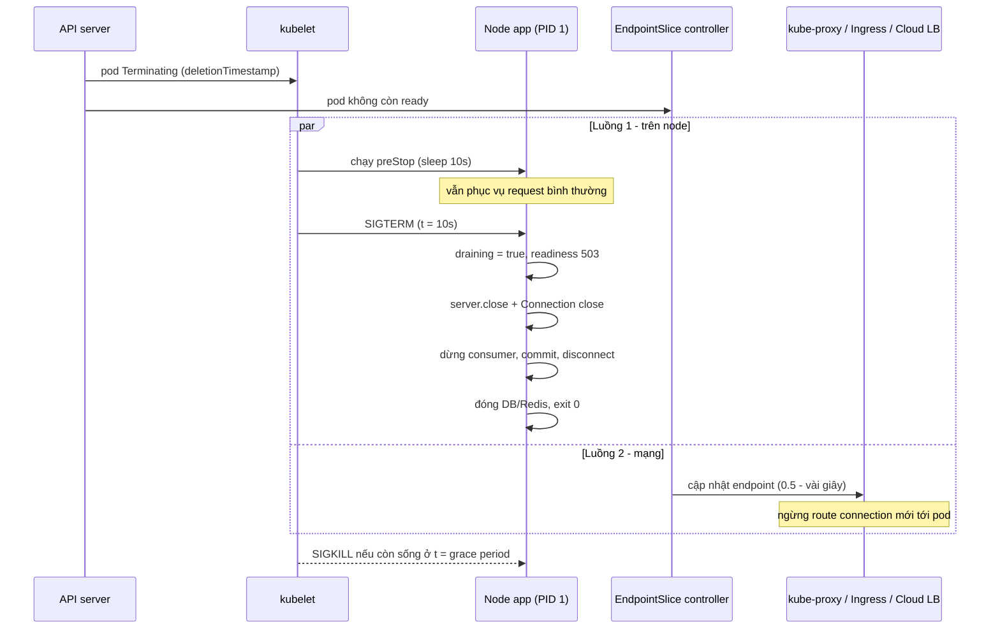
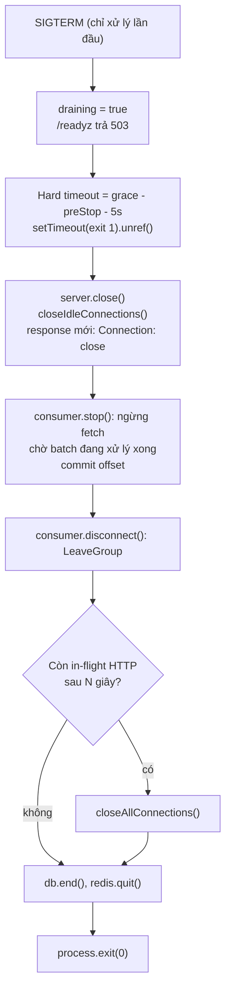
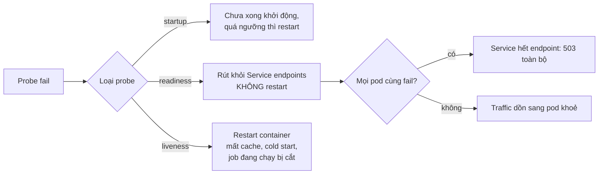

## Bối cảnh & vấn đề

Một team có dashboard error rate rất "đẹp" — trừ những lúc deploy. Mỗi lần rolling update, ingress ghi nhận một đợt **502/503** kéo dài 5–10 giây, vài job Kafka bị xử lý lặp, và có pod mất **đúng 30 giây** mới tắt. Code có SIGTERM handler, có `server.close()`, có `db.end()`. Ban đêm, khi job export báo cáo chạy, các pod lại **restart liên tục** dù process không hề crash.

Không lỗi nào trong số này nằm ở logic nghiệp vụ. Chúng nằm ở **ranh giới giữa app và platform**: Kubernetes gửi signal thế nào, khi nào load balancer ngừng gửi traffic, ai là PID 1 trong container, `server.close()` thực sự làm gì với keep-alive connection, và probe nói với kubelet điều gì. Mỗi bên "đúng" theo tài liệu của mình; sự cố xảy ra ở chỗ hai bên giả định khác nhau về thứ tự.

Bài này đi theo vòng đời của một pod bị terminate: từ lúc `kubectl rollout` tạo pod mới tới lúc pod cũ biến mất, rồi quay lại câu hỏi probe nào dùng cho việc gì. Môi trường đo thật: Node 24.21 trên máy local (không container); hành vi Kubernetes mô tả theo docs hiện hành, các chi tiết phụ thuộc version được đánh dấu (verify). Về idempotency của consumer xem [at-least-once consumer](/tracks/scenario-reliability/learn/at-least-once-webhooks-consumers); về timeout/retry xem [retry storm](/tracks/scenario-reliability/learn/retry-storms-overload).

## Khái niệm

### Termination của pod: hai luồng song song

Khi pod bị xoá (rolling update, scale down, drain node), API server đặt `deletionTimestamp` và pod chuyển sang **Terminating**. Từ đây có **hai luồng chạy song song, không chờ nhau**: (1) kubelet trên node chạy **preStop hook** (nếu có), xong rồi gửi **SIGTERM** cho process chính của từng container; (2) control plane đánh dấu endpoint của pod là không còn ready trong **EndpointSlice**, rồi kube-proxy (iptables/IPVS), ingress controller và cloud load balancer lần lượt cập nhật — việc này mất từ dưới một giây tới vài giây, tuỳ số node và loại LB.

Hệ quả: không có gì đảm bảo "LB ngừng gửi traffic **trước** khi app nhận SIGTERM". Nếu app vừa nhận SIGTERM đã ngừng accept connection, các request được route tới trong khoảng vài giây đó sẽ gặp `connection refused` hoặc reset — LB biến thành **502**.

**Interview angle:** câu hỏi 020 kiểm tra đúng một ý — ứng viên có biết hai luồng này chạy song song không. Ai nói "pod bị gỡ khỏi LB rồi mới nhận SIGTERM" là trượt.

### `terminationGracePeriodSeconds` và preStop

**Grace period** (mặc định **30 giây**) là tổng thời gian kubelet cho container trước khi gửi **SIGKILL**. Đồng hồ bắt đầu **từ lúc pod Terminating**, tức là **bao gồm cả thời gian preStop**, không phải từ lúc SIGTERM. preStop 10 giây + grace 30 giây nghĩa là app chỉ còn 20 giây sau SIGTERM. Nếu preStop chạy quá grace period, kubelet cho thêm một khoảng ngắn (docs ghi 2 giây, verify) rồi kill.

**preStop hook** là lệnh chạy trước SIGTERM. Mẹo phổ biến nhất là **sleep 5–15 giây**: trong lúc sleep, app vẫn nhận và phục vụ request bình thường, còn luồng (2) có thời gian gỡ endpoint khỏi mọi LB. Từ Kubernetes 1.29+ có action `sleep` gốc (beta, bật mặc định từ 1.30, verify); cluster cũ dùng `exec: { command: ["sleep", "10"] }`, cần binary `sleep` trong image — image distroless không có, hook sẽ fail và kubelet vẫn gửi SIGTERM ngay.

### Signal, PID 1 và shell form

**SIGTERM** là yêu cầu "hãy tắt", process có thể bắt và dọn dẹp; **SIGKILL** không bắt được, kernel giết ngay (exit code **137** = 128 + 9). Trong container, process đầu tiên là **PID 1** của PID namespace. Linux đối xử đặc biệt với PID 1: signal mà PID 1 **không cài handler** sẽ bị **bỏ qua** thay vì áp dụng hành động mặc định (terminate). Node không cài handler SIGTERM mặc định, nên Node làm PID 1 mà không có `process.on('SIGTERM')` sẽ phớt lờ `docker stop`.

**Shell form** (`CMD npm start`) được Docker chạy thành `/bin/sh -c "npm start"`; PID 1 là shell. `dash` (Debian, `node:22-slim`) không forward signal cho process con, và vì là PID 1 không có handler, nó cũng không chết — SIGTERM đi vào hư không, container chờ đủ grace period rồi bị SIGKILL. Busybox `sh` (alpine) thường `exec` thẳng lệnh đơn nên đôi khi "tình cờ" đúng (verify theo image). Thêm `npm` ở giữa lại là một tầng process nữa, việc forward signal phụ thuộc version npm (verify).

**Exec form** (`CMD ["node", "dist/server.js"]`) chạy trực tiếp, Node là PID 1 và nhận SIGTERM. Nhưng PID 1 còn có nhiệm vụ **reap zombie** (gọi `wait()` cho process con mồ côi); nếu app spawn process con (ffmpeg, puppeteer), nên dùng init nhỏ như **tini** (`docker run --init`, hoặc `ENTRYPOINT ["/sbin/tini", "--"]`).

### `server.close()` và keep-alive

**`server.close()`** của Node HTTP server ngừng **accept connection mới**; callback chỉ chạy khi **mọi connection hiện có đã đóng**. Load balancer và reverse proxy dùng **keep-alive**: một TCP connection được dùng lại cho nhiều request, và được giữ mở khi idle. Từ Node 19, `close()` cũng đóng các connection **đang idle tại thời điểm gọi** (verify), nhưng connection **đang có request dở** sẽ trở lại trạng thái keep-alive sau khi response xong — và không ai đóng nó. Kết quả: callback không bao giờ chạy, process chờ tới SIGKILL.

Ba API bổ trợ (Node ≥ 18.2): `server.closeIdleConnections()` đóng connection idle, `server.closeAllConnections()` cắt tất cả (kể cả đang xử lý), và header `Connection: close` trên response để client/LB biết không dùng lại connection.

### Liveness, readiness, startup probe

- **Readiness probe** trả lời "pod có nên **nhận traffic** không?". Fail → pod bị rút khỏi EndpointSlice; **không restart**. Đây là phản ứng đúng khi dependency (DB, Redis) tạm hỏng hoặc pod đang drain.
- **Liveness probe** trả lời "process có **hỏng tới mức restart sẽ sửa** không?". Fail `failureThreshold` lần liên tiếp → kubelet **restart container**. Chỉ hợp cho trạng thái như deadlock, event loop treo vĩnh viễn.
- **Startup probe** che liveness/readiness trong lúc app khởi động chậm (migrate, warm cache); liveness chỉ bắt đầu sau khi startup probe thành công.

Ví dụ: pod mất kết nối DB nhưng process khoẻ (card 005) → readiness fail, liveness vẫn pass. Restart không làm DB sống lại; nó chỉ thêm cold start và xoá cache.

**Interview angle:** "đặt DB check vào liveness" là red flag kinh điển. Câu follow-up: nếu **mọi** replica dùng chung DB và readiness của tất cả cùng fail, Service hết endpoint và user nhận 503 ngay ở ingress — đôi khi tốt hơn là vẫn ready và trả lỗi degrade cho riêng endpoint cần DB.

### Kafka consumer trong cùng pod

Consumer group chia partition cho các member. Khi một member rời group (shutdown, crash, hết `session.timeout.ms`), coordinator **rebalance**. Với **eager protocol**, mọi member thu hồi toàn bộ partition rồi nhận lại — cả group dừng xử lý. **Cooperative (incremental) rebalance** chỉ di chuyển partition cần chuyển. **Static membership** (`group.instance.id`) cho phép member restart trong `session.timeout.ms` mà không gây rebalance. Hỗ trợ khác nhau theo client: Java và librdkafka có cả hai; KafkaJS hạn chế (verify).

## Cơ chế hoạt động

### Dòng thời gian termination



Hai nhánh `par` là điểm mấu chốt. Không có preStop, SIGTERM tới ở t ≈ 0 trong khi LB có thể vẫn route tới t ≈ 3 giây; app đã `close()` nên connection mới bị refuse → 502. Với preStop sleep 10 giây, đến lúc SIGTERM tới thì nhánh mạng đã xong. Sau SIGTERM, app có `grace − preStop` giây để drain, và cần một **hard timeout** nhỏ hơn con số đó để tự thoát với log rõ ràng thay vì bị SIGKILL im lặng.

### Thứ tự shutdown bên trong app



Lý do của thứ tự: **ngừng nhận việc mới trước, xong việc đang làm, rồi mới tháo tài nguyên mà việc đang làm cần**. Consumer đang xử lý message cần DB, nên đóng DB trước consumer sẽ biến message đó thành lỗi giữa chừng (và có thể side effect đã chạy nhưng offset chưa commit). `disconnect()` gửi **LeaveGroup** để coordinator rebalance ngay, thay vì chờ `session.timeout.ms` (mặc định 45 giây ở client Java mới, verify) mà partition không ai đọc.

### Probe quyết định gì



Câu hỏi để chọn probe: "**restart có sửa được không?**". DB down → không → readiness (hoặc không gì cả). Event loop kẹt 60 giây vì vòng lặp vô hạn → có → liveness với ngưỡng rộng.

## Ví dụ thực tế

### Keep-alive làm shutdown treo (card 038)

Đoạn handler trong card:

```ts
process.on('SIGTERM', async () => {
  server.close();
  await drainInflightRequests(30_000);
  await db.end();
  await consumer.disconnect();
  process.exit(0);
});
```

Có bốn lỗi: `server.close()` không đóng keep-alive connection đang bận nên "drain" không bao giờ kết thúc; `drainInflightRequests` không phải API có sẵn; DB bị đóng **trước** consumer; và không có hard timeout hay guard chạy một lần. Tái hiện với Node 24.21: một agent keep-alive giữ một connection idle và một connection đang chạy request 1,5 giây; gọi `close()` ở giây 0,1.

```ts
const server = http.createServer((req, res) => {
  if (req.url === '/slow') setTimeout(() => res.end('slow done'), 1500);
  else res.end('ok');
});
server.keepAliveTimeout = 60_000;          // giống idle timeout của LB
// ... gửi /slow qua keep-alive agent, rồi:
server.close(() => console.log('close callback'));
```

```text
warm: 200 ok conn=keep-alive
slow: 200 slow done conn=keep-alive at 1504ms
[plain] still open after 5000ms -> would hang until SIGKILL
```

Request chậm hoàn thành, nhưng response vẫn mang `connection: keep-alive`, connection quay về pool của client, và callback của `close()` không chạy sau 5 giây — trong production là tới SIGKILL. Gọi thêm `closeIdleConnections()` ngay sau `close()` cũng **không** giúp, vì lúc gọi connection đó đang bận (đã đo: cùng kết quả). Bản sửa: đánh dấu draining và gắn `Connection: close` cho mọi response trong lúc drain.

```ts
let draining = false;
const server = http.createServer((req, res) => {
  if (draining) res.setHeader('connection', 'close');
  // ... handler; với response trả muộn, set header ngay trước res.end()
});
// khi SIGTERM:
draining = true;
server.close(() => console.log('close callback'));
server.closeIdleConnections();
```

```text
warm: 200 ok conn=keep-alive (socket now idle in pool)
close callback after 1506ms
slow: 200 slow done conn=close at 1507ms
new request after close: ERR ECONNREFUSED
```

Callback chạy ngay khi request cuối xong (1.506 ms). Dòng cuối là lời nhắc: sau `close()`, connection mới bị refuse — đó chính là 502 nếu LB còn route tới, nên preStop sleep vẫn cần. Handler hoàn chỉnh:

```ts
let shuttingDown = false;
let inflight = 0;
app.use((req, res, next) => {
  inflight++;
  res.on('close', () => inflight--);
  if (shuttingDown) res.setHeader('connection', 'close');
  next();
});
app.get('/readyz', (_req, res) => res.status(shuttingDown ? 503 : 200).end());

async function shutdown(signal: string) {
  if (shuttingDown) return;                       // SIGTERM có thể tới 2 lần
  shuttingDown = true;
  log.info({ signal, inflight }, 'shutdown start');
  setTimeout(() => { log.error({ inflight }, 'forced exit'); process.exit(1); }, 15_000).unref();

  const closed = new Promise<void>((r) => server.close(() => r()));
  server.closeIdleConnections();
  await consumer.stop();                          // ngừng fetch, chờ eachMessage đang chạy, commit
  await consumer.disconnect();                    // LeaveGroup
  await Promise.race([closed, sleep(10_000).then(() => server.closeAllConnections())]);
  await db.end();
  await redis.quit();
  log.info('shutdown done');
  process.exit(0);
}
process.on('SIGTERM', () => void shutdown('SIGTERM'));
process.on('SIGINT', () => void shutdown('SIGINT'));
```

Ngân sách thời gian với grace 30 giây, preStop 10 giây: còn 20 giây; hard timeout 15 giây; `closeAllConnections` sau 10 giây. Follow-up về **WebSocket/SSE**: connection sống lâu không bao giờ "xong", nên gửi tín hiệu cho client (WebSocket close frame code **1001 Going Away**, SSE gửi event `reconnect` rồi end), client reconnect có jitter sang pod khác; đặt hạn rồi cắt.

### Shell form nuốt SIGTERM (card 021)

Dockerfile trong card dùng `CMD npm start`. Không cần container để thấy cơ chế: chạy Node dưới một shell không `exec`, rồi gửi SIGTERM cho shell (đo trên macOS, `sh` là bash; dash làm PID 1 trong container còn tệ hơn vì nó không chết).

```bash
sh -c 'node sig.js; echo "sh: child exited"' &
kill -TERM $!          # gửi cho shell, giống kubelet gửi cho PID 1
ps -o pid,ppid,comm -p "$(pgrep -f 'node sig.js')"
```

```text
node pid 86153 ppid 86151
after SIGTERM to sh(86151):
  PID  PPID COMM
86153     1 node
```

Shell nhận SIGTERM; Node **không nhận gì** — handler `node: got SIGTERM` chỉ in ra khi ta gửi signal thẳng cho Node. Trong container, PID 1 là shell không handler nên signal bị bỏ qua, mọi pod mất đúng `terminationGracePeriodSeconds` = 30 giây rồi exit 137, request dở bị cắt. Bản sửa:

```dockerfile
FROM node:22-alpine
WORKDIR /app
COPY package*.json ./
RUN npm ci --omit=dev
COPY dist ./dist
RUN apk add --no-cache tini           # chỉ cần nếu app spawn process con
ENTRYPOINT ["/sbin/tini", "--"]
CMD ["node", "dist/server.js"]       # exec form, không qua npm
```

Kiểm chứng: `kubectl exec <pod> -- ps -o pid,comm` phải thấy `1 tini` / `node` (hoặc `1 node`), không phải `sh` hay `npm`. Tăng `terminationGracePeriodSeconds` (red flag của card) chỉ làm deploy chậm hơn mà không sửa gì.

### Restart loop lúc export đêm (card 040)

Config trong card: liveness và readiness cùng `/health` (ping DB + Redis), `timeoutSeconds: 1`, `failureThreshold: 2`, `periodSeconds: 5`. Job export chiếm event loop và DB → `/health` trả sau hơn 1 giây hai lần liên tiếp → sau ~10 giây kubelet restart → export bị cắt, chạy lại từ đầu → lại block → loop. Vì DB chậm ảnh hưởng mọi pod, cả Deployment restart cùng lúc. Sửa:

```yaml
startupProbe:
  httpGet: { path: /livez, port: 3000 }
  periodSeconds: 5
  failureThreshold: 30          # cho tối đa 150s để khởi động
livenessProbe:
  httpGet: { path: /livez, port: 3000 }   # trả 200 từ memory, không I/O
  periodSeconds: 10
  timeoutSeconds: 5
  failureThreshold: 6           # ~60s không phản hồi mới restart
readinessProbe:
  httpGet: { path: /readyz, port: 3000 }  # check dependency + draining flag
  periodSeconds: 5
  timeoutSeconds: 2
  failureThreshold: 3
```

```ts
import { monitorEventLoopDelay } from 'node:perf_hooks';
const h = monitorEventLoopDelay({ resolution: 20 }); h.enable();
app.get('/livez', (_req, res) => {
  const p99ms = h.percentile(99) / 1e6; h.reset();
  res.status(p99ms > 10_000 ? 500 : 200).json({ p99ms });   // chỉ fail khi kẹt thật
});
```

Gốc của vấn đề vẫn là export chạy trong process API: tách ra worker/Job riêng, hoặc stream + chunk để event loop không bị chặn. Follow-up "khi nào liveness nên fail?": khi process **không thể tự hồi phục** — deadlock, event loop kẹt vĩnh viễn, heap gần OOM không giải phóng được — và restart chắc chắn sửa được.

### Kafka consumer chung pod với API (card 039)

Triệu chứng: mỗi deploy có một đợt duplicate và rebalance storm. Duplicate vì pod bị SIGKILL (hoặc đóng DB sớm) khi message đã xử lý nhưng offset chưa commit; storm vì rolling update 10 pod tạo ~20 lần thành viên rời/vào group, mỗi lần eager rebalance dừng cả group. Cách tắt đúng là chuỗi `stop → chờ xong → commit → disconnect` ở trên; giảm rebalance bằng cooperative-sticky assignor và `group.instance.id` lấy từ tên pod của StatefulSet (static membership), hoặc tách consumer thành Deployment riêng với `maxSurge`/`maxUnavailable` phù hợp. Dù vậy OOM, node chết vẫn tạo duplicate — consumer **idempotent** là bắt buộc, graceful shutdown chỉ giảm tần suất. Follow-up eager vs cooperative: eager thu hồi mọi partition của mọi member (stop-the-world); cooperative chỉ thu hồi partition phải chuyển, phần còn lại tiếp tục xử lý.

### Kể chuyện theo STAR (card 058)

Khung câu trả lời: **Situation** — API Node sau ingress, rolling deploy 10 lần mỗi ngày, mỗi lần ~0,3% request 502. **Task** — đưa 502 khi deploy về 0 mà không chậm deploy. **Action** — đo timeline bằng access log của ingress so với log SIGTERM, phát hiện SIGTERM tới trước khi endpoint bị gỡ; thêm preStop 10 giây, `Connection: close` khi draining, hard timeout; tách `/livez` khỏi `/readyz`; kiểm bằng load test chạy liên tục trong lúc `kubectl rollout restart`. **Result** — 502 trong deploy về 0, thời gian terminate từ 30 giây (bị kill) còn ~12 giây. **Reflection** — default của framework hiếm khi đúng cho production; mỗi default (grace period, probe timeout, keep-alive timeout) cần một con số đo được. Với follow-up "default nào trong stack hiện tại vẫn sai?", nêu một cái cụ thể kèm cách mình định đo.

## Trade-offs & lựa chọn thay thế

| Lựa chọn | Lợi ích | Chi phí / rủi ro | Khi nào |
|---|---|---|---|
| preStop sleep 5–15s | Hết 502 do race EndpointSlice | Deploy chậm thêm N giây mỗi pod | Mọi service nhận traffic qua LB |
| Readiness fail ngay khi SIGTERM (không preStop) | Không cần hook | Vẫn phụ thuộc chu kỳ probe + propagation, không đủ một mình | Bổ sung, không thay thế preStop |
| Grace period dài (60–120s) | Request/job dài kịp xong | Rollout và drain node chậm | Có request dài thật, đã đo |
| `closeAllConnections` sớm | Tắt nhanh | Cắt request đang chạy | Sau hard deadline |
| tini / `--init` | Forward signal, reap zombie | Thêm một binary | App spawn process con |
| Node trực tiếp là PID 1 | Đơn giản | Phải tự handle signal, không reap zombie | App không spawn con |
| Consumer chung pod với API | Ít Deployment | Deploy API gây rebalance; scale chung | Tải nhỏ |
| Consumer Deployment riêng | Deploy/scale độc lập | Thêm vận hành | Tải lớn hoặc xử lý lâu |
| Liveness đơn giản (in-memory) | Không restart oan | Không bắt được một số trạng thái hỏng | Mặc định |
| Không có liveness | Không bao giờ restart oan | Pod treo vĩnh viễn vẫn chiếm chỗ | Khi chưa có tín hiệu "hỏng" đáng tin |

**Chọn thế nào.** preStop sleep + drain có hard timeout + exec form là **baseline cho mọi service HTTP** — rẻ và loại bỏ phần lớn lỗi khi deploy. Grace period đặt theo số đo: p99 của request dài nhất + preStop + vài giây dư; nếu cần hàng phút, đó là dấu hiệu việc đó nên chạy ở worker/Job chứ không phải kéo dài grace. Liveness nên bảo thủ: thà không restart một pod hỏng thêm một phút còn hơn restart cả Deployment vì DB chậm.

## Edge cases & failure modes

- **Grace period nhỏ hơn preStop + drain**: grace 30s, preStop 10s, request 25s (follow-up 020) → còn 20s sau SIGTERM, request 25s bị SIGKILL cắt giữa chừng. Tăng grace lên ~45s hoặc giảm thời gian request.
- **preStop exec trên image distroless**: không có `sleep` → hook fail, kubelet log `FailedPreStopHook`, SIGTERM tới ngay → 502 quay lại.
- **SIGTERM tới hai lần** (Ctrl+C hai lần ở local, hoặc tool gửi lại): handler không có guard sẽ gọi `db.end()` hai lần và ném lỗi. Luôn guard bằng cờ.
- **Readiness của mọi pod cùng fail** khi DB blip: Service hết endpoint, ingress trả 503 cho cả endpoint không cần DB. Cân nhắc readiness chỉ check thứ pod **riêng** sở hữu.
- **HPA scale down / node drain** đi qua cùng luồng terminate — lỗi shutdown không chỉ xảy ra lúc deploy. Spot instance có thể chỉ báo trước ~2 phút (verify theo cloud).
- **Cloud LB có connection draining riêng** (deregistration delay của AWS target group mặc định 300s, verify): preStop ngắn hơn khoảng propagation của LB vẫn gây 502 nếu LB route trực tiếp vào pod IP.
- **Consumer xử lý batch dài hơn thời gian còn lại**: commit theo từng message/chunk, hoặc giảm `max.poll.records` để batch kịp xong.
- **Process con không được reap**: Node là PID 1, spawn `ffmpeg` nhiều lần → zombie tích tụ tới khi hết PID. tini giải quyết.

## Pitfalls

- ❌ Tin rằng pod rời LB trước khi nhận SIGTERM → ✅ hai luồng song song; preStop sleep để nhánh mạng kịp xong.
- ❌ `process.exit(0)` ngay khi SIGTERM → ✅ drain theo thứ tự, có hard timeout nhỏ hơn `grace − preStop`.
- ❌ Chỉ gọi `server.close()` sau keep-alive LB → ✅ `Connection: close` khi draining, `closeIdleConnections()`, `closeAllConnections()` khi hết hạn (đo: treo vô hạn → 1.506 ms).
- ❌ `CMD npm start` → ✅ `CMD ["node", "dist/server.js"]`, thêm tini nếu spawn process con; kiểm PID 1 bằng `ps`.
- ❌ Tăng grace period để "sửa" pod tắt chậm 30s → ✅ tìm vì sao signal không tới app.
- ❌ Đóng DB trước khi dừng consumer → ✅ stop consumer, chờ xong, commit, disconnect, rồi mới đóng DB.
- ❌ DB check trong liveness, chung endpoint với readiness → ✅ `/livez` không I/O, `/readyz` check dependency và cờ draining.
- ❌ `timeoutSeconds: 1, failureThreshold: 2` cho liveness → ✅ ngưỡng rộng (5s × 6), startupProbe cho cold start.
- ❌ Coi graceful shutdown là đảm bảo không duplicate → ✅ consumer idempotent vẫn bắt buộc.

## Tóm tắt

- Terminate pod = **preStop → SIGTERM** song song với **gỡ khỏi EndpointSlice/LB**; không có thứ tự đảm bảo nên cần preStop sleep.
- `terminationGracePeriodSeconds` (mặc định 30s) **tính cả preStop**; hard timeout của app phải nhỏ hơn phần còn lại.
- PID 1 bỏ qua signal không có handler; **shell form** và `npm` chặn SIGTERM → dùng exec form `node ...`, tini khi spawn con.
- `server.close()` không đóng keep-alive connection đang bận → `Connection: close`, `closeIdleConnections`, `closeAllConnections` sau deadline.
- Thứ tự drain: readiness 503 → close HTTP → stop consumer + commit + disconnect → đóng DB/Redis → exit; guard chạy một lần.
- **Readiness** = có nhận traffic không (dependency, draining); **liveness** = restart có sửa được không (chỉ check process, ngưỡng rộng); **startup** che cold start.
- Rebalance storm giảm bằng cooperative-sticky và static membership; duplicate vẫn xảy ra nên consumer phải idempotent.
- Mọi default (grace, probe timeout, keep-alive) cần một con số đo được — đó là câu chuyện STAR tốt nhất.
