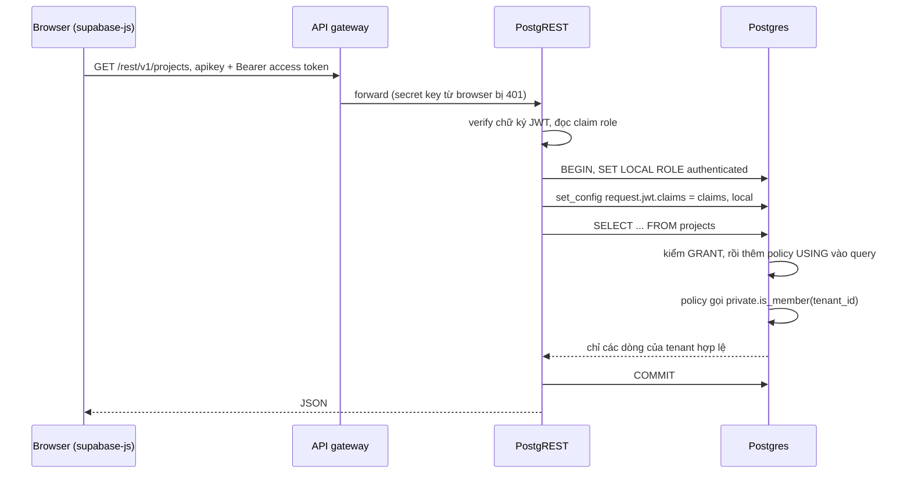
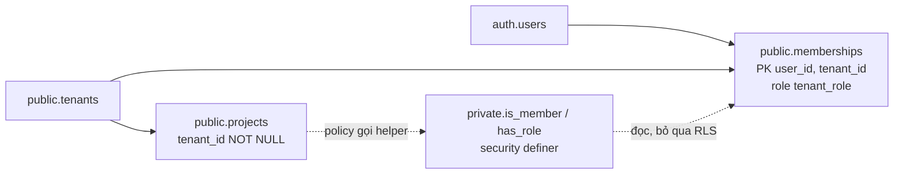

## Bối cảnh & vấn đề

Một team dựng internal platform trên Supabase trong hai tuần. Frontend Next.js gọi thẳng database bằng `supabase-js`, URL và key nằm trong `NEXT_PUBLIC_SUPABASE_URL` và `NEXT_PUBLIC_SUPABASE_PUBLISHABLE_KEY`. Một dev thêm bảng `salaries` bằng SQL editor để làm màn hình lương, định "lát nữa viết policy". Tối hôm đó, một nhân viên tò mò mở DevTools, copy key từ bundle JavaScript và gõ một lệnh `curl`:

```bash
curl "https://<project>.supabase.co/rest/v1/salaries?select=employee,amount" \
  -H "apikey: <key copy từ bundle>"
```

Kết quả là toàn bộ bảng lương. Tệ hơn, lệnh `PATCH` cũng chạy được. Không có server nào của team bị "hack": họ chưa từng viết một dòng API nào cho bảng này. Database **tự** có một REST API công khai, và key để gọi nó nằm sẵn trong trình duyệt của mọi user.

Đây là điểm khác biệt lớn nhất giữa Supabase và kiến trúc "Express/NestJS + ORM" quen thuộc. Ở kiến trúc cũ, database nằm sau server, và server là ranh giới bảo mật: quên một `WHERE tenant_id = ?` là bug, nhưng bảng chưa có endpoint thì không ai đọc được. Ở Supabase, client nói chuyện **trực tiếp** với Postgres qua PostgREST, nên ranh giới bảo mật dời xuống **quyền Postgres (GRANT) và Row Level Security (RLS)**. Bài này dựng lại đúng sự cố trên bằng stack Supabase chạy thật trong Docker, rồi xây policy multi-tenant đúng cách và đi qua các đường bypass hay gặp: helper đệ quy, view, materialized view, function `security definer` lộ ra API.

Nếu bạn chưa quen RLS của Postgres thuần (ENABLE vs FORCE, `set_config`, bẫy chuỗi rỗng), đọc trước [Row-Level Security trong PostgreSQL](/tracks/multi-tenancy/learn/postgres-rls). Bài này tập trung vào phần **riêng của Supabase**.

## Khái niệm

### Supabase là gì, nhìn từ góc bảo mật

**Supabase** là một bộ dịch vụ mã nguồn mở bao quanh một database Postgres: **PostgREST** sinh REST API từ schema, **GoTrue** (Supabase Auth) quản lý user và phát JWT, **Realtime** đẩy thay đổi qua WebSocket, **Storage** lưu file với metadata trong Postgres, và một API gateway đứng trước tất cả. Điều quan trọng là mọi dịch vụ này đều **ủy quyền cho Postgres** quyết định ai được làm gì: PostgREST không có logic phân quyền riêng, nó chỉ đổi sang một Postgres role rồi chạy SQL.

Vì vậy câu "Supabase chỉ là Postgres" vừa đúng vừa nguy hiểm. Đúng vì mọi thứ bạn biết về Postgres vẫn áp dụng. Nguy hiểm vì Postgres giờ đối mặt trực tiếp với Internet: mỗi bảng trong schema được expose (mặc định là `public`) có thể thành một endpoint `/rest/v1/<table>`.

**Interview angle:** interviewer hỏi "Supabase khác gì một Postgres managed" để xem bạn có nhận ra rằng client gọi DB trực tiếp, nên RLS là ranh giới bảo mật thật, không phải lớp "defense in depth" tùy chọn.

### Ba role: anon, authenticated, service_role

Supabase tạo sẵn các Postgres role mà request được "đội lốt". **`anon`** dành cho request chưa đăng nhập. **`authenticated`** dành cho request mang JWT của một user đã đăng nhập. **`service_role`** dành cho backend có quyền quản trị, và role này có thuộc tính **`BYPASSRLS`**: mọi policy bị bỏ qua. Ngoài ra còn `authenticator` (role PostgREST dùng để login, rồi `SET ROLE` sang role trong JWT) và `postgres` (role bạn dùng trong SQL editor và migration).

Trên image `supabase/postgres:17.11.0.002` chạy local, thuộc tính của các role như sau (chạy thật):

```text
       rolname       | rolbypassrls | rolsuper
---------------------+--------------+----------
 anon                | f            | f
 authenticated       | f            | f
 authenticator       | f            | f
 postgres            | t            | f
 service_role        | t            | f
 supabase_auth_admin | f            | f
```

Hai dòng cần nhớ: `service_role` **và** `postgres` đều `BYPASSRLS`. Nghĩa là mọi thứ chạy dưới quyền `postgres` (view do bạn tạo trong migration, function `security definer` do bạn viết, script kết nối bằng connection string mặc định) đều không bị RLS chặn. Phần lớn các lỗi lộ data ở cuối bài đều bắt nguồn từ dòng này.

**Interview angle:** "ai bypass RLS trên Supabase?" Câu trả lời đầy đủ: `service_role`, role `postgres` (owner của bảng và có BYPASSRLS), superuser, và mọi object chạy dưới quyền của họ (view mặc định, function security definer).

### API keys: publishable và secret

**API key** của Supabase quyết định request đi vào với role nào. Theo docs hiện tại, có hai thế hệ key:

- **Publishable key** (`sb_publishable_...`) và key cũ **`anon`** (là một JWT có claim `role: anon`): quyền thấp, được phép nằm trong browser, mobile app, thậm chí source control. Request chỉ mang key này chạy với role `anon`. Nếu kèm thêm access token của user đã login, request chạy với role `authenticated`.
- **Secret key** (`sb_secret_...`) và key cũ **`service_role`** (JWT có `role: service_role`): chạy với role `service_role`, tức là **bỏ qua mọi RLS**. Chỉ được nằm ở backend.

Docs ghi rằng legacy key `anon`/`service_role` vẫn hoạt động nhưng đang được **deprecate trước cuối năm 2026** (verify lịch cụ thể cho project của bạn), và secret key kiểu mới **không chạy trong browser**: gateway dò header `User-Agent` và trả `401`. Đó là một lưới an toàn, không phải lý do để bất cẩn: Server Action hay Route Handler chạy trên server vẫn dùng được secret key, và nếu code đó xử lý request của user mà không tự filter tenant thì vẫn lộ.

Trên Vercel, quy tắc rất đơn giản: publishable key được đặt trong biến `NEXT_PUBLIC_...` vì nó **sẽ** bị nhúng vào bundle. Secret key nằm trong biến **không** có prefix `NEXT_PUBLIC_`, chỉ đọc trong code server (`import 'server-only'`), và chỉ dùng cho việc hệ thống: cron, webhook, backfill, admin tool.

**Interview angle:** câu bẫy là "anon key có phải secret không?". Không. Nó công khai theo thiết kế. Điều giữ an toàn là grants + RLS, không phải việc giấu key.

### Hai lớp kiểm soát: GRANT rồi mới tới RLS

Postgres kiểm tra quyền theo hai lớp. Lớp đầu là **privilege** (`GRANT SELECT ON table TO role`): role không có quyền trên bảng thì bị từ chối ngay với `permission denied`, RLS còn chưa được đánh giá. Lớp thứ hai là **RLS**: role có quyền trên bảng, nhưng chỉ thấy/sửa được các dòng mà policy cho phép.

Lịch sử Supabase cấp `GRANT ALL` mặc định trên mọi bảng mới của schema `public` cho `anon`, `authenticated`, `service_role` (bằng `ALTER DEFAULT PRIVILEGES`). Image local 17.11 vẫn còn cấu hình đó, nên ở đây bảng mới tạo xong là đọc được qua API ngay. Supabase đã công bố một **breaking change**: project tạo từ 2026-05-30 không còn tự grant cho bảng mới, và từ **2026-10-30** áp dụng cho mọi project hiện có (bảng cũ giữ grant cũ) (verify ngày áp dụng cho project của bạn). Sau thay đổi này, quên RLS trên bảng mới ít nguy hiểm hơn, nhưng ngay khi bạn `grant ... to authenticated` để màn hình chạy được, RLS lại là thứ duy nhất đứng giữa user và dữ liệu tenant khác.

**Interview angle:** biết phân biệt "permission denied" (thiếu grant) với "mảng rỗng" (có grant, RLS lọc hết) là dấu hiệu bạn đã debug Supabase thật.

### RLS, USING và WITH CHECK

**Row Level Security** gắn **policy** (biểu thức boolean) vào bảng. Khi bảng bật RLS, Postgres tự thêm policy vào mọi câu lệnh của role không bypass. Bật RLS mà **không có policy nào** cho role đó thì là **deny all**: SELECT trả rỗng, INSERT lỗi. Đây là mặc định an toàn.

Mỗi policy có hai biểu thức, áp lên hai "phía" khác nhau của dữ liệu:

- **`USING`** áp lên **dòng đang tồn tại**: dòng nào được SELECT, dòng nào là mục tiêu của UPDATE/DELETE. Dòng không thỏa thì "như không tồn tại", không có lỗi.
- **`WITH CHECK`** áp lên **dòng mới**: dòng sắp INSERT, hoặc phiên bản **sau** UPDATE. Không thỏa thì lỗi `new row violates row-level security policy`.

Câu hỏi kinh điển: "user tenant A update `tenant_id` của một project sang tenant B thì sao?". `USING` cho qua vì dòng **cũ** thuộc A. `WITH CHECK` chặn vì dòng **mới** thuộc B. Nếu policy UPDATE không ghi `WITH CHECK`, Postgres dùng lại biểu thức `USING` làm check, nên ví dụ này vẫn bị chặn. Nhưng viết tường minh dễ đọc và dễ review hơn.

```sql
create policy "admins update projects" on public.projects for update to authenticated
  using (private.has_role(tenant_id, '{owner,admin}'))
  with check (private.has_role(tenant_id, '{owner,admin}'));
```

**Interview angle:** follow-up hay gặp là "vì sao UPDATE đôi khi trả 0 dòng mà không báo lỗi?". Vì `USING` lọc mất dòng mục tiêu trước khi update, nên không có gì để vi phạm `WITH CHECK`.

### `auth.uid()` và `auth.jwt()`

Policy cần biết "ai đang gọi". PostgREST verify JWT của request, rồi trong transaction của request đó nó `SET ROLE` sang claim `role` và ghi toàn bộ claims vào setting `request.jwt.claims`. Supabase cung cấp hai hàm đọc setting này. Định nghĩa thật trong image:

```sql
CREATE OR REPLACE FUNCTION auth.uid() RETURNS uuid LANGUAGE sql STABLE AS $function$
  select coalesce(
    nullif(current_setting('request.jwt.claim.sub', true), ''),
    (nullif(current_setting('request.jwt.claims', true), '')::jsonb ->> 'sub')
  )::uuid
$function$
```

`auth.jwt()` tương tự nhưng trả cả object `jsonb`. Hai điểm suy ra từ định nghĩa: (1) chúng chỉ là **đọc setting của transaction**, nên trong test bạn có thể giả lập user bằng `set_config('request.jwt.claims', ..., true)`; (2) chúng là `STABLE`, không phải hằng số, nên gọi trực tiếp trong policy có thể bị đánh giá lại nhiều lần. Bọc `(select auth.uid())` để Postgres tính một lần mỗi câu lệnh. Bài [RLS ở production](/tracks/mock-internal-platform/learn/rls-performance-testing) đo con số cụ thể.

**Interview angle:** nói được "`auth.uid()` đọc `request.jwt.claims`" cho thấy bạn hiểu RLS test được bằng SQL thuần, không cần mock.

### Helper `security definer` trong schema private

Policy multi-tenant gần như luôn cần câu hỏi "user hiện tại có là member của tenant này không?", nghĩa là đọc bảng `memberships`. Nhưng `memberships` cũng bật RLS, và policy của chính nó cũng cần hỏi câu đó. Viết thẳng subquery vào policy của `memberships` dẫn tới **infinite recursion**: đánh giá policy cần đọc bảng, đọc bảng lại cần đánh giá policy.

Cách chuẩn là một function **`security definer`**: function chạy với quyền của **owner** (`postgres`, có BYPASSRLS) thay vì người gọi, nên đọc `memberships` mà không kích hoạt policy. Ba điều bắt buộc đi kèm:

- Đặt trong schema **không expose** qua API (ví dụ `private`), để client không gọi nó như RPC với tham số tùy ý.
- `set search_path = ''` và viết tên đầy đủ `public.memberships`, chống tấn công thay bảng qua search_path.
- Đánh dấu `stable`, và chỉ trả **boolean**. Một function definer trả dữ liệu là một cái cửa sau.

**Interview angle:** follow-up của câu hỏi 007 là "helper definer nằm ở schema public thì sao?". Trả lời: PostgREST expose nó thành `/rpc/<name>`, ai có key cũng gọi được với tham số tự chọn. Ví dụ chạy thật ở dưới.

### View, `security_invoker` và materialized view

Một **view** trong Postgres mặc định kiểm tra quyền bảng gốc theo **owner của view**, không theo người gọi. Trên Supabase owner thường là `postgres` (BYPASSRLS), nên view thường **bỏ qua RLS** của bảng gốc. Từ PG15 có option **`security_invoker = true`**: view kiểm tra quyền và RLS theo role của người gọi. Với PG cũ hơn, giải pháp là không expose view: `revoke select ... from anon, authenticated` hoặc đặt view ở schema private.

**Materialized view** không hỗ trợ RLS (Postgres báo `This operation is not supported for materialized views`). Nó là một bảng chụp sẵn, ai có `SELECT` là thấy hết. Muốn phục vụ dashboard theo tenant từ materialized view thì đặt nó ở schema private và expose qua một function definer **tự filter theo tenant của người gọi** (không nhận tenant làm tham số), hoặc qua một view `security_invoker` có điều kiện `private.is_member(tenant_id)`.

**Interview angle:** "user thấy dữ liệu mọi tenant qua view báo cáo mới" là câu 009. Câu trả lời tốt nêu nguyên nhân (quyền owner), fix (security_invoker), và **guardrail** (CI query liệt kê view thiếu security_invoker).

### Tóm tắt khái niệm

| Khái niệm | Một câu | Bẫy |
|---|---|---|
| `anon` / `authenticated` | Role của request chưa/đã login, bị RLS | Có grant mặc định trên bảng public (project cũ) |
| `service_role` / secret key | Bỏ qua RLS | Dùng trong request path của user |
| `postgres` | Role migration/SQL editor, BYPASSRLS | View, definer function chạy dưới quyền nó |
| `USING` | Lọc dòng hiện có | UPDATE 0 dòng không báo lỗi |
| `WITH CHECK` | Kiểm dòng mới | Thiếu ở policy INSERT là INSERT bị chặn hết |
| `security definer` | Chạy quyền owner | Đặt ở public = RPC cửa sau |
| `security_invoker` | View áp RLS theo người gọi | Mặc định là false |

## Cơ chế hoạt động

Đường đi của một request `GET /rest/v1/projects` từ browser, mang access token của user:



Đọc sơ đồ theo từng bước:

1. **Gateway** nhận cả `apikey` (publishable hoặc anon) và `Authorization: Bearer <access token>`. Nếu chỉ có apikey, request chạy role `anon`. Với secret key kiểu mới, gateway chặn khi User-Agent là browser.
2. **PostgREST** verify chữ ký JWT bằng secret/JWKS đã cấu hình. JWT sai chữ ký hoặc hết hạn thì trả `401` trước khi chạm DB. Đây là lý do client không tự "đóng giả" `role: service_role` được: không có khóa ký.
3. Trong **một transaction**, PostgREST `SET LOCAL ROLE` sang claim `role` và ghi claims vào `request.jwt.claims` dạng local. Hết transaction là mất, nên connection pool của PostgREST không bị rò context giữa request (khác với lỗi session-level `SET` trong [bài RLS Postgres](/tracks/multi-tenancy/learn/postgres-rls)).
4. **Postgres** kiểm GRANT. Không có grant thì `42501 permission denied`. Có grant thì rewriter chèn biểu thức policy vào query như một điều kiện `WHERE` có "security barrier".
5. Policy gọi helper definer, helper đọc `memberships` dưới quyền owner (không đệ quy), so `user_id` với `(select auth.uid())`.
6. Kết quả chỉ chứa dòng thỏa policy. Với UPDATE/DELETE, dòng không thỏa `USING` không bị đụng và **không có lỗi**. Với INSERT/UPDATE, dòng mới không thỏa `WITH CHECK` gây lỗi `42501`.

Mô hình dữ liệu tối thiểu mà các policy trong bài dựa vào:



## Ví dụ thực tế

Lab: `supabase/postgres:17.11.0.002`, GoTrue `v2.197.0` (phát JWT thật), PostgREST `v16.4` (cùng engine REST mà Supabase dùng), chạy trong Docker cùng network. Key `anon` và `service_role` được ký HS256 bằng JWT secret của lab, đúng định dạng legacy key. Bốn user tạo qua admin API của GoTrue, đăng nhập bằng `POST /token?grant_type=password` để lấy access token thật.

### 1. Bảng không bật RLS là API công khai (chạy thật)

```sql
-- chạy dưới role postgres, như SQL editor
create table public.salaries (
  id bigint generated always as identity primary key,
  employee text not null,
  amount numeric not null
);
insert into public.salaries (employee, amount) values ('An', 42000000), ('Binh', 55000000);
```

```bash
curl -s "localhost:53000/salaries?select=employee,amount" -H "authorization: Bearer $ANON"
curl -s -X PATCH "localhost:53000/salaries?employee=eq.An" -H "authorization: Bearer $ANON" \
  -H 'content-type: application/json' -H 'prefer: return=representation' -d '{"amount":1}'
```

```text
[{"employee":"An","amount":42000000},
 {"employee":"Binh","amount":55000000}]
[{"id":1,"employee":"An","amount":1}]
```

Chỉ với key công khai, ai cũng đọc và **sửa** được lương. Bật RLS mà chưa viết policy:

```sql
alter table public.salaries enable row level security;
```

```text
GET  (anon)          -> []
POST (anon)          -> {"code":"42501","message":"new row violates row-level security policy for table \"salaries\""}
GET  (service_role)  -> [{"employee":"Binh","amount":55000000}, {"employee":"An","amount":1}]
```

Ba dòng output là ba bài học: RLS không policy = deny all (SELECT rỗng, không lỗi), INSERT bị chặn bằng lỗi, `service_role` vẫn thấy tất cả.

### 2. Policy multi-tenant với helper definer (chạy thật)

```sql
create schema private;
create type public.tenant_role as enum ('owner','admin','member','viewer');
create table public.tenants (id uuid primary key default gen_random_uuid(), name text not null);
create table public.memberships (
  user_id uuid not null references auth.users(id) on delete cascade,
  tenant_id uuid not null references public.tenants(id) on delete cascade,
  role public.tenant_role not null,
  created_at timestamptz not null default now(),
  primary key (user_id, tenant_id)
);
create table public.projects (
  id uuid primary key default gen_random_uuid(),
  tenant_id uuid not null references public.tenants(id),
  name text not null,
  created_at timestamptz not null default now(),
  unique (tenant_id, id)
);
create index on public.projects (tenant_id);

create function private.is_member(t uuid)
returns boolean language sql stable security definer set search_path = '' as $$
  select exists (select 1 from public.memberships m
                 where m.user_id = (select auth.uid()) and m.tenant_id = t);
$$;
create function private.has_role(t uuid, roles public.tenant_role[])
returns boolean language sql stable security definer set search_path = '' as $$
  select exists (select 1 from public.memberships m
                 where m.user_id = (select auth.uid()) and m.tenant_id = t and m.role = any(roles));
$$;
grant usage on schema private to authenticated;
revoke execute on all functions in schema private from public, anon;
grant execute on all functions in schema private to authenticated;

alter table public.tenants enable row level security;
alter table public.memberships enable row level security;
alter table public.projects enable row level security;
create policy "members read tenant" on public.tenants for select to authenticated
  using (private.is_member(id));
create policy "read memberships of my tenants" on public.memberships for select to authenticated
  using (private.is_member(tenant_id));
create policy "members read projects" on public.projects for select to authenticated
  using (private.is_member(tenant_id));
create policy "admins insert projects" on public.projects for insert to authenticated
  with check (private.has_role(tenant_id, '{owner,admin}'));
create policy "admins update projects" on public.projects for update to authenticated
  using (private.has_role(tenant_id, '{owner,admin}'))
  with check (private.has_role(tenant_id, '{owner,admin}'));
create policy "owners delete projects" on public.projects for delete to authenticated
  using (private.has_role(tenant_id, '{owner}'));
```

Seed: tenant Acme (`1111...`) có alice là owner, carol là viewer. Tenant Globex (`2222...`) có bob là admin. Acme có hai project, Globex có một. Gọi API bằng access token thật của từng user:

```text
--- alice GET /projects
[{"name":"Acme payroll","tenant_id":"11111111-1111-1111-1111-111111111111"},
 {"name":"Acme onboarding","tenant_id":"11111111-1111-1111-1111-111111111111"}]
--- bob GET /projects
[{"name":"Globex audit"}]
--- bob GET acme project by id
[]
--- alice PATCH project tenant_id -> globex
{"code":"42501","message":"new row violates row-level security policy for table \"projects\""}
--- carol (viewer) POST project
{"code":"42501","message":"new row violates row-level security policy for table \"projects\""}
--- carol (viewer) PATCH name = 'hacked'
HTTP/1.1 204 No Content
Content-Range: */*
```

Dòng cuối là bẫy UX: viewer update **không bị lỗi**, API trả `204` và `Content-Range: */*` (0 dòng). `USING` lọc mất dòng mục tiêu nên không có gì để chặn. Nếu UI hiện "Đã lưu" dựa vào việc không có lỗi, user sẽ tưởng thao tác thành công. Cách xử lý: dùng `prefer: return=representation` (hoặc `.select()` trong supabase-js) và coi mảng rỗng là `403/404`.

Helper trong schema `private` không bị expose: gọi `POST /rpc/has_role` trả `PGRST202 Could not find the function public.has_role`.

### 3. Ba đường bypass hay gặp (chạy thật)

```sql
-- (a) policy đệ quy trên bản sao memberships
create policy "naive" on public.memberships_naive for select to authenticated
  using (tenant_id in (select tenant_id from public.memberships_naive where user_id = auth.uid()));
-- (b) view mặc định và view security_invoker
create view public.project_counts as
  select tenant_id, count(*) as n from public.projects group by tenant_id;
create view public.project_counts_safe with (security_invoker = true) as
  select tenant_id, count(*) as n from public.projects group by tenant_id;
-- (c) materialized view và function definer ở schema public
create materialized view public.project_counts_mv as
  select tenant_id, count(*) as n from public.projects group by tenant_id;
create function public.tenant_projects(t uuid)
returns setof public.projects language sql stable security definer set search_path = '' as $$
  select * from public.projects where tenant_id = t;
$$;
```

Gọi tất cả bằng token của bob (chỉ thuộc Globex):

```text
--- naive recursive policy
{"code":"42P17","message":"infinite recursion detected in policy for relation \"memberships_naive\""}
--- view (default, owner rights)
[{"tenant_id":"1111...","n":2}, {"tenant_id":"2222...","n":1}]
--- view security_invoker
[{"tenant_id":"2222...","n":1}]
--- materialized view
[{"tenant_id":"1111...","n":2}, {"tenant_id":"2222...","n":1}]
--- bob POST /rpc/tenant_projects {"t": "1111..."}
[{"id":"a0000000-...-0001","tenant_id":"1111...","name":"Acme payroll",...},
 {"id":"a0000000-...-0002","tenant_id":"1111...","name":"Acme onboarding",...}]
```

```text
alter materialized view public.project_counts_mv enable row level security;
DETAIL:  This operation is not supported for materialized views.
```

Bob thấy dữ liệu Acme qua **ba** đường khác nhau: view mặc định, materialized view, và function definer trong `public` nhận tenant làm tham số. Cả ba đều qua code review dễ dàng vì trông "vô hại".

### 4. CI check: object nào trong public đang mở (chạy thật)

```sql
select c.relname, c.relkind, c.relrowsecurity as rls_on,
       (select count(*) from pg_policy p where p.polrelid = c.oid) as policies
from pg_class c join pg_namespace n on n.oid = c.relnamespace
where n.nspname = 'public' and c.relkind in ('r','p','v','m')
  and (not c.relrowsecurity or c.relkind in ('v','m'))
  and not (c.relkind = 'v' and coalesce(c.reloptions::text, '') like '%security_invoker=true%')
order by 1;
```

```text
      relname      | relkind | rls_on | policies
-------------------+---------+--------+----------
 audit_tmp         | r       | f      |        0
 project_counts    | v       | f      |        0
 project_counts_mv | m       | f      |        0
```

Query bắt đúng bảng quên RLS, view thiếu `security_invoker` và materialized view nằm trong schema expose. Chạy nó trong CI sau khi apply migration, fail nếu có dòng nào, là guardrail rẻ nhất cho cả câu 001 lẫn 009. Muốn bắt cả function definer ở `public`, thêm một query trên `pg_proc` với `prosecdef = true`.

## Trade-offs & lựa chọn thay thế

| Cách truy cập data | Ranh giới bảo mật | Ưu điểm | Nhược điểm | Hợp khi |
|---|---|---|---|---|
| Browser → PostgREST (publishable key + JWT user) | GRANT + RLS | Ít code, realtime, nhanh ra feature | Logic nghiệp vụ lộ ra client, mọi bảng expose phải có policy chuẩn | CRUD đơn giản, list/filter, realtime |
| Server (Server Action/Route Handler) → Supabase client mang JWT user | App check + RLS | Validate input, nhiều bước, vẫn có RLS làm lưới | Thêm một hop | Mutation có business rule |
| Server → secret key / `service_role` | Chỉ code của bạn | Không vướng policy, làm được việc hệ thống | Sót một filter là leak, RLS không cứu | Cron, webhook, backfill, admin có check tường minh |
| Server → Postgres trực tiếp (role riêng, không BYPASSRLS) | App check + RLS (nếu set claims) | SQL đầy đủ, transaction | Phải tự set `request.jwt.claims`, tự quản pool | Báo cáo phức tạp, job batch |

| Cách viết policy | Ưu | Nhược |
|---|---|---|
| Subquery inline trên `memberships` | Không cần function | Đệ quy nếu đặt trên chính `memberships`, khó tái sử dụng, chậm |
| Helper `security definer` trong `private` | Không đệ quy, tái sử dụng, dễ index | Phải nhớ search_path, schema không expose, chỉ trả boolean |
| Claim trong JWT (`auth.jwt()`) | Không query, nhanh nhất | Stale tới khi token refresh (xem [bài claims](/tracks/mock-internal-platform/learn/auth-claims-tenancy-rbac)) |

Chọn thế nào: với internal platform, mặc định là **client mang JWT của user ở mọi request của user**, dù gọi từ browser hay từ server. RLS luôn bật. Đọc đơn giản có thể đi thẳng từ browser. Mutation có business rule đi qua Server Action hoặc Postgres function (RPC) để có validation và transaction. `service_role` bị cô lập trong một module `admin` nhỏ, có lint rule cấm import từ request path. Helper definer là cách viết policy mặc định, claim JWT chỉ là tối ưu cho phần đọc nhiều.

## Edge cases & failure modes

- **Bảng mới quên RLS**: với project còn default grant, bảng mở cho `anon` ngay khi tạo. Với project sau thay đổi 2026, bảng mở ngay khi bạn chạy `grant ... to authenticated`. Cả hai trường hợp, CI query ở trên bắt được.
- **Policy cho `anon` vô tình**: `create policy ... using (true)` không có `to authenticated` sẽ áp cho mọi role, kể cả `anon`. Luôn ghi `to <role>`, vừa an toàn vừa giúp planner bỏ qua policy không liên quan.
- **UPDATE/DELETE 0 dòng im lặng**: như output `204` của carol. Client phải kiểm số dòng trả về.
- **INSERT ... RETURNING / upsert**: trả về dòng vừa insert cần dòng đó thỏa cả policy SELECT. Upsert (`on conflict do update`) cần policy UPDATE và SELECT, không chỉ INSERT. Lỗi hay gặp là INSERT thành công nhưng client nhận `42501` vì thiếu SELECT policy cho dòng mới.
- **Đệ quy gián tiếp**: policy bảng A đọc bảng B, policy bảng B đọc bảng A, cũng ra `42P17`. Helper definer cắt vòng.
- **Function definer có tham số**: `tenant_projects(t uuid)` là IDOR ở tầng DB. Nếu thật sự cần, function phải tự kiểm `private.is_member(t)` hoặc lấy tenant từ `auth.jwt()`, không từ tham số.
- **View được tạo bởi tool**: một số tool sinh view tự động (BI, migration diff). Chúng không có `security_invoker`. CI check là cách duy nhất bắt được nhất quán.
- **Đổi owner**: `alter table ... owner to` hoặc tạo bảng dưới role khác có thể đổi ai bypass. Giữ một role migration duy nhất.

## Pitfalls

- ❌ Coi publishable/anon key là secret, cố giấu nó. → ✅ Coi nó là công khai, bảo vệ dữ liệu bằng grants + RLS. Giấu key không bảo vệ gì vì key nằm trong bundle.
- ❌ `SUPABASE_SERVICE_ROLE_KEY` đặt thành `NEXT_PUBLIC_SUPABASE_SERVICE_ROLE_KEY` "cho tiện test". → ✅ Secret key chỉ có ở server, module admin có `import 'server-only'`, scan bundle trong CI.
- ❌ Một policy `for all using (...)` cho mọi thao tác. → ✅ Tách SELECT/INSERT/UPDATE/DELETE, mỗi cái đúng role, INSERT/UPDATE có `WITH CHECK`.
- ❌ Policy trên `memberships` query lại `memberships`. → ✅ Helper `security definer` trong schema `private`, `set search_path = ''`.
- ❌ Helper definer đặt ở `public` hoặc trả về dữ liệu. → ✅ Schema không expose, chỉ trả boolean, revoke execute khỏi `anon`.
- ❌ Tạo view báo cáo trên bảng có RLS rồi expose. → ✅ `with (security_invoker = true)`, hoặc đặt ở schema private.
- ❌ Expose materialized view cho dashboard. → ✅ Materialized view ở private, đọc qua function tự lấy tenant từ JWT.
- ❌ Hiện "Đã lưu" khi update không lỗi. → ✅ Kiểm số dòng bị ảnh hưởng.

## Tóm tắt

- Supabase cho client gọi Postgres trực tiếp qua PostgREST, nên **GRANT + RLS là ranh giới bảo mật thật**. Publishable/anon key là công khai.
- `anon` và `authenticated` bị RLS. `service_role` (secret key) và `postgres` có BYPASSRLS, và mọi view/function definer chạy dưới quyền họ cũng bypass.
- RLS bật không policy = deny all. `USING` lọc dòng hiện có (im lặng), `WITH CHECK` kiểm dòng mới (báo lỗi `42501`).
- `auth.uid()`/`auth.jwt()` chỉ đọc `request.jwt.claims` của transaction, nên test được bằng SQL thuần. Bọc `(select auth.uid())`.
- Policy cần đọc `memberships` thì dùng helper `security definer` trong schema `private`, `search_path = ''`, chỉ trả boolean.
- View mặc định bỏ qua RLS: dùng `security_invoker = true`. Materialized view không có RLS: không expose.
- Supabase đang bỏ default grant cho bảng mới (mọi project từ 2026-10-30, verify). RLS vẫn bắt buộc ngay khi bạn grant.
- Guardrail rẻ nhất: CI query liệt kê bảng thiếu RLS, view thiếu `security_invoker`, materialized view và function definer trong schema expose.
