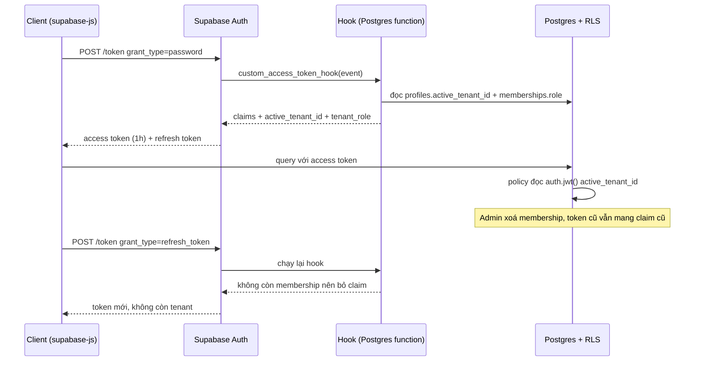

## Bối cảnh & vấn đề

Bản demo đầu tiên của internal platform cần phân quyền "admin thấy màn hình cấu hình, nhân viên thì không". Dev tìm được cách nhanh nhất: lúc đăng ký thì gọi `supabase.auth.signUp({ email, password, options: { data: { role: 'member' } } })`, rồi policy và UI đọc `auth.jwt() -> 'user_metadata' ->> 'role'`. Demo chạy tốt. Hai tuần sau, một nhân viên mở console trình duyệt và gõ:

```ts
await supabase.auth.updateUser({ data: { role: 'admin' } })
await supabase.auth.refreshSession()
```

Từ giây đó, người này là admin. Không có lỗ hổng nào trong Supabase: `user_metadata` được thiết kế để **user tự sửa** (tên hiển thị, avatar). Lỗi nằm ở chỗ team dùng một trường do user kiểm soát làm nguồn cho quyết định phân quyền.

Câu chuyện này mở ra ba câu hỏi mà mọi interviewer cho JD "internal platform, multi-tenant, RBAC" sẽ hỏi: (1) **thông tin quyền nằm ở đâu** để user không tự sửa được, (2) **data model** cho một người thuộc nhiều công ty với vai trò khác nhau trông thế nào, và (3) nếu đưa tenant/role vào JWT cho nhanh thì **trả giá gì** khi quyền thay đổi. Bài này trả lời cả ba bằng GoTrue (Supabase Auth) chạy thật, có Custom Access Token Hook.

Nền tảng chung về JWT, chữ ký, vòng đời token đã có ở [JWT: ký và verify](/tracks/auth-identity/learn/jwt-signing-verification) và [Token lifecycle & revocation](/tracks/auth-identity/learn/token-lifecycle-revocation). Mô hình authorization tổng quát (RBAC, ABAC, ReBAC) ở [Authorization models](/tracks/auth-identity/learn/authorization-models). Ở đây ta chỉ nói phần cụ thể cho Supabase.

## Khái niệm

### Access token và refresh token của Supabase Auth

Khi user đăng nhập, **Supabase Auth** (tên dự án gốc là GoTrue) trả về hai thứ. **Access token** là một JWT ngắn hạn (mặc định 1 giờ, cấu hình được) mà PostgREST, Storage, Realtime đều verify để biết request là ai. **Refresh token** là một chuỗi ngẫu nhiên lưu trong bảng `auth.refresh_tokens`, dùng một lần để đổi lấy cặp token mới. Refresh token bị **rotate**: dùng lại token cũ sẽ nhận `refresh_token_already_used` (output thật ở dưới), đây là cơ chế phát hiện token bị đánh cắp.

Một access token thật do GoTrue v2.197 phát ra trong lab có các claim:

```json
{"aal":"aal1","amr":[{"method":"password","timestamp":1791253003}],
 "app_metadata":{"provider":"email","providers":["email"]},
 "aud":["authenticated"],"email":"dan@example.com","exp":1791256603,"iat":1791253003,
 "is_anonymous":false,"phone":"","role":"authenticated",
 "session_id":"cad4b9d0-935d-43c8-9306-00b8fb8bc86c",
 "sub":"00000004-0000-0000-0000-000000000000",
 "user_metadata":{"email_verified":true}}
```

`sub` là `auth.users.id`, thứ `auth.uid()` trả về. `role` là Postgres role mà PostgREST sẽ `SET ROLE`. `exp - iat = 3600` giây. `session_id` trỏ tới dòng trong `auth.sessions`, thứ bạn xoá khi muốn đăng xuất user khỏi mọi thiết bị.

**Interview angle:** interviewer muốn nghe "access token không thể thu hồi trước khi hết hạn, chỉ refresh token và session thì thu hồi được". Đó là gốc của mọi câu hỏi về claim stale.

### `user_metadata` và `app_metadata`

`auth.users` có hai cột JSON: `raw_user_meta_data` (lộ ra JWT dưới tên `user_metadata`) và `raw_app_meta_data` (`app_metadata`). Khác biệt duy nhất nhưng quyết định: **ai được ghi**.

- `user_metadata`: user tự ghi qua `updateUser({ data })` bằng access token của chính họ. Dùng cho thông tin hồ sơ.
- `app_metadata`: chỉ ghi được bằng admin API (secret/service_role key) hoặc trực tiếp trong DB. User thử ghi sẽ nhận `403 not_admin`.

Output thật khi dan thử cả hai bằng token của mình:

```text
PUT /user {"data":{"role":"admin"}}          -> user_metadata: {"email_verified":true,"role":"admin"}
PUT /user {"app_metadata":{"role":"admin"}}  -> {"code":403,"error_code":"not_admin",
                                                  "msg":"Updating app_metadata requires admin privileges"}
```

Vậy `app_metadata` an toàn cho thông tin hệ thống cấp. Nhưng với internal platform nhiều tenant, nó vẫn chưa đủ: một user thuộc nhiều tenant, mỗi tenant một role, và quyền thay đổi thường xuyên. JSON trong `app_metadata` không có FK, không có constraint, không query join được. **Nguồn sự thật nên là bảng `memberships`**. Claim trong JWT chỉ là bản sao để policy đọc nhanh.

**Interview angle:** câu 004 có red flag rõ ràng: đọc role từ `auth.jwt() -> 'user_metadata'`. Câu trả lời mạnh nêu cả ba tầng: user_metadata (không bao giờ), app_metadata (được, cho cờ đơn giản), bảng memberships (nguồn sự thật).

### Data model tenant + membership

Một người có thể là admin ở công ty A và viewer ở công ty B. Mô hình tối thiểu:

```sql
create type public.tenant_role as enum ('owner','admin','member','viewer');
create table public.tenants (id uuid primary key default gen_random_uuid(), name text not null);
create table public.memberships (
  user_id   uuid not null references auth.users(id) on delete cascade,
  tenant_id uuid not null references public.tenants(id) on delete cascade,
  role      public.tenant_role not null,
  created_at timestamptz not null default now(),
  primary key (user_id, tenant_id)
);
create index on public.memberships (tenant_id);
```

**PK kép `(user_id, tenant_id)`** vừa đảm bảo một user chỉ có một role mỗi tenant, vừa là index cho câu hỏi nóng nhất của RLS ("user này có trong tenant kia không?"). Index phụ `(tenant_id)` phục vụ màn hình "danh sách thành viên". Role **không** nằm trên bảng `users`, vì như vậy một user chỉ có một role cho mọi tenant.

**Interview angle:** red flag của câu 005 là "một cột role trên bảng users". Nói được vì sao PK kép và vì sao cần index thứ hai cho thấy bạn nghĩ tới query thật.

### Composite foreign key mang `tenant_id`

Mọi bảng nghiệp vụ có `tenant_id not null`. Nhưng nếu `tasks.project_id` chỉ tham chiếu `projects(id)`, database vẫn cho phép một task của tenant B trỏ vào project của tenant A: hai cột `tenant_id` lệch nhau mà không constraint nào để ý. Lỗi này thường đến từ import CSV, script backfill, hoặc API nhận `projectId` từ client.

Cách chặn ở tầng DB: `projects` có `unique (tenant_id, id)`, và bảng con dùng **FK kép** `foreign key (tenant_id, project_id) references projects (tenant_id, id)`. Giá phải trả: thêm một unique index trên bảng cha, cột `tenant_id` lặp ở mọi bảng con, và FK rộng hơn một chút. Đổi lại, cả một lớp bug cross-tenant trở thành lỗi `23503` ngay lúc ghi. Chi tiết thiết kế schema pooled ở [Pooled schema design](/tracks/multi-tenancy/learn/pooled-schema-design).

**Interview angle:** follow-up của câu 005 hỏi đúng điểm này: "vì sao đưa tenant_id vào FK, và nó tốn gì?".

### Custom Access Token Hook

**Custom Access Token Hook** là một Postgres function (hoặc HTTP endpoint) mà Supabase Auth gọi **mỗi lần phát access token**: lúc đăng nhập và mỗi lần refresh. Function nhận một `event` jsonb gồm `user_id`, `claims` (các claim sắp ký) và `authentication_method`, rồi trả lại event với `claims` đã sửa. Docs yêu cầu giữ nguyên các claim bắt buộc (`iss`, `aud`, `exp`, `iat`, `sub`, `role`, `aal`, `session_id`, `email`, `phone`, `is_anonymous`).

Hook chạy dưới role `supabase_auth_admin`, nên bạn phải `grant execute` cho role này, `revoke execute` khỏi `authenticated`, `anon`, `public` (để user không gọi hook qua RPC), và cho `supabase_auth_admin` quyền đọc các bảng hook cần (kèm policy nếu bảng bật RLS). Quên grant là lỗi hay gặp nhất: login trả 500 và log GoTrue báo lỗi permission.

**Interview angle:** câu 010 muốn bạn nói được cả cơ chế (hook chạy lúc phát token) lẫn hệ quả (claim chỉ đổi khi token mới được phát).

### Từ role cố định sang permission

Bắt đầu bằng enum `owner/admin/member/viewer` là hợp lý. Vấn đề đến khi tenant đòi "Finance viewer xem được hoá đơn nhưng không xem lương". Nếu code đang viết `if (role === 'admin' || role === 'owner')` ở 80 chỗ, mỗi role mới là 80 chỗ sửa.

Cách tiến hoá không phải viết lại: **code chỉ check permission** (`invoice:read`, `salary:read`), không bao giờ check role trực tiếp. Bảng `role_permissions(role, permission)` map role sang permission. Khi cần custom role theo tenant, đổi enum thành bảng `roles(id, tenant_id, name)` và `memberships.role_id`, còn mọi điểm check vẫn là `can(user, 'salary:read')`. Ở DB, helper `private.has_permission(tenant, perm)` thay cho `has_role`.

RLS hoạt động theo **dòng**. Lương là một **cột**. Muốn ẩn cột với Finance viewer, có ba cách: tách cột nhạy cảm sang bảng riêng `employee_compensation` có policy riêng; expose qua view/RPC không chứa cột đó; hoặc dùng column privilege (`revoke select (salary) on employees from authenticated`), nhưng column privilege áp cho cả role `authenticated` chứ không theo tenant role, nên thường là tách bảng.

**Interview angle:** câu 045 là senior. Điểm cộng: "permission là hằng số trong code, role là dữ liệu", và nhận ra RLS không giải quyết được quyền theo cột.

### UUID hay bigint, timestamp hay timestamptz

**UUID** không đoán được, không lộ số lượng bản ghi (`/invoices/1043` cho biết bạn có khoảng 1000 hoá đơn), sinh được ở client, và cùng kiểu với `auth.users.id`. Nhược điểm: 16 byte so với 8 byte của `bigint`, và UUIDv4 ngẫu nhiên làm insert rải khắp B-tree index. **UUIDv7** đặt timestamp ở đầu nên gần tuần tự, giảm phân mảnh. Postgres 18 có sẵn `uuidv7()`. Postgres 17 (image Supabase trong lab) thì chưa: `ERROR: function uuidv7() does not exist`. Supabase hiện chạy PG17 trên phần lớn project (verify phiên bản project của bạn), nên cần extension hoặc sinh UUIDv7 ở app.

UUID **không** thay authorization. Không đoán được không có nghĩa là không lộ: ID xuất hiện trong URL, log, email, ảnh chụp màn hình. Mọi `/invoices/:id` vẫn cần RLS hoặc check quyền.

**`timestamptz`** lưu một thời điểm tuyệt đối (nội bộ là UTC) và hiển thị theo `timezone` của session. **`timestamp`** (without time zone) chỉ là "giờ treo tường", không biết múi giờ nào. Output thật: cùng chuỗi `2026-03-29 01:30+07` hiển thị `01:30+07` ở session Asia/Ho_Chi_Minh và `19:30+01` (ngày 28) ở Europe/Berlin, còn cột `timestamp` trả `01:30` ở cả hai, không ai biết là giờ ở đâu. Và ngày 2026-03-29 ở Berlin chỉ dài 23 giờ vì DST.

**Interview angle:** câu 048 dễ, nhưng follow-up "UUID có loại bỏ IDOR không?" là chỗ phân loại ứng viên.

## Cơ chế hoạt động

Luồng phát token có hook, và chuyện gì xảy ra khi quyền thay đổi:



Các bước:

1. **Đăng nhập**: Auth verify mật khẩu, dựng bộ claim chuẩn, rồi gọi hook.
2. **Hook** đọc tenant đang active của user (`profiles.active_tenant_id`) và **join với `memberships`** để lấy role. Join là bắt buộc: nếu chỉ đọc `active_tenant_id` mà không kiểm membership, user bị xoá khỏi tenant vẫn nhận claim tenant đó ở lần refresh sau.
3. **Ký token**: Auth ký JWT chứa claim mới. Từ đây claim là **bất biến** tới `exp`.
4. **Query**: policy đọc `auth.jwt() ->> 'active_tenant_id'`, không cần query bảng. Nhanh.
5. **Quyền thay đổi**: admin xoá membership. Không có gì "đẩy" vào token đã phát. Policy dựa trên claim vẫn cho qua tới khi token hết hạn hoặc được refresh.
6. **Refresh**: hook chạy lại, thấy membership không còn, bỏ claim. Token mới không còn quyền.

Chuyển tenant trong UI là cùng cơ chế: ghi lựa chọn vào `profiles.active_tenant_id` (qua Server Action có kiểm membership), rồi gọi `refreshSession()` để lấy token có claim mới. Trong khoảng giữa hai bước đó, mọi cache phía client (React Query, router cache) vẫn chứa dữ liệu tenant cũ: đó là câu trả lời cho follow-up "user đổi tenant mà vài giây vẫn thấy dữ liệu cũ".

## Ví dụ thực tế

Lab: GoTrue `v2.197.0` với `GOTRUE_HOOK_CUSTOM_ACCESS_TOKEN_ENABLED=true` và `GOTRUE_HOOK_CUSTOM_ACCESS_TOKEN_URI=pg-functions://postgres/public/custom_access_token_hook` (trên Supabase cloud bật trong Dashboard → Authentication → Hooks), DB `supabase/postgres:17.11.0.002`, PostgREST `v16.4`. Dữ liệu từ [bài 01](/tracks/mock-internal-platform/learn/supabase-rls-foundations): dan là `member` của Acme và `admin` của Globex.

### 1. Hook thêm tenant và role vào token (chạy thật)

```sql
create table public.profiles (
  user_id uuid primary key references auth.users(id) on delete cascade,
  active_tenant_id uuid references public.tenants(id)
);

create function public.custom_access_token_hook(event jsonb)
returns jsonb language plpgsql stable as $$
declare
  claims jsonb := event->'claims';
  t uuid;
  r public.tenant_role;
begin
  select p.active_tenant_id, m.role into t, r
  from public.profiles p
  join public.memberships m on m.user_id = p.user_id and m.tenant_id = p.active_tenant_id
  where p.user_id = (event->>'user_id')::uuid;

  if t is null then
    claims := claims - 'active_tenant_id' - 'tenant_role';
  else
    claims := jsonb_set(claims, '{active_tenant_id}', to_jsonb(t));
    claims := jsonb_set(claims, '{tenant_role}', to_jsonb(r));
  end if;
  return jsonb_set(event, '{claims}', claims);
end $$;

grant usage on schema public to supabase_auth_admin;
grant execute on function public.custom_access_token_hook to supabase_auth_admin;
revoke execute on function public.custom_access_token_hook from authenticated, anon, public;
grant select on table public.profiles, public.memberships to supabase_auth_admin;
create policy "auth admin reads profiles" on public.profiles for select to supabase_auth_admin using (true);
create policy "auth admin reads memberships" on public.memberships for select to supabase_auth_admin using (true);

-- policy đọc claim, không query bảng
create policy "by claim" on public.invoices for select to authenticated
  using (tenant_id = ((select auth.jwt()) ->> 'active_tenant_id')::uuid);
```

Đăng nhập dan, decode payload: token giờ có `"active_tenant_id":"11111111-1111-1111-1111-111111111111"` và `"tenant_role":"member"` ở top-level, bên cạnh các claim chuẩn ở phần Khái niệm. `GET /invoices` trả hai hoá đơn của Acme: `[{"total":100}, {"total":250}]`.

### 2. Cửa sổ stale sau khi thu hồi quyền (chạy thật)

```sql
delete from public.memberships
where user_id = '00000004-0000-0000-0000-000000000000'
  and tenant_id = '11111111-1111-1111-1111-111111111111';
```

```text
--- OLD token, invoices (policy đọc claim)
[{"total":100}, {"total":250}]
--- OLD token, projects (policy tra memberships qua private.is_member)
[{"name":"Globex audit"}]
--- refresh, rồi decode claim
{}
--- NEW token, invoices
[]
```

Đây là trade-off của câu 010 trong bốn dòng. Bảng `invoices` dùng claim nên dan **vẫn đọc được hoá đơn Acme** bằng token cũ, tối đa 1 giờ. Bảng `projects` dùng lookup nên mất quyền **ngay lập tức** (chỉ còn project Globex). Sau refresh, hook không tìm thấy membership nên bỏ claim, và token mới không đọc được gì.

### 3. Đổi tenant và refresh token rotation (chạy thật)

```sql
update public.profiles set active_tenant_id = '22222222-2222-2222-2222-222222222222'
where user_id = '00000004-0000-0000-0000-000000000000';
```

```text
--- switch tenant + refresh
{"active_tenant_id":"22222222-2222-2222-2222-222222222222","tenant_role":"admin"}
[{"total":999}]
--- reuse old refresh token
{"code":400,"error_code":"refresh_token_already_used","msg":"Invalid Refresh Token: Already Used"}
```

Cùng một user, cùng một session, nhưng role đổi từ `member` sang `admin` vì tenant đổi. Refresh token cũ đã bị rotate nên không dùng lại được.

### 4. Composite FK chặn cross-tenant reference (chạy thật)

```sql
create table public.tasks (
  id uuid primary key default gen_random_uuid(),
  tenant_id uuid not null references public.tenants(id),
  project_id uuid not null,
  title text not null,
  foreign key (tenant_id, project_id) references public.projects (tenant_id, id)
);
insert into public.tasks (tenant_id, project_id, title)
  values ('22222222-2222-2222-2222-222222222222', 'a0000000-0000-0000-0000-000000000001', 'cross-tenant');
```

```text
ERROR:  insert or update on table "tasks" violates foreign key constraint "tasks_tenant_id_project_id_fkey"
DETAIL:  Key (tenant_id, project_id)=(22222222-..., a0000000-...-000000000001) is not present in table "projects".
```

Cùng câu INSERT vào bảng `tasks_loose` (FK chỉ trên `project_id`) thì thành công: `INSERT 0 1`. Một task của Globex trỏ vào project "Acme payroll", và từ đó mọi join `tasks → projects` trong màn hình Globex sẽ kéo tên project của Acme ra.

### 5. Permission helper (chạy thật)

```sql
create table public.role_permissions (
  role public.tenant_role not null, permission text not null, primary key (role, permission)
);
-- owner: invoice:read/write, salary:read, member:invite ; admin: invoice:read/write, member:invite ; ...
create function private.has_permission(t uuid, perm text)
returns boolean language sql stable security definer set search_path = '' as $$
  select exists (select 1 from public.memberships m
                 join public.role_permissions rp on rp.role = m.role
                 where m.user_id = (select auth.uid()) and m.tenant_id = t and rp.permission = perm);
$$;
```

Giả lập bob (admin Globex) bằng `set local role authenticated` + `set_config('request.jwt.claims', ...)`:

```text
  permission   | granted
---------------+---------
 invoice:read  | t
 invoice:write | t
 salary:read   | f
 member:invite | t
```

Policy giờ viết `using (private.has_permission(tenant_id, 'invoice:read'))`, và phía server dùng cùng danh sách permission trong `can(user, 'invoice:read')`. Thêm role "finance-viewer" chỉ là thêm dòng vào `role_permissions` (và một giá trị enum, hoặc một dòng `roles` khi chuyển sang custom role), không sửa policy hay code check nào.

## Trade-offs & lựa chọn thay thế

| Đặt thông tin quyền ở đâu | Đọc nhanh | Thu hồi ngay | User tự sửa? | Ghi chú |
|---|---|---|---|---|
| `user_metadata` | Có (trong JWT) | Không | **Có** | Không bao giờ dùng cho quyền |
| `app_metadata` | Có (trong JWT) | Không, chờ refresh | Không | Hợp cho cờ toàn cục đơn giản (`is_staff`) |
| Claim từ hook | Có | Không, chờ refresh | Không | Hợp cho tenant đang active, role chính |
| Lookup `memberships` trong policy | Một index lookup mỗi câu lệnh | **Có** | Không | Nguồn sự thật, dùng cho thao tác nhạy cảm |

| Mô hình quyền | Ưu | Nhược | Khi nào |
|---|---|---|---|
| Enum role | Đơn giản, dễ đọc policy | Mỗi role mới phải sửa code | ≤ 4 role cố định, giai đoạn đầu |
| Role → permission (bảng) | Thêm role không sửa code | Thêm một join | Khi có role thứ 5 hoặc tenant đòi tuỳ biến |
| ABAC (thuộc tính: phòng ban, người tạo) | Diễn tả rule tinh | Policy phức tạp, khó test | Khi rule phụ thuộc dữ liệu của bản ghi |

Cách chọn thực tế cho internal platform: `memberships` là nguồn sự thật. Claim hook chỉ chứa **tenant đang active** (để policy đọc nhiều chạy nhanh và để UI biết đang ở tenant nào). Các policy cho thao tác ghi, xoá, tiền, đổi quyền thì tra `memberships`/`has_permission` trực tiếp, chấp nhận một index lookup để thu hồi có hiệu lực ngay. Muốn thu hẹp cửa sổ stale cho phần đọc: giảm JWT expiry (ví dụ 10–15 phút, đánh đổi bằng nhiều refresh hơn), và khi admin thu hồi quyền thì gọi admin API sign out user (thu hồi refresh token) để họ không lấy được token mới (verify tên API trong supabase-js phiên bản bạn dùng).

## Edge cases & failure modes

- **Hook lỗi = không ai đăng nhập được**: hook raise exception hoặc thiếu grant thì Auth trả lỗi cho mọi lần login và refresh. Hook phải đơn giản, có test, và xử lý trường hợp user chưa có profile (trả claims gốc, không raise).
- **Hook chậm**: hook chạy trên mọi refresh của mọi user. Một query không index trong hook nhân lên theo số session. Giữ nó là một lookup theo PK.
- **Claim phình to**: nhét danh sách permission hoặc mọi tenant vào JWT làm cookie vượt giới hạn kích thước (cookie ~4 KB, `@supabase/ssr` phải chia cookie thành nhiều phần). Chỉ đưa thứ nhỏ và ổn định vào claim.
- **Token cũ sau khi xoá user**: xoá user trong `auth.users` không vô hiệu access token đã phát. Policy chỉ dựa claim vẫn cho qua tới `exp`. Policy dựa lookup sẽ chặn vì membership bị cascade xoá.
- **Đổi tenant giữa chừng**: một tab đang ở tenant A, tab khác chuyển sang B và refresh. Cookie dùng chung nên tab A giờ gửi token của B trong khi UI vẫn hiển thị A. Server phải đọc tenant từ token đã verify, không từ state của UI, và UI nên nghe sự kiện `onAuthStateChange` để reload.
- **Mời user vào tenant**: invite tạo membership trước khi user có tài khoản. Email chưa xác minh không nên được tự động gán vào membership có sẵn (account linking theo email cần email đã verify).
- **DST và ca làm việc**: lưu `timestamptz`, tính "8 giờ" bằng khoảng thời gian thật, không bằng giờ treo tường.

## Pitfalls

- ❌ Đọc role/tenant từ `user_metadata`. → ✅ `memberships` là nguồn sự thật, claim hook là cache, `app_metadata` chỉ cho cờ hệ thống.
- ❌ Hook chỉ đọc `active_tenant_id` mà không join `memberships`. → ✅ Luôn kiểm membership trong hook, để user bị xoá không nhận lại claim ở lần refresh sau.
- ❌ Policy cho thao tác xoá/đổi quyền dựa hoàn toàn vào claim. → ✅ Thao tác nhạy cảm tra bảng trực tiếp, claim chỉ cho đọc nhiều.
- ❌ Một cột `role` trên bảng users. → ✅ `memberships(user_id, tenant_id, role)` PK kép.
- ❌ FK bảng con chỉ trên `parent_id`. → ✅ `unique (tenant_id, id)` ở cha + FK kép ở con.
- ❌ `if (role === 'admin')` rải khắp code. → ✅ Check permission, map role → permission ở một chỗ.
- ❌ Tin rằng UUID làm IDOR không thể xảy ra. → ✅ UUID giảm enumeration, authorization vẫn bắt buộc.
- ❌ `timestamp` cho thời điểm. → ✅ `timestamptz`, chuyển múi giờ ở lớp hiển thị.

## Tóm tắt

- Access token Supabase là JWT 1 giờ (mặc định) không thu hồi được. Refresh token rotate, dùng lại báo `refresh_token_already_used`.
- `user_metadata` user tự sửa, `app_metadata` chỉ admin sửa (user thử thì `403 not_admin`). Quyền không bao giờ dựa vào `user_metadata`.
- Data model: `tenants`, `memberships(user_id, tenant_id, role)` PK kép, `tenant_id not null` ở mọi bảng, composite FK `(tenant_id, parent_id)`.
- Custom Access Token Hook chạy ở mỗi lần phát token, cần grant cho `supabase_auth_admin` và revoke khỏi user roles. Phải join membership.
- Claim nhanh nhưng stale tới khi refresh. Lookup chậm hơn một chút nhưng thu hồi ngay. Dùng cả hai theo độ nhạy của thao tác.
- Code check permission, không check role. Bảng `role_permissions` cho phép thêm role không sửa code. RLS theo dòng, quyền theo cột cần tách bảng/view.
- UUID (UUIDv7 nếu có PG18) cho ID expose qua API, nhưng không thay authorization. Luôn `timestamptz`.
