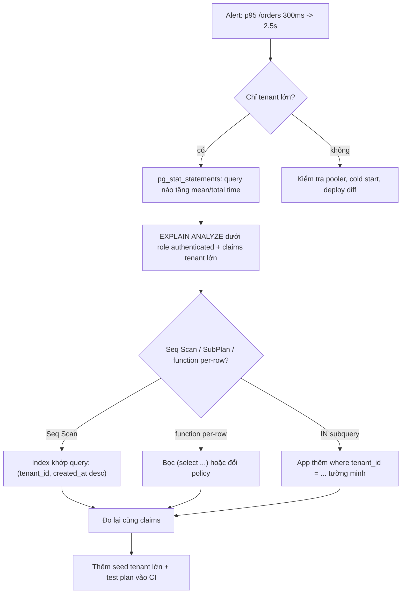
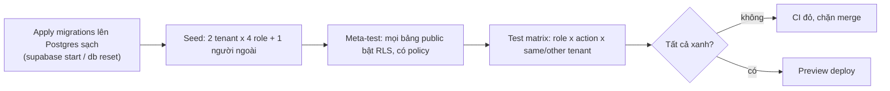

## Bối cảnh & vấn đề

Màn hình "Đơn hàng" của internal platform chạy mượt trên staging: 300 ms. Sau khi khách hàng lớn nhất được onboard (1,6 triệu đơn), cùng màn hình đó mất 4 giây với họ, trong khi các tenant nhỏ vẫn nhanh. Code không đổi. Câu query của app rất đơn giản:

```sql
select * from orders order by created_at desc limit 50;
```

Và policy là đoạn "chuẩn" mà nhiều người copy từ ví dụ trên mạng:

```sql
create policy "tenant read" on orders for select to authenticated
  using (tenant_id in (select tenant_id from memberships where user_id = auth.uid()));
```

Câu hỏi 008 và 029 là phiên bản phỏng vấn của tình huống này. Nó có ba tầng: **vì sao** RLS làm chậm (planner không thấy điều kiện tenant như một hằng số), **đo thế nào** cho đúng (EXPLAIN phải chạy dưới role và claim của user thật, không phải dưới `postgres` vốn bypass RLS), và **chặn tái diễn** ra sao (test và seed tenant lớn trong CI).

Nửa sau của bài nói về mặt còn lại của RLS ở production: làm sao để một regression làm lộ dữ liệu giữa các tenant **làm CI đỏ** (câu 016, 030), soft delete tương tác với RLS thế nào (019), và nếu leak vẫn xảy ra thì giờ đầu tiên của on-call trông ra sao (015). Nền tảng planner và EXPLAIN ở [Planner & EXPLAIN](/tracks/sql-postgres/learn/planner-explain); phần RLS production cho Postgres thuần ở [RLS ở production](/tracks/multi-tenancy/learn/rls-production).

## Khái niệm

### Policy là một điều kiện WHERE bị ẩn

Postgres chèn biểu thức `USING` vào query như một điều kiện lọc, ở bước rewrite, trước khi planner chạy. Planner tối ưu nó như mọi điều kiện khác, với một ràng buộc: điều kiện policy là **security barrier**, nên các hàm không `LEAKPROOF` trong query của user không được đẩy xuống trước nó. Hệ quả thực tế: hiệu năng của RLS **phụ thuộc hoàn toàn vào việc planner có biến điều kiện policy thành một index condition hay không**.

Điều kiện `tenant_id = <giá trị biết trước>` thành `Index Cond` ngon lành. Điều kiện `tenant_id IN (subquery)` thường thành `hashed SubPlan` áp lên một Seq Scan: Postgres đọc toàn bảng rồi lọc. Điều kiện `my_function(tenant_id)` là tệ nhất: function được gọi **mỗi dòng**.

**Interview angle:** câu "vì sao RLS chậm" muốn nghe "policy là WHERE ẩn, planner phải biết giá trị tenant để dùng index".

### initPlan: `(select auth.uid())`

`auth.uid()` và `auth.jwt()` là function `STABLE`: kết quả không đổi trong một câu lệnh, nhưng Postgres không bắt buộc phải gọi chúng một lần. Khi bọc trong `(select ...)`, planner biến nó thành **InitPlan**: một subquery không phụ thuộc dòng nào, chạy **đúng một lần** trước câu lệnh, kết quả dùng như hằng số. Supabase docs khuyến nghị cách này cho mọi lời gọi `auth.*` trong policy.

Trong lab, hai cách viết cùng dùng index, nhưng bản bọc `select` chạy 0,095 ms so với 1,15 ms vì không phải phân tích lại JSON claim. Khác biệt lớn thật sự xuất hiện khi function không inline được hoặc được gọi trên hàng triệu dòng, như helper `is_member(tenant_id)` gọi per-row ở dưới: **23 giây**.

**Interview angle:** nói được tên "initPlan" và vì sao nó giúp là dấu hiệu bạn đã đọc plan, không chỉ copy khuyến nghị.

### EXPLAIN dưới đúng role

Chạy `explain analyze` trong SQL editor dưới role `postgres` là đo **sai**: `postgres` có BYPASSRLS nên plan không chứa policy. Phải giả lập request y như PostgREST làm, trong một transaction:

```sql
begin;
set local role authenticated;
select set_config('request.jwt.claims',
  '{"sub":"00000001-0000-0000-0000-000000000000","role":"authenticated"}', true);
explain (analyze, buffers) select * from orders order by created_at desc limit 50;
rollback;
```

Dùng claims của **tenant lớn nhất**, vì plan của tenant 50 dòng nói rất ít về tenant 1,6 triệu dòng. Supabase cũng cho phép `.explain()` từ supabase-js khi bật trong cấu hình (verify: mặc định tắt, chỉ nên bật ở môi trường không phải prod).

**Interview angle:** follow-up của 008 là đúng câu này: "làm sao EXPLAIN với policy được áp?".

### Test matrix cho RLS

**Test matrix** là bảng kỳ vọng: role (owner, admin, member, viewer, người ngoài) × thao tác (select, insert, update, delete) × phạm vi (cùng tenant, tenant khác). Mỗi ô là một kỳ vọng cụ thể: thấy N dòng, 0 dòng, hay lỗi `42501`. Ô quan trọng nhất là "tenant khác": đó là ô bắt leak.

Test chạy trên **Postgres thật** đã apply đủ migration, vì logic bảo mật nằm trong policy và function SQL. Mock supabase-js để test quyền là test rỗng: nó chứng minh code gọi đúng hàm, không chứng minh DB chặn được. Công cụ tự nhiên là **pgTAP** (extension test cho Postgres, Supabase CLI chạy bằng `supabase test db`), hoặc test TypeScript ký JWT test rồi gọi qua supabase-js tới stack local.

**Interview angle:** câu 016 chấm hai điểm: Postgres thật và ô "tenant khác". Câu 030 thêm: "không test cái gì" (mock DB cho quyền, snapshot tràn lan).

### Meta-test

Test matrix chỉ bảo vệ bảng **đã có test**. Bảng mới thêm tuần sau không có ai viết test. **Meta-test** là test về schema: "mọi bảng trong `public` phải bật RLS", "mọi bảng phải có ít nhất một policy", "không view nào thiếu `security_invoker`". Nó fail khi ai đó thêm bảng mà quên guardrail, kể cả khi không ai nhớ viết test. Trong lab, meta-test bắt được bốn bảng thật mà chính bài này quên bật RLS.

**Interview angle:** follow-up "giữ matrix khỏi thành gánh nặng thế nào?" trả lời bằng meta-test + sinh test từ bảng kỳ vọng.

### Soft delete và RLS

**Soft delete** là đánh dấu `deleted_at` thay vì xoá dòng. Nó va với ba thứ. (1) **Unique constraint**: `unique (tenant_id, email)` vẫn tính dòng đã xoá, nên tạo lại cùng email bị `23505`. Fix bằng **partial unique index** `... where deleted_at is null`. (2) **RLS**: nếu policy SELECT có `deleted_at is null` (để user không thấy dòng đã xoá), thì UPDATE set `deleted_at` có thể bị chặn vì dòng mới không còn "nhìn thấy được". Trong lab trên PG17, câu update đó lỗi `new row violates row-level security policy` ngay cả khi **không** có `RETURNING`. Fix: soft delete qua function `security definer` có check quyền, hoặc tách điều kiện `deleted_at` ra khỏi SELECT policy và lọc ở view `security_invoker`. (3) **FK và luật xoá dữ liệu**: FK không biết soft delete, và soft delete không phải là xoá theo nghĩa GDPR.

**Interview angle:** câu 019 là gotcha. Điểm phân loại là phần (2): ít người biết policy SELECT ảnh hưởng tới UPDATE.

## Cơ chế hoạt động

Quy trình điều tra một trang chậm "chỉ với tenant lớn", và pipeline CI ngăn nó tái diễn:



Giải thích:

1. **Khoanh vùng theo tenant** trước: nếu chỉ tenant lớn chậm, nghi ngay query phụ thuộc số dòng (seq scan, sort không index, function per-row, `count(*)` chính xác). Nếu mọi tenant đều chậm, nghi hạ tầng (pooler hết slot, cold start, region).
2. **`pg_stat_statements`** (Supabase Dashboard có trang Query Performance dựa trên nó) cho biết query nào tăng `mean_exec_time` sau deploy.
3. **EXPLAIN dưới đúng role** để thấy plan có policy.
4. Đọc plan tìm ba mẫu: `Seq Scan` + `Rows Removed by Filter` lớn, `hashed SubPlan` từ `IN (subquery)`, hoặc `Filter: private.some_fn(tenant_id)`.
5. Fix theo mẫu, đo lại cùng claims, rồi đưa vào CI để không tái diễn.

Pipeline test RLS trong CI:



## Ví dụ thực tế

Lab: `supabase/postgres:17.11.0.002`, bảng `orders` 2 triệu dòng, tenant Acme chiếm 1,6 triệu, 18 tenant nhỏ chia 400 nghìn. Alice là owner Acme, bob là admin Globex (0 đơn).

### 1. Bảy phiên bản policy, bảy plan (chạy thật)

Query app giữ nguyên: `select * from orders order by created_at desc limit 50`. Mọi plan chạy trong transaction `set local role authenticated` + claims của alice.

**A. Policy gốc, không index `tenant_id`:**

```text
Limit (actual time=893.875..893.883 rows=50 loops=1)
  ->  Sort  Sort Method: top-N heapsort  Memory: 28kB
        ->  Seq Scan on orders (actual time=0.847..702.028 rows=1600000 loops=1)
              Filter: (ANY (tenant_id = (hashed SubPlan 1).col1))
              Rows Removed by Filter: 400000
Execution Time: 893.980 ms
```

Với bob (0 đơn), vẫn quét đủ 2 triệu dòng để tìm ra không có gì: `Rows Removed by Filter: 2000000`, 179 ms. Seq scan đọc toàn bảng bất kể tenant lớn hay nhỏ.

**B. Thêm index `(tenant_id, created_at desc)`, policy giữ nguyên:** vẫn `Seq Scan`, 648 ms. Index vô dụng vì planner không biết giá trị tenant lúc lập plan: `IN (subquery)` thành hashed SubPlan lọc sau khi quét.

**C. Policy `using (private.is_member(tenant_id))`, gọi helper trên từng dòng:**

```text
Seq Scan on orders (actual time=0.819..22994.858 rows=1600000 loops=1)
  Filter: private.is_member(tenant_id)
Execution Time: 23394.306 ms
```

**23 giây.** Helper security definer không inline được, nên chạy 2 triệu lần. Đây là bẫy khi ai đó "tối ưu" policy bằng cách đổi subquery thành helper mà không đọc plan.

**D. Policy đọc claim, không bọc:** `using (tenant_id = (auth.jwt() ->> 'active_tenant_id')::uuid)`

```text
Index Scan using orders_tenant_created_idx on orders (actual time=1.014..1.018 rows=50 loops=1)
  Index Cond: (tenant_id = (((COALESCE(NULLIF(current_setting('request.jwt.claim', true), '') ...
Execution Time: 1.154 ms
```

**E. Policy đọc claim, bọc `(select auth.jwt())`:**

```text
InitPlan 1
->  Index Scan using orders_tenant_created_idx on orders (actual time=0.033..0.037 rows=50 loops=1)
      Index Cond: (tenant_id = (((InitPlan 1).col1 ->> 'active_tenant_id'))::uuid)
Execution Time: 0.095 ms
```

**F. Policy `tenant_id in (select private.my_tenant_ids())`** (helper trả `setof uuid`, cách hỗ trợ user nhiều tenant), query app không filter: lại `Seq Scan`, 721 ms.

**G. Cùng policy F, nhưng app thêm `where tenant_id = '1111...'`:**

```text
Index Scan using orders_tenant_created_idx on orders (actual time=0.356..0.364 rows=50 loops=1)
  Index Cond: (tenant_id = '11111111-1111-1111-1111-111111111111'::uuid)
  Filter: (ANY (tenant_id = (hashed SubPlan 1).col1))
Execution Time: 0.404 ms
```

Bảng tóm tắt (cùng dữ liệu, cùng user):

| Phiên bản | Plan | Thời gian |
|---|---|---|
| A. IN subquery, không index | Seq Scan + hashed SubPlan | 894 ms |
| B. A + index | Seq Scan (index không dùng được) | 648 ms |
| C. helper per-row | Seq Scan, function 2M lần | 23 394 ms |
| D. claim, không bọc | Index Scan | 1,15 ms |
| E. claim, `(select ...)` | InitPlan + Index Scan | 0,095 ms |
| F. `IN (select helper())` | Seq Scan + hashed SubPlan | 722 ms |
| G. F + app filter tường minh | Index Scan, policy thành Filter phụ | 0,40 ms |

Bài học: policy lo **bảo mật**, query app lo **hiệu năng**. Khi policy phải hỗ trợ user nhiều tenant (F), app vẫn nên gửi `where tenant_id = <tenant đang active>` (Supabase docs cũng khuyên thêm filter tường minh). Policy lúc đó chỉ còn là lưới an toàn rẻ tiền. Nếu app quên filter, kết quả vẫn **đúng** (chỉ chậm), chứ không lộ.

### 2. pgTAP test matrix + meta-test (chạy thật)

```sql
begin;
select plan(6);

select is_empty($$
  select c.relname from pg_class c join pg_namespace n on n.oid = c.relnamespace
  where n.nspname = 'public' and c.relkind = 'r' and not c.relrowsecurity
$$, 'every public table has RLS enabled');

set local role authenticated;
select set_config('request.jwt.claims', '{"sub":"00000001-0000-0000-0000-000000000000","role":"authenticated"}', true);
select results_eq($$ select count(*)::int from projects $$, array[2], 'alice sees 2 Acme projects');
select is_empty($$ select 1 from projects where tenant_id = '22222222-2222-2222-2222-222222222222' $$,
  'alice cannot read Globex');
select throws_ok($$ insert into projects (tenant_id, name) values ('22222222-2222-2222-2222-222222222222', 'x') $$,
  '42501', null, 'alice cannot insert into Globex');

select set_config('request.jwt.claims', '{"sub":"00000003-0000-0000-0000-000000000000","role":"authenticated"}', true);
select throws_ok($$ insert into projects (tenant_id, name) values ('11111111-1111-1111-1111-111111111111', 'x') $$,
  '42501', null, 'viewer cannot insert');
select is_empty($$ update projects set name = 'hacked' returning 1 $$, 'viewer update touches 0 rows');

select * from finish();
rollback;
```

```text
1..6
not ok 1 - every public table has RLS enabled
# Failed test 1: "every public table has RLS enabled"
#     Unexpected records:
#         (audit_tmp)
#         (tasks_loose)
#         (tasks)
#         (role_permissions)
ok 2 - alice sees 2 Acme projects
ok 3 - alice cannot read Globex
ok 4 - alice cannot insert into Globex
ok 5 - viewer cannot insert
ok 6 - viewer update touches 0 rows
# Looks like you failed 1 test of 6
```

Test 1 đỏ là **đúng**: trong hai bài trước, lab đã tạo `tasks`, `tasks_loose`, `role_permissions` để minh hoạ composite FK và permission mà quên bật RLS. Với project còn default grant, `role_permissions` đang cho `anon` sửa bảng phân quyền. Không test matrix nào bắt được lỗi này, vì không ai viết test cho bảng mới. Meta-test thì bắt được.

Trong repo thật, file này nằm ở `supabase/tests/database/*.sql` và chạy bằng `supabase test db` sau `supabase db reset` (verify đường dẫn mặc định theo CLI version). Mỗi test bọc trong `begin ... rollback` nên không để lại dữ liệu.

### 3. Soft delete đụng SELECT policy (chạy thật)

```sql
create unique index customers_email_live on customers (tenant_id, lower(email)) where deleted_at is null;
create policy sel on customers for select to authenticated
  using (private.is_member(tenant_id) and deleted_at is null);
create policy upd on customers for update to authenticated
  using (private.is_member(tenant_id)) with check (private.is_member(tenant_id));
-- dưới role authenticated, claims của alice:
update customers set deleted_at = now() where email = 'a@x.vn';
```

```text
ERROR:  new row violates row-level security policy for table "customers"
```

`WITH CHECK` của policy UPDATE thỏa. Nhưng dòng sau update (`deleted_at` có giá trị) không còn thỏa SELECT policy, và Postgres 17 từ chối. Cách xử lý thường dùng là function `private.soft_delete_customer(id)` security definer, tự kiểm `has_permission(tenant, 'customer:delete')`, rồi update dưới quyền owner.

## Trade-offs & lựa chọn thay thế

| Cách viết policy tenant | Tốc độ | Thu hồi quyền | Hỗ trợ nhiều tenant cùng lúc | Ghi chú |
|---|---|---|---|---|
| Claim `active_tenant_id`, bọc `(select)` | Nhanh nhất, index trực tiếp | Chờ refresh token | Không (một tenant active) | Hợp cho bảng đọc nhiều |
| `IN (select helper_setof())` | Chậm nếu app không filter | Ngay | Có | Bắt buộc app filter tường minh |
| Helper boolean gọi per-row | Rất chậm trên bảng lớn | Ngay | Có | Chỉ cho bảng nhỏ hoặc khi có điều kiện index khác |
| Subquery inline | Như IN helper, cộng RLS của memberships | Ngay | Có | Tránh trên bảng có RLS chéo |

| Tầng test | Test gì | Không test gì | Chạy ở đâu |
|---|---|---|---|
| Unit (Vitest) | Rule thuần: permission map, state machine, tính tiền | Truy cập DB | Mỗi commit, giây |
| Integration DB (pgTAP/TS + Postgres thật) | RLS matrix, meta-test, constraint, RPC, migration từ đầu | UI | Mỗi PR, vài phút |
| Server Action/Route Handler | 401/403/400 theo role, validation | Chi tiết render | Mỗi PR |
| E2E (Playwright) | Login, tạo + duyệt request, đổi tenant | Mọi nhánh logic | Trên preview deploy |

Khi nào chọn gì: tầng integration với Postgres thật là tầng **quan trọng nhất** trên Supabase, vì logic bảo mật nằm trong DB. Giữ CI dưới 10 phút bằng cách tái dùng một DB đã migrate, bọc mỗi test trong transaction rollback, chạy song song theo schema hoặc theo file, và chỉ chạy E2E cho vài luồng sống còn. Coverage là tín hiệu, không phải mục tiêu. Chi tiết chiến lược test tenant isolation ở [Testing: auth & tenant isolation](/tracks/testing/learn/auth-tenant-isolation).

## Edge cases & failure modes

- **Plan staging khác prod**: staging thiếu tenant lớn nên thống kê khác, planner chọn plan khác. Các nguyên nhân khác: `ANALYZE` chưa chạy sau import lớn, khác cấu hình (`work_mem`, `random_page_cost`), bloat, khác phiên bản Postgres, generic plan của prepared statement. Seed một tenant lớn ở staging và so plan.
- **Test pass nhưng vô nghĩa**: test chạy dưới `service_role` hoặc `postgres` luôn pass vì bypass. Assert đầu tiên của suite nên là `select current_user = 'authenticated'`.
- **`count(*)` chính xác cho phân trang**: với tenant 1,6 triệu dòng, đếm chính xác là quét index lớn. Dùng keyset pagination và `count` ước lượng hoặc "1000+".
- **Claim stale trong test**: test dùng `set_config` nên không bao giờ gặp stale claim. Cửa sổ stale phải được test ở mức integration với Auth thật (xem [bài 02](/tracks/mock-internal-platform/learn/auth-claims-tenancy-rbac)).
- **Leak qua đường không phải bảng**: cache key thiếu tenant, view, materialized view, Storage, Realtime. Test matrix trên bảng không bắt được. Đó là lý do có meta-test cho view và test riêng cho từng kênh.
- **Incident leak**: khi khách báo thấy dữ liệu công ty khác, mỗi phút debug là thêm dữ liệu lộ. Thứ tự đúng là **contain → scope → fix → notify → prevent**:
  1. *Contain* (phút 0–10): tắt feature flag hoặc instant rollback trên Vercel. Nếu nguyên nhân là migration (view mới, policy bị drop), rollback code không đủ: revoke quyền trên object đó ngay (`revoke select on view ... from authenticated`).
  2. *Scope* (phút 10–40): xác định object và khoảng thời gian, dùng request log có `tenant_id`/`user_id` và API/Postgres logs của Supabase để biết ai đọc gì.
  3. *Fix + test tái hiện*: viết test "user A đọc invoice B nhận 0 dòng", fix, deploy.
  4. *Notify*: báo lead/security theo quy trình. Nghĩa vụ báo cáo pháp lý (GDPR 72 giờ với dữ liệu cá nhân EU, luật địa phương khác) do người có thẩm quyền quyết định (verify áp dụng).
  5. *Prevent*: postmortem không đổ lỗi, thêm guardrail tự động (meta-test view `security_invoker`, lint cấm admin client trong request path).

## Pitfalls

- ❌ Tắt RLS "vì chậm". → ✅ Đọc plan dưới đúng role, thêm index và filter tường minh. RLS đúng cách tốn dưới 1 ms.
- ❌ `explain analyze` trong SQL editor dưới `postgres`. → ✅ `set local role authenticated` + `set_config('request.jwt.claims', ...)` của tenant lớn nhất.
- ❌ Đổi subquery thành helper boolean `is_member(tenant_id)` cho bảng triệu dòng. → ✅ Claim bọc `(select)`, hoặc `IN (select helper())` kèm app filter.
- ❌ Gọi `auth.uid()` trần trong policy. → ✅ `(select auth.uid())` để thành InitPlan.
- ❌ Test quyền bằng mock supabase-js. → ✅ Postgres thật, test matrix có ô "tenant khác".
- ❌ Chỉ test bảng đang có. → ✅ Meta-test cho mọi bảng/view trong schema expose.
- ❌ `unique (tenant_id, email)` với soft delete. → ✅ Partial unique index `where deleted_at is null`.
- ❌ Đọc code một giờ khi leak vẫn đang diễn ra. → ✅ Contain trước, debug sau.

## Tóm tắt

- Policy là WHERE ẩn. Hiệu năng phụ thuộc planner có biến điều kiện tenant thành `Index Cond` không.
- Lab 2 triệu dòng: `IN (subquery)` 894 ms, helper per-row 23 giây, claim bọc `(select)` + index 0,095 ms, policy nhiều tenant + app filter 0,40 ms.
- Index khớp query phổ biến: `(tenant_id, created_at desc)`. App luôn gửi filter tenant tường minh, policy là lưới an toàn.
- EXPLAIN phải chạy dưới role `authenticated` với claims thật, của tenant lớn nhất.
- RLS test chạy trên Postgres thật: test matrix role × action × cùng/khác tenant, cộng meta-test bắt bảng quên RLS.
- Soft delete: partial unique index, SELECT policy có `deleted_at is null` chặn UPDATE soft delete, dùng function definer.
- Incident leak: contain → scope → fix + test → notify → prevent.
