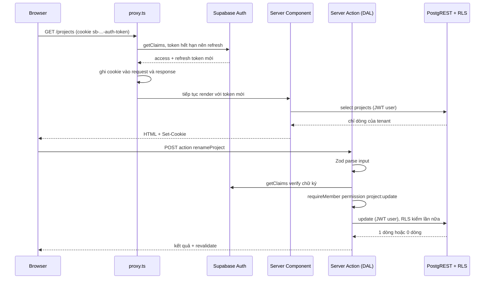

## Bối cảnh & vấn đề

Một team bảo vệ toàn bộ khu vực `/admin` bằng một file:

```ts
// proxy.ts (Next 16, trước đây là middleware.ts)
export async function proxy(request: NextRequest) {
  const user = await getUserFromCookie(request)
  if (!user && request.nextUrl.pathname.startsWith('/admin')) {
    return NextResponse.redirect(new URL('/login', request.url))
  }
}
```

Reviewer chỉ ra ba lỗ hổng trong một buổi: (1) Server Action `deleteMember` được gọi trực tiếp bằng `POST` tới bất kỳ trang nào, không đi qua `/admin`, (2) matcher của proxy loại `/api/*` để "tránh chậm", nên Route Handler `/api/members` không được bảo vệ, (3) `getUserFromCookie` dùng `supabase.auth.getSession()`, thứ đọc session từ cookie mà **không verify chữ ký**: ai tự viết cookie cũng thành người dùng đó.

Lỗi thứ ba nghe như lý thuyết, nên bài này chạy thật: tự ký một access token bằng secret bịa ra, nhét vào "cookie", và xem ba API `getSession`, `getUser`, `getClaims` phản ứng khác nhau thế nào. Sau đó ta dựng lại cấu trúc đúng: proxy chỉ refresh session, mọi Server Action và Route Handler tự xác thực qua một **Data Access Layer**, input được Zod parse, type sinh từ DB, và OAuth Google chạy bằng PKCE.

Kiến thức nền Next.js ở các bài của track Next.js: [Proxy](/tracks/nextjs/learn/proxy), [Server Actions](/tracks/nextjs/learn/server-actions), [Auth & data security](/tracks/nextjs/learn/auth-data-security). PKCE và OAuth tổng quát ở [Authorization Code + PKCE](/tracks/auth-identity/learn/authorization-code-pkce).

## Khái niệm

### `@supabase/ssr` và session trong cookie

Ở SPA thuần, supabase-js lưu session trong `localStorage`. Với App Router, server cần biết user là ai khi render Server Component, nên session phải nằm trong **cookie** đi kèm mọi request. Package **`@supabase/ssr`** cung cấp `createBrowserClient` (Client Component) và `createServerClient` (Server Component, Server Action, Route Handler, proxy). Server client nhận một adapter cookie gồm `getAll()` và `setAll()`.

```ts
// lib/supabase/server.ts
import 'server-only'
import { cookies } from 'next/headers'
import { createServerClient } from '@supabase/ssr'
import type { Database } from '@/types/database'

export async function createClient() {
  const cookieStore = await cookies() // Next 15+: cookies() là async
  return createServerClient<Database>(
    process.env.NEXT_PUBLIC_SUPABASE_URL!,
    process.env.NEXT_PUBLIC_SUPABASE_PUBLISHABLE_KEY!,
    {
      cookies: {
        getAll: () => cookieStore.getAll(),
        setAll: (list) => {
          try { list.forEach(({ name, value, options }) => cookieStore.set(name, value, options)) }
          catch { /* gọi từ Server Component: không ghi được cookie, proxy sẽ lo */ }
        },
      },
    },
  )
}
```

Khối `try/catch` không phải trang trí: **Server Component không ghi được cookie**. Nếu access token hết hạn khi đang render, client refresh được token mới nhưng không lưu được, và request sau lại phải refresh với refresh token đã bị rotate. Đó là lý do cần proxy.

**Interview angle:** "vì sao Supabase + App Router cần proxy/middleware?" Câu trả lời: Server Component không set cookie được, nên phải có một chỗ chạy trước render để refresh token và ghi cookie mới.

### Proxy: refresh session, không phải lớp authorization

Next 16 đổi tên `middleware.ts` thành **`proxy.ts`** (export function `proxy`, convention `middleware` bị deprecate). Với Supabase, proxy làm một việc: tạo server client trên request, gọi `supabase.auth.getClaims()` (docs Supabase hiện dùng hàm này trong proxy) để kích hoạt refresh nếu cần, rồi ghi cookie mới vào **cả** request (để Server Component phía sau thấy token mới) **và** response (để browser lưu).

Proxy có thể redirect sớm user chưa login về `/login` cho UX tốt, nhưng **không được là lớp bảo mật duy nhất**. Ba lý do: matcher có thể bỏ sót route; Server Action là POST tới chính URL trang, nên logic theo pathname dễ sai; và proxy từng có lỗ hổng bypass thật (CVE-2025-29927, header `x-middleware-subrequest` khiến middleware bị bỏ qua trên các bản Next chưa vá). Next docs về proxy cũng nói rõ không nên dựa vào shared modules hay globals trong proxy, và mọi quyết định truy cập nên được kiểm lại gần dữ liệu.

**Interview angle:** câu 012 có red flag "ẩn nút trên UI là đủ". Câu trả lời mạnh nêu cả ba lý do trên và chỉ ra nơi check đúng: DAL.

### `getSession`, `getUser`, `getClaims`

Ba hàm trả lời câu "ai đang gọi" với mức tin cậy khác nhau:

- **`getSession()`**: đọc session từ storage (ở server là cookie) và trả về. Nó **không** verify chữ ký access token. Docs Supabase: "Never trust `supabase.auth.getSession()` inside server code. It reads the session out of the cookie without revalidating it."
- **`getUser()`**: gửi access token tới Auth server (`GET /user`). Auth verify chữ ký, kiểm session còn sống, trả user mới nhất từ DB. Chắc chắn nhất, nhưng tốn một network round-trip mỗi lần.
- **`getClaims()`**: verify JWT và trả claims. Với **asymmetric signing key** (RS256/ES256), nó verify **local** bằng JWKS (`/.well-known/jwks.json`, có cache), không cần round-trip. Với **symmetric key** (HS256, cấu hình legacy), nó luôn gọi Auth server, giống `getUser`. Lưu ý `getClaims` chỉ kiểm chữ ký và hạn: một session đã bị logout nhưng token chưa hết hạn vẫn có claims hợp lệ, còn `getUser` thì phát hiện được.

Pattern hiện tại: proxy gọi `getClaims()` để refresh, DAL gọi `getClaims()` cho request thường, và `getUser()` cho thao tác cực nhạy cảm nếu cần chắc rằng session chưa bị thu hồi. Dù chọn gì, **RLS vẫn verify JWT lần nữa ở PostgREST**, nên dữ liệu được bảo vệ ngay cả khi code server lỡ tin `getSession`. Thứ bị ảnh hưởng là các quyết định server làm **ngoài** DB: gọi API bên thứ ba, dùng admin client, render trang admin.

**Interview angle:** câu 011. Điểm cộng: biết `getClaims` verify local chỉ khi dùng asymmetric key, và biết RLS là lớp chặn cuối.

### Server Action là public endpoint

Mỗi Server Action được export là một endpoint nhận `POST`. Next tạo action ID mã hoá, không đoán được và đổi giữa các build, và loại action không dùng khỏi bundle. Nhưng docs Next ghi rõ: vẫn phải "treat Server Actions as reachable via direct POST requests and verify authentication and authorization inside each one." Action ID xuất hiện trong bundle client của trang dùng nó, nên ai có quyền mở trang (hoặc từng mở) đều lấy được.

Cách làm cho lớp check không thể bị quên là **Data Access Layer (DAL)**: một thư mục `server/` có `import 'server-only'`, mọi hàm truy cập dữ liệu đều bắt đầu bằng `requireMember({ permission })`. Server Action chỉ làm ba việc: parse input bằng Zod, gọi DAL, `revalidatePath/Tag`. Lint rule (ví dụ `no-restricted-imports`) cấm file `'use server'` import supabase client trực tiếp.

**Interview angle:** follow-up "làm sao để dev mới không thể thêm action bỏ qua check?" chờ câu trả lời có tính **cưỡng chế**: DAL + lint + test, không phải "nhắc trong code review".

### Zod ở biên, type sinh từ DB

TypeScript chỉ tồn tại lúc compile. `(await req.json()) as Body` không kiểm gì cả: body có thể thiếu field, sai kiểu, hoặc chứa `role: 'owner'`. **Zod** parse dữ liệu không tin cậy lúc runtime và cho type qua `z.infer`. Mọi biên đều cần nó: form, Server Action, Route Handler, webhook, env var.

Phía DB, `supabase gen types typescript` sinh type `Database` từ schema thật. Đặt bước sinh type trong CI rồi `git diff --exit-code`: migration đổi cột mà code chưa đổi thì typecheck đỏ. Constraint trong DB (`NOT NULL`, `CHECK`, FK) là lớp cuối. Zod là UX và fail sớm. Hai thứ có thể lệch nhau: Zod bắt buộc `email` nhưng cột cho phép NULL và dữ liệu cũ có NULL, thế là form sửa bản ghi cũ không submit được, hoặc code đọc `row.email.toLowerCase()` crash. Type sinh từ DB sẽ cho `string | null`, buộc bạn xử lý.

**Interview angle:** câu 024 và 031. Red flag kinh điển là "chỉ thiếu try/catch".

### Google OAuth qua Supabase với PKCE

Luồng "Sign in with Google" trong App Router:

1. Client gọi `supabase.auth.signInWithOAuth({ provider: 'google', options: { redirectTo: `${origin}/auth/callback` } })`. Supabase client sinh **code verifier** (PKCE), lưu trong cookie, gửi **code challenge** đi.
2. Browser tới Google, user đồng ý, Google redirect về callback **của Supabase** (`https://<project>.supabase.co/auth/v1/callback`, URL phải có trong Authorized redirect URIs ở Google Cloud Console).
3. Supabase redirect tiếp về `redirectTo` của app kèm `?code=...`, **chỉ khi** `redirectTo` khớp **Redirect URLs allow-list**. Không khớp thì Supabase rơi về **Site URL** mặc định.
4. Route Handler `/auth/callback` gọi `supabase.auth.exchangeCodeForSession(code)` bằng server client: gửi code + verifier, nhận session, ghi cookie, redirect vào app.

Ba chỗ hay hỏng: Google Console thiếu callback URI của Supabase; allow-list thiếu `localhost` hoặc URL preview (preview login xong lại về production, đúng triệu chứng follow-up của câu 006); callback route dùng client không ghi cookie được. Với internal platform chỉ cho nhân viên một Google Workspace, kiểm domain ở **server** (Auth Hook hoặc callback): claim `hd` hoặc domain của email đã verify. Tham số `hd` trong URL đăng nhập chỉ là gợi ý UI, không phải kiểm soát.

**Interview angle:** câu 050 dễ, follow-up "chỉ cho domain công ty" là chỗ phân loại: kiểm ở browser là red flag.

## Cơ chế hoạt động

Luồng một request có session sắp hết hạn, đi qua proxy, render Server Component, rồi gọi Server Action:



Đọc sơ đồ:

1. **Proxy** là nơi duy nhất vừa đọc vừa ghi cookie trước render. Nó refresh token và ghi cookie vào request (cho Server Component) và response (cho browser). Quên ghi vào request thì Server Component thấy token cũ. Quên ghi vào response thì browser giữ refresh token đã rotate, request sau bị đăng xuất.
2. **Server Component** đọc dữ liệu bằng client mang JWT của user. RLS lọc theo tenant.
3. **Server Action** là một POST độc lập: nó không "kế thừa" bất kỳ kiểm tra nào của trang đã render nó. Thứ tự trong action: parse input → xác thực → phân quyền theo permission → ghi bằng client của user → RLS kiểm lần cuối.
4. **Ba lớp**: proxy (UX, refresh), DAL (authn + authz nghiệp vụ), RLS (tenant isolation ở DB). Mỗi lớp độc lập, nên một lớp sai không làm lộ dữ liệu.

## Ví dụ thực tế

### 1. Cookie giả mạo: getSession tin, getUser/getClaims không (chạy thật)

Lab: GoTrue `v2.197.0` (HS256, cấu hình giống project dùng legacy JWT secret), `@supabase/auth-js 2.117.2`. Kẻ tấn công tự ký access token với `sub` của alice bằng một secret bịa, đặt vào storage mà server client đọc (tương đương cookie `sb-<ref>-auth-token`):

```ts
import { AuthClient } from '@supabase/auth-js'
import { sign } from './jwt.mjs' // HMAC-SHA256 JWT signer, 8 dòng

const now = Math.floor(Date.now() / 1000)
const forged = sign({ sub: '00000001-0000-0000-0000-000000000000', role: 'authenticated', aud: 'authenticated',
  email: 'alice@example.com', exp: now + 3600, iat: now, session_id: 'x' }, 'attacker-secret-not-the-real-one-000000')
const session = { access_token: forged, refresh_token: 'fake', token_type: 'bearer', expires_in: 3600,
  expires_at: now + 3600, user: { id: '00000001-0000-0000-0000-000000000000', email: 'alice@example.com' /* ... */ } }

const store = new Map([['sb-lab-auth-token', JSON.stringify(session)]])
const auth = new AuthClient({ url: 'http://localhost:59999', storageKey: 'sb-lab-auth-token',
  autoRefreshToken: false, persistSession: true,
  storage: { getItem: (k) => store.get(k) ?? null, setItem: (k, v) => store.set(k, v), removeItem: (k) => store.delete(k) } })

const s = await auth.getSession()
console.log('getSession ->', s.data.session?.user.email, '| error:', s.error?.message ?? null)
const u = await auth.getUser()
console.log('getUser    ->', u.data.user?.email ?? null, '| error:', u.error?.status, u.error?.message)
const c = await auth.getClaims()
console.log('getClaims  ->', c.data?.claims?.sub ?? null, '| error:', c.error?.status ?? '', c.error?.message ?? null)
```

```text
getSession -> alice@example.com | error: null
getUser    -> null | error: 403 invalid JWT: unable to parse or verify signature, token signature is invalid: signature is invalid
getClaims  -> null | error: 403 invalid JWT: unable to parse or verify signature, token signature is invalid: signature is invalid
```

`getSession` vui vẻ trả về "alice". Nếu code server dùng kết quả đó để quyết định "user là owner, cho phép gọi admin client", kẻ tấn công thành alice. `getUser` và `getClaims` đều từ chối. Ở lab dùng HS256 nên `getClaims` gọi Auth server (cùng thông báo lỗi với `getUser`). Với asymmetric key, `getClaims` sẽ từ chối local qua JWKS mà không cần round-trip.

### 2. Route Handler sai và bản sửa (minh hoạ)

Bản gốc của câu 031:

```ts
export async function POST(req: Request) {
  const body = (await req.json()) as { tenantId: string; role: 'member' | 'admin'; email: string }
  const admin = createAdminClient() // service_role
  await admin.from('memberships').insert({ tenant_id: body.tenantId, role: body.role, email: body.email })
  return Response.json({ ok: true })
}
```

Năm lỗi: `as` không validate; không xác thực; `tenantId` lấy từ body; không phân quyền (ai cũng mời được, kể cả tự cấp `owner`); dùng `service_role` nên RLS không cứu. Bản sửa:

```ts
// app/api/members/route.ts
import { z } from 'zod'
import { requireMember } from '@/server/auth'
import { inviteMember } from '@/server/members'

const Body = z.object({ email: z.email(), role: z.enum(['member', 'admin']) })
const RANK = { viewer: 0, member: 1, admin: 2, owner: 3 } as const

export async function POST(req: Request) {
  const parsed = Body.safeParse(await req.json().catch(() => null))
  if (!parsed.success) return Response.json({ error: z.treeifyError(parsed.error) }, { status: 400 })

  const ctx = await requireMember({ permission: 'member:invite' }) // throw 401/403
  if (RANK[parsed.data.role] > RANK[ctx.role]) return Response.json({ error: 'forbidden' }, { status: 403 })

  // tenant lấy từ token đã verify, không từ body; ghi bằng client của user để RLS kiểm lần nữa
  await inviteMember(ctx, { email: parsed.data.email, role: parsed.data.role })
  return Response.json({ ok: true }, { status: 201 })
}
```

Rule "admin mời được member và admin, không mời được owner" nằm ở **hai** chỗ: phép so hạng ở server (thông báo lỗi rõ ràng), và policy `WITH CHECK` trên `memberships` dùng `private.has_role(tenant_id, '{owner}')` cho dòng có `role = 'owner'` (DB chặn kể cả khi code sai). Test: matrix role người mời × role được mời.

### 3. Zod parse (chạy thật)

```ts
import { z } from 'zod' // 4.6.5
const Input = z.object({ projectId: z.uuid(), name: z.string().trim().min(1).max(120) })
console.log(Input.safeParse({ projectId: 'a0000000-0000-4000-8000-000000000001', name: '  Payroll  ' }))
console.log(Input.safeParse({ projectId: '1 or 1=1', name: '' }).error.issues.map((i) => `${i.path}: ${i.message}`))
console.log(Input.safeParse({ projectId: 'a0000000-0000-0000-0000-000000000001', name: 'x' }).success,
  z.guid().safeParse('a0000000-0000-0000-0000-000000000001').success)
```

```text
{
  success: true,
  data: { projectId: 'a0000000-0000-4000-8000-000000000001', name: 'Payroll' }
}
[
  'projectId: Invalid UUID',
  'name: Too small: expected string to have >=1 characters'
]
false true
```

Lưu ý `z.uuid()` của Zod 4 kiểm theo RFC 9562 (phải có version và variant hợp lệ), nên ID dạng `a0000000-0000-0000-0000-000000000001` trong lab **không** qua; dùng `z.guid()` nếu DB chứa UUID không chuẩn.

## Trade-offs & lựa chọn thay thế

| Nơi chạy mutation | Bảo mật dựa vào | Hợp khi | Không hợp khi |
|---|---|---|---|
| Browser → Supabase trực tiếp | RLS hoàn toàn | CRUD một bảng, realtime, optimistic UI | Nhiều bước, cần atomic, logic nghiệp vụ không muốn lộ |
| Server Action | DAL + RLS | Mutation từ UI của chính app, cần validate, revalidate cache | Client ngoài app (mobile, webhook) |
| Route Handler | DAL + RLS | Webhook, API cho mobile/service khác, cần status/header/streaming | Form nội bộ (Server Action gọn hơn) |
| Postgres function (RPC) | Function tự check + RLS | Nhiều bước phải atomic: order + lines + trừ kho | Logic gọi API ngoài |

| Hàm xác thực | Verify chữ ký | Phát hiện session bị thu hồi | Chi phí |
|---|---|---|---|
| `getSession()` | Không | Không | 0 |
| `getClaims()` asymmetric key | Có, local qua JWKS | Không | ~0 sau khi cache JWKS |
| `getClaims()` symmetric key | Có, qua Auth server | Có | Một round-trip |
| `getUser()` | Có, qua Auth server | Có | Một round-trip |

Chọn thế nào: mặc định Server Action cho mutation từ UI, mỗi action đi qua DAL. Logic nhiều bước cần atomic (tạo đơn, duyệt yêu cầu) đặt trong Postgres function gọi bằng `supabase.rpc()` từ action, vì supabase-js không có transaction nhiều câu lệnh. Browser gọi thẳng Supabase cho đọc và cập nhật đơn giản có RLS chặt. Route Handler cho mọi thứ đến từ ngoài app.

## Edge cases & failure modes

- **Matcher loại trừ route**: route không qua proxy sẽ không được refresh session. Server Component ở đó thấy token hết hạn, user bị "đăng xuất ngẫu nhiên" sau 1 giờ. Matcher nên bao mọi route trừ static asset.
- **Proxy quên ghi cookie vào response**: refresh token đã rotate nằm trên server, browser giữ token cũ, request kế tiếp gặp `refresh_token_already_used` và user bị đăng xuất.
- **Cache trang có cookie**: trang cá nhân hoá bị cache ở CDN sẽ trả HTML của user A cho user B. `@supabase/ssr` truyền header chống cache khi set cookie, đừng ghi đè nó.
- **Nhiều tab, đổi tenant**: tab cũ gửi token của tenant mới. Server luôn đọc tenant từ token, UI nghe `onAuthStateChange`.
- **Cookie quá lớn**: claim phình to làm cookie bị chia nhỏ (`.0`, `.1`), dễ vượt giới hạn header của proxy/CDN.
- **OAuth trên preview**: `redirectTo` dùng URL preview không khớp allow-list nên Supabase redirect về Site URL (production). Dùng wildcard `https://*-<team-slug>.vercel.app/**` (`*` không khớp `.` và `/`, `**` khớp tất cả).
- **Account linking**: user đăng ký email/password trước, sau đó login Google cùng email. Supabase tự liên kết identity khi email đã verify (verify chính sách hiện tại). Email chưa verify mà được link là đường chiếm tài khoản.

## Pitfalls

- ❌ Chỉ check auth trong proxy. → ✅ Proxy refresh + redirect sớm, DAL check trong mọi action/handler, RLS ở DB.
- ❌ `getSession()` ở server để quyết định quyền. → ✅ `getClaims()` (hoặc `getUser()` cho thao tác nhạy cảm).
- ❌ `as Body` với dữ liệu từ request. → ✅ Zod `safeParse`, trả 400 kèm lỗi.
- ❌ `tenantId` từ body/query string. → ✅ Tenant từ token đã verify, kiểm với membership.
- ❌ Admin client trong request path của user. → ✅ Client mang JWT user, admin client trong module riêng có lint chặn import.
- ❌ Viết type DB bằng tay. → ✅ `supabase gen types` trong CI + `git diff --exit-code`.
- ❌ Ẩn nút để chặn action. → ✅ Action tự kiểm, UI ẩn chỉ để UX.
- ❌ Kiểm domain Google ở browser. → ✅ Kiểm ở Auth Hook hoặc callback trên server.

## Tóm tắt

- `@supabase/ssr` lưu session trong cookie. Server Component không ghi được cookie, nên `proxy.ts` (Next 16) refresh token và ghi cookie vào cả request lẫn response.
- `getSession()` không verify chữ ký: token giả mạo được chấp nhận (output thật). `getUser()` và `getClaims()` từ chối với `403 invalid JWT`.
- `getClaims()` verify local với asymmetric key, gọi Auth server với symmetric key. Không phát hiện session đã logout như `getUser()`.
- Server Action là POST endpoint public. Mọi action qua DAL: Zod parse → verify → permission → client của user → RLS.
- Browser cho CRUD đơn giản, Server Action cho mutation UI, Route Handler cho client ngoài, RPC cho thao tác cần atomic.
- Type DB sinh bằng CLI trong CI. Zod ở mọi biên. DB constraint là lớp cuối.
- Google OAuth dùng PKCE, `exchangeCodeForSession` ở callback server. Allow-list phải có localhost và wildcard preview Vercel. Domain công ty kiểm ở server.
