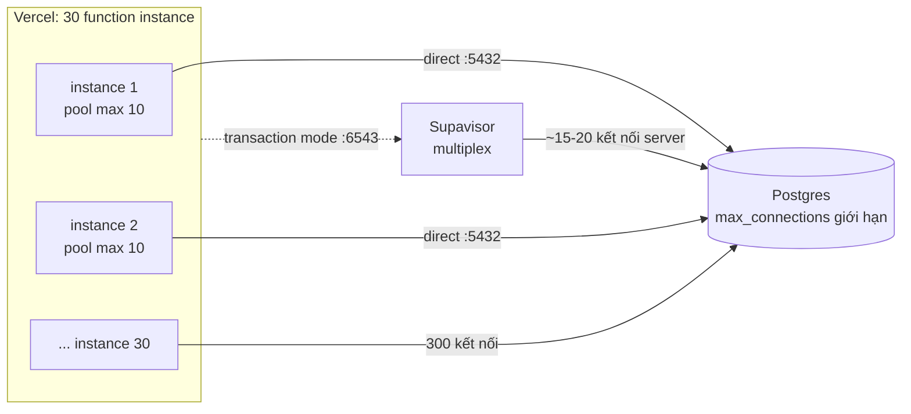
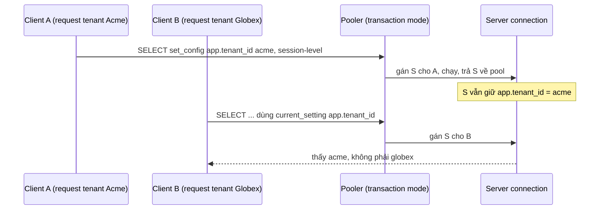

## Bối cảnh & vấn đề

Ngày đầu tiên cả công ty dùng platform mới, 9 giờ sáng, error tracker đỏ rực:

```text
error: sorry, too many clients already
error: remaining connection slots are reserved for roles with the SUPERUSER attribute
```

Code dùng `pg` với `new Pool({ max: 10 })` đặt trong module, connection string là `db.<ref>.supabase.co:5432` copy từ dashboard. Chạy local hoàn hảo. Trên Vercel, lúc đông người, nền tảng scale lên vài chục instance của function, **mỗi instance có pool riêng tối đa 10 kết nối**. 30 instance × 10 = 300 kết nối, trong khi instance Postgres nhỏ chỉ cho phép vài chục tới vài trăm `max_connections` (con số phụ thuộc compute size, verify bảng giới hạn của Supabase). Postgres từ chối, và các request đầu tiên bắt đầu fail.

Đó là câu 013. Nó dẫn tới ba chủ đề khác cùng gốc "serverless không phải một process sống lâu": **pooler** và những tính năng Postgres mất đi khi dùng transaction mode (prepared statement, `SET`, advisory lock, `LISTEN`); **state trong module** sống qua nhiều request của nhiều user khác nhau (câu 023, một lỗi leak dữ liệu giữa tenant mà không có dòng SQL nào sai); và **job dài** không thể chạy trong một request có giới hạn thời gian (câu 025). Câu 040 hỏi bạn mang kinh nghiệm Redis cũ sang stack này thế nào.

Nền tảng connection pooling cho Postgres (PgBouncer, các mode, sizing) ở [Connection pooling](/tracks/sql-postgres/learn/connection-pooling). Bài này tập trung vào Supabase + Vercel và chạy thật các bẫy với PgBouncer 1.26.

## Khái niệm

### Connection Postgres đắt và có giới hạn

Mỗi kết nối Postgres là một **process** riêng trên server, tốn vài MB RAM và chi phí bắt tay (TCP, TLS, auth SCRAM). `max_connections` là giới hạn cứng. Một app server truyền thống giữ một pool cố định, ví dụ 20 kết nối, sống hàng tuần, nên tổng số kết nối dễ dự đoán.

Serverless phá giả định đó. Số instance do nền tảng quyết định theo traffic, có thể tăng từ 2 lên 50 trong một phút. Instance mới mở kết nối mới, instance bị thu hồi có thể không kịp đóng kết nối cũ (Postgres chỉ biết khi TCP timeout). Kết quả: số kết nối tỉ lệ với số instance, không với số query thật sự đang chạy.

**Interview angle:** red flag của câu 013 là "tăng `max_connections`". Mỗi kết nối tốn RAM, và tăng giới hạn chỉ dời điểm gãy.

### Ba cách kết nối tới Supabase

Theo docs Supabase hiện tại:

- **Direct connection** (`db.<ref>.supabase.co:5432`): nối thẳng Postgres. Mặc định chỉ IPv6 (IPv4 cần add-on). Dùng cho migration, `pg_dump`, server sống lâu.
- **Shared pooler, session mode** (`aws-<n>-<region>.pooler.supabase.com:5432`, Supavisor): mỗi client giữ một kết nối server suốt phiên. Hỗ trợ IPv4. Tương đương direct về tính năng, chủ yếu để có IPv4.
- **Shared pooler, transaction mode** (cùng host, **port 6543**): client chỉ mượn kết nối server **trong một transaction**, trả lại ngay khi commit. Đây là mode docs khuyến nghị cho serverless và edge function "which open many short-lived connections".
- **Dedicated pooler** (PgBouncer chạy cạnh database, `db.<ref>.supabase.co:6543`, chỉ plan trả phí).

Ngoài ra, **supabase-js** gọi PostgREST qua HTTP, nên CRUD đơn giản từ function không tốn kết nối Postgres nào của bạn: PostgREST có pool riêng.

**Interview angle:** nhớ con số "6543 = transaction mode" và lý do (multiplexing) quan trọng hơn nhớ hostname.

### Transaction mode multiplexing và cái giá của nó

Trong **transaction mode**, pooler gán kết nối server cho client lúc `BEGIN` (hoặc lúc câu lệnh lẻ bắt đầu) và lấy lại lúc kết thúc. 200 client có thể chia nhau 15 kết nối server, vì phần lớn thời gian client đang chờ HTTP, render, hoặc network, không chạy query.

Cái giá: mọi thứ gắn với **session** của Postgres không còn đáng tin, vì câu lệnh sau của bạn có thể chạy trên kết nối server khác, và kết nối bạn vừa dùng có thể được giao cho client khác:

- `SET` / `set_config(..., false)` ở mức session: rò sang client kế tiếp dùng cùng kết nối server.
- **Prepared statement** có tên (protocol-level): tạo trên kết nối A, thực thi trên kết nối B thì không tồn tại; hoặc client khác tạo trùng tên trên cùng kết nối thì `already exists`. Docs Supabase: "Transaction mode does not support prepared statements. To avoid errors, turn them off in your connection library." PgBouncer từ 1.21 có `max_prepared_statements` để tự quản lý prepared statement ở protocol level (verify Supavisor hỗ trợ tới đâu).
- `pg_advisory_lock` cấp session, `LISTEN/NOTIFY`, temp table sống qua transaction, `WITH HOLD` cursor.

Quy tắc an toàn: mọi state phải sống **trong một transaction** (`set_config(..., true)`, `pg_advisory_xact_lock`), và tắt prepared statement có tên trong driver/ORM khi đi qua Supavisor transaction mode. Ví dụ: Prisma thêm `?pgbouncer=true`, postgres.js đặt `prepare: false` (verify theo phiên bản driver).

**Interview angle:** follow-up "ORM bắt đầu báo `prepared statement already exists` sau khi chuyển sang pooler" có đáp án ngay trong output ở phần Ví dụ.

### Function instance được tái sử dụng

Trên Vercel, một **function instance** không chết sau mỗi request. Instance "ấm" được tái sử dụng cho request kế tiếp, và với **Fluid compute** (mặc định cho project mới, verify), một instance còn xử lý **nhiều request đồng thời**, giống một Node server nhỏ. Mọi biến ở **module scope** (ngoài handler) sống qua các request đó.

Đây vừa là cơ hội vừa là bẫy. Cơ hội: đặt pool `pg` ở module scope để tái dùng kết nối giữa các invocation thay vì mở mới mỗi request. Bẫy: bất kỳ dữ liệu nào **của một user/tenant** để ở module scope sẽ được request của user/tenant khác nhìn thấy. Local thì không thấy bug vì chỉ có một mình bạn, một tenant.

**Interview angle:** câu 023 là debug. Nguyên nhân không nằm ở DB hay replication lag (red flag), mà ở `let cached` dùng chung cho mọi tenant.

### Cache trên stack serverless

Với app server truyền thống, cache-aside qua Redis hoặc in-memory là phản xạ. Trên Vercel + Supabase, bốn lựa chọn:

- **In-memory module scope**: chỉ dùng cho dữ liệu không thuộc user và chấp nhận mỗi instance một bản (config, danh mục tĩnh). Không có invalidation chung giữa instance.
- **Next.js Data Cache / `"use cache"`** với `cacheTag`: cache được chia sẻ, invalidate bằng `revalidateTag` (chi tiết ở [Cache Components](/tracks/nextjs/learn/cache-components)). Tenant phải nằm trong **tham số** của hàm cache (để thành một phần của cache key) và trong tag.
- **CDN cache**: chỉ cho dữ liệu công khai. Dữ liệu theo tenant không bao giờ đi qua CDN công khai.
- **Redis serverless qua HTTP** (các dịch vụ trên Vercel Marketplace, verify tên sản phẩm): khi thật sự cần counter, rate limit, cache chung.

Internal platform thường **ít cần cache**: vài trăm user, dữ liệu phải tươi. Thứ tự đúng là index + query tốt (đã thấy 0,4 ms ở [bài 03](/tracks/mock-internal-platform/learn/rls-performance-testing)) trước, cache sau. Một khó khăn riêng: client gọi Supabase trực tiếp (bypass server) không kích hoạt `revalidateTag`. Muốn invalidate theo thay đổi DB, dùng Database Webhook/trigger gọi Route Handler revalidate, hoặc chấp nhận TTL ngắn.

**Interview angle:** câu 040 là CV. Câu trả lời tốt kể bản Redis cũ (key, TTL, invalidation, số liệu), rồi nói rõ cái gì đổi: không có process sống lâu, key luôn có tenant, ưu tiên không cache.

### Job dài không thuộc về request

Vercel function có **giới hạn thời gian chạy** (max duration tuỳ plan và cấu hình, với Fluid compute mặc định 300 giây, tối đa cao hơn ở plan trả phí, verify con số hiện tại). Import CSV 50.000 dòng, mỗi dòng validate + upsert + audit, dễ vượt giới hạn, và quan trọng hơn: request bị cắt giữa chừng để lại **nửa dữ liệu** nếu không có transaction hay checkpoint.

Thiết kế đúng tách "nhận việc" khỏi "làm việc": request chỉ lưu file vào Storage, tạo bản ghi `import_jobs`, trả `202` + job id. Một worker (Supabase Queues dựa trên `pgmq`, cron gọi Route Handler, hoặc dịch vụ workflow bên ngoài như Inngest/QStash) xử lý **theo batch** 500–1000 dòng, mỗi batch một transaction, lưu checkpoint `processed`. Upsert theo khoá tự nhiên `(tenant_id, employee_code)` để chạy lại không nhân đôi. Dòng lỗi ghi vào `import_errors`, không làm fail cả job.

**Interview angle:** red flag câu 025 là "tăng timeout". Follow-up "business muốn all-or-nothing" đổi thiết kế: load vào bảng staging theo batch, validate toàn bộ, rồi một transaction cuối `insert ... select` từ staging sang bảng thật (hoặc đánh dấu batch là active).

## Cơ chế hoạt động

So sánh direct connection và transaction mode khi Vercel scale:



Và vòng đời một kết nối server trong transaction mode, nơi bẫy `SET` xảy ra:



Giải thích:

1. Với direct connection, số kết nối = số instance × pool size. Không có ai điều tiết.
2. Với transaction mode, pooler giữ một số nhỏ kết nối server và cho client mượn theo transaction. Postgres chỉ thấy vài chục kết nối dù có hàng trăm client.
3. Kết nối server là **tài nguyên dùng chung**. Bất cứ thứ gì client để lại ở mức session (setting, prepared statement, lock) sẽ đi theo kết nối đó sang client khác. PgBouncer mặc định chạy `server_reset_query` (`DISCARD ALL`) chỉ trong session mode, không chạy trong transaction mode.
4. Vì vậy context như tenant phải được đặt bằng `set_config(..., true)` **bên trong** transaction, và chỉ sống tới `COMMIT`. Nếu dùng supabase-js qua PostgREST, PostgREST đã làm đúng việc này với `request.jwt.claims`.

## Ví dụ thực tế

Lab: `edoburu/pgbouncer:v1.26.0-p0` (PgBouncer 1.26.0) ở `pool_mode = transaction`, `default_pool_size = 1` (để hai client chắc chắn dùng chung một kết nối server), trước `supabase/postgres:17.11`. Client là `pg` 8.23.1 trên Node 24. Supavisor không chạy được local nên dùng PgBouncer, cùng mô hình transaction mode.

### 1. SET rò và prepared statement (chạy thật)

```ts
import pg from 'pg'
const cfg = { host: 'localhost', port: Number(process.env.PORT ?? 56432), user: 'postgres', password: 'postgres', database: 'postgres' }
const a = new pg.Client(cfg), b = new pg.Client(cfg)
await a.connect(); await b.connect()

// 1) session-level SET qua pooler transaction mode
await a.query(`select set_config('app.tenant_id', 'acme', false)`)
const r1 = await b.query(`select current_setting('app.tenant_id', true) as seen_by_b, pg_backend_pid() as pid`)
console.log('1) client B sees:', r1.rows[0])

// 2) transaction-local SET
await a.query('begin'); await a.query(`select set_config('app.tenant_id', 'globex', true)`); await a.query('commit')
const r2 = await b.query(`select current_setting('app.tenant_id', true) as seen_by_b`)
console.log('2) after local set in tx, B sees:', r2.rows[0])

// 3) named prepared statement, cùng tên, khác SQL, từ hai client
try {
  await a.query({ name: 'get-orders', text: 'select count(*)::int as n from public.orders where tenant_id = $1',
                  values: ['11111111-1111-1111-1111-111111111111'] })
  const r3 = await b.query({ name: 'get-orders', text: 'select 42 as n where $1::text is not null', values: ['x'] })
  console.log('3) prepared statements OK, B got', r3.rows[0])
} catch (e) { console.log('3) error:', e.code, e.message) }
```

```text
== via PgBouncer 1.26 transaction mode (default config)
1) client B sees: { seen_by_b: 'acme', pid: 19364 }
2) after local set in tx, B sees: { seen_by_b: 'acme' }
3) prepared statements OK, B got { n: 42 }
== direct Postgres
1) client B sees: { seen_by_b: null, pid: 19396 }
2) after local set in tx, B sees: { seen_by_b: null }
3) prepared statements OK, B got { n: 42 }
== via PgBouncer 1.26 transaction mode, max_prepared_statements = 0
3) error: 42P05 prepared statement "get-orders" already exists
```

Đọc kết quả:

- **Dòng 1**: client B (một request khác, có thể của tenant khác) đọc được `acme` mà client A đặt. Nếu policy hay query dựa vào `current_setting('app.tenant_id')`, B vừa đọc dữ liệu của Acme. Đi thẳng Postgres thì B thấy `null` như mong đợi.
- **Dòng 2**: `set_config(..., true)` trong transaction tự hết hiệu lực lúc commit, đúng. Nhưng B vẫn thấy `acme` vì giá trị session-level từ bước 1 **vẫn còn** trên kết nối server. Một lần dùng sai là bẩn kết nối cho tới khi nó bị đóng.
- **Dòng 3**: PgBouncer 1.26 mặc định có `max_prepared_statements` khác 0, nên nó tự đổi tên và theo dõi prepared statement theo từng kết nối server: hai client dùng cùng tên `get-orders` với SQL khác nhau vẫn chạy đúng. Tắt tính năng đó (`= 0`, hành vi của PgBouncer cũ và của nhiều pooler khác), cùng đoạn code lỗi `42P05 prepared statement "get-orders" already exists`, đúng lỗi trong follow-up của câu 013. Với Supavisor transaction mode, làm theo docs Supabase: tắt prepared statement trong driver.

### 2. Cache module-scope theo tenant: bug và bản sửa (minh hoạ)

Bản lỗi của câu 023:

```ts
let cached: { at: number; data: Stats } | null = null

export async function getStats(tenantId: string) {
  if (cached && Date.now() - cached.at < 60_000) return cached.data // không có tenant trong key
  const data = await db.query('select ... where tenant_id = $1', [tenantId])
  cached = { at: Date.now(), data }
  return data
}
```

Request đầu tiên trên một instance (tenant A) điền `cached`. Trong 60 giây sau, mọi request của tenant khác **trên cùng instance** nhận số liệu của A. Lỗi "thỉnh thoảng" vì phụ thuộc instance nào nhận request.

Bản sửa tối thiểu là key theo tenant. Bản tốt hơn là dùng cache có invalidation:

```ts
import { cacheTag, cacheLife } from 'next/cache'

export async function getStats(tenantId: string) {
  'use cache'
  cacheTag(`tenant:${tenantId}:stats`)   // tenant là tham số nên nằm trong cache key
  cacheLife('minutes')
  return loadStatsFromDb(tenantId)       // hàm không được tự đọc cookies() bên trong
}
// khi có đơn mới: revalidateTag(`tenant:${tenantId}:stats`) trong Server Action / webhook
```

Điểm tinh tế: nếu hàm cache tự đọc `cookies()` để lấy tenant thay vì nhận tham số, tenant không nằm trong key và bug quay lại (Next còn chặn đọc dynamic API trong `"use cache"`, verify theo phiên bản). Guardrail: checklist review "mọi cache key có tenant", và một integration test gọi `getStats` cho hai tenant xen kẽ.

## Trade-offs & lựa chọn thay thế

| Cách kết nối | Hợp với | Tính năng session | Rủi ro |
|---|---|---|---|
| supabase-js (HTTP → PostgREST) | CRUD, đọc theo RLS từ function | PostgREST lo | Không có transaction nhiều câu lệnh từ client, dùng RPC |
| Supavisor transaction mode :6543 | Function serverless dùng `pg`/ORM | Không (tắt prepared, SET chỉ local) | SET/lock session rò giữa client |
| Supavisor session mode :5432 | Client cần session nhưng chỉ có IPv4 | Có | Không multiplex, vẫn cạn kết nối nếu nhiều instance |
| Direct :5432 | Migration, `pg_dump`, worker sống lâu | Có | Cạn kết nối nếu dùng từ serverless |
| Dedicated pooler (PgBouncer) | Plan trả phí, cần độ trễ thấp hơn | Như transaction mode | Phụ thuộc plan |

| Nơi chạy việc dài | Ưu | Nhược |
|---|---|---|
| Trong request | Đơn giản | Timeout, dữ liệu dở dang, user chờ |
| Supabase Queues (pgmq) + worker | Cùng DB, transaction với dữ liệu | Phải tự dựng worker/cron |
| Cron gọi Route Handler theo batch | Không thêm hạ tầng | Mỗi batch vẫn bị giới hạn thời gian |
| Dịch vụ workflow (Inngest/QStash...) | Retry, step, quan sát sẵn | Thêm vendor, thêm chi phí |

Chọn thế nào: trong function, mặc định supabase-js cho truy cập theo user (RLS, không tốn kết nối). Khi cần SQL đầy đủ hoặc transaction, dùng `pg` qua transaction mode với pool **nhỏ** ở module scope (1–5 kết nối mỗi instance), tắt prepared statement có tên, đặt context bằng `set_config(..., true)` trong transaction. Migration và job dài chạy ngoài request, qua direct hoặc session mode.

## Edge cases & failure modes

- **Pool ở module scope không đóng**: instance bị đóng băng (suspend) giữa chừng, kết nối nằm im phía pooler tới timeout. Đặt `idleTimeoutMillis` ngắn, và trên Fluid compute dùng helper của nền tảng để đóng pool trước khi instance bị thu hồi (Vercel có `attachDatabasePool` trong `@vercel/functions`, verify).
- **Transaction dài trong transaction mode**: giữ kết nối server suốt transaction. Một request mở transaction rồi gọi API ngoài 10 giây là chiếm một trong số ít kết nối thật. Không gọi network bên ngoài khi đang trong transaction.
- **ORM bật prepared statement ngầm**: lỗi chỉ xuất hiện khi tải tăng và hai request dùng chung kết nối server, nên local không thấy. Cấu hình rõ ràng và test với pooler trong CI.
- **Advisory lock session-level**: lock "giữ" trên kết nối server, client khác dùng kết nối đó cũng "có" lock. Dùng `pg_advisory_xact_lock`.
- **Cache key thiếu tenant ở chỗ không ngờ**: `unstable_cache`/`"use cache"` đọc tenant bên trong, memo hoá trong `React.cache` chỉ sống trong một request (an toàn), Map ở module scope (không an toàn).
- **Job import chạy lại**: worker crash sau khi ghi batch nhưng trước khi lưu checkpoint. Upsert theo khoá tự nhiên làm việc chạy lại an toàn.
- **Cold start + pool**: instance mới phải mở kết nối, TLS, SCRAM: hàng chục tới hàng trăm ms. Pooler gần region của function giảm chi phí này. Đặt function cùng region với database.

## Pitfalls

- ❌ Copy connection string direct vào env của Vercel. → ✅ Transaction mode port 6543 cho function, direct/session cho migration.
- ❌ Tăng `max_connections` khi gặp "too many clients". → ✅ Pooler + pool nhỏ mỗi instance.
- ❌ `SET app.tenant_id = ...` ở mức session. → ✅ `set_config(..., true)` trong transaction, hoặc để PostgREST lo bằng JWT.
- ❌ Để ORM dùng prepared statement có tên qua Supavisor. → ✅ Tắt theo hướng dẫn driver.
- ❌ Biến module-scope chứa dữ liệu theo user/tenant. → ✅ Cache có key gồm tenant, có invalidation, hoặc không cache.
- ❌ Thêm Redis cho mọi endpoint theo thói quen. → ✅ Đo trước, index trước, cache khi có lý do.
- ❌ Import lớn đồng bộ trong request, tăng timeout khi lỗi. → ✅ 202 + job, batch có checkpoint, upsert idempotent.

## Tóm tắt

- Serverless nhân số kết nối theo số instance. Dùng Supavisor transaction mode (port 6543) cho function, direct/session cho migration và worker sống lâu.
- Transaction mode multiplex kết nối server, nên mọi state session-level rò giữa client: lab cho thấy client B đọc được `app.tenant_id = acme` của client A.
- Prepared statement có tên lỗi `42P05 ... already exists` khi pooler không quản lý chúng. PgBouncer 1.26 mặc định quản lý được, Supabase docs vẫn bảo tắt prepared statement cho transaction mode.
- Function instance được tái dùng (Fluid compute còn chạy đồng thời), nên biến module-scope dùng chung giữa user. Cache phải có tenant trong key.
- Cache trên Vercel: Next cache với tag theo tenant, CDN chỉ cho dữ liệu công khai, Redis HTTP khi thật sự cần. Internal platform thường không cần cache.
- Job dài: 202 + `import_jobs`, worker xử lý batch có checkpoint, upsert idempotent, lỗi từng dòng ghi riêng.
