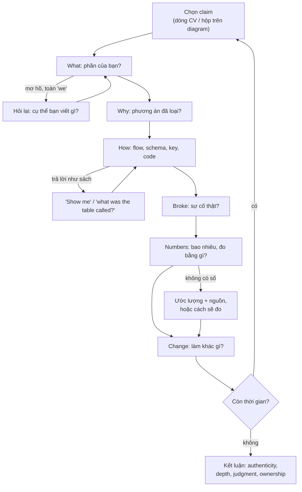
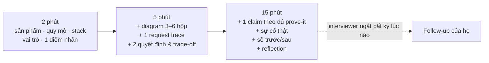

## Bối cảnh & vấn đề

Một buổi phỏng vấn senior 60 phút thường dành 15–30 phút cho **project deep-dive**. Câu mở đầu nghe rất hiền: "Tell me about a project you're proud of." Ứng viên A trả lời: "Em làm Checkout cho một nền tảng e-commerce, có giỏ hàng, chọn địa chỉ, thanh toán, rồi hiển thị đơn hàng." Interviewer hỏi tiếp: "What exactly did you build?" A nói lại các màn hình. "How did you prevent a double charge?" A im lặng một lúc rồi nói "backend có xử lý". Từ giây phút đó, interviewer không còn tin dòng "owned features end-to-end" trên CV nữa, và mọi câu sau đều bị nghe với sự nghi ngờ.

Ứng viên B nhận cùng câu hỏi. B vẽ ba hộp (Next.js app, Node API, SQL database cộng một payment provider), nói "phần của em là API tạo order và luồng reservation tồn kho; payment adapter do một bạn khác viết, em tích hợp với nó". Khi bị hỏi double charge, B nói về idempotency key, conditional update và trạng thái `unknown` khi payment timeout, rồi tự thêm: "Sau release có một bug: retry từ mobile tạo hai order vì key sinh lại mỗi lần retry; em sửa bằng cách sinh key một lần khi mở màn hình thanh toán." B không nói gì cao siêu hơn A về lý thuyết. Khác biệt là B **chứng minh được** mình đã thật sự làm, hiểu vì sao, và biết cái gì đã hỏng.

Bài này dạy cách vận hành của phần deep-dive: interviewer đang tìm gì, họ đào theo trình tự nào, và bạn chuẩn bị gì để mỗi claim trên CV trụ được 4–5 tầng câu hỏi. Các bài sau áp dụng khung này cho từng dự án: P1 e-commerce multi-tenant B2B2C, P2 monolith → microservices back-office, P3 banking React SPA và P4 financial web apps real-time. Tất cả số liệu trong bài là placeholder `<số liệu thật của bạn>` hoặc dữ liệu minh hoạ; bạn phải điền số thật của mình.

## Khái niệm

### Deep-dive là gì và interviewer đang đo cái gì

**Project deep-dive** là phần phỏng vấn trong đó interviewer chọn một claim trên CV (hoặc một dự án bạn tự chọn) và hỏi liên tục cho tới khi chạm giới hạn hiểu biết của bạn. Nó khác system design ở chỗ không có đề bài giả định: mọi câu trả lời phải đúng với **hệ thống có thật** mà bạn đã làm, nên không thể "thiết kế đẹp" cho qua. Nó khác behavioral ở chỗ trọng tâm là kỹ thuật, dù vẫn dùng cấu trúc kể chuyện.

Interviewer đo bốn thứ. **Authenticity**: bạn có thật sự làm những gì CV nói không (người làm thật nhớ tên bảng, tên topic, con số, và chi tiết khó chịu). **Depth**: bạn hiểu tới tầng nào (biết API của thư viện, hay biết vì sao nó hoạt động như vậy và khi nào nó hỏng). **Judgment**: bạn có cân nhắc phương án khác không, có nhìn thấy chi phí của quyết định không. **Ownership**: bạn coi feature là của mình tới production và sau production, hay chỉ tới lúc merge PR.

**Interview angle:** câu mở "draw the architecture" không phải để chấm hình vẽ; nó tạo ra bản đồ để interviewer chọn chỗ đào. Hộp nào bạn vẽ mơ hồ, họ sẽ đào đúng hộp đó.

### Chuỗi prove-it

**Chuỗi prove-it** là trình tự câu hỏi interviewer dùng cho một claim: **What** (bạn làm chính xác gì, phạm vi nào là của bạn) → **Why** (vì sao làm như vậy, phương án nào đã bị loại) → **How** (luồng dữ liệu, schema, code, tên endpoint/key/topic) → **Broke** (cái gì đã hỏng, sự cố nào) → **Numbers** (bao nhiêu, đo bằng gì, trước/sau) → **Change** (nhìn lại thì làm khác gì). Không phải buổi nào cũng đi đủ sáu bước, nhưng bạn phải sẵn sàng cho cả sáu.

Mỗi bước loại một kiểu ứng viên. "What" loại người kể như user. "Why" loại người chỉ làm theo ticket. "How" loại người chỉ đọc design doc của người khác. "Broke" loại người chưa vận hành thật (hệ thống thật luôn hỏng ở đâu đó). "Numbers" loại người không đo. "Change" loại người không tự đánh giá. Ví dụ với claim "introduced Redis caching for hot APIs": What = ba endpoint đọc catalog và config tenant; Why = DB time chiếm phần lớn latency, dữ liệu chấp nhận stale vài chục giây; How = cache-aside, key có tenant, TTL + jitter, delete sau commit; Broke = giá cũ sau bulk import; Numbers = p95 và hit ratio `<số liệu thật của bạn>`; Change = dùng version key ngay từ đầu.

### Claim inventory

**Claim inventory** là một bảng (hoặc file) liệt kê mỗi dòng trên CV kèm sáu ô của chuỗi prove-it. Lý do phải viết ra: trí nhớ về dự án cũ rất dễ "trôi" thành phiên bản đẹp hơn sự thật, và lúc bị hỏi dồn bạn không có thời gian tái dựng. Bảng này cũng giúp bạn **nhất quán** giữa các vòng: vòng 1 nói hit ratio "khoảng 80%", vòng 3 nói "95%" là một red flag.

Ô khó điền nhất thường là Numbers và Broke. Nếu không có số chính xác, ghi số ước lượng **kèm nguồn** ("dashboard APM lúc đó cho thấy khoảng X") hoặc ghi cách bạn sẽ đo nếu được làm lại. Không bao giờ bịa con số cụ thể: interviewer giỏi sẽ hỏi "đo bằng công cụ gì, ở percentile nào, trong khoảng thời gian nào", và con số bịa không trả lời được câu đó.

### Pitch 2 / 5 / 15 phút

Cùng một dự án, bạn cần ba độ dài. **2 phút** (elevator pitch): sản phẩm là gì, cho ai, quy mô, stack, vai trò của bạn, và một điểm kỹ thuật đáng nói nhất. Dùng khi interviewer hỏi "walk me through your CV" và có bốn dự án phải đi qua. **5 phút**: thêm kiến trúc vẽ được (3–6 hộp), một request trace từ đầu tới cuối, và hai quyết định quan trọng kèm trade-off. **15 phút**: đi sâu một claim theo đủ chuỗi prove-it, kèm sự cố và reflection.

Nguyên tắc là **xếp lớp**: bản 5 phút là bản 2 phút cộng thêm chi tiết, bản 15 phút là bản 5 phút đào sâu một nhánh. Như vậy bạn có thể dừng ở bất kỳ lớp nào mà câu chuyện vẫn trọn vẹn, và interviewer luôn có "móc" để hỏi tiếp. Nói quá dài ngay từ đầu là lỗi phổ biến: interviewer mất quyền điều khiển cuộc trò chuyện và không kịp hỏi phần họ quan tâm.

### Ranh giới ownership: "tôi" và "chúng tôi"

Trong team, gần như không feature nào do một người làm hết. **Ranh giới ownership** là việc nói rõ phần nào bạn quyết định, phần nào bạn implement, phần nào bạn tích hợp với người khác, và phần nào là quyết định có sẵn. Dùng "we" cho mọi thứ làm interviewer không biết bạn đóng góp gì; dùng "I" cho mọi thứ thì một câu hỏi sâu vào phần không phải của bạn sẽ lộ ngay.

Cách nói tốt: "Tech lead chọn SQL Server và pattern repository; tôi thiết kế bảng `shift` và constraint chống chồng ca, viết API và màn hình quản lý ca; QA viết test E2E, tôi viết unit/integration test." Câu này cho interviewer biết chính xác chỗ nào nên đào và chỗ nào bạn sẽ nói "phần đó tôi biết ở mức tích hợp". Câu 003 (vai trò và tổ chức team) chính là bài kiểm tra ranh giới này.

**Interview angle:** follow-up kinh điển là "Which decisions were you allowed to make on your own, and which needed the tech lead?" Câu trả lời tốt có ví dụ cụ thể cho cả hai loại, và một lần bạn **đề xuất** thứ gì đó lên lead (được chấp nhận hay bị từ chối, và vì sao).

### Gap trung thực

**Gap** là thứ JD yêu cầu mà bạn chưa dùng ở production, ví dụ AWS hay NestJS. Interviewer senior không loại bạn vì một gap; họ loại bạn vì **giấu** gap rồi bị lộ. Câu trả lời tốt có ba phần: thừa nhận rõ ("chưa vận hành AWS ở production"), map kinh nghiệm có sẵn sang khái niệm tương đương (Redis → ElastiCache, Kafka → MSK, Elasticsearch → OpenSearch, SQL database → RDS), và một kế hoạch đang làm có bằng chứng (POC, cert, side project; điền thông tin thật của bạn).

### Reflection và góc nhìn của người khác

Hai câu hỏi đo **self-awareness**: "dự án nào dạy bạn nhiều nhất" (câu 007) và "nếu tôi gọi tech lead cũ của bạn, họ nói gì" (câu 063). Cả hai cần **bài học cụ thể dẫn tới thay đổi hành vi**, không phải tính từ. "Tôi học được tầm quan trọng của testing" là câu rỗng; "Sau P2 tôi luôn viết contract test cho message trước khi đổi producer, vì một lần consumer crash loop do monolith gửi format cũ" là câu có bằng chứng. Với câu 063, điểm cần cải thiện phải **thật** và có hành động đi kèm; "tôi quá cầu toàn" là red flag.

## Cơ chế hoạt động

Sơ đồ dưới là vòng lặp một interviewer thường chạy với mỗi claim. Họ bắt đầu từ một hộp trên diagram bạn vẽ hoặc một dòng CV, đi dọc chuỗi prove-it, và rẽ nhánh mỗi khi câu trả lời có chỗ mơ hồ. Khi bạn chạm tới giới hạn (nói "tôi không chắc"), họ hoặc đào tiếp xem bạn suy luận thế nào, hoặc chuyển sang claim khác.



Đọc sơ đồ theo góc nhìn của bạn: ba vòng lặp phụ (W2, H2, N2) là nơi điểm số mất nhanh nhất, vì mỗi lần interviewer phải hỏi lại là một lần họ ghi chú "vague". Chuẩn bị claim inventory chính là chuẩn bị để không rơi vào ba vòng đó.

Về thời gian, một buổi deep-dive 20 phút thường chia như sau: 2–3 phút pitch, 3–5 phút kiến trúc và request trace, 10–12 phút đào hai hoặc ba claim, vài phút cuối cho "would you do it differently" hoặc câu hỏi của bạn. Pitch xếp lớp giúp bạn khớp với nhịp đó:



Điểm quan trọng là bạn **dừng** ở cuối mỗi lớp và nhường quyền cho interviewer ("Tôi có thể đi sâu vào phần tenant isolation hoặc phần migration, anh/chị muốn nghe phần nào?"). Câu này vừa cho thấy bạn kiểm soát được câu chuyện, vừa để interviewer chọn chỗ họ cần đánh giá.

## Ví dụ thực tế

### Claim inventory checker

Đoạn TypeScript dưới đây là cách tự kiểm tra claim inventory trước buổi phỏng vấn. Mỗi claim có các ô của chuỗi prove-it; checker liệt kê những gì interviewer sẽ thấy thiếu. Dữ liệu trong ví dụ là **minh hoạ**: thay bằng claim và số thật của bạn. Chạy bằng Node 24 (tự strip type).

```ts
// claims.ts — Claim inventory: one entry per CV line.
type Claim = { id: string; claim: string; mine?: string; diagram?: boolean; rejected?: string; broke?: string;
  numbers?: { name: string; value?: string; source?: string }[]; change?: string };
const claims: Claim[] = [
  { id: 'P1-cache', claim: 'Introduced Redis caching for hot APIs', mine: 'proposed + implemented cache-aside for 3 read endpoints',
    diagram: true, rejected: 'HTTP/CDN cache: responses are tenant- and user-specific', broke: 'stale price after bulk update',
    numbers: [{ name: 'p95 before/after', value: '<số liệu thật của bạn>', source: 'APM dashboard' }, { name: 'hit ratio' }], change: 'version keys from day one' },
  { id: 'P2-memcached', claim: 'Memcached TTL + refresh reduced DB load significantly', numbers: [{ name: 'DB QPS before/after' }] },
  { id: 'P4-csv', claim: 'Fixed CSV processing bottlenecks', mine: 'rewrote import as stream + batch insert', diagram: true,
    numbers: [{ name: 'file size', value: '<số liệu thật của bạn>', source: 'support ticket' }, { name: 'time before/after', value: '<số liệu thật của bạn>', source: 'job logs' }] },
];
const placeholder = (v?: string) => !v || v.startsWith('<');
for (const c of claims) {
  const gaps: string[] = [];
  if (!c.mine) gaps.push('what exactly was YOURS');
  if (!c.diagram) gaps.push('no diagram');
  if (!c.rejected) gaps.push('no rejected alternative (why)');
  if (!c.broke) gaps.push('nothing broke? (depth signal)');
  const nums = c.numbers ?? [];
  if (nums.length < 2) gaps.push(`only ${nums.length} number(s), want 2-3`);
  for (const n of nums) { if (placeholder(n.value)) gaps.push(`fill "${n.name}"`); if (!n.source) gaps.push(`how was "${n.name}" measured?`); }
  if (!c.change) gaps.push('no "would do differently"');
  console.log(`${c.id.padEnd(13)} ${gaps.length ? '✗ ' + gaps.join('; ') : '✓ ready'}`);
}
```

Output thật khi chạy `node claims.ts`:

```text
P1-cache      ✗ fill "p95 before/after"; fill "hit ratio"; how was "hit ratio" measured?
P2-memcached  ✗ what exactly was YOURS; no diagram; no rejected alternative (why); nothing broke? (depth signal); only 1 number(s), want 2-3; fill "DB QPS before/after"; how was "DB QPS before/after" measured?; no "would do differently"
P4-csv        ✗ no rejected alternative (why); nothing broke? (depth signal); fill "file size"; fill "time before/after"; no "would do differently"
```

Dòng `P2-memcached` là đúng tình trạng của nhiều CV: một claim "significantly" không có gì đỡ phía sau. Đó là claim bạn phải lấp trước tiên, vì câu 058 sẽ hỏi thẳng vào nó.

### Pitch 2 phút cho P1 (khung điền)

> "Hai năm gần nhất tôi làm full-stack cho một nền tảng e-commerce multi-tenant B2B2C: tenant là các retailer, end user là khách mua hàng và nhân viên của retailer, ở hai quốc gia. Stack là Node/TypeScript/Express ở backend, React và Next.js ở frontend, SQL Server, Redis và Elasticsearch. Quy mô khoảng `<số tenant>` retailer, `<RPS peak>` request/giây. Tôi own các feature end-to-end, ví dụ Checkout, Address Management và Shift Management, và làm nhiều về tenant-aware data access, migration không downtime và caching. Điểm kỹ thuật tôi muốn kể nhất là `<một claim, ví dụ: cách chúng tôi đổi schema bảng lớn mà không mất dữ liệu>`."

Khung này có đủ năm thành phần (sản phẩm, quy mô, stack, vai trò, điểm nhấn) và kết thúc bằng một "móc" để interviewer chọn đào tiếp.

### Câu 048: own feature end-to-end, theo đủ chuỗi

Chọn một feature bạn hiểu sâu nhất. Ví dụ khung với Address Management (minh hoạ, thay bằng chi tiết thật):

- **What**: schema `address` theo tenant và customer, API CRUD, validate theo định dạng từng quốc gia, UI form và chọn địa chỉ mặc định trong Checkout; tôi làm cả BE và FE, QA viết test E2E.
- **Why**: lưu snapshot địa chỉ vào order thay vì foreign key tới `address`, vì khách sửa địa chỉ sau khi đặt hàng không được làm đổi địa chỉ giao của đơn cũ; phương án bị loại là versioning bảng address (phức tạp hơn mà không cần).
- **Broke**: sau release, một số địa chỉ có mã bưu chính mất số 0 đầu vì cột kiểu số ở một bảng cũ; sửa kiểu cột bằng expand/contract (xem [bài 6](/tracks/project-deep-dive/learn/p1-query-migrations)).
- **Numbers**: `<số liệu thật của bạn>`: thời gian giao feature, số địa chỉ/ngày, số bug sau release.
- **Change**: thêm validate ở API theo bảng quy tắc từng quốc gia ngay từ đầu, thay vì chỉ validate ở form.

Follow-up "phần nào người khác làm" là cơ hội thể hiện kỹ năng tích hợp: "Payment adapter do teammate viết; tôi định nghĩa interface `createPayment(orderId, idempotencyKey)` và trạng thái trả về, rồi viết test với fake adapter."

### Câu 003 và 063: team và góc nhìn của lead

Câu 003 cần ba ý: vai trò (full-stack, own feature từ analysis tới production), tổ chức team (PO, QA, Designer, Tech Lead, dev phân tán, giao tiếp tiếng Anh; kích thước `<số liệu thật của bạn>`), và nhịp làm việc (sprint, refinement, review, release, cách xử lý lệch múi giờ). Thêm một ví dụ quyết định bạn tự đưa ra và một quyết định phải hỏi lead.

Câu 063 cần một đóng góp **có bằng chứng** và một điểm cần cải thiện **thật**. Ví dụ khung: "Lead sẽ nói đóng góp lớn nhất là tôi chuẩn hoá cách làm migration zero-downtime cho team (checklist + script backfill dùng chung); điểm cần cải thiện là tôi hay báo rủi ro muộn, khi đã code xong một nửa. Từ đó tôi viết một design note ngắn trước mỗi thay đổi schema lớn và đưa lead review trước khi code." Câu trả lời phải nhất quán với những gì bạn kể ở các câu khác.

### Câu 047: gap AWS

| Kinh nghiệm có sẵn | Tương đương trên AWS | Điều phải học thêm |
|---|---|---|
| Redis cache | ElastiCache / MemoryDB | subnet group, failover, encryption in transit |
| Kafka | MSK | IAM auth, broker sizing, cross-AZ cost |
| Elasticsearch | OpenSearch Service | domain sizing, snapshot, fine-grained access |
| SQL Server / Postgres | RDS / Aurora | Multi-AZ, read replica, parameter group, backup |
| Node service | ECS Fargate / EKS / Lambda | task role, health check, deploy strategy |
| Cấu hình, secret | Parameter Store / Secrets Manager | rotation, IAM policy |

Câu trả lời mẫu: "Tôi chưa vận hành AWS ở production; các hệ thống trước chạy trên `<hạ tầng thật của bạn>`. Tôi map được phần lớn khái niệm (bảng trên), và phần tôi đang học có chủ đích là IAM least privilege, VPC và IaC, vì đó là chỗ kinh nghiệm cũ không chuyển sang được. Hiện tôi `<POC / cert / side project thật của bạn>`." Follow-up "deploy Indexer Service lên AWS thế nào" xem [track AWS](/tracks/aws/learn/compute-choices).

## Trade-offs & lựa chọn thay thế

| Lựa chọn | Phương án A | Phương án B | Khi nào chọn gì |
|---|---|---|---|
| Dự án flagship | Dự án mới nhất (P1) | Dự án "ấn tượng" nhất | Chọn dự án bạn **nhớ chi tiết nhất** và gần JD nhất; thường là dự án mới nhất |
| Độ rộng vs độ sâu | Kể cả bốn dự án đều nhau | Một dự án sâu, ba dự án 1 phút | Deep-dive thưởng cho độ sâu; độ rộng chỉ cần đủ để interviewer chọn |
| "I" vs "we" | Toàn "we" (khiêm tốn) | Toàn "I" (tự tin) | "I" cho phần của bạn, "we/team" cho quyết định chung, nói rõ ai làm gì |
| Gap | Lảng tránh, nói chung chung | Thừa nhận + map + kế hoạch | Luôn B; interviewer sẽ hỏi tới chỗ đó dù bạn tránh |
| Số liệu thiếu | Bịa số đẹp | Ước lượng + nguồn / cách đo | Luôn B; số bịa sụp ở câu "đo bằng gì" |
| Chủ động chọn nhánh | Để interviewer dẫn hoàn toàn | Đề xuất nhánh ở cuối mỗi lớp pitch | Đề xuất, nhưng đi theo khi họ chọn khác |

Trong thực tế, lựa chọn quan trọng nhất là dự án flagship. Một dự án bạn làm 2 năm, gần JD, có cả backend lẫn frontend lẫn database (P1) cho interviewer nhiều chỗ đào nhất, và cho bạn nhiều câu chuyện nhất. Dự án cũ hơn (P3, P4) dùng để bổ sung một mảng mà P1 thiếu, ví dụ frontend performance (P3) hoặc streaming/real-time (P4).

## Edge cases & failure modes

- **Interviewer biết domain sâu hơn bạn**: họ từng làm payment hoặc search. Đừng giả vờ; nói phần bạn làm và hỏi lại họ đã làm thế nào. Đó là cuộc trò chuyện giữa hai engineer, không phải bài thi.
- **NDA và thông tin client**: không nói tên client, số liệu kinh doanh nhạy cảm, hay chi tiết bảo mật. Khái quát hoá ("một retailer lớn", "khoảng vài trăm nghìn sản phẩm") và nói rõ là bạn đang khái quát hoá.
- **Phần bạn không làm bị hỏi sâu**: "Phần đó teammate làm; tôi biết ở mức interface: nó nhận X và trả Y. Nếu phải đoán cách bên trong, tôi nghĩ họ làm Z vì…" Suy luận có lý do tốt hơn im lặng hoặc nhận vơ.
- **Không nhớ chi tiết**: nói thật mức bạn nhớ và cách bạn sẽ kiểm tra. "Tôi không nhớ chính xác số partition, khoảng một chục; nó được chọn theo số consumer instance tối đa."
- **Mâu thuẫn giữa các vòng**: các interviewer so ghi chú. Claim inventory là nguồn sự thật duy nhất của bạn.
- **Hỏi dồn liên tục để xem bạn phản ứng thế nào**: giữ bình tĩnh, trả lời ngắn từng câu; "tôi không biết, đây là cách tôi sẽ tìm hiểu" là một câu trả lời được chấp nhận ở tầng thứ năm.
- **Dự án thất bại hoặc bị huỷ**: vẫn kể được, thậm chí tốt hơn, nếu bạn nói rõ vì sao thất bại và bạn học gì.

## Pitfalls

- ❌ Kể feature như user ("có màn hình giỏ hàng, có nút thanh toán") → ✅ kể như engineer: dữ liệu, luồng, ràng buộc, lỗi.
- ❌ Toàn "we", không biết bạn làm gì → ✅ tách rõ phần quyết định, phần implement, phần tích hợp.
- ❌ "Significantly faster", "much better" → ✅ số trước/sau, percentile, công cụ đo; hoặc ước lượng kèm nguồn.
- ❌ Bịa số khi bị hỏi → ✅ "Tôi không có số chính xác; dashboard lúc đó cho thấy khoảng X, đo bằng Y."
- ❌ Không có câu chuyện "cái gì đã hỏng" → ✅ ít nhất một sự cố hoặc bug thật cho mỗi dự án lớn.
- ❌ Nói về thứ chưa dùng production như đã dùng → ✅ "Chưa dùng production; tôi đã POC và hiểu trade-off…"
- ❌ Pitch 10 phút liền không dừng → ✅ xếp lớp 2/5/15, dừng và đề xuất nhánh.
- ❌ Điểm yếu kiểu "tôi quá cầu toàn" → ✅ một điểm yếu thật kèm hành động đã làm để cải thiện.

## Tóm tắt

- Deep-dive đo authenticity, depth, judgment và ownership trên hệ thống có thật; không thể "thiết kế đẹp" cho qua.
- Chuỗi prove-it: What → Why → How → Broke → Numbers → Change; chuẩn bị cả sáu ô cho mỗi claim.
- Claim inventory viết ra giấy giúp lấp lỗ hổng trước buổi phỏng vấn và giữ câu trả lời nhất quán giữa các vòng.
- Pitch xếp lớp 2/5/15 phút; dừng ở cuối mỗi lớp và đề xuất nhánh để interviewer chọn.
- Nói rõ ranh giới ownership: ai quyết định, ai implement, bạn tích hợp với ai.
- Gap (AWS, NestJS) trả lời bằng thừa nhận + map kinh nghiệm + kế hoạch có bằng chứng.
- Reflection phải là bài học cụ thể dẫn tới thay đổi hành vi; điểm yếu phải thật và có hành động.
- Không bao giờ bịa số; dùng `<số liệu thật của bạn>` trong ghi chú và điền trước buổi phỏng vấn.
