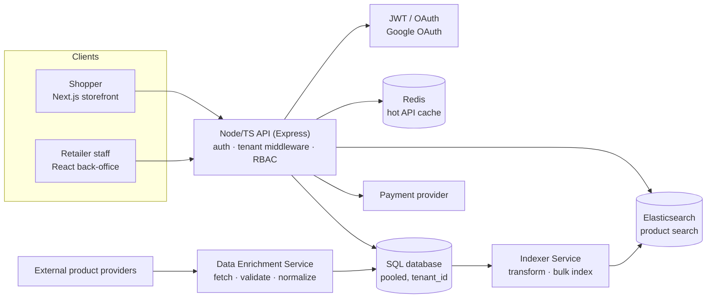
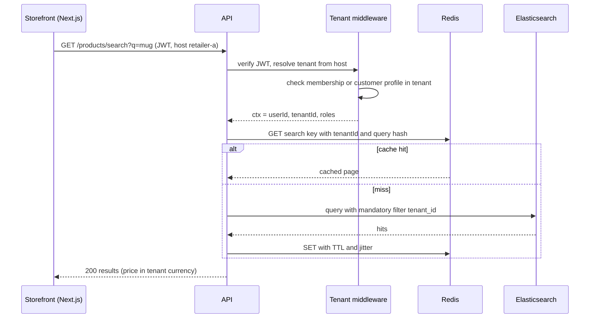

## Bối cảnh & vấn đề

"Pick the project you know best and draw its architecture for me" là câu mở đầu phổ biến nhất của deep-dive (câu 001). Có hai cách trả lời hỏng thường gặp. Cách thứ nhất là chỉ vẽ phần mình làm: một hộp "Checkout API" và một hộp "DB", còn search, cache, auth, các service đồng bộ dữ liệu thì không có. Interviewer kết luận bạn không nhìn thấy hệ thống. Cách thứ hai là vẽ 15 hộp với mũi tên chằng chịt, mất 8 phút, và không ai biết request đi đường nào.

Một câu trả lời tốt vẽ **5–8 hộp** ở mức container (app, service, datastore, hệ thống ngoài), rồi **kể theo một request cụ thể** đi qua các hộp đó, đánh dấu phần nào bạn build, nêu quy mô bằng số thật, và kết thúc bằng một điểm yếu của kiến trúc. Follow-up gần như chắc chắn: "Which box would fail first if traffic grew 10x?" Câu này đo xem bạn có mô hình định lượng trong đầu hay không.

Bài này dùng P1 làm ví dụ xuyên suốt. Diagram là bản **khái quát hoá** từ overview của track; bạn phải vẽ lại đúng hệ thống thật của mình (tên service, datastore, luồng đồng bộ) và không đưa tên client hay thông tin nội bộ nhạy cảm.

## Khái niệm

### Mức zoom: context, container, component

**C4 model** chia diagram thành các mức zoom: **system context** (hệ thống và người dùng, hệ thống ngoài), **container** (các đơn vị deploy được: web app, API, database, queue, search), **component** (module bên trong một container). Trong phỏng vấn, mức container là mặc định: đủ chi tiết để thấy luồng dữ liệu, đủ ít để vẽ trong 2 phút. Bạn chỉ zoom xuống component khi interviewer chỉ vào một hộp và hỏi "what's inside".

Một quy tắc thực tế: mỗi hộp phải trả lời được ba câu "nó lưu/xử lý gì", "ai gọi nó", "nó hỏng thì sao". Hộp nào bạn không trả lời được ba câu đó thì hoặc bỏ ra, hoặc chuẩn bị trước khi phỏng vấn.

### B2B2C và tenant cụ thể là gì

**B2B2C** nghĩa là nền tảng bán cho doanh nghiệp (B2B: các retailer là khách hàng trả tiền của nền tảng), và doanh nghiệp đó bán cho người tiêu dùng (B2C: khách mua hàng của retailer). **Tenant** là đơn vị cô lập dữ liệu và cấu hình; ở P1 tenant là retailer. Có hai loại **end user**: nhân viên của retailer (quản lý cửa hàng, nhân viên ca) và khách mua hàng. Mỗi request thuộc về đúng một tenant; sản phẩm, giá, đơn hàng, ca làm đều tách theo tenant.

Câu 002 cần bạn nói thêm ba thứ. Một là **mô hình isolation** thật của dự án: pool (chung database, cột `tenant_id`), bridge (schema riêng mỗi tenant) hay silo (database riêng); xem [Mô hình tenancy](/tracks/multi-tenancy/learn/tenancy-models). Hai là **hai quốc gia** kéo theo currency, timezone, locale và có thể yêu cầu pháp lý khác nhau. Ba là follow-up "một người có thể là khách của hai retailer không": câu trả lời phụ thuộc vào việc identity là **global** (một login dùng ở nhiều retailer, profile khách tách theo tenant) hay **per-tenant** (đăng ký riêng ở mỗi retailer, cùng email là hai account khác nhau).

**Interview angle:** interviewer muốn nghe bạn phân biệt "identity" (ai đang đăng nhập) với "membership/profile trong tenant" (người đó là gì ở retailer này). Lẫn hai khái niệm là nguồn gốc của nhiều bug cross-tenant.

### Request trace

**Request trace** là cách kể kiến trúc theo một request thật, từ trình duyệt tới datastore và quay lại. Nó biến diagram tĩnh thành câu chuyện: request đi qua middleware nào, tenant được xác định ở đâu, cache được hỏi trước hay sau, query nào chạy, lỗi được xử lý ở đâu. Chọn request có nhiều thứ để nói nhất: search sản phẩm (cache, Elasticsearch, tenant filter) hoặc checkout (transaction, idempotency, payment provider).

### Điểm nghẽn và câu hỏi "10x"

Câu "hộp nào hỏng đầu tiên khi traffic 10x" đo **mô hình định lượng**. Cách nghĩ: với mỗi hộp, **utilization = demand / capacity**. Demand của một hộp phụ thuộc vào traffic và vào các hộp phía trước (ví dụ DB nhận traffic **sau** cache, nên DB demand = request × miss ratio × số query mỗi miss). Hộp có utilization vượt 100% đầu tiên là hộp hỏng đầu tiên. Capacity lấy từ load test hoặc metric production, không lấy từ cảm giác.

Điểm tinh tế là **phụ thuộc chéo**: cache che DB. Khi cache lạnh (deploy, flush, Redis restart) đúng lúc traffic cao, DB nhận toàn bộ traffic và thường hỏng trước cả API. Chi tiết ước lượng xem [Back-of-envelope](/tracks/system-design/learn/back-of-envelope).

### Thiết kế lại và mở rộng thị trường

Hai câu senior (042 và 044) đo **judgment**: bạn có biết điều gì trong kiến trúc hiện tại đang gây đau, và bạn có ưu tiên được không. "Làm lại từ đầu" cần 2–3 thay đổi dựa trên đau thực tế, kèm thừa nhận điều đã làm đúng. "Thêm quốc gia thứ ba" kiểm tra các khái niệm **money** (lưu minor units + currency code, không float), **tax rules** (cấu hình theo market, không hard-code), **locale/timezone/định dạng địa chỉ**, và **data residency** (dữ liệu của tenant phải nằm ở region quy định, kể cả backup, log, cache và search index).

## Cơ chế hoạt động

### Diagram P1 ở mức container



Diagram có hai luồng chính. Luồng **online** (bên trái): storefront và back-office gọi một API Node/TypeScript; API xác thực, xác định tenant, kiểm quyền, rồi đọc Redis, SQL database hoặc Elasticsearch tuỳ endpoint, và gọi payment provider trong checkout. Luồng **offline** (bên dưới): Data Enrichment Service kéo dữ liệu sản phẩm từ provider ngoài, chuẩn hoá và ghi vào database; Indexer Service chuyển dữ liệu từ database sang Elasticsearch. Khi kể, đánh dấu phần bạn build (ví dụ: API Checkout/Address/Shift, một phần Data Enrichment, Indexer).

### Request trace: search sản phẩm



Khi kể sequence này, có ba điểm interviewer thường dừng lại hỏi. Tenant đến từ đâu và có được kiểm với user không (xem [bài 4](/tracks/project-deep-dive/learn/p1-tenant-isolation)). Cache key có tenant không (xem [bài 7](/tracks/project-deep-dive/learn/p1-redis-caching)). Elasticsearch có filter tenant bắt buộc không, và dữ liệu trong index stale bao lâu so với DB (xem [bài 9](/tracks/project-deep-dive/learn/p1-enrichment-indexer)). Chuẩn bị sẵn ba câu trả lời đó là bạn đã trả lời trước nửa số follow-up.

## Ví dụ thực tế

### Mô hình một người mua ở hai retailer

Schema dưới đây là **minh hoạ** cho mô hình identity global + profile theo tenant. Bảng `users` là identity (một login); `memberships` là phía B2B (nhân viên thuộc tenant nào, role gì); `tenant_customers` là phía B2C (khách hàng ở retailer nào, với thuộc tính riêng của retailer đó). Chạy trên Postgres 17:

```sql
CREATE TABLE tenants (id int PRIMARY KEY, name text, market text NOT NULL, currency char(3) NOT NULL, tz text NOT NULL);
CREATE TABLE users (id int PRIMARY KEY, email text UNIQUE NOT NULL);
CREATE TABLE memberships (user_id int REFERENCES users, tenant_id int REFERENCES tenants, role text, PRIMARY KEY (user_id, tenant_id));
CREATE TABLE tenant_customers (tenant_id int REFERENCES tenants, user_id int REFERENCES users, loyalty_tier text, marketing_opt_in bool,
  PRIMARY KEY (tenant_id, user_id));
INSERT INTO tenants VALUES (1,'Retailer A','M1','USD','America/New_York'), (2,'Retailer B','M2','EUR','Europe/Berlin');
INSERT INTO users VALUES (10,'shopper@example.test'), (20,'manager@example.test');
INSERT INTO tenant_customers VALUES (1,10,'gold',true), (2,10,'none',false);
INSERT INTO memberships VALUES (20,1,'store_manager');

SELECT u.email, t.name AS retailer, t.market, tc.loyalty_tier, tc.marketing_opt_in
FROM tenant_customers tc JOIN users u ON u.id=tc.user_id JOIN tenants t ON t.id=tc.tenant_id ORDER BY t.id;
```

```text
        email         |  retailer  | market | loyalty_tier | marketing_opt_in
----------------------+------------+--------+--------------+------------------
 shopper@example.test | Retailer A | M1     | gold         | t
 shopper@example.test | Retailer B | M2     | none         | f
(2 rows)
```

Cùng một người, hai profile độc lập: hạng thành viên và consent marketing của Retailer A không lộ sang Retailer B. Mỗi bảng có dữ liệu nghiệp vụ (đơn hàng, địa chỉ) phải có `tenant_id` và mọi khoá ngoại phải đi kèm tenant. Phương án thay thế là identity per-tenant: đơn giản hơn về isolation (không bao giờ có user "dùng chung"), đổi lại khách phải đăng ký lại ở mỗi retailer và Google OAuth phải liên kết theo từng tenant. Nói đúng mô hình dự án bạn dùng và vì sao.

### Ước lượng hộp hỏng đầu tiên khi 10x

Script dưới đây tính utilization cho từng hộp. Tất cả input là **minh hoạ** (300 RPS peak, hit ratio 85%, 4 query mỗi miss, capacity từ một load test giả định); thay bằng số thật của bạn trước khi dùng trong phỏng vấn.

```ts
// tenx.ts
const today = { peakRps: 300, cacheHitRatio: 0.85, dbQueriesPerMiss: 4, searchShare: 0.3 };
const capacity = {
  'API pods (CPU)':      { max: 4 * 400 },   // 4 pods × ~400 rps each (from a load test)
  'DB connections':      { max: 200 },
  'DB (queries/s)':      { max: 6000 },
  'Redis (ops/s)':       { max: 80000 },
  'Elasticsearch (qps)': { max: 1500 },
};
function demand(m: number, hit = today.cacheHitRatio) {
  const rps = today.peakRps * m, misses = rps * (1 - hit);
  const dbQps = misses * today.dbQueriesPerMiss;
  return { 'API pods (CPU)': rps, 'DB connections': dbQps * 0.02 /* 20 ms per query held */, 'DB (queries/s)': dbQps,
    'Redis (ops/s)': rps * 2, 'Elasticsearch (qps)': rps * today.searchShare };
}
for (const [m, hit, label] of [[1, 0.85, '1x'], [10, 0.85, '10x'], [10, 0, '10x + cold cache']] as const) {
  const d = demand(m, hit);
  const rows = Object.entries(capacity).map(([k, c]) => ({ box: k, util: d[k as keyof typeof d] / c.max }))
    .sort((a, b) => b.util - a.util).map(r => `${r.box} ${(r.util * 100).toFixed(0)}%`);
  console.log(`${label}:`, rows.join(' | '));
}
```

```text
1x: API pods (CPU) 19% | Elasticsearch (qps) 6% | DB (queries/s) 3% | DB connections 2% | Redis (ops/s) 1%
10x: API pods (CPU) 188% | Elasticsearch (qps) 60% | DB (queries/s) 30% | DB connections 18% | Redis (ops/s) 8%
10x + cold cache: DB (queries/s) 200% | API pods (CPU) 188% | DB connections 120% | Elasticsearch (qps) 60% | Redis (ops/s) 8%
```

Đọc kết quả: với cache ấm, API pods hỏng trước, và đó là hộp **dễ** sửa nhất (stateless, scale ngang). Với cache lạnh, database vượt cả query/s lẫn connection, và database là hộp **khó** scale nhất. Vì vậy câu trả lời senior cho follow-up của câu 001 không phải "API" mà là: "Nếu cache ấm thì API pods, chúng tôi scale ngang được; rủi ro thật là DB khi cache lạnh, nên tôi sẽ có warm-up trước sự kiện lớn, stampede protection và giới hạn connection pool để DB không bị kéo sập."

### Câu 042: làm lại từ đầu thì đổi gì

Khung trả lời (chọn 2–3 điểm dựa trên đau **thật** của bạn):

1. **Tenant isolation ở tầng database** (RLS hoặc security policy) và **observability có tenant dimension** ngay từ ngày đầu, vì filter ở application layer phụ thuộc vào việc không ai quên.
2. **Outbox/CDC cho đồng bộ DB → Elasticsearch** thay cho polling theo `updated_at`, nếu polling đã gây drift (sản phẩm đã xoá vẫn hiện trong search).
3. **Idempotency và state machine cho checkout** từ đầu, thay vì vá sau sự cố.
4. **Migration tooling và expand/contract làm chuẩn** (checklist, script backfill dùng chung).

Kết bằng ưu tiên: "Nếu chỉ có một quý, tôi chọn (1) vì rủi ro của leak dữ liệu giữa tenant là rủi ro hợp đồng, còn drift search chỉ là rủi ro trải nghiệm." Và thừa nhận điều đã làm đúng: pooled model giúp vận hành rẻ khi số tenant còn nhỏ.

### Câu 044: quốc gia thứ ba

| Khía cạnh | Thay đổi | Ghi chú |
|---|---|---|
| Money | `amount_minor bigint` + `currency char(3)`; giá theo market/tenant | Không float; số chữ số thập phân theo ISO 4217 (JPY có 0) |
| Thuế | Rule/config theo market, tách khỏi checkout core | Tính thuế là một bước có input/output rõ, test riêng |
| Địa chỉ, locale | Định dạng địa chỉ, validate mã bưu chính theo quốc gia | Liên quan Address Management |
| Thời gian | UTC instant + IANA zone của store | Xem [bài 8](/tracks/project-deep-dive/learn/p1-checkout-shifts) |
| Data residency | Tenant của market đó ở region riêng (silo theo market), routing theo tenant | Backup, log, cache, search index cũng phải ở region đó |
| Rollout | Feature flag theo tenant/market | Bật dần, có rollback |

Follow-up "data residency ảnh hưởng cache và search thế nào": Redis và Elasticsearch của market đó phải nằm trong region đó; không dùng cache toàn cục chung; log và APM có thể chứa PII nên cũng phải tuân thủ (hoặc lọc PII trước khi gửi). Chi tiết kiến trúc multi-region xem [Multi-tenant architecture](/tracks/system-design/learn/multi-tenant-architecture).

## Trade-offs & lựa chọn thay thế

| Quyết định khi vẽ/kể | Lựa chọn A | Lựa chọn B | Khi nào chọn |
|---|---|---|---|
| Mức chi tiết | 5–8 hộp container | Component chi tiết | A mặc định; B khi interviewer chỉ vào một hộp |
| Request để trace | Search (đọc) | Checkout (ghi) | Search để nói cache/ES/tenant; checkout để nói transaction/idempotency |
| Identity | Global user + profile theo tenant | Account per-tenant | A khi cần SSO/trải nghiệm xuyên retailer; B khi isolation và đơn giản quan trọng hơn |
| Market mới | Pooled + cột `market` | Silo theo region | A khi không có yêu cầu residency; B khi luật hoặc hợp đồng yêu cầu dữ liệu ở trong nước |
| Trả lời "10x" | Nêu một hộp | Nêu hộp + điều kiện (cache ấm/lạnh) | B luôn tốt hơn: cho thấy bạn hiểu phụ thuộc chéo |

Trong prose: diagram 5–8 hộp kèm một request trace là "đủ" cho 90% buổi phỏng vấn. Chỉ zoom sâu khi được hỏi, vì mỗi phút bạn tự vẽ chi tiết là một phút interviewer không được hỏi phần họ muốn đánh giá.

## Edge cases & failure modes

- **Bạn không biết hạ tầng chạy ở đâu** (cloud, VM, container): đây là gap thường gặp với dev outsource. Nói thật và nói phần bạn biết (CI/CD pipeline, môi trường staging); đừng đoán tên dịch vụ.
- **Kiến trúc thật xấu hơn diagram lý tưởng**: vẽ cái thật (ví dụ indexer đọc trực tiếp bảng nghiệp vụ theo `updated_at`), rồi nói bạn sẽ cải thiện thế nào. Vẽ phiên bản lý tưởng rồi bị hỏi chi tiết là cách nhanh nhất để mất tín nhiệm.
- **Interviewer hỏi về hộp không phải của bạn**: nói ở mức interface và suy luận có lý do.
- **Con số quy mô nhạy cảm**: dùng bậc độ lớn ("vài trăm tenant", "hàng chục nghìn đơn mỗi ngày") và nói là bạn đang làm tròn.
- **Cache lạnh khi deploy hoặc khi Redis failover**: hộp hỏng thật thường là DB, không phải hộp có utilization cao nhất lúc bình thường.
- **Một tenant chiếm phần lớn traffic**: utilization trung bình không phản ánh p99 của tenant nhỏ; xem noisy neighbor ở [bài 4](/tracks/project-deep-dive/learn/p1-tenant-isolation).

## Pitfalls

- ❌ Chỉ vẽ component của mình → ✅ vẽ cả hệ thống ở mức container, đánh dấu phần của mình.
- ❌ Vẽ 15 hộp không có luồng → ✅ 5–8 hộp và kể theo một request cụ thể.
- ❌ "Tenant là khách hàng" (mơ hồ) → ✅ tenant = retailer; end user = nhân viên và khách mua; isolation model cụ thể.
- ❌ Trả lời "10x" bằng cảm giác → ✅ utilization = demand / capacity, có điều kiện cache ấm/lạnh.
- ❌ "Làm lại thì đổi hết" → ✅ 2–3 thay đổi có lý do, có ưu tiên, thừa nhận điều đã làm đúng.
- ❌ Lưu tiền bằng float, thuế hard-code trong checkout → ✅ minor units + currency, rule theo market.
- ❌ Coi data residency chỉ là "database ở region X" → ✅ cả backup, log, cache, search index và bên thứ ba.

## Tóm tắt

- Vẽ ở mức container (5–8 hộp), mỗi hộp trả lời được "lưu gì, ai gọi, hỏng thì sao".
- Kể theo một request thật (search hoặc checkout) và chỉ rõ chỗ tenant, cache, search filter.
- B2B2C: tenant = retailer; phân biệt identity với membership/profile trong tenant.
- Câu 10x: tính utilization từng hộp; cache che DB nên cache lạnh là kịch bản nguy hiểm nhất.
- Câu "làm lại từ đầu": 2–3 thay đổi dựa trên đau thật, có ưu tiên.
- Câu "quốc gia thứ ba": money minor units, thuế theo market, locale/timezone, data residency ở mọi tầng, rollout bằng flag.
- Vẽ hệ thống thật, không vẽ phiên bản lý tưởng.
