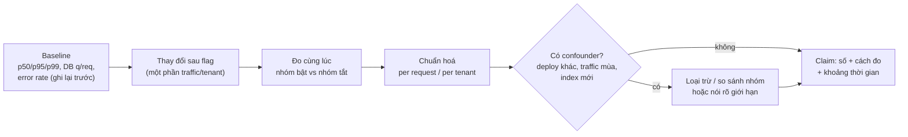
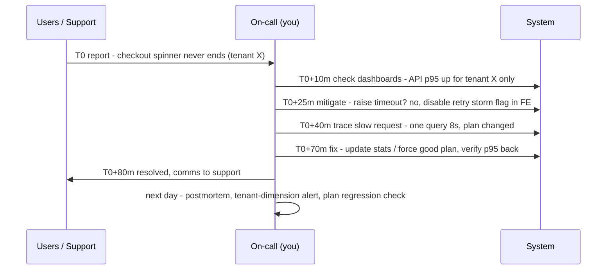

## Bối cảnh & vấn đề

Dòng CV "Memcached with TTL and refresh reduced DB load significantly" nghe ổn cho tới khi interviewer hỏi câu 058: "What were the before and after numbers, and what else changed at the same time?" Có ba cách trả lời hỏng. Cách một: "Em không nhớ, nhưng giảm nhiều lắm." Cách hai: bịa "giảm 80%", rồi sụp ở câu "đo ở metric nào, trong khoảng thời gian nào". Cách ba: đưa ra con số thật nhưng không biết rằng cùng tuần đó traffic giảm một phần ba vì hết mùa cao điểm, nên phần lớn "thành tích" không phải của cache.

Senior interviewer hỏi số không phải để chấm độ lớn của con số. Họ muốn biết bạn **có đo không**, **đo đúng không** (percentile, chuẩn hoá, khoảng thời gian), và **có trung thực về giới hạn của con số không**. Một câu "DB queries mỗi request giảm khoảng một nửa theo dashboard APM, nhưng tổng QPS giảm nhiều hơn vì traffic cũng giảm trong tuần đó" thắng mọi câu "giảm 80%".

Bài này dạy cách thu thập và bảo vệ số liệu, cách chứng minh "zero data loss", cách kể một sự cố production end-to-end, và cách chọn một bài học production có bằng chứng. Mọi con số trong bài là **minh hoạ** hoặc placeholder `<số liệu thật của bạn>`.

## Khái niệm

### Baseline

**Baseline** là giá trị của metric **trước** khi thay đổi, đo trong điều kiện tương đương (cùng khung giờ, cùng ngày trong tuần, cùng loại traffic). Không có baseline thì mọi "cải thiện" chỉ là cảm giác. Baseline tốt nhất được ghi lại **trước khi bắt đầu** làm (screenshot dashboard, export metric), vì sau khi deploy bạn không quay lại được quá khứ, và retention của metric thường chỉ vài tuần.

Nếu bạn không có baseline từ dự án cũ, câu trả lời trung thực là: "Tôi không chụp baseline lúc đó; con số tôi nhớ là khoảng X từ dashboard Y. Bài học là bây giờ tôi luôn ghi lại baseline trước khi tối ưu." Câu 058 có phần reflection chính là câu này.

### Percentile, không phải mean

**Mean** (trung bình) bị kéo bởi số đông request nhanh và che mất phần đuôi. **p50** là median; **p95/p99** là giá trị mà 95%/99% request nhanh hơn. User cảm nhận phần đuôi: một trang gọi 10 API, mỗi API có 5% request chậm, thì khoảng 40% lượt tải trang gặp ít nhất một API chậm (1 − 0,95¹⁰ ≈ 0,40). Vì vậy claim về latency phải nói percentile.

Cache là ví dụ kinh điển: cache hit làm request nhanh hơn rất nhiều, nên mean và p50 giảm mạnh, nhưng request **miss** vẫn chậm như cũ. Nếu tỷ lệ miss lớn hơn 5%, p95 gần như không đổi. Nói "cache giảm latency 55%" dựa trên mean mà không nói p95 là một nửa sự thật.

### Chuẩn hoá và yếu tố gây nhiễu

**Chuẩn hoá** là chia metric tổng cho một mẫu số phản ánh khối lượng công việc: DB queries **mỗi request**, CPU **mỗi 1.000 request**, lỗi **trên tổng request**. **Yếu tố gây nhiễu** (confounder) là thứ thay đổi cùng lúc với thay đổi của bạn: traffic theo mùa, một deploy khác, một index mới, một tenant lớn rời đi. Câu 058 hỏi thẳng "what else changed at the same time" vì đây là chỗ hầu hết claim sụp.

Cách loại nhiễu, từ mạnh tới yếu: rollout sau **feature flag** và so sánh hai nhóm cùng lúc (cùng traffic, cùng ngày); bật/tắt flag vài lần và xem metric đi theo; so sánh metric chuẩn hoá trước/sau; liệt kê các deploy cùng kỳ và loại trừ từng cái.

### Ước lượng có nguồn

Khi không có số chính xác, **ước lượng có nguồn** vẫn được chấp nhận: "khoảng 3–4 query mỗi request, theo trace APM của endpoint đó; sau cache còn khoảng 1–2". Ba thành phần: bậc độ lớn, nguồn (dashboard, log, load test, trace), và mức chắc chắn. Interviewer phân biệt rất nhanh giữa ước lượng trung thực và số bịa: số bịa thường quá tròn, quá đẹp và không đi kèm cách đo.

### Bằng chứng cho "zero data loss" và "zero downtime"

"Zero data loss" là một **claim cần bằng chứng**, không phải mô tả (câu 051). Bằng chứng gồm: **count** theo tenant sau backfill bằng nhau giữa cũ và mới; **checksum** hoặc hash theo batch/tenant khớp; **shadow read** (đọc cả cũ và mới, log khi lệch) trong thời gian chuyển tiếp; **reconcile job** chạy sau cutover; và **backup/point-in-time restore** sẵn sàng trước bước rủi ro. "Zero downtime" cũng cần bằng chứng: error rate và latency trong lúc migration (dashboard), không có maintenance window, không có lock wait dài. Cơ chế chi tiết ở [bài 6](/tracks/project-deep-dive/learn/p1-query-migrations).

### Incident narrative

Một **incident narrative** tốt có cấu trúc thời gian: **detect** (ai/cái gì phát hiện, sau bao lâu: MTTD), **mitigate** (chặn thiệt hại trước, ví dụ rollback, tắt flag, chặn endpoint), **diagnose** (giả thuyết, bằng chứng, giả thuyết bị loại), **fix** (root cause), **prevent** (test, alert, runbook, thay đổi quy trình), và **MTTR** (thời gian từ phát hiện tới khôi phục). Câu 056 hỏi incident "across backend, database and frontend", nên câu chuyện tốt nhất là câu chuyện mà triệu chứng ở một tầng nhưng nguyên nhân ở tầng khác.

**Interview angle:** follow-up "What tooling did you wish you had?" đo xem bạn rút ra được gì về observability. Câu trả lời tốt nêu một công cụ cụ thể và giải thích nó sẽ rút ngắn bước nào trong timeline (ví dụ: trace có `tenant_id` sẽ rút ngắn bước diagnose từ 3 giờ xuống vài phút).

## Cơ chế hoạt động

### Vòng đo lường



Sơ đồ có một điểm mấu chốt: **đo hai nhóm cùng lúc**. Khi một phần traffic chạy có cache và phần còn lại không, mọi yếu tố gây nhiễu theo thời gian (mùa, ngày trong tuần, deploy khác) ảnh hưởng đều cả hai nhóm, nên khác biệt giữa hai nhóm là do cache. So sánh "tuần trước vs tuần này" yếu hơn nhiều, và nếu chỉ có loại so sánh đó, bạn phải chuẩn hoá và nói rõ giới hạn.

### Timeline một incident



Timeline trên là **minh hoạ** cho một sự cố xuyên ba tầng: frontend retry làm tăng tải, API chậm ở một tenant, nguyên nhân gốc là một execution plan bị đổi ở database. Khi kể sự cố thật của bạn, giữ đúng cấu trúc này: mỗi mốc có thời gian (xấp xỉ cũng được), hành động, và bằng chứng dẫn tới hành động tiếp theo. Mitigate **trước** diagnose: interviewer senior đánh giá cao việc bạn chặn thiệt hại trước khi tìm root cause.

## Ví dụ thực tế

### Mean giảm, p95 đứng yên, và một nửa mức giảm DB load không phải của bạn

Script dưới đây sinh dữ liệu **minh hoạ** (seed cố định) cho latency trước/sau khi bật cache, và counter DB của hai tuần. Tính toán là thật; dữ liệu là giả định để minh hoạ cách đọc số.

```ts
// metrics.ts — synthetic data (minh hoạ)
let seed = 42; const rnd = () => (seed = (seed * 1103515245 + 12345) % 2 ** 31) / 2 ** 31;
const sample = (n: number, base: number, tailP: number, tail: number) =>
  Array.from({ length: n }, () => base * (0.6 + rnd() * 0.8) + (rnd() < tailP ? tail * rnd() : 0));
const pct = (xs: number[], p: number) => { const s = [...xs].sort((a, b) => a - b); return s[Math.ceil(p * s.length) - 1]; };
const mean = (xs: number[]) => xs.reduce((a, b) => a + b, 0) / xs.length;

const before = sample(20000, 120, 0.08, 900);   // ms
const after  = sample(20000, 25, 0.10, 900);    // cache hits fast, misses still slow
for (const [name, xs] of [['before', before], ['after', after]] as const)
  console.log(`${name.padEnd(6)} mean ${mean(xs).toFixed(0)} ms | p50 ${pct(xs, .5).toFixed(0)} | p95 ${pct(xs, .95).toFixed(0)} | p99 ${pct(xs, .99).toFixed(0)}`);

const weekBefore = { requests: 1_000_000, dbQueries: 4_200_000 };
const weekAfter  = { requests:   650_000, dbQueries: 1_300_000 };
const rawDrop = 1 - weekAfter.dbQueries / weekBefore.dbQueries;
const perReqBefore = weekBefore.dbQueries / weekBefore.requests, perReqAfter = weekAfter.dbQueries / weekAfter.requests;
console.log(`raw DB queries -${(rawDrop * 100).toFixed(0)}% | per request ${perReqBefore.toFixed(2)} -> ${perReqAfter.toFixed(2)} (-${((1 - perReqAfter / perReqBefore) * 100).toFixed(0)}%)`);
console.log(`share of the raw drop explained by lower traffic: ${(((1 - weekAfter.requests / weekBefore.requests) * perReqBefore * weekBefore.requests) / (weekBefore.dbQueries - weekAfter.dbQueries) * 100).toFixed(0)}% (approx.)`);
```

Output thật (`node metrics.ts`, Node 24):

```text
before mean 157 ms | p50 122 | p95 488 | p99 912
after  mean 71 ms | p50 26 | p95 502 | p99 844
raw DB queries -69% | per request 4.20 -> 2.00 (-52%)
share of the raw drop explained by lower traffic: 51% (approx.)
```

Hai bài học từ cùng một bộ số. Thứ nhất, nói "latency giảm 55%" (mean 157 → 71) là đúng về mặt số học nhưng gây hiểu nhầm: p95 gần như không đổi (488 → 502) vì 10% request vẫn miss và vẫn chậm. Claim trung thực là "p50 giảm từ ~120 ms xuống ~26 ms; p95 không đổi vì phần đuôi là cache miss, bước tiếp theo là giảm miss ratio hoặc tối ưu query của miss". Thứ hai, tổng DB queries giảm 69%, nhưng traffic cũng giảm 35%; chuẩn hoá theo request thì cache giảm khoảng 52% query mỗi request, và khoảng một nửa mức giảm tổng là do traffic. Đó là câu trả lời cho "what else changed at the same time".

### Câu 058: Memcached "significantly"

Khung trả lời: (1) số thật hoặc ước lượng có nguồn: "DB QPS giờ cao điểm `<trước>` → `<sau>`, CPU DB `<trước>` → `<sau>`, theo `<dashboard>`"; (2) chuẩn hoá: "tính theo request, giảm khoảng `<x>`"; (3) confounder: "cùng kỳ có `<deploy/index/traffic>`; tôi loại trừ bằng `<so sánh nhóm / bật tắt flag / không loại trừ được và nói rõ>`"; (4) staleness: "TTL `<n>` giây, PO đồng ý vì dữ liệu config/catalog đổi ít"; (5) reflection: "lần sau tôi ghi baseline và rollout sau flag để có so sánh cùng lúc". Follow-up "có user nào thấy dữ liệu stale không" cần một câu chuyện thật hoặc một câu thật thà "không ghi nhận, nhưng đây là cách chúng tôi sẽ phát hiện".

### Câu 050: chứng minh Redis caching có ích

Câu này giống 058 nhưng thêm phần **chọn endpoint**: xếp hạng endpoint theo RPS × DB time (từ APM hoặc log), chọn cái có tỷ lệ đọc/ghi cao và chấp nhận stale. Sau đó baseline, rollout sau flag, đo hit ratio, p50/p95, DB load. Và nói rõ "introduced" nghĩa là gì: bạn đề xuất và implement, hay implement theo thiết kế của lead. Follow-up "bạn quyết định **không** cache cái gì" có câu trả lời tốt: giá và tồn kho tại bước checkout, quyền của user, mọi thứ cá nhân hoá theo user mà hit ratio thấp. Chi tiết kỹ thuật ở [bài 7](/tracks/project-deep-dive/learn/p1-redis-caching).

### Câu 056: incident khó nhất, end to end

Khung STAR mở rộng cho incident (điền bằng sự cố thật của bạn):

- **S**: triệu chứng người dùng thấy, phạm vi (tenant, số user/đơn bị ảnh hưởng `<số liệu thật của bạn>`), mức nghiêm trọng.
- **T**: vai trò của bạn (on-call, người được giao, người tự nhận).
- **A**: timeline như sơ đồ trên; công cụ ở từng tầng (browser DevTools/network tab, log, APM/trace, execution plan, metric DB); ít nhất một giả thuyết bị loại và vì sao.
- **R**: fix, thời gian phát hiện và khôi phục `<MTTD, MTTR>`, phòng ngừa (test, alert theo tenant, runbook).
- **Reflection**: thứ bạn sẽ thêm để phát hiện sớm hơn.

Một giả thuyết bị loại là chi tiết đắt giá nhất: "Ban đầu tôi nghĩ do Redis vì hit ratio giảm, nhưng hit ratio giảm là **hệ quả** của retry từ frontend tạo key mới mỗi lần, không phải nguyên nhân." Chi tiết này chứng minh bạn đã thật sự điều tra.

### Câu 045: bài học production quan trọng nhất

Chọn **một** bài học có câu chuyện chứng minh và cách bạn áp dụng bây giờ. Các ứng viên tốt từ các dự án trong track: "mọi thay đổi phải đảo ngược được" (flag, expand/contract, alias swap); "không đo thì không tối ưu"; "tenant/authorization phải enforce ở tầng chung, không dựa vào trí nhớ"; "idempotency ở mọi nơi có retry". Follow-up "dạy team thế nào để họ không phải học bằng cách đau" cần cơ chế, không phải lời khuyên: checklist trong PR template, lint rule, test template cross-tenant, runbook, buổi chia sẻ postmortem.

## Trade-offs & lựa chọn thay thế

| Cách đo | Độ tin cậy | Chi phí | Dùng khi |
|---|---|---|---|
| So sánh hai nhóm sau flag, cùng lúc | Cao | Cần flag và metric theo nhóm | Thay đổi có rủi ro hoặc cần claim mạnh |
| Bật/tắt flag nhiều lần | Khá cao | Thấp | Không chia được nhóm |
| Trước/sau, chuẩn hoá theo request | Trung bình | Thấp | Đã deploy cho tất cả; nói rõ giới hạn |
| Trước/sau, số tổng | Thấp | Thấp | Chỉ làm số tham khảo |
| Load test trước/sau | Trung bình (môi trường khác prod) | Trung bình | Tối ưu trước khi lên prod; cần môi trường đại diện |
| Ước lượng từ trí nhớ + nguồn | Thấp nhưng trung thực | Không | Dự án cũ, không còn quyền truy cập dashboard |

Không có cách đo nào hoàn hảo; điều interviewer muốn là bạn biết mình đang dùng cách nào và giới hạn của nó. Một câu "đây là số trước/sau tổng, chưa chuẩn hoá, nên tôi chỉ dám nói giảm khoảng một nửa" là câu senior.

## Edge cases & failure modes

- **Request timeout không được ghi vào latency histogram**: p99 trông đẹp hơn thực tế vì request chậm nhất bị cắt. Đếm timeout riêng và cộng vào.
- **Coordinated omission trong load test**: tool chờ response mới gửi request tiếp, nên khi hệ thống chậm, tool gửi ít request hơn và đo ít request chậm hơn. Dùng tool sinh tải theo tốc độ cố định (open model).
- **Trung bình theo tenant che tenant nhỏ**: p95 toàn hệ thống ổn nhưng một tenant nhỏ có p95 gấp mười. Cần metric có tenant dimension.
- **Hit ratio bị thổi phồng** bởi health check hoặc bot gọi cùng một key; tính hit ratio theo endpoint quan trọng.
- **Metric retention ngắn**: dashboard chỉ giữ 14–30 ngày; baseline phải được export trước khi bắt đầu.
- **Count khớp nhưng nội dung lệch**: verify migration bằng count là chưa đủ; cần checksum hoặc so sánh nội dung.
- **Incident chưa có root cause rõ**: nói thật "chúng tôi mitigate được nhưng root cause là giả thuyết mạnh nhất X, bằng chứng Y"; đừng dựng chuyện cho tròn.

## Pitfalls

- ❌ "Nhanh hơn nhiều", "giảm đáng kể" → ✅ số trước/sau, percentile, nguồn đo, khoảng thời gian.
- ❌ Chỉ nói mean → ✅ p50 và p95/p99; nói rõ phần đuôi có đổi không.
- ❌ So sánh số tổng tuần trước và tuần này → ✅ chuẩn hoá theo request, liệt kê confounder, tốt nhất là so sánh hai nhóm sau flag.
- ❌ Bịa số tròn → ✅ ước lượng + nguồn + mức chắc chắn.
- ❌ "Zero data loss" vì "không ai phàn nàn" → ✅ count, checksum, shadow read, reconcile job.
- ❌ Kể incident theo thứ tự "tìm ra bug rồi sửa" → ✅ timeline detect → mitigate → diagnose → fix → prevent, có giả thuyết bị loại.
- ❌ Bài học kiểu khẩu hiệu → ✅ một câu chuyện, một thay đổi hành vi, một cơ chế để team áp dụng.

## Tóm tắt

- Interviewer hỏi số để xem bạn có đo, đo đúng và trung thực về giới hạn của con số không.
- Ghi baseline trước khi thay đổi; dùng percentile; chuẩn hoá theo request; tìm confounder.
- So sánh hai nhóm cùng lúc sau feature flag là cách đo mạnh nhất; trước/sau tổng là yếu nhất.
- Ví dụ thật: mean −55% nhưng p95 không đổi; DB load −69% nhưng khoảng một nửa do traffic giảm.
- "Zero data loss" cần count + checksum + shadow read + reconcile; "zero downtime" cần dashboard error rate/latency.
- Incident: detect → mitigate → diagnose → fix → prevent, có MTTD/MTTR và một giả thuyết bị loại.
- Không có số chính xác thì ước lượng kèm nguồn; không bao giờ bịa.
