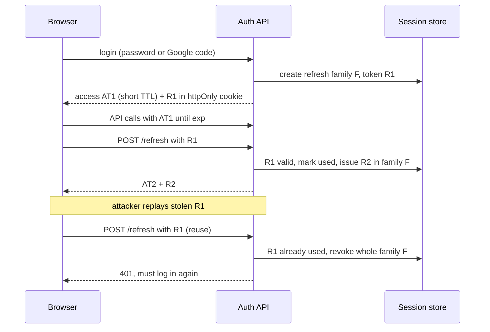
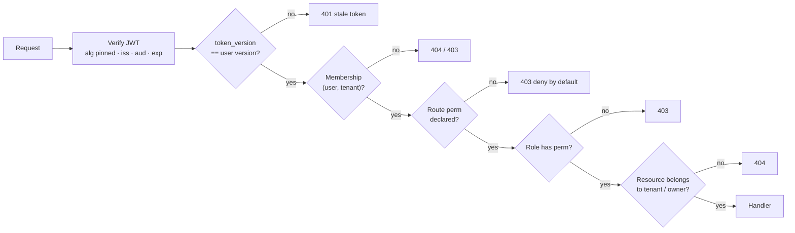

## Bối cảnh & vấn đề

Ba câu hỏi về auth của P1 có chung một bẫy: ứng viên trả lời bằng định nghĩa ("JWT là token có chữ ký, gồm header, payload, signature") thay vì bằng **thông số của hệ thống mình**. Interviewer không hỏi JWT là gì; họ hỏi access token sống bao lâu, lưu ở đâu trên client, refresh token có rotation không, và khi admin hạ quyền một user đang đăng nhập thì sau bao lâu quyền mới có hiệu lực (câu 009, 010). Họ hỏi Google OAuth dùng flow nào và **liên kết** với account email/password có sẵn thế nào (câu 011), vì đây là chỗ nhiều hệ thống mở đường cho account takeover. Và họ hỏi permission check nằm ở đâu và làm sao để endpoint mới không bị quên check (câu 055).

Một kịch bản thất bại có thật ở nhiều hệ thống: một manager bị hạ xuống staff lúc 9:00 vì nghỉ việc. Access token của họ có `role: manager` trong payload và sống 1 giờ; refresh token sống 30 ngày và mỗi lần refresh lại đọc role từ... chính access token cũ. Họ vẫn refund được đơn hàng tới hết tuần. Không có dòng code nào "sai" theo nghĩa crash; chỉ là không ai thiết kế đường đi của một thay đổi quyền.

Bài này cho khung trả lời từng câu, kèm demo chạy thật. Lý thuyết đầy đủ ở track [Auth & Identity](/tracks/auth-identity/learn/jwt-signing-verification). Mọi thông số (TTL, nơi lưu) phải là thông số **thật** của dự án bạn: `<số liệu thật của bạn>`.

## Khái niệm

### Access token và refresh token

**Access token** là token ngắn hạn (thường 5–15 phút) gửi kèm mỗi request; server verify chữ ký và claim mà không cần tra database, nên nhanh và stateless. **Refresh token** là token dài hạn hơn, chỉ dùng để xin access token mới, và **được lưu phía server** (hoặc có bản ghi phía server) để có thể thu hồi. Lý do tách đôi: access token không thu hồi được dễ dàng (nó tự hợp lệ tới `exp`), nên phải ngắn; refresh token thu hồi được, nên có thể dài.

**Rotation** nghĩa là mỗi lần dùng refresh token, server cấp refresh token mới và vô hiệu hoá cái cũ. **Reuse detection**: nếu một refresh token đã bị dùng rồi lại được gửi lên lần nữa, đó là dấu hiệu bị đánh cắp (kẻ tấn công hoặc user thật đang dùng bản cũ); server thu hồi cả "họ" token đó và bắt đăng nhập lại. Chi tiết ở [Access token, refresh token, rotation và revocation](/tracks/auth-identity/learn/token-lifecycle-revocation).

### Nơi lưu token trên client

Ba lựa chọn chính. **localStorage**: dễ dùng nhưng bất kỳ XSS nào cũng đọc được token. **httpOnly Secure SameSite cookie**: JavaScript không đọc được nên XSS không lấy được token (dù XSS vẫn gửi request được trong phiên), nhưng phải xử lý CSRF (SameSite + CSRF token cho request thay đổi trạng thái). **Access token trong memory + refresh token trong httpOnly cookie**: cân bằng phổ biến cho SPA. Với Next.js có server-side rendering, cookie gần như bắt buộc vì server cần token khi render (follow-up của câu 010). Xem [Token trong browser](/tracks/auth-identity/learn/browser-tokens-bff-dpop).

### Verify an toàn

Verify JWT không chỉ là kiểm chữ ký. Phải **pin algorithm** (chỉ chấp nhận thuật toán bạn dùng, từ chối `alg: none` và từ chối nhầm lẫn HS/RS), kiểm `iss` (ai phát hành), `aud` (token dành cho ai), `exp`/`nbf` (thời gian), và nếu dùng khoá bất đối xứng thì lấy public key từ JWKS có cache và xử lý rotation khoá. Thư viện tốt làm phần lớn việc này, nhưng bạn phải truyền đúng tham số.

### Revocation và độ trễ của thay đổi quyền

Có ba cơ chế để thay đổi quyền có hiệu lực trước khi access token hết hạn. **Denylist theo `jti`** trong Redis (TTL bằng thời gian sống còn lại của token): thu hồi từng token. **`token_version` trên user**: tăng version khi đổi role/đổi mật khẩu/logout-all; token mang version cũ bị từ chối; cần tra version mỗi request (cache được). **Không nhét permission vào token**, chỉ nhét `sub`, rồi tra quyền từ cache/DB mỗi request. Không có cơ chế nào thì độ trễ tối đa bằng TTL của access token. Câu trả lời đúng cho follow-up câu 009 là một con số: "tối đa `<TTL access token>`, trừ khi …".

### Google OAuth và account linking

Google login nên dùng **Authorization Code flow** (kèm PKCE nếu client là public), đổi code lấy token **ở server**, verify **ID token** (chữ ký qua JWKS của Google, `aud` là client id của bạn, `iss`, `exp`, `nonce`), và dùng **`sub`** làm định danh ổn định (email có thể đổi). Tham số `state` chống CSRF trong redirect. Bảng `identities(user_id, provider, provider_sub)` cho phép một user có nhiều phương thức đăng nhập.

**Account linking** là gắn Google identity vào user đã tồn tại có cùng email. Nguy hiểm: nếu tự động link chỉ vì email trùng, kẻ tấn công tạo account Google (hoặc provider khác) với email của nạn nhân chưa được xác minh và chiếm account. Quy tắc an toàn: chỉ link khi `email_verified = true` **và** user chứng minh sở hữu account hiện có (đăng nhập bằng mật khẩu, hoặc xác nhận qua email). Xem [MFA, passkeys và account linking](/tracks/auth-identity/learn/mfa-passkeys-account-linking).

**Interview angle:** follow-up của 011 là "What attack becomes possible if you auto-link purely by matching email?". Trả lời: pre-account takeover / account takeover qua email chưa xác minh; kể cả với Google (email thường verified), một provider khác cho phép email chưa xác minh sẽ mở cùng lỗ hổng nếu logic linking dùng chung.

### RBAC theo membership

Trong multi-tenant, **role gắn với membership**, không gắn với user: `memberships(user_id, tenant_id, role_id)`, `roles`, `role_permissions(role_id, permission)`. Một người có thể là manager ở retailer A và staff ở retailer B. **Permission** dạng `resource:action` (`order:refund`). **Platform role** (admin của nền tảng) tách riêng khỏi role trong tenant và có audit. Permission check luôn đi kèm **ownership/tenant check** của resource cụ thể: có `order:refund` không có nghĩa là refund được đơn của tenant khác. Xem [Authorization multi-tenant](/tracks/auth-identity/learn/multi-tenant-authorization).

### Deny by default

**Deny by default** nghĩa là route không khai báo permission thì bị chặn, thay vì được mở. Cách cài phổ biến: mỗi route khai báo metadata (`perm: 'order:refund'` hoặc `public: true`), middleware chung từ chối route không có metadata, và một test liệt kê mọi route để fail CI nếu có route thiếu khai báo. Frontend ẩn nút "Refund" chỉ là UX, không phải bảo mật.

## Cơ chế hoạt động

### Login, refresh rotation và reuse detection



Sơ đồ cho thấy vì sao rotation có giá trị: refresh token bị đánh cắp chỉ dùng được cho tới khi một trong hai bên (kẻ tấn công hoặc user thật) refresh lần tiếp theo; lần dùng lại token cũ kích hoạt thu hồi cả family. Lưu ý chiều ngược lại: nếu kẻ tấn công refresh **trước**, họ giữ phiên cho tới khi user thật dùng lại token cũ của mình. Rotation giới hạn thời gian, không loại bỏ hoàn toàn rủi ro.

### Đường đi của một permission check



Mỗi hình thoi là một lớp có thể trả lời câu "check nằm ở đâu" (câu 055). Hai lớp đầu ở middleware chung, lớp "route perm declared" là cơ chế deny-by-default, lớp cuối (ownership) nằm trong service hoặc repository vì chỉ ở đó mới biết resource cụ thể. Membership và role có thể cache vài chục giây; khi đó độ trễ của thay đổi quyền bằng TTL của cache đó, không phải TTL của token.

## Ví dụ thực tế

### Demo: verify, token_version, deny-by-default, account linking (chạy thật)

Script dùng `node:crypto` để ký/verify HS256 (không cần thư viện, để thấy rõ từng bước), mô phỏng membership theo tenant, `token_version`, một route registry và quy tắc linking. Dữ liệu là minh hoạ.

```ts
// auth.ts
import { createHmac, timingSafeEqual } from 'node:crypto';
const SECRET = 'dev-only-secret';
const b64 = (o: object) => Buffer.from(JSON.stringify(o)).toString('base64url');
function sign(payload: object) {
  const h = b64({ alg: 'HS256', typ: 'JWT' }), p = b64(payload);
  return `${h}.${p}.${createHmac('sha256', SECRET).update(`${h}.${p}`).digest('base64url')}`;
}
function verify(token: string, now: number) {
  const [h, p, s] = token.split('.');
  const header = JSON.parse(Buffer.from(h, 'base64url').toString());
  if (header.alg !== 'HS256') throw new Error('alg not allowed');            // pin the algorithm
  const want = createHmac('sha256', SECRET).update(`${h}.${p}`).digest();
  if (!timingSafeEqual(want, Buffer.from(s, 'base64url'))) throw new Error('bad signature');
  const c = JSON.parse(Buffer.from(p, 'base64url').toString());
  if (c.iss !== 'api' || c.aud !== 'web') throw new Error('bad iss/aud');
  if (c.exp <= now) throw new Error('expired');
  return c;
}
const users = new Map([['u1', { tokenVersion: 3 }]]);
const memberships = new Map([['u1:t-a', 'manager'], ['u1:t-b', 'staff']]);
const rolePerms: Record<string, string[]> = { manager: ['order:read', 'order:refund'], staff: ['order:read'] };
function authorize(token: string, tenantId: string, perm: string, now: number) {
  const c = verify(token, now);
  if (c.ver !== users.get(c.sub)!.tokenVersion) return 'deny: token_version stale';
  const role = memberships.get(`${c.sub}:${tenantId}`);
  if (!role) return 'deny: not a member of tenant';
  return rolePerms[role].includes(perm) ? `allow (${role})` : `deny: ${role} lacks ${perm}`;
}
const now = 1_800_000_000;
const t = sign({ sub: 'u1', iss: 'api', aud: 'web', ver: 3, iat: now, exp: now + 300 });
console.log('refund in t-a      :', authorize(t, 't-a', 'order:refund', now));
console.log('refund in t-b      :', authorize(t, 't-b', 'order:refund', now));
console.log('read in t-c        :', authorize(t, 't-c', 'order:read', now));
users.get('u1')!.tokenVersion = 4;  // admin downgrades the user -> bump version
console.log('after downgrade    :', authorize(t, 't-a', 'order:refund', now + 10));
try { verify(t, now + 301); } catch (e) { console.log('after 5 min        :', (e as Error).message); }
const none = `${b64({ alg: 'none' })}.${t.split('.')[1]}.`;
try { verify(none, now); } catch (e) { console.log('alg=none token     :', (e as Error).message); }

type Route = { method: string; path: string; perm?: string; public?: true };
const routes: Route[] = [
  { method: 'GET', path: '/health', public: true },
  { method: 'GET', path: '/orders/:id', perm: 'order:read' },
  { method: 'POST', path: '/orders/:id/refund', perm: 'order:refund' },
  { method: 'GET', path: '/reports/revenue' },               // new endpoint, forgot the permission
];
console.log('routes without perm:', routes.filter(r => !r.perm && !r.public).map(r => `${r.method} ${r.path}`));

type Google = { sub: string; email: string; email_verified: boolean };
function link(g: Google, existingByEmail: boolean, provedOwnership: boolean) {
  if (!existingByEmail) return 'create user + identity(google, sub)';
  if (!g.email_verified) return 'refuse: email not verified';
  return provedOwnership ? 'link identity(google, sub) to existing user' : 'ask to log in with password / confirm by email first';
}
console.log('link unverified    :', link({ sub: '1', email: 'a@x.test', email_verified: false }, true, false));
console.log('link verified only :', link({ sub: '1', email: 'a@x.test', email_verified: true }, true, false));
console.log('link + proved      :', link({ sub: '1', email: 'a@x.test', email_verified: true }, true, true));
```

Output thật (`node auth.ts`, Node 24):

```text
refund in t-a      : allow (manager)
refund in t-b      : deny: staff lacks order:refund
read in t-c        : deny: not a member of tenant
after downgrade    : deny: token_version stale
after 5 min        : expired
alg=none token     : alg not allowed
routes without perm: [ 'GET /reports/revenue' ]
link unverified    : refuse: email not verified
link verified only : ask to log in with password / confirm by email first
link + proved      : link identity(google, sub) to existing user
```

Đọc output theo câu hỏi. Cùng một token, cùng một user: refund được ở tenant A (manager), không refund được ở tenant B (staff), không đọc được ở tenant C (không có membership): đó là RBAC theo membership (câu 009). Sau khi tăng `token_version`, token còn 290 giây sống vẫn bị từ chối **ngay**: đó là câu trả lời cho "role bị hạ thì bao lâu có hiệu lực", với chi phí là một lần tra version (cache được) mỗi request. Token `alg: none` bị từ chối vì algorithm được pin. Route `/reports/revenue` thiếu permission bị liệt kê, chính là test deny-by-default chạy trong CI (câu 055). Quy tắc linking từ chối email chưa xác minh và yêu cầu chứng minh sở hữu trước khi link (câu 011).

### Khung trả lời câu 010

"Access token `<TTL thật>`, ký `<HS256/RS256>`, verify pin algorithm và kiểm `iss`/`aud`/`exp`. Refresh token `<TTL thật>`, lưu `<httpOnly cookie / ...>`, có `<rotation + reuse detection / không>`. Revoke: logout xoá refresh token phía server; đổi role/mật khẩu thì `<token_version / denylist jti / chờ hết TTL>`. Với Next.js SSR, token nằm trong cookie để server component/route handler đọc được; refresh xảy ra ở `<middleware / route handler / client>`." Nếu dự án lưu token ở localStorage, nói thật và nói rủi ro XSS cùng hướng cải thiện.

### Khung trả lời câu 055 và follow-up

"Permission check ở `<middleware requirePermission theo route>` cộng ownership/tenant check trong service. Tránh quên bằng `<deny by default / metadata trên route / test liệt kê route / review checklist>`." Follow-up "quyền của role thay đổi lan tới user đang đăng nhập thế nào": nếu permission nằm trong JWT thì phải chờ token hết hạn hoặc tăng `token_version`; nếu tra từ cache thì bằng TTL của cache cộng thời gian invalidate. Một thiết kế hay là invalidate cache quyền theo `role_id` khi admin sửa role, và gắn version vào key cache quyền.

## Trade-offs & lựa chọn thay thế

| Quyết định | Phương án A | Phương án B | Khi nào chọn |
|---|---|---|---|
| Permission ở đâu | Trong JWT (nhanh, không tra) | Tra cache/DB mỗi request (tươi) | A khi quyền ít đổi và TTL token ngắn; B khi cần thu hồi ngay hoặc quyền phức tạp |
| Revoke access token | Chờ hết TTL | `token_version` / denylist `jti` | B cho thao tác nhạy cảm (refund, admin) |
| Lưu token | localStorage | httpOnly cookie (+ CSRF) | B gần như luôn; bắt buộc khi SSR |
| Khoá ký | HS256 (một secret) | RS256/ES256 + JWKS | B khi nhiều service verify mà không được phép ký |
| Session | JWT stateless | Server session (cookie id) | Session đơn giản và thu hồi dễ cho một app; JWT khi nhiều service/edge verify |
| Linking Google | Auto-link theo email | Link sau khi chứng minh sở hữu | Luôn B |

Lựa chọn giữa JWT và server session đáng nói trong phỏng vấn: với một monolith Next.js + một API, server session (cookie chứa session id, dữ liệu ở Redis) thường đơn giản hơn và thu hồi tức thì. JWT có lợi khi nhiều service độc lập cần verify mà không gọi về auth server. Nói được vì sao dự án chọn cái đang dùng (hoặc thừa nhận nó là quyết định có sẵn) cho thấy judgment.

## Edge cases & failure modes

- **Clock skew** giữa server: `exp` vừa hết ở server này nhưng chưa hết ở server kia; cho leeway vài chục giây.
- **Hai tab cùng refresh** với rotation: tab thứ hai dùng refresh token vừa bị rotate và kích hoạt reuse detection, đăng xuất user. Cần cơ chế đồng bộ (một request refresh dùng chung, hoặc grace period ngắn cho token vừa rotate).
- **Redis chứa denylist chết**: fail-open (cho qua token có thể đã bị thu hồi) hay fail-closed (đăng xuất mọi người)? Quyết định theo mức độ nhạy cảm; xem [bài 7](/tracks/project-deep-dive/learn/p1-redis-caching).
- **Rotation khoá ký**: JWKS phải chứa cả khoá cũ và mới trong thời gian chuyển tiếp; cache JWKS phải refresh khi gặp `kid` lạ.
- **User bị xoá khỏi tenant** nhưng token còn hạn: nếu membership không tra lại mỗi request (hoặc cache quá lâu), họ vẫn truy cập được.
- **Google đổi email của user** hoặc user đổi email Google: dùng `sub` thì không ảnh hưởng; dùng email làm khoá thì tạo account mới hoặc tệ hơn, gắn nhầm.
- **Platform admin "impersonate"** một tenant để hỗ trợ: phải có audit và giới hạn thời gian, không dùng chung đường đi với user thường.

## Pitfalls

- ❌ Trả lời bằng định nghĩa JWT → ✅ thông số thật: TTL, nơi lưu, rotation, cơ chế revoke.
- ❌ Không pin algorithm, không kiểm `aud` → ✅ chỉ chấp nhận thuật toán đã chọn; kiểm `iss`, `aud`, `exp`.
- ❌ Role global trên user → ✅ role trên membership (user, tenant).
- ❌ Nhét permission vào token TTL dài → ✅ token ngắn hoặc `token_version`, hoặc tra quyền có cache ngắn.
- ❌ Auto-link Google theo email → ✅ `email_verified` + chứng minh sở hữu account hiện có; định danh bằng `sub`.
- ❌ Route mới mặc định mở → ✅ deny by default + test liệt kê route thiếu permission.
- ❌ Ẩn nút ở frontend coi là bảo mật → ✅ mọi check ở server, kèm ownership của resource.

## Tóm tắt

- Access token ngắn, refresh token lưu phía server, rotation + reuse detection.
- Lưu token trong httpOnly cookie (bắt buộc với SSR); localStorage mở rủi ro XSS.
- Verify: pin algorithm, `iss`, `aud`, `exp`; JWKS có cache cho khoá bất đối xứng.
- Thay đổi quyền có hiệu lực sau tối đa TTL token, trừ khi có `token_version`/denylist/tra quyền mỗi request (demo: từ chối ngay sau khi tăng version).
- Google OAuth: Authorization Code (+PKCE), verify ID token, `state`, `nonce`, định danh bằng `sub`; link chỉ khi email verified và user chứng minh sở hữu.
- RBAC theo membership; permission `resource:action`; luôn kèm ownership/tenant check.
- Deny by default với route metadata và test CI liệt kê route thiếu permission.
