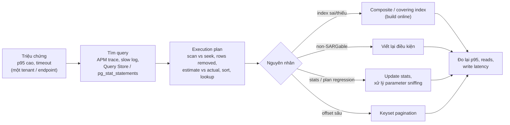
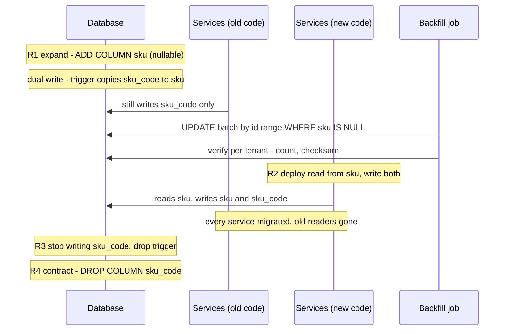

## Bối cảnh & vấn đề

Hai claim của P1 đi cùng nhau: "schema changes, indexing and query optimization for high-traffic APIs" và "zero-downtime, zero-data-loss migrations during production schema changes". Interviewer sẽ đào cả hai bằng câu chuyện cụ thể. Câu 013: "Give me one slow query you fixed. What did the execution plan show?" Câu 014 và 030: "Walk me through a zero-downtime migration step by step" và "rename a column on a hot table used by several services". Câu 031 và 051: rollback thế nào, và làm sao bạn **biết** là không mất dữ liệu. Câu 052: bạn thêm bao nhiêu index, có cái nào làm chậm write hay bị gỡ không.

Câu trả lời yếu nghe như sau: "Query chậm thì em thêm index vào các cột trong WHERE." Interviewer sẽ hỏi: thứ tự cột trong composite index là gì, vì sao; plan trước và sau trông ra sao; tạo index trên bảng lớn thế nào để không khoá write. Câu trả lời yếu cho migration: "Em viết migration ALTER TABLE rồi deploy." Trên bảng hot có vài service đọc, một `RENAME COLUMN` làm vỡ mọi service chưa deploy code mới ngay giây đó.

Bài này cho hai câu chuyện chạy thật trên Postgres 17 (chọn Postgres vì chạy được trong container; P1 dùng SQL Server, nên mỗi chỗ khác biệt quan trọng được ghi chú, và các điểm cụ thể của SQL Server được đánh dấu verify). Lý thuyết đầy đủ ở [Query planner & EXPLAIN](/tracks/sql-postgres/learn/planner-explain), [B-tree index](/tracks/sql-postgres/learn/btree-indexes) và [Zero-downtime schema migrations](/tracks/sql-postgres/learn/zero-downtime-migrations).

## Khái niệm

### Execution plan

**Execution plan** là cách database quyết định chạy một query: đọc bảng nào bằng cách nào (seq scan, index scan, index seek), join theo thuật toán nào, sắp xếp ở đâu. `EXPLAIN (ANALYZE, BUFFERS)` trong Postgres chạy query thật và in số dòng thật, thời gian thật và số page đọc; SQL Server có "actual execution plan" và `SET STATISTICS IO ON` cho logical reads. Thứ cần đọc: node nào tốn thời gian nhất, **Rows Removed by Filter** (đọc nhiều mà bỏ đi nhiều là dấu hiệu index sai), ước lượng số dòng so với số dòng thật (lệch lớn là thống kê cũ hoặc phân phối lệch), và có bước sort hay key lookup đắt không.

### Composite index và thứ tự cột

**Composite index** là index trên nhiều cột, sắp xếp theo cột đầu rồi cột sau. Thứ tự đúng thường là: cột so sánh bằng (`tenant_id = ?`, `status = ?`) trước, cột dùng cho range hoặc `ORDER BY` (`created_at`) sau. Với query `WHERE tenant_id = ? AND status = 'active' ORDER BY created_at DESC LIMIT 20`, index `(tenant_id, status, created_at DESC)` cho phép database nhảy thẳng tới đoạn của tenant đó và đọc đúng 20 dòng đầu, không phải sort. **Covering index** (`INCLUDE` ở cả Postgres và SQL Server) thêm cột cần trả về vào lá của index để tránh quay lại bảng (key lookup ở SQL Server).

Trong multi-tenant pooled, `tenant_id` gần như luôn đứng đầu index của bảng nghiệp vụ, vì gần như mọi query đều lọc theo tenant.

### SARGable

Một điều kiện là **SARGable** (Search ARGument-able) khi database dùng được index cho nó. `date(created_at) = '2026-03-01'` không SARGable với index trên `created_at`, vì index sắp theo `created_at`, không theo `date(created_at)`; viết lại thành range `created_at >= '2026-03-01' AND created_at < '2026-03-02'` thì dùng được. Tương tự: hàm trên cột, implicit conversion kiểu dữ liệu (rất phổ biến ở SQL Server khi so `nvarchar` với `varchar`), `LIKE '%abc'`.

### Chi phí của index

Mỗi index làm **chậm write** (mỗi INSERT/UPDATE cột được index phải cập nhật thêm một cấu trúc), tốn **dung lượng** và RAM cho buffer cache, và có thể làm planner chọn sai. Index không được dùng là chi phí thuần. Kiểm tra bằng `pg_stat_user_indexes.idx_scan` (Postgres) hoặc `sys.dm_db_index_usage_stats` (SQL Server; số liệu reset khi restart instance). Câu 052 kiểm tra đúng ý thức này: một ứng viên senior kể được cả index đã thêm lẫn index đã gỡ.

### Tạo index trên bảng lớn

`CREATE INDEX` thông thường khoá write trên bảng trong lúc build. Postgres có `CREATE INDEX CONCURRENTLY`: không khoá write, chậm hơn, không chạy được trong transaction, và nếu fail thì để lại index `INVALID` phải drop. SQL Server có `WITH (ONLINE = ON)`, nhưng chỉ ở Enterprise edition (và Azure SQL); Standard edition build offline (verify với edition của bạn). Đây là follow-up của câu 013.

### Expand/contract (parallel change)

**Expand/contract** chia một thay đổi schema phá vỡ tương thích thành nhiều bước, mỗi bước tương thích với code đang chạy: **expand** (thêm cột/bảng mới, không xoá gì), **migrate** (dual-write, backfill, verify, chuyển đọc), **contract** (ngừng ghi cũ, xoá cũ ở release sau). Nguyên tắc nền: tại mọi thời điểm, cả code phiên bản cũ và mới đều chạy đúng với schema hiện tại. Điều đó cho phép deploy từng service một và **rollback bằng code**, không phải bằng schema.

### Backfill theo batch

**Backfill** là sao chép dữ liệu cũ sang cấu trúc mới. Trên bảng lớn phải chia **batch nhỏ theo khoá** (PK range), mỗi batch một transaction ngắn, có **throttle** (nghỉ giữa các batch), **idempotent** (chạy lại không sai: `WHERE new_col IS NULL`), **resumable** (lưu `lastId`). Lý do: một UPDATE triệu dòng trong một transaction giữ lock lâu, phình transaction log/WAL, làm replica lag, và nếu fail thì rollback cũng lâu như lúc chạy.

## Cơ chế hoạt động

### Từ triệu chứng tới fix



Khi kể câu 013, đi đúng thứ tự trên và dừng lâu ở bước plan: đó là bằng chứng bạn đã thật sự nhìn plan. Bước cuối "đo lại" phải có cả chiều read (query nhanh hơn) và chiều write (index mới có làm chậm INSERT/UPDATE không).

### Rename cột trên bảng hot bằng expand/contract



Bốn release (R1–R4), mỗi release rollback được độc lập. Trigger trong bước dual-write là lựa chọn khi code cũ chưa biết cột mới; phương án khác là code mới ghi cả hai cột (khi đó phải deploy code mới trước backfill). Bước "every service migrated" là bước hay bị bỏ quên nhất: trước khi drop cột cũ, phải chắc mọi consumer (service khác, job báo cáo, ETL, view) đã thôi đọc nó. Dữ liệu dễ mất nhất ở hai chỗ: khoảng giữa backfill và lúc dual-write chưa bật (ghi mới không được sao chép), và đường ghi đi vòng qua cơ chế dual-write (bulk tool, script tay).

## Ví dụ thực tế

### Slow query của tenant nhỏ trên index dùng chung (Postgres 17, chạy thật)

Bảng `products` 1 triệu dòng, 50 tenant chia đều, có sẵn index trên `created_at`. Thêm tenant 51 nhỏ (200 sản phẩm, tạo từ năm trước).

```sql
CREATE TABLE products (
  id bigint GENERATED ALWAYS AS IDENTITY PRIMARY KEY,
  tenant_id int NOT NULL, status text NOT NULL, sku_code text NOT NULL,
  price_minor bigint NOT NULL, created_at timestamptz NOT NULL
);
INSERT INTO products (tenant_id, status, sku_code, price_minor, created_at)
SELECT (g % 50) + 1, CASE WHEN g % 10 = 0 THEN 'archived' ELSE 'active' END,
       'SKU-' || g, (g % 1000) * 100, timestamptz '2026-01-01' + (g || ' seconds')::interval * 30
FROM generate_series(1, 1000000) g;
CREATE INDEX products_created_at ON products (created_at);
INSERT INTO products (tenant_id, status, sku_code, price_minor, created_at)
SELECT 51, 'active', 'SMALL-' || g, 500, timestamptz '2025-12-01' + (g || ' minutes')::interval FROM generate_series(1, 200) g;
ANALYZE products;

EXPLAIN (ANALYZE, BUFFERS, COSTS OFF)
SELECT id, sku_code, price_minor FROM products
WHERE tenant_id = 51 AND status = 'active' ORDER BY created_at DESC LIMIT 20;
```

```text
 Limit (actual time=144.935..151.041 rows=20 loops=1)
   Buffers: shared hit=14159 read=2723
   ->  Gather Merge (actual time=144.924..151.027 rows=20 loops=1)
         Workers Planned: 2
         Workers Launched: 2
         ->  Parallel Index Scan Backward using products_created_at on products (actual time=141.682..141.684 rows=7 loops=3)
               Filter: ((tenant_id = 51) AND (status = 'active'::text))
               Rows Removed by Filter: 333333
 Execution Time: 151.101 ms
```

Đọc plan: planner chọn đi **ngược** index `created_at` (để có sẵn thứ tự DESC) và lọc từng dòng theo tenant. Với tenant lớn, 20 dòng đầu xuất hiện rất sớm nên query này nhanh (đã đo: 0,4 ms cho tenant 7). Với tenant 51, mọi sản phẩm đều cũ hơn toàn bộ dữ liệu khác, nên phải đi qua cả triệu dòng: `Rows Removed by Filter: 333333` × 3 worker, gần 17.000 page. Đây là kiểu bug "chỉ một tenant phàn nàn" rất điển hình ở multi-tenant.

```sql
CREATE INDEX CONCURRENTLY products_tenant_status_created
  ON products (tenant_id, status, created_at DESC) INCLUDE (sku_code, price_minor);
```

```text
 Limit (actual time=0.074..0.082 rows=20 loops=1)
   Buffers: shared hit=4 read=1
   ->  Index Scan using products_tenant_status_created on products (actual time=0.055..0.061 rows=20 loops=1)
         Index Cond: ((tenant_id = 51) AND (status = 'active'::text))
 Execution Time: 0.149 ms
```

151 ms xuống 0,15 ms, 16.882 page xuống 5. Cái giá: `pg_stat_user_indexes` cho thấy index mới **64 MB**, gấp ba index `created_at` (21 MB) vì có `INCLUDE`. Đó là phần "chi phí của index" phải nói trong câu 052, kèm việc đo write latency sau khi thêm.

Cùng dữ liệu, điều kiện non-SARGable `date(created_at) = '2026-03-01'` chạy 49 ms (Bitmap Heap Scan, loại 19.943 dòng), viết lại thành range `created_at >= '2026-03-01' AND created_at < '2026-03-02'` chạy 1 ms.

Khung trả lời câu 013 cho dự án thật: "Endpoint `<tên>`, p95 `<trước>`; tìm qua `<APM / Query Store>`; plan cho thấy `<scan/lookup/sort/estimate lệch>`; tôi `<thay đổi>`; p95 còn `<sau>`, logical reads `<trước/sau>`, bảng `<kích thước>`." Với SQL Server, Query Store giữ lịch sử plan nên là công cụ tốt để chứng minh plan regression (verify cấu hình Query Store trên instance của bạn).

### Expand/backfill/verify với ghi đồng thời (chạy thật)

Rename `sku_code` → `sku` trên bảng 1 triệu dòng trong khi "code cũ" vẫn ghi liên tục.

```ts
// migrate.ts
import pg from 'pg';
const pool = new pg.Pool({ connectionString: 'postgres://postgres:pw@localhost:55432/postgres', max: 4 });
const q = (s: string, p: unknown[] = []) => pool.query(s, p);

await q('ALTER TABLE products ADD COLUMN IF NOT EXISTS sku text');                 // 1. expand
await q(`CREATE OR REPLACE FUNCTION products_sync_sku() RETURNS trigger LANGUAGE plpgsql AS $$
BEGIN NEW.sku := NEW.sku_code; RETURN NEW; END $$`);                                 // 2. dual write
await q('DROP TRIGGER IF EXISTS products_sync_sku ON products');
await q('CREATE TRIGGER products_sync_sku BEFORE INSERT OR UPDATE OF sku_code ON products FOR EACH ROW EXECUTE FUNCTION products_sync_sku()');

let writes = 0, stop = false;                                                       // old app keeps writing
const writer = (async () => {
  while (!stop) {
    await q("UPDATE products SET sku_code = sku_code || '-v2' WHERE id = (random()*1000000)::int + 1");
    await q("INSERT INTO products (tenant_id,status,sku_code,price_minor,created_at) VALUES (3,'active','NEW-'||clock_timestamp(),100,now())");
    writes += 2;
  }
})();

const { rows: [{ max }] } = await q('SELECT max(id) AS max FROM products');         // 3. backfill
const t0 = Date.now(); let lastId = 0, batches = 0, updated = 0;
while (lastId < Number(max)) {
  const r = await q('UPDATE products SET sku = sku_code WHERE id > $1 AND id <= $2 AND sku IS NULL', [lastId, lastId + 10000]);
  updated += r.rowCount ?? 0; lastId += 10000; batches++;
  if (batches % 25 === 0) console.log(`batch ${batches}: up to id ${lastId}, updated ${updated}`);
  await new Promise(r => setTimeout(r, 5));                                          // throttle
}
stop = true; await writer;
console.log(`backfill: ${batches} batches, ${updated} rows, ${Date.now() - t0} ms, concurrent writes ${writes}`);

const verify = () => q(`SELECT tenant_id, count(*) AS n,                             -- 4. verify
    count(*) FILTER (WHERE sku IS DISTINCT FROM sku_code) AS mismatched
  FROM products GROUP BY tenant_id HAVING count(*) FILTER (WHERE sku IS DISTINCT FROM sku_code) > 0`);
console.log('mismatched tenants:', (await verify()).rows);
const sum = await q(`SELECT md5(string_agg(sku_code, ',' ORDER BY id)) = md5(string_agg(sku, ',' ORDER BY id)) AS same FROM products WHERE tenant_id = 7`);
console.log('tenant 7 checksum equal:', sum.rows[0].same);

const c = await pool.connect();                            // a write path that bypasses the trigger
await c.query("SET session_replication_role = replica");
await c.query("UPDATE products SET sku_code = 'BYPASS' WHERE id = 42");
await c.query("RESET session_replication_role"); c.release();
console.log('after a trigger-bypassing write:', (await verify()).rows);
await pool.end();
```

Output lần chạy đầu:

```text
batch 25: up to id 250000, updated 249997
batch 50: up to id 500000, updated 499976
batch 75: up to id 750000, updated 749959
batch 100: up to id 1000000, updated 999930
backfill: 101 batches, 1000130 rows, 14658 ms, concurrent writes 288
mismatched tenants: []
tenant 7 checksum equal: true
after a trigger-bypassing write: [ { tenant_id: 43, n: '20000', mismatched: '1' } ]
```

Output khi chạy lại cùng script (chứng minh idempotent và resumable):

```text
batch 25: up to id 250000, updated 0
...
backfill: 101 batches, 0 rows, 1974 ms, concurrent writes 28
mismatched tenants: []
```

Ba điểm để kể. Thứ nhất, số dòng backfill (999.930 ở batch 100) **ít hơn** 1 triệu, vì trigger đã điền sẵn `sku` cho những dòng được code cũ cập nhật trong lúc backfill chạy, và `WHERE sku IS NULL` bỏ qua chúng: dual-write và backfill phối hợp đúng. Thứ hai, verify theo tenant bằng count **và** checksum: count bằng nhau không đủ, nội dung phải khớp. Thứ ba, một đường ghi đi vòng qua trigger (ở đây là `session_replication_role = replica`, mô phỏng bulk tool hoặc replication) tạo ra đúng một dòng lệch, và verify bắt được nó. Đó chính là câu trả lời cho câu 051 "how do you know there was zero data loss" và follow-up của 014 "data loss dễ xảy ra ở bước nào".

Trên SQL Server, khác biệt cần nhắc khi kể (verify): backfill nên dùng `UPDATE TOP (N) ... WHERE new_col IS NULL` hoặc range theo clustered key; theo dõi **lock escalation** (mặc định khi một statement giữ khoảng 5.000 lock trên một object), tăng trưởng transaction log và độ trễ của Always On secondary; `sp_rename` là thao tác metadata nhưng vẫn làm vỡ mọi code đang dùng tên cũ.

### Câu 030 follow-up: replica lag tăng giữa chừng

Dừng hoặc giảm tốc backfill ngay (batch nhỏ hơn, nghỉ lâu hơn), vì replica lag làm read từ replica trả dữ liệu cũ và có thể làm failover mất dữ liệu. Đưa ngưỡng lag vào chính vòng lặp backfill: trước mỗi batch, đọc lag (`pg_stat_replication.replay_lag` hoặc DMV của Always On), vượt ngưỡng thì chờ. Vì backfill resumable, dừng không tốn gì.

### Câu 031: rollback

Khung trả lời: "Thiết kế để rollback bằng code: vì expand chỉ thêm, code cũ vẫn chạy với schema mới, nên rollback là tắt flag hoặc deploy lại version cũ. Nếu dữ liệu đã bị ghi sai: dừng backfill, xác định phạm vi (dòng nào, tenant nào, từ lúc nào), sửa bằng script có kiểm chứng, lấy giá trị đúng từ cột cũ (vẫn còn vì chưa contract) hoặc từ point-in-time restore vào **database tạm** rồi copy phần bị hỏng; không restore cả database đang nhận ghi mới." Follow-up "vì sao down migration thường vô dụng ở production": nó không khôi phục được dữ liệu đã ghi sau khi up chạy, thường chưa từng được test trên dữ liệu thật, và một số thao tác (drop column) không đảo ngược được. Nếu bạn chưa từng rollback migration thật, nói thật và trình bày kế hoạch rollback bạn đã chuẩn bị.

## Trade-offs & lựa chọn thay thế

| Quyết định | Phương án | Ưu | Nhược |
|---|---|---|---|
| Dual-write | Trigger trong DB | Bắt mọi ghi qua SQL, kể cả code cũ | Ẩn logic, tốn mỗi write, bị bypass bởi một số tool |
| Dual-write | Code app ghi cả hai | Rõ ràng, test được | Phải deploy mọi writer trước backfill |
| Backfill | Một UPDATE lớn | Đơn giản | Lock dài, log/WAL phình, replica lag, rollback lâu |
| Backfill | Batch theo PK + throttle | An toàn, resumable | Lâu hơn, cần job và theo dõi |
| Rename | `RENAME COLUMN` / `sp_rename` | Tức thì | Vỡ mọi code chưa deploy |
| Rename | Expand/contract 4 release | Không vỡ, rollback được | Nhiều release, cần kỷ luật để contract |
| Index | Composite + INCLUDE | Nhanh nhất cho query đó | To hơn, chậm write hơn |
| Index | Composite không INCLUDE | Nhỏ hơn | Thêm lookup về bảng |

Rename chỉ đáng làm bằng expand/contract khi bảng thật sự được nhiều code/service dùng; với bảng nội bộ của một service, một release đổi tên đồng thời với code (và một maintenance ngắn) có thể chấp nhận được. Nói được khi nào **không cần** quy trình nặng cũng là judgment.

## Edge cases & failure modes

- **`CREATE INDEX CONCURRENTLY` fail giữa chừng** để lại index `INVALID`, vẫn tốn chi phí write; phải phát hiện và drop/rebuild.
- **Plan thay đổi sau khi thêm index**: query khác dùng index mới một cách tệ hơn; kiểm tra các query chính sau khi deploy.
- **Parameter sniffing (SQL Server)**: plan biên dịch cho tenant nhỏ được tái sử dụng cho tenant lớn; triệu chứng là chậm thất thường theo tenant (verify).
- **Thống kê cũ** sau bulk load làm estimate lệch; chạy `ANALYZE`/`UPDATE STATISTICS` sau khi nạp dữ liệu lớn.
- **Ghi đi vòng dual-write**: bulk import, script tay, replication, service khác chưa biết cột mới. Verify sau backfill phải chạy lại ngay trước contract.
- **Cột mới NOT NULL có default** trên engine cũ có thể rewrite cả bảng; Postgres 11+ thêm default hằng số là metadata-only, SQL Server 2012+ Enterprise cũng vậy với default hằng số (verify).
- **Backfill chạy lúc cao điểm**: throttle theo metric (lag, CPU, lock wait), không theo thời gian cố định.
- **Quên contract**: hai cột tồn tại mãi, trigger chạy mãi; đặt ticket contract ngay khi bắt đầu expand.

## Pitfalls

- ❌ "Thêm index vào mọi cột trong WHERE" → ✅ composite theo thứ tự bằng → range/sort, kiểm bằng plan.
- ❌ Kể slow query không có plan → ✅ nêu node đắt, rows removed, estimate vs actual, trước/sau.
- ❌ `CREATE INDEX` thường trên bảng lớn → ✅ `CONCURRENTLY` (Postgres) / `ONLINE = ON` nếu edition hỗ trợ.
- ❌ Không bao giờ gỡ index → ✅ theo dõi `idx_scan` / `dm_db_index_usage_stats`, gỡ index không dùng.
- ❌ Một UPDATE triệu dòng → ✅ batch theo PK, throttle, idempotent, resumable, theo dõi lag.
- ❌ "Zero data loss vì không ai báo lỗi" → ✅ count + checksum theo tenant, chạy lại trước contract.
- ❌ Dựa vào down migration để rollback → ✅ thiết kế để rollback bằng code; dữ liệu sai sửa bằng script từ cột cũ/PITR tạm.

## Tóm tắt

- Slow query: triệu chứng → tìm query → đọc plan → nguyên nhân → thay đổi → đo cả read lẫn write.
- Demo thật: tenant nhỏ trên index `created_at` mất 151 ms (loại 1 triệu dòng); composite `(tenant_id, status, created_at DESC)` còn 0,15 ms, đổi lại index 64 MB.
- Non-SARGable `date(col) = ...` 49 ms → range 1 ms.
- Index có chi phí: write, dung lượng, plan; theo dõi usage và gỡ index thừa.
- Expand/contract: expand → dual-write → backfill batch → verify → chuyển đọc → ngừng ghi cũ → drop, mỗi bước rollback được bằng code.
- Demo thật: backfill 1 triệu dòng với ghi đồng thời, chạy lại 0 dòng (idempotent), verify count + checksum bắt được một ghi đi vòng trigger.
- SQL Server: online index tuỳ edition, lock escalation, transaction log, Query Store (verify).
