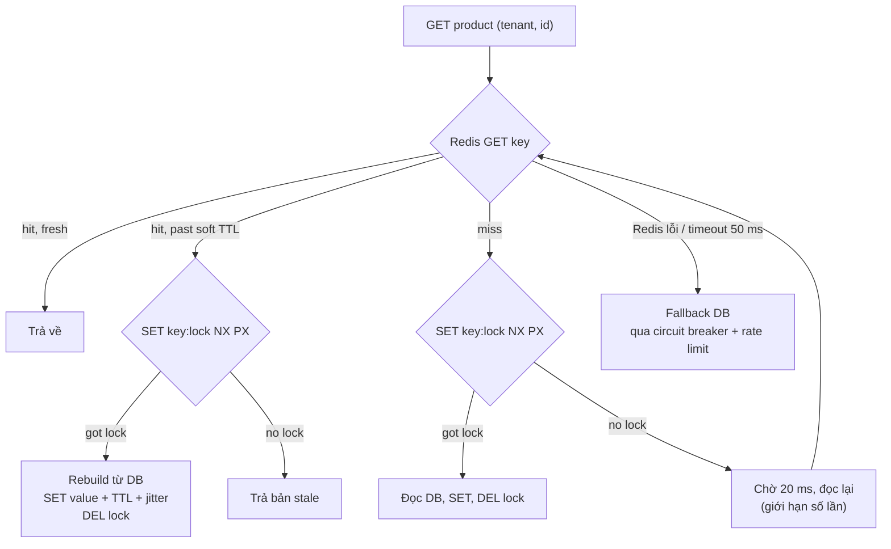
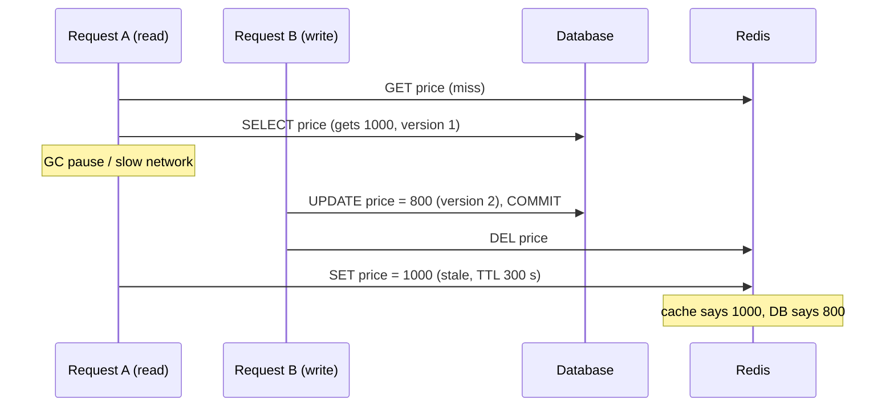

## Bối cảnh & vấn đề

"Introduced Redis caching for hot APIs" là một claim dễ viết và rất dễ bị đào. Interviewer đi theo năm hướng: endpoint nào, key gì, TTL bao nhiêu, invalidate thế nào (câu 012); flash sale làm entry hot hết hạn và DB CPU lên 100% (câu 027); xoá cache sau khi update DB mà vẫn stale (câu 028); Redis chết thì sao (câu 029); và bạn **chứng minh** caching có ích bằng gì (câu 050).

Câu trả lời yếu thường chỉ có hai câu: "Em dùng cache-aside, TTL 5 phút." Nó không nói key có tenant không (nếu không, tenant B có thể nhận dữ liệu tenant A), không nói giá bị sửa thì sao, không nói gì về stampede hay Redis timeout. Ba hướng sau là nơi phân biệt người "đã dùng Redis" với người "đã vận hành Redis ở production", vì chúng chỉ xuất hiện khi có tải thật và sự cố thật.

Bài này trả lời từng hướng với demo chạy thật trên Redis 7.4 (container) và ioredis 6.0. Lý thuyết đầy đủ ở track [Caching](/tracks/caching/learn/cache-fundamentals). Các con số trong demo là của máy chạy demo, không phải của dự án; số dự án là `<số liệu thật của bạn>`.

## Khái niệm

### Chọn endpoint để cache

Endpoint đáng cache khi **đọc nhiều, ghi ít, tốn DB**, và **chấp nhận stale** trong một khoảng xác định. Cách chọn bằng dữ liệu: xếp hạng endpoint theo RPS × DB time từ APM hoặc log, rồi lọc theo tỷ lệ đọc/ghi và yêu cầu về độ tươi. Với e-commerce: catalog sản phẩm, danh mục, cấu hình tenant, trang search phổ biến là ứng viên tốt; giỏ hàng, giá **tại bước checkout**, tồn kho để quyết định bán và quyền của user là không nên (hoặc phải rất cẩn thận). Câu 050 hỏi đúng quy trình này.

### Cache-aside và key design

**Cache-aside** (lazy loading): đọc cache, miss thì đọc DB và ghi vào cache; ghi thì cập nhật DB rồi **xoá** key. Ứng dụng tự quản lý cache, nên đơn giản và Redis chết thì vẫn đọc được DB. Xem [Các pattern caching](/tracks/caching/learn/caching-patterns).

**Key design** cho multi-tenant: `{env}:{tenantId}:{resource}:{id|queryHash}:{version}`. Tenant **luôn** có trong key; locale/currency có trong key nếu nội dung khác theo chúng; `queryHash` là hash của tham số đã chuẩn hoá (sắp xếp, bỏ tham số không ảnh hưởng kết quả) để tránh nhiều key cho cùng một kết quả; `version` cho phép invalidate cả một nhóm bằng cách tăng số. Xem [Cache key design và multi-tenant caching](/tracks/caching/learn/keys-multi-tenant).

### TTL, jitter và invalidation

**TTL** giới hạn độ stale tối đa khi invalidation thất bại. **Jitter** (cộng ngẫu nhiên vài phần trăm vào TTL) tránh nhiều key cùng hết hạn một lúc (avalanche). **Invalidation on write**: xoá key **sau khi DB commit**; xoá trước commit thì một request đọc chen vào giữa sẽ nạp lại giá trị cũ. Với một sản phẩm xuất hiện ở nhiều key (detail, list, search page), xoá từng key là không khả thi; dùng **version/namespace** (tăng `catalog:{tenant}:v` khi ghi, key chứa version) hoặc invalidate qua event/CDC. Xem [Invalidation & consistency](/tracks/caching/learn/invalidation-consistency).

### Cache stampede

**Cache stampede** (thundering herd) xảy ra khi một key hot hết hạn và hàng trăm request cùng miss, cùng chạy query DB đắt để rebuild. DB nhận đột ngột N lần tải của một query, trong khi mọi request đều đang chờ, nên latency tăng, connection pool cạn, và có thể kéo sập DB. Phòng: **single-flight/lock** (một request rebuild, còn lại đợi hoặc trả stale), **stale-while-revalidate** (lưu soft TTL trong value, phục vụ bản cũ trong lúc một request làm mới), **refresh-ahead** cho key hot, **TTL jitter**, **pre-warm** trước sự kiện. Xem [Cache stampede](/tracks/caching/learn/stampede-protection).

### Race giữa read-miss và write-delete

Cache-aside có một race kinh điển (câu 028): request A miss, đọc giá **cũ** từ DB rồi bị chậm (GC pause, network); request B update DB và xoá key; A tỉnh dậy và ghi giá cũ vào cache. Cache sai cho tới hết TTL. Cách sửa: TTL ngắn làm giới hạn; **delayed double delete** (xoá lại sau vài trăm ms); ghi cache **có điều kiện theo version** (chỉ ghi nếu version mới hơn bản đang có, kiểm tra atomic bằng Lua); hoặc invalidate qua event sau commit. Dữ liệu cần đúng tuyệt đối (giá lúc checkout) thì đọc từ DB.

### Redis là dependency, không phải bộ nhớ trong

Khi Redis chậm hoặc chết, câu hỏi không phải "có cache hay không" mà là "request **chờ** bao lâu". Client Redis mặc định thường được tối ưu để **không mất lệnh**: tự reconnect, xếp lệnh vào hàng đợi offline, retry nhiều lần. Đó là hành vi đúng cho một job, sai cho một API phải trả lời trong 200 ms. Cần: timeout lệnh ngắn, không xếp hàng khi mất kết nối, circuit breaker, fallback DB **có giới hạn** (DB có chịu nổi toàn bộ traffic không?). Với chức năng không phải cache (session, denylist, rate limit) phải quyết định **fail-open hay fail-closed** cho từng chức năng. Xem [Cache nhiều tầng và khi Redis chậm hoặc chết](/tracks/caching/learn/multi-level-resilience).

## Cơ chế hoạt động

### Đọc có stampede protection



Ba nhánh cần giải thích khi trình bày. Nhánh **soft TTL** là stale-while-revalidate: request không bao giờ phải chờ rebuild khi đã có bản cũ. Nhánh **miss + no lock** phải có giới hạn số lần chờ, nếu không khi lock holder chết, mọi request chờ mãi; PX trên lock đảm bảo lock tự hết hạn (follow-up câu 027). Nhánh **Redis lỗi** đi thẳng xuống DB nhưng qua circuit breaker và rate limit, vì nếu cache che 85% tải, mất cache nghĩa là DB nhận gấp gần 7 lần tải bình thường.

### Race delete-after-update



Race cần ba điều kiện: một read miss, một write xen vào **sau** khi A đọc DB và **trước** khi A ghi cache, và A chậm hơn B. Hiếm ở traffic thấp, gần như chắc chắn xảy ra ở traffic cao với key hot. Fix bằng version: A mang version 1, cache đã có version 2 (nếu B ghi-through) hoặc một tombstone có version, nên lệnh ghi của A bị từ chối.

## Ví dụ thực tế

### Stampede: 500 miss đồng thời (Redis 7.4, chạy thật)

```ts
// stampede.ts
import { Redis } from 'ioredis';
const redis = new Redis(56379);
let dbCalls = 0;
const db = async (id: string) => { dbCalls++; await new Promise(r => setTimeout(r, 50)); return { id, priceMinor: 1999 }; };
const key = (t: string, id: string) => `prod:${t}:product:${id}:v1`;

async function naive(t: string, id: string) {
  const hit = await redis.get(key(t, id)); if (hit) return JSON.parse(hit);
  const v = await db(id); await redis.set(key(t, id), JSON.stringify(v), 'EX', 60); return v;
}
async function locked(t: string, id: string): Promise<unknown> {
  for (let i = 0; i < 50; i++) {
    const hit = await redis.get(key(t, id)); if (hit) return JSON.parse(hit);
    const got = await redis.set(key(t, id) + ':lock', String(process.pid), 'PX', 2000, 'NX');
    if (got) {
      try { const v = await db(id); await redis.set(key(t, id), JSON.stringify(v), 'EX', 60 + Math.floor(Math.random() * 10)); return v; }
      finally { await redis.del(key(t, id) + ':lock'); }
    }
    await new Promise(r => setTimeout(r, 20));
  }
  return db(id); // give up waiting: bounded fallback
}
for (const [name, fn] of [['naive', naive], ['lock', locked]] as const) {
  await redis.flushall(); dbCalls = 0;
  const t0 = Date.now();
  await Promise.all(Array.from({ length: 500 }, () => fn('t-a', 'p1')));
  console.log(`${name.padEnd(5)}: 500 concurrent misses -> ${dbCalls} DB calls, ${Date.now() - t0} ms`);
}
await redis.quit();
```

```text
naive: 500 concurrent misses -> 500 DB calls, 100 ms
lock : 500 concurrent misses -> 1 DB calls, 110 ms
```

Không có lock, một key hết hạn biến thành 500 query DB cùng lúc; với query 50 ms và pool 20 connection, 480 request phải xếp hàng chờ connection, và DB CPU nhảy vọt (đúng triệu chứng câu 027). Có lock, đúng 1 query, đổi lại các request còn lại chờ thêm khoảng 10 ms. Lock này có hai điểm yếu cần nói: `DEL` lock không kiểm tra chủ (lock hết hạn rồi bị request khác lấy thì `DEL` xoá nhầm lock của người khác; dùng Lua compare-and-delete), và nó là lock "best effort", không phải lock đúng tuyệt đối (xem [Distributed lock với Redis](/tracks/caching/learn/distributed-locks)). Với cache thì best effort là đủ: tệ nhất là vài request cùng rebuild.

### Race delete-after-update và fix bằng version (chạy thật)

```ts
// race.ts
import { Redis } from 'ioredis';
const redis = new Redis(56379);
const sleep = (ms: number) => new Promise(r => setTimeout(r, ms));
let dbPrice = 1000; let dbVersion = 1;
const K = 'prod:t-a:price:p1';

async function readerSlow() { const v = { price: dbPrice, ver: dbVersion }; await sleep(100); await redis.set(K, JSON.stringify(v), 'EX', 300); }
async function writer() { await sleep(20); dbPrice = 800; dbVersion = 2; await redis.del(K); }
await redis.del(K);
await Promise.all([readerSlow(), writer()]);
console.log('delete-after-update: DB =', dbPrice, '| cache =', JSON.parse((await redis.get(K))!).price, '(stale until TTL)');

const setIfNewer = `local cur = redis.call('GET', KEYS[1])
if cur then local c = cjson.decode(cur) if c.ver >= tonumber(ARGV[2]) then return 0 end end
redis.call('SET', KEYS[1], ARGV[1], 'EX', ARGV[3]) return 1`;
dbPrice = 1000; dbVersion = 1; await redis.del(K);
async function readerSlowFixed() {
  const v = { price: dbPrice, ver: dbVersion }; await sleep(100);
  const ok = await redis.eval(setIfNewer, 1, K, JSON.stringify(v), v.ver, 300);
  console.log('slow reader write accepted?', ok === 1);
}
async function writerFixed() {
  await sleep(20); dbPrice = 800; dbVersion = 2;
  await redis.eval(setIfNewer, 1, K, JSON.stringify({ price: dbPrice, ver: dbVersion }), dbVersion, 300); // write-through with version
}
await Promise.all([readerSlowFixed(), writerFixed()]);
console.log('versioned write    : DB =', dbPrice, '| cache =', JSON.parse((await redis.get(K))!).price);
await redis.quit();
```

```text
delete-after-update: DB = 800 | cache = 1000 (stale until TTL)
slow reader write accepted? false
versioned write    : DB = 800 | cache = 800
```

Lần chạy đầu tái hiện đúng race: DB 800, cache 1000 trong 5 phút. Lần thứ hai, writer ghi-through giá mới **kèm version**, và lệnh ghi của reader chậm (mang version 1) bị Lua từ chối vì cache đã có version 2. Version lấy từ cột `rowversion` (SQL Server) hoặc một cột `version`/`updated_at` tăng đơn điệu trong DB. Follow-up "dữ liệu nào không bao giờ lấy từ cache": giá và tồn kho tại bước tạo order, số dư, quyền; đó là nơi đọc DB (xem [bài 8](/tracks/project-deep-dive/learn/p1-checkout-shifts)).

### Redis chết: mặc định treo 73 giây (chạy thật)

```ts
// down.ts — port 56390 has nothing listening (Redis "down")
import { Redis } from 'ioredis';
const db = async () => { await new Promise(r => setTimeout(r, 15)); return 'from-db'; };
async function getWithFallback(r: Redis, label: string) {
  const t0 = Date.now(); let src: string;
  try { src = (await r.get('k')) ?? (await db()); } catch (e) { src = 'fallback ' + (await db()) + ` (${(e as Error).message.slice(0, 45)})`; }
  console.log(`${label.padEnd(9)} ${String(Date.now() - t0).padStart(5)} ms -> ${src}`);
}
const defaults = new Redis(56390); defaults.on('error', () => {});
const tuned = new Redis(56390, { enableOfflineQueue: false, maxRetriesPerRequest: 1, commandTimeout: 50, retryStrategy: t => Math.min(t * 200, 2000) });
tuned.on('error', () => {});
await new Promise(r => setTimeout(r, 300));
await getWithFallback(tuned, 'tuned');
await getWithFallback(defaults, 'defaults');
defaults.disconnect(); tuned.disconnect();
```

```text
tuned        17 ms -> fallback from-db (Stream isn't writeable and enableOfflineQueue)
defaults  73111 ms -> fallback from-db (Reached the max retries per request limit (wh)
```

Với cấu hình mặc định của ioredis 6.0, một lệnh `GET` khi Redis không kết nối được nằm trong offline queue và chờ qua nhiều lượt reconnect trước khi fail: **73 giây** trên máy demo. Trong một API, mọi request đều treo như vậy, event loop không bận nhưng mọi socket client giữ mở, load balancer timeout, và từ ngoài nhìn vào thì "cả API chết" dù DB khoẻ. Đó là câu trả lời cho nửa đầu câu 029 ("what happens"). Nửa sau ("what should happen"): `enableOfflineQueue: false`, `commandTimeout` vài chục ms, `maxRetriesPerRequest` nhỏ, fallback DB qua circuit breaker và rate limit, alert. Con số 73 giây phụ thuộc vào `retryStrategy` và phiên bản (verify với client của bạn), nhưng bậc độ lớn "hàng chục giây" là bài học.

Follow-up "JWT denylist trong Redis: fail-open hay fail-closed": thường fail-closed cho thao tác nhạy cảm (refund, đổi quyền, admin) và fail-open có giới hạn cho đọc thông thường (access token vốn ngắn hạn), kèm alert; nói rõ đây là quyết định business về rủi ro, không phải chi tiết kỹ thuật.

### Khung trả lời câu 012 và 050

"Endpoint `<danh sách thật>` được chọn vì `<RPS × DB time từ APM>`. Key `<pattern thật, có tenant>`, TTL `<n>` giây + jitter, invalidate `<xoá sau commit / version key / event>`. Stampede: `<lock / SWR / chưa có>`. Redis down: `<timeout, fallback>`. Kết quả: hit ratio `<x>`, p50/p95 `<trước/sau>`, DB QPS `<trước/sau>`, đo bằng `<công cụ>`, rollout `<sau flag / toàn bộ>`." Follow-up "giá stale sau khi retailer cập nhật": invalidate theo version khi ghi, bulk import tăng version namespace thay vì xoá từng key, và checkout luôn đọc giá từ DB. Phần chứng minh bằng số và loại confounder ở [bài 3](/tracks/project-deep-dive/learn/numbers-incidents).

## Trade-offs & lựa chọn thay thế

| Quyết định | Phương án | Ưu | Nhược |
|---|---|---|---|
| Invalidation | Xoá key sau commit | Đơn giản | Race read-miss; nhiều key cho một entity |
| Invalidation | Version/namespace key | Một lệnh invalidate cả nhóm | Key cũ chờ TTL mới hết (tốn RAM) |
| Invalidation | Event/CDC sau commit | Không phụ thuộc code ghi | Thêm pipeline, độ trễ |
| Stampede | Lock SET NX PX | 1 lần rebuild | Request chờ; cần giới hạn chờ |
| Stampede | Stale-while-revalidate | Không ai chờ | Phục vụ dữ liệu cũ thêm một chút |
| Stampede | Refresh-ahead / pre-warm | Không bao giờ miss key hot | Tốn tài nguyên refresh key ít dùng |
| Redis down | Fallback DB | Vẫn phục vụ | DB có thể sập nếu cache che phần lớn tải |
| Redis down | In-process cache nhỏ | Chịu được ngắn hạn | Không nhất quán giữa instance |

Kết hợp thường dùng cho catalog: cache-aside, key có tenant và version, TTL vài phút + jitter, stale-while-revalidate cho key hot, invalidation bằng version khi ghi, Redis client timeout ngắn và fallback có rate limit. Không cần dùng hết mọi kỹ thuật; nói được vì sao chọn tổ hợp của mình là đủ.

## Edge cases & failure modes

- **Lock holder crash** trước khi ghi cache: lock tự hết hạn sau PX; các request chờ đã có giới hạn số lần và fallback.
- **Big value** (một trang search 2 MB) làm Redis single thread chậm cho mọi client; giới hạn kích thước, nén, hoặc chỉ cache id.
- **Hot key** trên Redis Cluster dồn vào một shard; replicate key hoặc thêm in-process cache vài giây (xem [Redis Cluster, hot key và big key](/tracks/caching/learn/cluster-hot-big-keys)).
- **Eviction** khi đầy RAM với `maxmemory-policy` không phù hợp; key quan trọng (session) không nên ở chung instance với cache có thể bị evict.
- **Cache penetration**: request cho id không tồn tại luôn miss; cache cả kết quả "không có" với TTL ngắn.
- **Deploy làm cache lạnh** (đổi format value, đổi version prefix): toàn bộ traffic xuống DB cùng lúc; đổi dần hoặc pre-warm.
- **Serialize/deserialize** khác version giữa hai bản code đang chạy song song khi rolling deploy; value phải tương thích hai chiều hoặc đổi prefix.

## Pitfalls

- ❌ Key thiếu tenant → ✅ `{env}:{tenant}:{resource}:{id|hash}:{version}`, có locale/currency nếu nội dung khác.
- ❌ Xoá cache trước commit → ✅ xoá sau commit; với key hot dùng version hoặc delayed double delete.
- ❌ TTL giống hệt nhau cho mọi key → ✅ TTL + jitter.
- ❌ Không có stampede protection cho key hot → ✅ lock có hạn hoặc stale-while-revalidate.
- ❌ Dùng client Redis với cấu hình mặc định trong API → ✅ commandTimeout ngắn, tắt offline queue, circuit breaker.
- ❌ Fallback DB không giới hạn → ✅ rate limit / load shedding, tính trước DB chịu được bao nhiêu.
- ❌ Lấy giá checkout từ cache → ✅ cache để hiển thị, quyết định ở DB.
- ❌ "Cache làm nhanh hơn nhiều" → ✅ hit ratio, p50/p95, DB QPS trước/sau, có baseline.

## Tóm tắt

- Chọn endpoint bằng RPS × DB time, đọc nhiều/ghi ít, chấp nhận stale; không cache giá checkout, tồn kho, quyền.
- Cache-aside, key luôn có tenant (và version), TTL + jitter, invalidate sau commit.
- Demo thật: 500 miss đồng thời → 500 query DB; lock `SET NX PX` → 1 query.
- Race delete-after-update để lại giá cũ tới hết TTL; ghi có điều kiện theo version (Lua) chặn được.
- Demo thật: ioredis mặc định treo 73 giây khi Redis chết; timeout 50 ms + tắt offline queue fallback sau 17 ms.
- Redis down: timeout ngắn, circuit breaker, fallback có giới hạn; fail-open/closed quyết định theo từng chức năng.
- Chứng minh có ích bằng baseline, hit ratio, percentile và DB load chuẩn hoá.
