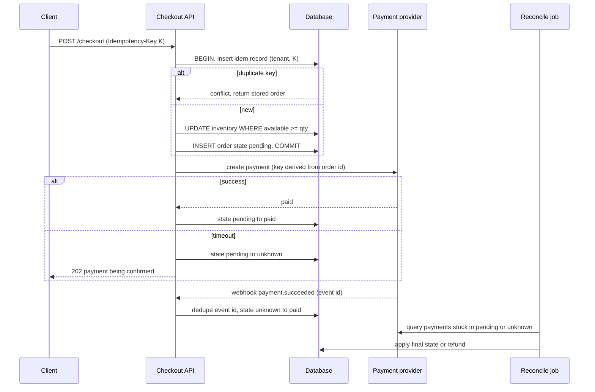
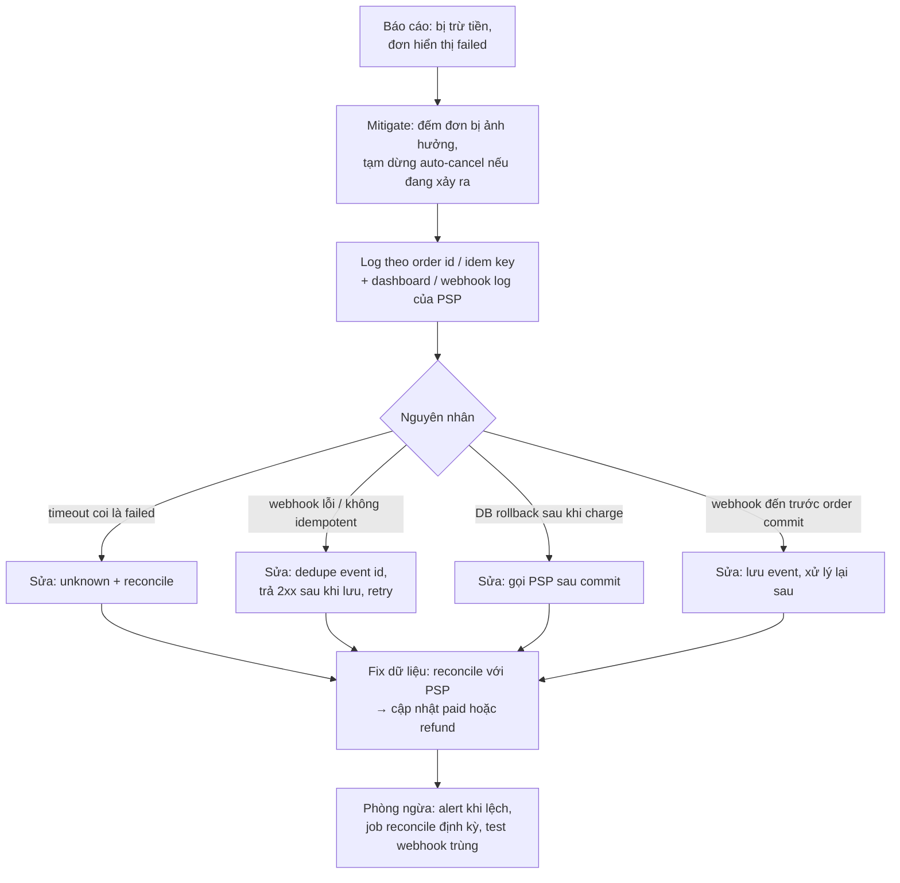

## Bối cảnh & vấn đề

"Built Checkout, Address Management and Shift Management" là dòng CV mà interviewer có thể đào lâu nhất, vì mỗi feature có một bài toán đúng/sai rõ ràng. Checkout có tiền: double charge, oversell, payment timeout (câu 015, 032). Shift Management có thời gian: ca qua nửa đêm, hai quốc gia khác múi giờ, DST làm giờ bị mất hoặc lặp, hai ca chồng nhau cho cùng một nhân viên (câu 016). Và câu 048 yêu cầu chọn một trong ba feature, kể đủ chuỗi prove-it.

Kịch bản thất bại của checkout: khách bấm "Thanh toán", payment provider phản hồi chậm hơn timeout 30 giây, server coi timeout là thất bại, đánh dấu đơn `failed` và trả hàng về kho. Khách bấm lại, tạo đơn thứ hai, thanh toán thành công. Hai phút sau provider gửi webhook "đơn thứ nhất đã thanh toán". Khách bị trừ tiền hai lần, một đơn hiển thị failed. Đây chính là câu 032.

Kịch bản thất bại của shift: server lưu giờ ca dạng "giờ địa phương không có múi giờ", và chuyển đổi bằng múi giờ của **server** hoặc **trình duyệt** của manager. Manager ở một múi giờ khác lên lịch cho store, ca bị lệch vài giờ; đêm chuyển DST, một ca 8 tiếng được trả lương 7 hoặc 9 tiếng.

Thiết kế checkout đầy đủ (saga, outbox, reservation TTL, hot SKU) ở [Checkout, tồn kho và thanh toán](/tracks/system-design/learn/checkout-payments); bài này tập trung vào cách **kể** feature của bạn và các demo cho những claim trung tâm. Nói rõ phần nào dự án có thật, phần nào là đề xuất, và payment do ai tích hợp.

## Khái niệm

### Idempotency key

**Idempotency key** là một id do client sinh **một lần** cho một ý định (một lần bấm "Đặt hàng"), gửi kèm mọi lần retry. Server lưu key cùng kết quả; request lặp lại với cùng key trả về kết quả cũ thay vì tạo đơn mới. Key phải được sinh **khi mở màn hình thanh toán** hoặc khi bắt đầu submit, không phải mỗi lần gọi API (nếu không, retry tạo key mới và mất tác dụng). Server lưu key trong cùng transaction với việc tạo đơn, với unique constraint theo `(tenant_id, idem_key)`, để hai request đồng thời cùng key không cùng thắng. Gửi cùng key đó (hoặc key suy ra từ order id) sang payment provider để provider cũng dedupe.

### Conditional update chống oversell

**Oversell** xảy ra khi hai request cùng đọc "còn 1" rồi cùng trừ. Cách sửa căn bản là để database kiểm tra và trừ trong một câu lệnh: `UPDATE inventory SET available = available - 1 WHERE sku = ? AND available >= 1`, rồi xem row count (Postgres trả số dòng, SQL Server dùng `@@ROWCOUNT`). Row count 0 nghĩa là hết hàng. `CHECK (available >= 0)` là lưới an toàn cuối. Với thanh toán mất vài phút, dùng **reservation có TTL** (giữ hàng, hết hạn thì trả lại) thay vì trừ thẳng.

### Transaction boundary và payment ngoài transaction

DB transaction bao quanh **order + reservation + idempotency record**, commit nhanh. Lời gọi payment provider nằm **ngoài** transaction: giữ transaction mở trong 30 giây chờ provider là giữ lock tồn kho 30 giây và cạn connection pool. Sau khi có kết quả, cập nhật trạng thái bằng một transaction mới. Hệ quả: hệ thống phải chịu được trạng thái trung gian ("order tạo rồi, chưa biết payment"), nên cần state machine.

### Payment state machine và trạng thái unknown

Order/payment đi qua các trạng thái `pending → paid → confirmed`, có nhánh `failed`, `refunded`, và quan trọng nhất là **`unknown`** khi provider timeout: bạn **không biết** tiền đã bị trừ chưa. Mỗi chuyển tiếp là một conditional update (`UPDATE ... SET state = 'paid' WHERE id = ? AND state IN ('pending','unknown')`), nên áp lại hai lần không đổi gì và không thể đi lùi. Kết quả đến từ ba nguồn: response đồng bộ, **webhook**, và **reconciliation job** đối chiếu định kỳ với provider. Webhook dedupe theo `event_id` của provider.

### Thời gian: instant, wall time và IANA zone

**Instant** là một điểm trên trục thời gian toàn cầu (UTC); **wall time** là giờ trên đồng hồ treo tường tại một nơi ("09:00 ở store"). Ca làm được **lên lịch** theo wall time của store nhưng **diễn ra** ở instant. Quy tắc: lưu instant (UTC, `timestamptz` / `datetimeoffset`) cộng **IANA zone của store** (`America/New_York`, `Europe/Berlin`), chuyển đổi bằng zone của store, không bằng zone của server hay trình duyệt. Offset cố định ("UTC−5") không đủ vì offset đổi theo DST.

### DST: giờ bị mất và giờ bị lặp

Đêm bắt đầu DST, đồng hồ nhảy từ 02:00 lên 03:00: giờ 02:30 **không tồn tại**. Đêm kết thúc DST, 01:00–02:00 diễn ra **hai lần**: 01:30 là **ambiguous**. Một ca 22:00–06:00 qua đêm DST dài 7 hoặc 9 giờ thực, không phải 8. Hệ thống phải quyết định: lương tính theo giờ thực (instant) hay theo giờ đồng hồ; 02:30 không tồn tại thì đẩy lên 03:30 hay báo lỗi; 01:30 lặp thì lấy lần đầu hay lần hai. Đây là quyết định business cần PO chốt, và phải có test riêng.

### Chống chồng ca

Kiểm tra chồng ca ở application ("SELECT có ca nào overlap không, nếu không thì INSERT") có race giống oversell: hai request đồng thời cùng thấy "không có" và cùng chèn. Cần ràng buộc ở database: Postgres có **exclusion constraint** trên `tstzrange` với `&&` (overlap); SQL Server không có exclusion constraint, phải kiểm tra trong transaction với lock phù hợp (`UPDLOCK, HOLDLOCK` trên phạm vi của nhân viên) hoặc serialize theo nhân viên (verify chi tiết lock với workload của bạn).

## Cơ chế hoạt động

### Luồng checkout



Ba điểm để nói khi trình bày. Idempotency được kiểm **trong** transaction với unique constraint, nên double click và retry không tạo hai đơn. Payment gọi **sau** commit, ngoài transaction. Timeout không bao giờ được coi là thất bại: đơn chuyển sang `unknown`, UI báo "đang xác nhận", và webhook hoặc reconcile job quyết định trạng thái cuối. Câu follow-up "gateway timeout, khách đã trả tiền chưa?" có câu trả lời chính là nhánh `timeout` này.

### Điều tra "charged but failed"



Sơ đồ trên là khung trả lời câu 032. Bước mitigate đứng trước: nếu sự cố đang tiếp diễn, dừng cơ chế đang gây hại (auto-cancel đơn timeout) trước khi tìm root cause. Bốn nguyên nhân là bốn lỗi phổ biến nhất; nói cái nào đã thật sự xảy ra trong dự án của bạn (nếu có), hoặc nói đây là danh sách bạn sẽ kiểm tra.

## Ví dụ thực tế

### 30 khách, 10 sản phẩm, một khách double click (Postgres 17, chạy thật)

```sql
CREATE TABLE inventory (tenant_id int, sku text, available int NOT NULL CHECK (available >= 0), PRIMARY KEY (tenant_id, sku));
CREATE TABLE orders_c (id bigint GENERATED ALWAYS AS IDENTITY PRIMARY KEY, tenant_id int, customer text, state text NOT NULL DEFAULT 'pending');
CREATE TABLE checkout_requests (tenant_id int, idem_key text, order_id bigint, PRIMARY KEY (tenant_id, idem_key));
INSERT INTO inventory VALUES (1, 'HEADPHONE', 10);
```

```ts
// checkout.ts
import pg from 'pg';
const pool = new pg.Pool({ connectionString: 'postgres://postgres:pw@localhost:55432/postgres', max: 20 });

async function checkout(tenantId: number, customer: string, idemKey: string) {
  const c = await pool.connect();
  try {
    await c.query('BEGIN');
    // Claim the key first; a concurrent duplicate blocks on the PK, then sees the winner's row.
    const claim = await c.query('INSERT INTO checkout_requests (tenant_id, idem_key) VALUES ($1,$2) ON CONFLICT DO NOTHING', [tenantId, idemKey]);
    if (claim.rowCount === 0) {
      await c.query('ROLLBACK');
      const prev = await pool.query('SELECT order_id FROM checkout_requests WHERE tenant_id=$1 AND idem_key=$2', [tenantId, idemKey]);
      return { replay: true, orderId: prev.rows[0]?.order_id };
    }
    const dec = await c.query('UPDATE inventory SET available = available - 1 WHERE tenant_id=$1 AND sku=$2 AND available >= 1', [tenantId, 'HEADPHONE']);
    if (dec.rowCount === 0) { await c.query('ROLLBACK'); return { soldOut: true }; }
    const o = await c.query('INSERT INTO orders_c (tenant_id, customer) VALUES ($1,$2) RETURNING id', [tenantId, customer]);
    await c.query('UPDATE checkout_requests SET order_id=$3 WHERE tenant_id=$1 AND idem_key=$2', [tenantId, idemKey, o.rows[0].id]);
    await c.query('COMMIT');   // payment is called AFTER this commit, outside the DB transaction
    return { orderId: o.rows[0].id };
  } catch (e) { await c.query('ROLLBACK'); throw e; } finally { c.release(); }
}

const reqs = Array.from({ length: 30 }, (_, i) => checkout(1, `c${i}`, `key-${i}`));
reqs.push(checkout(1, 'c0', 'key-0'), checkout(1, 'c0', 'key-0'));   // customer 0 double-clicks
const res = await Promise.all(reqs);
const ok = res.filter(r => 'orderId' in r && !('replay' in r)).length;
console.log({ orders: ok, soldOut: res.filter(r => 'soldOut' in r).length, replays: res.filter(r => 'replay' in r).length });
console.log((await pool.query("SELECT (SELECT available FROM inventory) AS available, (SELECT count(*) FROM orders_c) AS orders, (SELECT count(*) FROM orders_c WHERE customer='c0') AS c0_orders")).rows[0]);
await pool.end();
```

```text
{ orders: 10, soldOut: 20, replays: 2 }
{ available: 0, orders: '10', c0_orders: '1' }
```

32 request đồng thời: đúng 10 đơn, 20 "hết hàng", 2 replay (hai lần bấm thêm của khách c0 nhận lại đơn cũ), tồn kho 0 chứ không âm, khách c0 có đúng 1 đơn. Hai cơ chế làm việc này: unique constraint trên `(tenant_id, idem_key)` (request trùng bị chặn ở `INSERT ... ON CONFLICT`, và vì nó phải chờ transaction của request đầu commit nên luôn thấy kết quả cuối) và conditional update trên tồn kho. Khi request bị "hết hàng", record idempotency rollback theo, nên retry với cùng key sẽ thử lại (một lựa chọn thiết kế: có thể lưu cả kết quả "hết hàng" nếu muốn retry trả đúng kết quả đó). Trên SQL Server, cấu trúc tương tự với `@@ROWCOUNT` và unique index; pattern "insert key trước" chạy được ở cả hai engine.

### Ca qua đêm DST và chống chồng ca (Postgres 17, chạy thật)

```sql
CREATE EXTENSION IF NOT EXISTS btree_gist;
CREATE TABLE shifts (
  id bigint GENERATED ALWAYS AS IDENTITY PRIMARY KEY,
  tenant_id int NOT NULL, store_tz text NOT NULL, employee_id int NOT NULL,
  during tstzrange NOT NULL,
  EXCLUDE USING gist (tenant_id WITH =, employee_id WITH =, during WITH &&)
);
-- Wall time at the store -> instant, using the store's IANA zone (ví dụ minh hoạ: America/New_York).
INSERT INTO shifts (tenant_id, store_tz, employee_id, during) VALUES
 (1, 'America/New_York', 7, tstzrange(timestamp '2026-03-07 22:00' AT TIME ZONE 'America/New_York',
                                      timestamp '2026-03-08 06:00' AT TIME ZONE 'America/New_York'));
SELECT upper(during) - lower(during) AS real_duration_overnight_dst FROM shifts;
INSERT INTO shifts (tenant_id, store_tz, employee_id, during) VALUES
 (1, 'America/New_York', 7, tstzrange(timestamp '2026-03-08 05:00' AT TIME ZONE 'America/New_York',
                                      timestamp '2026-03-08 09:00' AT TIME ZONE 'America/New_York'));
SELECT timestamp '2026-03-08 01:30' AT TIME ZONE 'America/New_York' AS start_utc,
       timestamp '2026-03-08 03:30' AT TIME ZONE 'America/New_York' AS end_utc,
       (timestamp '2026-03-08 03:30' AT TIME ZONE 'America/New_York') - (timestamp '2026-03-08 01:30' AT TIME ZONE 'America/New_York') AS paid_hours,
       timestamp '2026-03-08 02:30' AT TIME ZONE 'America/New_York' AS nonexistent_0230;
SELECT timestamp '2026-11-01 01:30' AT TIME ZONE 'America/New_York' AS ambiguous_0130_resolved_to;
```

Output (session `TimeZone = UTC`):

```text
 real_duration_overnight_dst
-----------------------------
 07:00:00

ERROR:  conflicting key value violates exclusion constraint "shifts_tenant_id_employee_id_during_excl"
DETAIL:  Key (tenant_id, employee_id, during)=(1, 7, ["2026-03-08 09:00:00+00","2026-03-08 13:00:00+00")) conflicts with existing key (tenant_id, employee_id, during)=(1, 7, ["2026-03-08 03:00:00+00","2026-03-08 10:00:00+00")).

       start_utc        |        end_utc         | paid_hours |    nonexistent_0230
------------------------+------------------------+------------+------------------------
 2026-03-08 06:30:00+00 | 2026-03-08 07:30:00+00 | 01:00:00   | 2026-03-08 07:30:00+00

 ambiguous_0130_resolved_to
----------------------------
 2026-11-01 06:30:00+00
```

Bốn kết quả trả lời câu 016 và follow-up. Ca 22:00–06:00 đêm DST dài **7 giờ** thực. Ca chồng lên (05:00–09:00) bị database từ chối, kể cả khi hai request đồng thời: không có race. Ca **01:30–03:30** đêm DST bắt đầu chỉ dài **1 giờ** thực, và 02:30 (không tồn tại) được Postgres hiểu là 07:30 UTC, tức 03:30 giờ mới. 01:30 đêm DST kết thúc (xảy ra hai lần) được Postgres chọn là 06:30 UTC, tức lần **thứ hai** (giờ chuẩn, sau khi lùi đồng hồ) (verify quy tắc này trong docs Postgres trước khi dựa vào nó). Hệ thống production không nên để database tự đoán: UI phải cảnh báo khi người dùng chọn giờ không tồn tại hoặc ambiguous, và quy tắc trả lương theo giờ thực phải được PO chốt.

Bẫy ở phía Node: `new Date("2026-03-08T02:30")` (không có offset) được hiểu theo múi giờ của **process**. Chạy với `TZ=Europe/London`:

```text
browser-local trap: new Date("2026-03-08T02:30") on a server in Europe/London = 2026-03-08T02:30:00.000Z
```

Instant đúng cho 02:30 (đã đẩy thành 03:30) ở store New York phải là 07:30Z; server ở London cho ra 02:30Z, lệch 5 giờ. Chuyển wall time sang instant phải dùng IANA zone của store một cách tường minh (thư viện date có hỗ trợ zone, `Intl`, hoặc Temporal khi runtime hỗ trợ).

### Câu 048 với Checkout (khung điền)

- **What**: `<phạm vi thật>`: ví dụ API tạo order, reservation, idempotency, màn hình review; payment adapter do teammate làm.
- **Why**: idempotency key sinh ở client lúc mở màn hình thanh toán (đã loại: dedupe theo nội dung giỏ hàng, vì khách có thể cố ý mua hai lần).
- **Broke**: `<sự cố thật>`: ví dụ retry tạo key mới mỗi lần, hai đơn cho một lần bấm.
- **Numbers**: `<số liệu thật của bạn>`: số đơn/ngày, tỷ lệ lỗi checkout, số đơn `unknown` được reconcile mỗi tuần.
- **Change**: reconcile job và alert khi số đơn `unknown` tăng, ngay từ release đầu.

Follow-up "webhook gửi cùng event ba lần, sai thứ tự": lưu `event_id` với unique constraint trong cùng transaction với việc đổi trạng thái; chuyển tiếp là conditional update nên event cũ đến sau (ví dụ `payment.pending` sau `payment.succeeded`) không làm trạng thái đi lùi; trả 2xx sau khi đã lưu để provider ngừng retry.

## Trade-offs & lựa chọn thay thế

| Quyết định | Phương án A | Phương án B | Khi nào chọn |
|---|---|---|---|
| Chống oversell | Conditional UPDATE | `SELECT ... FOR UPDATE` / `UPDLOCK` rồi UPDATE | A khi điều kiện đơn giản; B khi cần đọc nhiều dòng để quyết định |
| Giữ hàng | Trừ thẳng khi đặt | Reservation có TTL | B khi thanh toán mất vài phút hoặc có thể bị bỏ dở |
| Lưu idempotency | Bảng trong cùng DB, cùng transaction | Redis `SET NX` | A cho tiền (bền, cùng transaction); B chỉ cho dedupe ngắn hạn |
| Payment timeout | Coi là failed | `unknown` + webhook + reconcile | Luôn B |
| Lưu thời gian ca | Wall time + zone store | Instant UTC + zone store | B cho ca đã chốt; A hữu ích cho lịch lặp lại ("mỗi thứ Hai 09:00") rồi sinh instant |
| Chống chồng ca | Check ở app | Exclusion constraint / lock trong transaction | B luôn có, A để báo lỗi thân thiện |

Lịch lặp lại là chỗ hay bị bỏ sót: "mỗi thứ Hai 09:00 giờ store" phải lưu dạng wall time + zone và sinh instant cho từng tuần, vì offset đổi qua DST. Lưu một instant rồi cộng 7 ngày sẽ lệch một giờ sau DST.

## Edge cases & failure modes

- **Hai request cùng idempotency key nhưng nội dung khác** (client bug): so sánh hash request body với bản đã lưu, trả 422 nếu khác.
- **Reservation hết hạn trong khi payment thành công muộn**: chính sách cần chốt: giữ đơn nếu còn hàng, nếu không thì refund tự động.
- **Webhook đến trước khi order commit**: handler không tìm thấy order; lưu event và xử lý lại sau, không trả 2xx khi chưa lưu.
- **Reconcile job chết**: đơn `unknown` không bao giờ được giải quyết; alert theo tuổi của đơn `unknown`.
- **Store đổi múi giờ** (hiếm nhưng có, hoặc luật DST của quốc gia thay đổi): cập nhật tzdata; ca tương lai đã lưu instant theo luật cũ có thể lệch; lưu cả wall time gốc để tính lại.
- **Nhân viên làm ở hai store khác múi giờ**: chống chồng ca theo instant (đúng), hiển thị theo zone của từng store.
- **Ca kết thúc đúng lúc ca sau bắt đầu**: `tstzrange` mặc định `[)` (bao đầu, không bao cuối) nên 06:00–14:00 và 14:00–22:00 không bị coi là chồng.

## Pitfalls

- ❌ Sinh idempotency key mỗi lần gọi API → ✅ một key cho một ý định, giữ qua mọi retry.
- ❌ Đọc tồn kho rồi trừ trong code → ✅ `UPDATE ... WHERE available >= n`, kiểm row count.
- ❌ Giữ DB transaction trong lúc gọi payment → ✅ commit trước, gọi provider, cập nhật bằng transaction mới.
- ❌ Timeout = failed → ✅ `unknown`, webhook, reconcile, refund khi cần.
- ❌ Webhook không dedupe → ✅ unique `event_id` + conditional state transition.
- ❌ Lưu giờ ca không có zone hoặc dùng zone trình duyệt → ✅ instant UTC + IANA zone của store.
- ❌ Check chồng ca chỉ ở app → ✅ exclusion constraint (Postgres) hoặc lock trong transaction (SQL Server).
- ❌ Không test DST → ✅ test ca qua đêm bắt đầu/kết thúc DST, giờ không tồn tại và giờ lặp.

## Tóm tắt

- Checkout: idempotency key (unique trong cùng transaction), conditional update tồn kho, payment ngoài transaction, state machine có `unknown`.
- Demo thật: 30 khách tranh 10 sản phẩm + 2 double click → đúng 10 đơn, tồn kho 0, khách double click 1 đơn.
- Timeout không phải thất bại; webhook dedupe theo event id; reconcile job cho đơn kẹt.
- Charged-but-failed: mitigate → log + dashboard PSP → bốn nguyên nhân phổ biến → reconcile dữ liệu → alert.
- Shift: instant UTC + IANA zone của store; chuyển đổi bằng zone store, không bằng server/trình duyệt.
- Demo thật: ca qua đêm DST dài 7 giờ; ca 01:30–03:30 đêm DST dài 1 giờ; exclusion constraint chặn ca chồng.
- DST là quyết định business (trả lương theo giờ thực, xử lý giờ không tồn tại/ambiguous) và cần test riêng.
