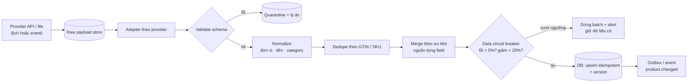
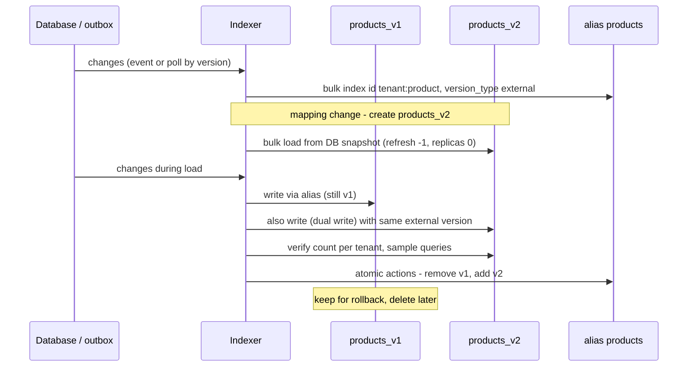

## Bối cảnh & vấn đề

P1 có hai service nền mà CV nêu rõ: **Data Enrichment Service** (đồng bộ và chuẩn hoá dữ liệu sản phẩm từ provider ngoài) và **Indexer Service** (chuyển và index sản phẩm vào Elasticsearch). Đây là phần dễ bị hỏi sâu vì nó là **data pipeline**, và pipeline luôn hỏng theo cách im lặng: không có request nào lỗi 500, chỉ có dữ liệu sai dần. Tám câu của track tập trung vào đây: pipeline normalize thế nào (017), contribution cụ thể và provider chết thì sao (053), provider đổi format (035), DB → ES (018), search hiện sản phẩm đã xoá hoặc giá cũ (033), reindex không downtime (034), full reindex mất bao lâu (054), và 10x lượng update (046).

Hai sự cố điển hình. Một provider đổi tên field `price` thành `unit_price` mà không báo; adapter đọc `price` ra `undefined`, chuyển thành `0` hoặc `NaN`, và ghi đè giá của mười nghìn sản phẩm. Sáng hôm sau, storefront bán sản phẩm giá 0. Sự cố thứ hai: một sản phẩm bị xoá trong DB nhưng vẫn hiện trong search, vì indexer polling theo `updated_at` mà soft delete không cập nhật `updated_at`, hoặc vì một event update cũ được xử lý **sau** event delete.

Bài này cho khung trả lời và các demo cho cơ chế trung tâm. Phần Elasticsearch trong bài là **mô phỏng** (minh hoạ) semantics của ES để thấy rõ logic; các bài [Reindex không downtime](/tracks/nosql-search/learn/reindex-alias-bulk), [Đồng bộ DB → Elasticsearch](/tracks/nosql-search/learn/db-es-sync-indexer) và [Drift & reconciliation](/tracks/nosql-search/learn/drift-search-design) có demo chạy trên Elasticsearch thật. Nói đúng cách dự án bạn làm (polling hay event, alias hay không) và đúng phần **bạn** đóng góp.

## Khái niệm

### Adapter theo provider

**Adapter** là module chuyển payload riêng của một provider (tên field, định dạng, đơn vị) thành **mô hình chuẩn** của nền tảng. Mỗi provider một adapter, mapping (category, đơn vị, brand) để trong cấu hình được, không hard-code. Lợi ích: thêm provider mới không chạm vào phần còn lại của pipeline; một provider đổi format chỉ hỏng adapter của nó. Đây thường là phần "contributed" cụ thể nhất để kể trong câu 053: "tôi viết adapter cho provider X và Y, rule normalize cho đơn vị và category".

### Validate ở biên và quarantine

**Validate ở biên** nghĩa là kiểm tra schema ngay khi nhận dữ liệu từ ngoài (zod, JSON Schema), trước khi bất kỳ thứ gì được ghi. Record sai không bị bỏ đi âm thầm mà được đưa vào **quarantine** (bảng hoặc bucket riêng, kèm lý do) để xem lại và replay sau khi sửa adapter. **Lưu raw payload** của mỗi lần sync cũng cùng mục đích: có thể chạy lại normalize trên dữ liệu gốc mà không phải gọi lại provider.

### Data circuit breaker

**Data circuit breaker** là ngưỡng bất thường ở cấp batch: nếu tỷ lệ record lỗi vượt X%, hoặc số sản phẩm giảm đột ngột so với lần sync trước (provider trả về danh sách rỗng hoặc thiếu nửa), thì **dừng cả batch** và alert, thay vì áp dụng phần "hợp lệ". Lý do: khi provider đổi format, record có thể vẫn "hợp lệ" về schema nhưng sai về nghĩa; một batch mà 100% record lỗi gần như chắc chắn là lỗi hệ thống, không phải dữ liệu thật. Câu 035 hỏi đúng cơ chế này.

### Normalize, dedupe và merge

**Normalize**: đơn vị (gram/kg), tiền tệ (minor units + currency), encoding, khoảng trắng, mapping category của provider sang taxonomy nội bộ. **Dedupe**: nhận ra cùng một sản phẩm từ nhiều nguồn bằng khoá tự nhiên như **GTIN** (mã vạch chuẩn GS1) hoặc SKU của provider. **Merge**: khi hai provider gửi dữ liệu mâu thuẫn, chọn theo **độ ưu tiên nguồn theo từng field** (ví dụ giá lấy từ retailer, mô tả lấy từ provider có chất lượng cao hơn), có ghi lại nguồn của mỗi field. Follow-up câu 017 "hai provider mâu thuẫn, ai thắng" cần một quy tắc như vậy, không phải "cái nào đến sau".

### DB → Elasticsearch: polling, event, CDC

Ba cách đưa thay đổi vào ES. **Polling** theo `updated_at`/`rowversion`: đơn giản, nhưng bỏ sót khi `updated_at` không được cập nhật (soft delete, update bằng script), có clock skew và cửa sổ polling. **Event/queue** khi dữ liệu đổi (tốt nhất qua outbox trong cùng transaction): độ trễ thấp, nhưng event có thể bị mất nếu publish ngoài transaction. **CDC** (Change Data Capture, đọc transaction log của DB): không bỏ sót, không cần sửa code ghi, nhưng thêm hạ tầng. Indexer **denormalize** (product + price + stock + category theo tenant) thành một document, ghi bằng **Bulk API** và xử lý lỗi **từng item** (bulk trả 200 kể cả khi một số item fail).

### Document id ổn định và external version

**Document id ổn định** (`{tenantId}:{productId}`) làm cho index lại idempotent: ghi lại cùng document không tạo bản sao. **External version** (`version_type=external`, version lấy từ DB như `rowversion` hay một cột tăng đơn điệu) làm ES chỉ chấp nhận ghi khi version **lớn hơn** version đang có, trả `409 version_conflict_engine_exception` cho ghi cũ hơn. Nhờ vậy, event cũ được retry và xử lý sau event mới không đè được dữ liệu mới. **Tombstone** cho delete: xoá kèm version, để một update cũ đến muộn không "hồi sinh" sản phẩm đã xoá; lưu ý ES chỉ giữ thông tin version của document đã xoá trong `index.gc_deletes` (mặc định 60 giây) (verify), nên với độ trễ lớn hơn cần tombstone ở tầng ứng dụng (document `deleted: true` có version).

### Alias và reindex không downtime

**Alias** là tên trỏ tới một hoặc nhiều index thật. Ứng dụng đọc/ghi qua alias (`products`), không qua tên index (`products_v1`). Reindex không downtime: tạo `products_v2` với mapping mới, bulk load, xử lý update đến trong lúc load (dual-write vào cả hai, hoặc replay từ một mốc thời gian/offset), verify, rồi **swap alias atomic** trong một lệnh `_aliases`, giữ v1 để rollback. Trong lúc load: `refresh_interval: -1` và `number_of_replicas: 0` cho nhanh, bật lại trước khi swap.

### Drift

**Drift** là khác biệt giữa DB (source of truth) và ES. Mọi pipeline đều drift theo thời gian vì lỗi tạm thời, bug, hay thao tác tay. Phát hiện: job so sánh **count theo tenant**, rồi so sánh **hash của (id, version)** theo tenant hoặc theo dải id để tìm đúng document lệch; sửa bằng reindex có mục tiêu, và full reindex qua alias định kỳ nếu cần. Câu follow-up "search stale tối đa bao lâu, PO có đồng ý không" đo xem bạn có SLA độ trễ index không.

## Cơ chế hoạt động

### Pipeline enrichment



Hai nút quyết định bảo vệ dữ liệu ở hai cấp. "Validate schema" là cấp **record**: record lỗi vào quarantine, record tốt đi tiếp. "Data circuit breaker" là cấp **batch**: kể cả khi từng record qua được, batch bất thường bị dừng nguyên. Provider chết hoặc chậm (câu 053) xử lý ở bước đầu: timeout, retry có backoff, circuit breaker gọi provider, và **không bao giờ** coi "provider trả về rỗng" là "provider không còn sản phẩm nào", nếu không bạn xoá cả catalog.

### Indexer và reindex qua alias



Điểm tinh tế: trong lúc load v2, update mới phải đến **cả hai** index. External version làm cho thứ tự giữa "bulk load từ snapshot" và "dual-write update mới" không quan trọng: document nào version cao hơn thắng, dù bên nào ghi sau. Không có external version, một document từ snapshot cũ được bulk load **sau** update mới sẽ đè lên dữ liệu mới. Follow-up câu 034 "ứng dụng ghi thẳng vào tên index thay vì alias thì sao": sau khi swap, ứng dụng vẫn ghi vào v1 và v2 không bao giờ nhận update, nên search drift ngay sau khi reindex xong.

## Ví dụ thực tế

### Provider đổi format: quarantine và data circuit breaker (chạy thật)

```ts
// enrich.ts — provider v2 renamed price -> unit_price and sends cents as a string
type Raw = Record<string, unknown>;
type Product = { gtin: string; name: string; priceMinor: number; currency: string };

function normalize(r: Raw): Product | string {
  const gtin = String(r.gtin ?? '').trim();
  if (!/^\d{8,14}$/.test(gtin)) return 'invalid gtin';
  if (typeof r.price !== 'number' || !Number.isFinite(r.price) || r.price <= 0) return 'price missing/not a positive number';
  const currency = String(r.currency ?? '').toUpperCase();
  if (!['USD', 'EUR', 'GBP'].includes(currency)) return `unknown currency ${currency}`;
  return { gtin, name: String(r.name ?? '').trim().replace(/\s+/g, ' '), priceMinor: Math.round(r.price * 100), currency };
}
function runBatch(rows: Raw[], previousCount: number) {
  const good: Product[] = [], quarantined: { row: Raw; reason: string }[] = [];
  for (const r of rows) { const p = normalize(r); typeof p === 'string' ? quarantined.push({ row: r, reason: p }) : good.push(p); }
  const errorRate = quarantined.length / rows.length;
  const drop = 1 - good.length / previousCount;
  const tripped = errorRate > 0.05 || drop > 0.2;     // refuse to apply a batch that would wipe or corrupt the catalog
  return { good: good.length, quarantined: quarantined.length, errorRate: errorRate.toFixed(3), tripped, sampleReason: quarantined[0]?.reason };
}
const v1 = Array.from({ length: 1000 }, (_, i) => ({ gtin: String(4006381333931 + i), name: `  Mug   ${i}`, price: 9.99, currency: 'usd' }));
const v2 = v1.map(({ price, ...rest }) => ({ ...rest, unit_price: String(Math.round(price * 100)) }));
console.log('normal day  :', runBatch(v1, 1000));
console.log('format break:', runBatch(v2, 1000));
console.log('float trap  : 19.99*100 =', 19.99 * 100, '-> Math.round =', Math.round(19.99 * 100));
```

```text
normal day  : { good: 1000, quarantined: 0, errorRate: '0.000', tripped: false, sampleReason: undefined }
format break: { good: 0, quarantined: 1000, errorRate: '1.000', tripped: true, sampleReason: 'price missing/not a positive number' }
float trap  : 19.99*100 = 1998.9999999999998 -> Math.round = 1999
```

Ngày bình thường, 1.000 record qua. Ngày provider đổi format, cả 1.000 record bị quarantine với lý do rõ ràng, breaker bật, và **không có gì bị ghi đè**: catalog giữ giá cũ, alert gửi tới team. Sau khi sửa adapter để đọc `unit_price`, replay từ raw payload đã lưu cho đúng những sản phẩm bị ảnh hưởng (follow-up câu 035: chọn theo `provider_id` + khoảng thời gian sync, hoặc theo danh sách id trong quarantine). Dòng cuối là lý do mọi nơi dùng `Math.round` hoặc parse chuỗi khi chuyển tiền sang minor units: `19.99 * 100` không phải `1999`.

### External version, tombstone và drift (mô phỏng semantics ES, minh hoạ)

```ts
// versioning.ts — simulation of Elasticsearch external versioning (minh hoạ, not a real ES run)
type Doc = { version: number; source: { priceMinor: number } | null };
const index = new Map<string, Doc>();
function put(id: string, version: number, source: Doc['source'], external: boolean) {
  const cur = index.get(id);
  if (external && cur && version <= cur.version) return '409 version_conflict_engine_exception';
  index.set(id, { version, source }); return '200';
}
const events = [{ v: 1, p: 1200 }, { v: 3, p: 800 }, { v: 2, p: 1000 }];   // retried v2 arrives last
for (const external of [false, true]) {
  index.clear();
  const codes = events.map(e => put('t1:p1', e.v, { priceMinor: e.p }, external));
  console.log(external ? 'external version:' : 'last write wins :', codes.join(' '), '-> price', index.get('t1:p1')!.source!.priceMinor);
}
index.clear(); put('t1:p2', 5, null, true);
console.log('late update after delete:', put('t1:p2', 4, { priceMinor: 1 }, true), '-> still deleted:', index.get('t1:p2')!.source === null);

import { createHash } from 'node:crypto';
const dbRows = [['p1', 3], ['p2', 5], ['p3', 1], ['p4', 2]] as const;
const esRows = [['p1', 3], ['p2', 4], ['p4', 2], ['p9', 1]] as const;
const h = (rows: readonly (readonly [string, number])[]) => createHash('sha256').update(rows.map(r => r.join(':')).sort().join(',')).digest('hex').slice(0, 12);
console.log('tenant t1 hash db/es:', h(dbRows), h(esRows));
const es = new Map(esRows), dbm = new Map(dbRows);
console.log('reindex:', dbRows.filter(([id, v]) => es.get(id) !== v).map(r => r[0]), 'delete from ES:', esRows.filter(([id]) => !dbm.has(id)).map(r => r[0]));
```

```text
last write wins : 200 200 200 -> price 1000
external version: 200 200 409 version_conflict_engine_exception -> price 800
late update after delete: 409 version_conflict_engine_exception -> still deleted: true
tenant t1 hash db/es: ac18bb350c23 df1db88c8416
reindex: [ 'p2', 'p3' ] delete from ES: [ 'p9' ]
```

Ba bài học cho câu 033. "Last write wins" để lại giá 1000 (cũ) vì event v2 được retry và xử lý cuối; external version giữ giá 800 và trả 409 cho ghi cũ, và indexer phải coi 409 là **thành công** (đã có dữ liệu mới hơn), không phải lỗi để retry mãi. Tombstone có version chặn một update cũ hồi sinh sản phẩm đã xoá. Drift check theo tenant: hash khác nhau cho biết tenant t1 lệch; so sánh `(id, version)` cho ra đúng danh sách phải reindex (`p2` version cũ, `p3` thiếu) và phải xoá khỏi ES (`p9` đã xoá ở DB). Ở quy mô thật, so sánh theo dải id (mỗi dải một hash) để không phải tải hết id.

### Khung trả lời các câu CV

**Câu 053** (contribution và provider down): "Phần của tôi: `<adapter nào, rule normalize nào, retry/scheduling, test>`. Provider chậm: timeout `<n>` giây, retry backoff có jitter, circuit breaker; provider trả rỗng hoặc lỗi thì **giữ dữ liệu cũ**, không xoá; chạy lại phần thiếu bằng `<cách thật>`. Số liệu: `<số provider, số sản phẩm mỗi lần sync, thời gian sync, tỷ lệ lỗi>`." Follow-up "ai validate dữ liệu đã enrich đúng": so sánh mẫu với nguồn, báo cáo chất lượng (tỷ lệ thiếu field, category chưa map), và người của business duyệt mapping category.

**Câu 054** (full reindex): "Full reindex `<số document>` document của `<số tenant>` tenant mất `<thời gian thật>`. Search `<không bị ảnh hưởng vì alias swap / có khoảng thiếu dữ liệu vì index trực tiếp>`. Update trong lúc reindex được `<dual-write / replay từ mốc thời gian / bị bỏ lỡ và sửa bằng drift job>`. Tôi đã cải thiện `<bulk size, song song, refresh_interval, replicas 0>`." Follow-up "chạy được trong giờ làm việc": throttle bulk theo latency của cluster, ưu tiên query hơn indexing (thread pool, node riêng nếu có), chạy theo tenant để dừng được giữa chừng.

**Câu 046** (10x update): đo bottleneck trước (đọc DB, transform, bulk ES, network); chuyển sang event/CDC + Kafka để tách producer và consumer, scale consumer theo partition với **key = product id** (giữ thứ tự theo sản phẩm); **coalesce** nhiều update của cùng sản phẩm trong cửa sổ ngắn (chỉ index bản cuối); bulk size theo MB thay vì số document; ES: shard và refresh interval phù hợp, tenant rất lớn tách index riêng; SLA độ trễ index (ví dụ "trong 1 phút") chốt với PO. Follow-up "ưu tiên giá và tồn kho hơn mô tả": hai topic hoặc hai hàng đợi với consumer riêng, partial update chỉ field giá/tồn kho cho đường nhanh.

## Trade-offs & lựa chọn thay thế

| Quyết định | Phương án | Ưu | Nhược |
|---|---|---|---|
| Nguồn thay đổi | Polling `updated_at` | Đơn giản, không hạ tầng mới | Bỏ sót soft delete/script, clock skew, độ trễ = chu kỳ poll |
| Nguồn thay đổi | Event qua outbox | Độ trễ thấp, không mất event | Phải sửa mọi đường ghi |
| Nguồn thay đổi | CDC | Không bỏ sót, không sửa code ghi | Thêm hạ tầng, event ở mức bảng |
| Thứ tự ghi ES | Last write wins | Không cần version | Event cũ đè mới |
| Thứ tự ghi ES | External version | Ghi cũ bị từ chối | Cần cột version đơn điệu trong DB |
| Tenant trong ES | Index chung + filter `tenant_id` | Ít index, dễ vận hành | Quên filter = leak; tenant lớn ảnh hưởng tenant nhỏ |
| Tenant trong ES | Index/alias theo tenant | Isolation tốt, reindex theo tenant | Nhiều shard, overhead cluster |
| Lỗi dữ liệu provider | Bỏ record lỗi | Đơn giản | Mất dữ liệu âm thầm |
| Lỗi dữ liệu provider | Quarantine + breaker | An toàn, replay được | Cần công cụ xem và replay |

Kết hợp hợp lý cho quy mô vừa: outbox hoặc polling theo `rowversion` (không theo `updated_at`), document id ổn định, external version, alias cho mọi index, drift job hằng đêm theo tenant. CDC đáng đầu tư khi nhiều đường ghi không kiểm soát được hoặc khi cần độ trễ thấp ở quy mô lớn.

## Edge cases & failure modes

- **Bulk trả 200 nhưng một số item lỗi** (mapping conflict, document quá lớn): phải đọc `errors: true` và từng item; item lỗi vào DLQ, không bỏ qua.
- **Mapping explosion** từ attribute động của provider (mỗi provider một bộ field): dùng `flattened` hoặc cấu trúc key/value, không dynamic mapping tự do.
- **Provider trả 200 với danh sách rỗng**: breaker theo mức giảm số sản phẩm; không xoá dữ liệu cũ.
- **Clock skew khi polling theo `updated_at`**: dùng `rowversion`/sequence của DB, hoặc lùi cửa sổ poll một khoảng an toàn và dựa vào idempotency.
- **Sửa adapter rồi replay**: replay phải idempotent và giữ version; replay dữ liệu cũ không được đè dữ liệu mới đã sync sau đó.
- **Alias trỏ tới hai index khi ghi**: ES từ chối ghi qua alias trỏ nhiều index nếu không có `is_write_index`; swap phải là một lệnh `_aliases` với remove + add.
- **Reindex tốn disk gấp đôi**: kiểm tra disk watermark trước; đầy disk làm index chuyển read-only.
- **Tenant xoá tài khoản**: dữ liệu ở DB, ES, raw payload store và quarantine đều phải xoá.

## Pitfalls

- ❌ Ghi payload provider thẳng vào DB → ✅ adapter + validate ở biên + quarantine.
- ❌ Áp dụng phần "hợp lệ" của một batch bất thường → ✅ data circuit breaker theo tỷ lệ lỗi và mức giảm.
- ❌ Coi provider trả rỗng là "hết sản phẩm" → ✅ giữ dữ liệu cũ, alert.
- ❌ Tiền dạng float → ✅ minor units + currency, parse cẩn thận.
- ❌ Document id ngẫu nhiên → ✅ `{tenant}:{product}`, index lại idempotent.
- ❌ Last write wins khi có retry → ✅ external version từ DB; 409 là thành công.
- ❌ App ghi vào tên index → ✅ luôn qua alias; swap atomic.
- ❌ Không có drift job → ✅ so sánh count và hash (id, version) theo tenant, reindex có mục tiêu.

## Tóm tắt

- Enrichment: raw payload → adapter → validate → normalize → dedupe (GTIN/SKU) → merge theo ưu tiên nguồn từng field → upsert idempotent.
- Demo thật: provider đổi tên field → 100% record quarantine, breaker chặn batch, catalog không bị ghi đè.
- Provider down: timeout, retry backoff, circuit breaker, giữ dữ liệu cũ, replay từ raw.
- DB → ES: polling theo version, event qua outbox hoặc CDC; Bulk API với xử lý lỗi từng item.
- External version + tombstone chặn ghi cũ đè mới và hồi sinh sản phẩm đã xoá (mô phỏng; ES thật ở track 15).
- Reindex: index mới, bulk load, dual-write update mới, verify, swap alias atomic, giữ index cũ để rollback.
- Drift: count + hash (id, version) theo tenant; 10x: event + partition theo product id + coalesce + SLA độ trễ.
