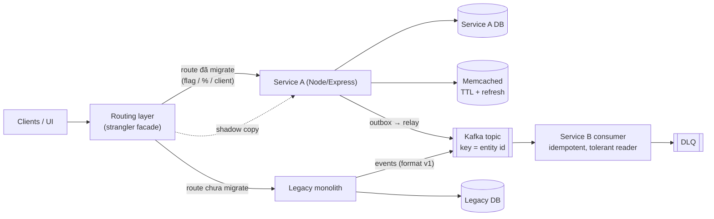
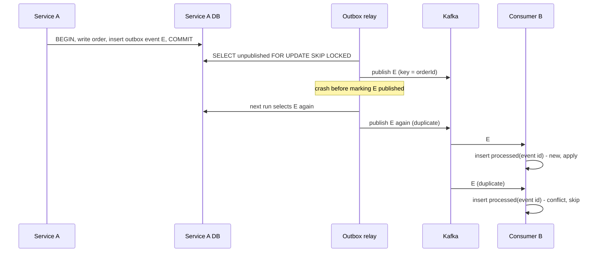

## Bối cảnh & vấn đề

P2 là migration một hệ thống back-office doanh nghiệp từ monolith sang các service Node/Express, với Kafka cho giao tiếp async, caching, data transformation, backward compatibility trong lúc migrate dần, và Memcached "TTL + refresh" giảm tải DB. Đây là dự án có nhiều quyết định kiến trúc nhất, nên interviewer có thể hỏi cả mười câu trong track: vì sao migrate (004), boundary (019), routing (020), Memcached (021, 058), DB write + Kafka (036), topic/partition (037), message format cũ (038), có chọn lại microservices không (043), và bạn tự build gì (057).

Bẫy lớn nhất của P2 là **ranh giới ownership**. Quyết định "đi microservices" và phần lớn boundary thường đã có trước khi bạn vào; bạn implement một số service, consumer, transformation. Nhận vơ quyết định kiến trúc rồi bị hỏi "vì sao không chọn modular monolith" là cách nhanh nhất để mất điểm. Câu trả lời tốt: "Quyết định migrate có trước khi tôi tham gia, lý do là X; phần của tôi là service Y và consumer Z; nhìn lại, tôi nghĩ…"

Bẫy thứ hai là **exactly-once**. Câu 036 có red flag "Claims exactly-once end-to-end without explaining how". Nếu dự án thật chỉ "publish sau commit, có retry", hãy nói đúng như vậy và nói rủi ro còn lại (commit xong, process chết trước khi publish thì event mất). Bài này có demo outbox chạy thật để bạn hiểu cơ chế, nhưng đừng kể outbox như thể dự án đã có nếu nó không có. Lý thuyết đầy đủ ở track [Microservices](/tracks/microservices/learn/architecture-styles) và [Messaging & Kafka](/tracks/messaging-kafka/learn/outbox-cdc-sagas).

## Khái niệm

### Lý do migrate và chi phí của microservices

Câu 004 cần **vấn đề cụ thể** của monolith: một thay đổi nhỏ phải deploy cả hệ thống và deploy hiếm, rủi ro; coupling làm team giẫm chân nhau; một phần cần scale khác hẳn phần còn lại; công nghệ cũ khó tuyển và khó bảo trì; DB chung là bottleneck. "Microservices là xu hướng" là red flag. Câu trả lời senior cũng nêu **chi phí**: network call thay cho function call (latency, lỗi một phần), không còn transaction xuyên service (consistency phải thiết kế), debugging phân tán, vận hành nhiều deployable hơn, cần CI/CD và observability trưởng thành. Fowler gọi đó là **microservice premium**.

### Bounded context và service đầu tiên

**Bounded context** là ranh giới trong đó một mô hình nghiệp vụ nhất quán (một "Order" ở billing khác "Order" ở fulfillment). Boundary của service nên theo **business capability và ownership dữ liệu**, không theo layer kỹ thuật (service "database", service "validation" là boundary sai). **Service đầu tiên** thường được chọn vì ít phụ thuộc, giá trị rõ, rủi ro thấp, hoặc ngược lại là điểm đau lớn nhất. Giai đoạn chuyển tiếp, service mới có thể đọc chung DB của monolith; mục tiêu cuối là mỗi service sở hữu dữ liệu riêng. Xem [Bounded context và ranh giới service](/tracks/microservices/learn/bounded-contexts).

### Strangler fig và verify parity

**Strangler fig** là cách migrate dần: một **facade** (gateway, reverse proxy, routing layer) đứng trước monolith, chuyển từng route sang service mới; route chưa migrate vẫn đi vào monolith. Chuyển dần theo feature flag, phần trăm traffic, hoặc theo tenant/client; rollback là đổi route về monolith. **Verify parity** (câu 020 follow-up): **shadow traffic** (gửi request tới cả hai, trả kết quả của monolith, so sánh và log khác biệt), contract test, so sánh số liệu nghiệp vụ (tổng tiền, số bản ghi) giữa hai đường. Xem [Strangler fig và anti-corruption layer](/tracks/microservices/learn/strangler-fig-acl).

### Dual write và transactional outbox

**Dual write** là khi một thao tác ghi vào hai hệ thống (DB và Kafka) mà không có transaction chung: commit DB rồi publish fail thì hệ thống khác không bao giờ biết; publish trước rồi commit fail thì hệ thống khác biết một điều không xảy ra. **Transactional outbox**: ghi event vào bảng `outbox` **trong cùng transaction** với thay đổi nghiệp vụ; một **relay** (polling hoặc CDC) đọc outbox và publish lên Kafka, đánh dấu đã gửi. Relay có thể publish rồi chết trước khi đánh dấu, nên delivery là **at-least-once**: consumer phải **idempotent**, dedupe theo event id. Nhiều relay chạy song song dùng `FOR UPDATE SKIP LOCKED` để không lấy cùng một dòng.

### Partition key và ordering

Kafka chỉ đảm bảo thứ tự **trong một partition**. **Key = entity id** (orderId) đưa mọi event của một entity vào cùng partition, nên chúng được xử lý theo thứ tự; không có thứ tự toàn cục giữa các entity. Số partition là giới hạn song song của một consumer group (mỗi partition tối đa một consumer trong group); tăng partition làm đổi mapping key → partition, nên event cũ và mới của cùng key có thể nằm ở hai partition trong thời gian chuyển. Topic theo **domain event** (`order.events`), consumer group theo service. Xem [Key, partitioner và ordering](/tracks/messaging-kafka/learn/keys-partitioning-ordering).

Follow-up câu 037 "consumer xử lý chậm bị đá khỏi group": nếu thời gian giữa hai lần `poll()` vượt `max.poll.interval.ms` (mặc định 5 phút trong Java client, verify với client Node bạn dùng), consumer bị coi là chết, group rebalance, partition chuyển cho consumer khác, và message đang xử lý dở được xử lý lại. Sửa: batch nhỏ hơn, xử lý nhanh hơn hoặc đẩy việc nặng sang worker riêng, tăng timeout có cân nhắc. Xem [Rebalance](/tracks/messaging-kafka/learn/rebalance-liveness).

### Schema evolution, tolerant reader và DLQ

**Schema evolution** an toàn: chỉ thêm field optional, không đổi nghĩa và không xoá field mà consumer còn dùng; có field `version` trong message hoặc schema registry với compatibility check. **Tolerant reader**: consumer bỏ qua field lạ, dùng default cho field thiếu, và map được các format cũ đã biết. **Poison message** (message không bao giờ xử lý được) nếu retry vô hạn trên cùng partition sẽ **chặn cả partition**, vì offset không bao giờ được commit; cần retry có giới hạn rồi đưa vào **DLQ** (dead letter queue) kèm alert, commit offset và đi tiếp. Xem [Poison pill, retry topic và DLQ](/tracks/messaging-kafka/learn/errors-retries-dlq) và [Schema evolution](/tracks/messaging-kafka/learn/schema-event-design).

### Memcached TTL + refresh

**TTL** giới hạn độ stale. **Refresh** nghĩa là làm mới **trước** khi dữ liệu thật sự hết hạn, để không có lúc mọi request cùng miss: lưu một **soft TTL** trong value (ngắn hơn TTL thật của Memcached); khi quá soft TTL, **một** request làm mới, các request khác tiếp tục dùng bản cũ. Memcached có lệnh **`add`** chỉ thành công nếu key chưa tồn tại, nên `add refresh-lock` là một lock rẻ và atomic. Vì sao Memcached thay vì Redis (câu 021): đơn giản, multi-thread, chỉ key-value; đủ khi chỉ cần cache (không cần data structure, persistence, pub/sub). Rất thường gặp là lý do thực tế: hạ tầng đã có sẵn Memcached. Nói thật lý do đó.

## Cơ chế hoạt động

### Strangler routing trong lúc migrate



Diagram là bản khái quát hoá; vẽ đúng hệ thống thật của bạn. Ba điểm để kể: routing layer quyết định đường đi theo từng route và có thể chuyển dần hoặc quay lại; monolith và service mới **cùng** publish vào Kafka trong giai đoạn chuyển tiếp, nên consumer phải đọc được cả format cũ lẫn mới; DLQ là nơi message không xử lý được nằm chờ, thay vì chặn partition.

### Outbox, relay và consumer idempotent



Đọc từ trên xuống: event được ghi trong cùng transaction với dữ liệu nghiệp vụ, nên không bao giờ có "order mà không có event" hay "event mà không có order". Relay có thể publish trùng (at-least-once); consumer dedupe bằng bảng `processed_events` trong **cùng transaction** với side effect của nó. Đây là cách duy nhất để nói "effectively once" một cách trung thực: không phải "Kafka đảm bảo exactly-once", mà "at-least-once + consumer idempotent".

## Ví dụ thực tế

### Outbox với relay crash và consumer dedupe (Postgres 17, chạy thật)

Topic Kafka ở đây là một mảng trong bộ nhớ (minh hoạ); phần outbox, `SKIP LOCKED` và dedupe chạy trên Postgres thật. Demo với Kafka thật ở [Dual write, outbox, CDC và saga](/tracks/messaging-kafka/learn/outbox-cdc-sagas).

```sql
CREATE TABLE bo_orders (id bigint PRIMARY KEY, status text NOT NULL);
CREATE TABLE outbox (id bigint GENERATED ALWAYS AS IDENTITY PRIMARY KEY, event_id uuid NOT NULL DEFAULT gen_random_uuid(),
  aggregate_id bigint NOT NULL, type text NOT NULL, payload jsonb NOT NULL, published_at timestamptz);
CREATE TABLE processed_events (consumer text, event_id uuid, PRIMARY KEY (consumer, event_id));
CREATE TABLE read_model (order_id bigint PRIMARY KEY, status text, applied_events int NOT NULL DEFAULT 0);
```

```ts
// outbox.ts
import pg from 'pg';
const pool = new pg.Pool({ connectionString: 'postgres://postgres:pw@localhost:55432/postgres', max: 10 });
const topic: { key: string; value: any }[] = [];   // stand-in for a Kafka topic (minh hoạ)

async function placeOrder(id: number) {             // business write + event in ONE transaction
  const c = await pool.connect();
  try {
    await c.query('BEGIN');
    await c.query("INSERT INTO bo_orders VALUES ($1, 'placed')", [id]);
    await c.query("INSERT INTO outbox (aggregate_id, type, payload) VALUES ($1, 'order.placed', jsonb_build_object('orderId', $1::bigint, 'v', 1))", [id]);
    await c.query('COMMIT');
  } finally { c.release(); }
}
async function relayOnce(name: string, crashAfterPublish = false) {
  const c = await pool.connect();
  try {
    await c.query('BEGIN');
    const { rows } = await c.query('SELECT id, event_id, aggregate_id, payload FROM outbox WHERE published_at IS NULL ORDER BY id LIMIT 5 FOR UPDATE SKIP LOCKED');
    for (const r of rows) topic.push({ key: String(r.aggregate_id), value: { eventId: r.event_id, ...r.payload } });
    if (crashAfterPublish) { await c.query('ROLLBACK'); return `${name}: published ${rows.length} then crashed before marking`; }
    await c.query('UPDATE outbox SET published_at = now() WHERE id = ANY($1)', [rows.map(r => r.id)]);
    await c.query('COMMIT');
    return `${name}: published ${rows.length}`;
  } finally { c.release(); }
}
async function consume(msg: { value: any }) {        // dedupe by event id in the same transaction as the side effect
  const c = await pool.connect();
  try {
    await c.query('BEGIN');
    const fresh = await c.query("INSERT INTO processed_events VALUES ('billing', $1) ON CONFLICT DO NOTHING", [msg.value.eventId]);
    if (fresh.rowCount === 1)
      await c.query("INSERT INTO read_model (order_id, status, applied_events) VALUES ($1, 'placed', 1) ON CONFLICT (order_id) DO UPDATE SET applied_events = read_model.applied_events + 1", [msg.value.orderId]);
    await c.query('COMMIT');
    return fresh.rowCount === 1;
  } finally { c.release(); }
}

for (let i = 1; i <= 8; i++) await placeOrder(i);
console.log(await relayOnce('relay-A', true));
console.log(...(await Promise.all([relayOnce('relay-A'), relayOnce('relay-B')])));
console.log(await relayOnce('relay-A'));
console.log('messages on topic:', topic.length, '(8 events, at-least-once)');
let applied = 0; for (const m of topic) if (await consume(m)) applied++;
console.log('applied:', applied, 'skipped duplicates:', topic.length - applied);
console.log((await pool.query('SELECT max(applied_events) AS max_applied_per_order, count(*) AS orders FROM read_model')).rows[0]);
await pool.end();
```

```text
relay-A: published 5 then crashed before marking
relay-A: published 5 relay-B: published 3
relay-A: published 0
messages on topic: 13 (8 events, at-least-once)
applied: 8 skipped duplicates: 5
{ max_applied_per_order: 1, orders: '8' }
```

Relay A publish 5 event rồi "chết" trước khi đánh dấu, nên lần chạy sau 5 event đó được publish lại. Hai relay chạy song song chia nhau 5 và 3 dòng nhờ `SKIP LOCKED`, không dòng nào bị lấy hai lần. Topic có 13 message cho 8 event; consumer áp dụng đúng 8, bỏ 5 bản trùng, và không order nào được áp dụng quá một lần. Đây là câu trả lời đầy đủ cho câu 036 và follow-up "relay publish trùng thì consumer làm gì".

### Message format cũ: crash loop vs tolerant reader + DLQ (chạy thật)

```ts
// tolerant.ts — monolith emits v1 { customer_id, amount }; new producer emits v2 { customerId, amountMinor, currency }
type OrderPlaced = { customerId: string; amountMinor: number; currency: string };
function strict(m: any): OrderPlaced {
  if (typeof m.amountMinor !== 'number') throw new TypeError(`amountMinor is ${typeof m.amountMinor}`);
  return m;
}
function tolerant(m: any): OrderPlaced {
  if (m.v === 2 || 'amountMinor' in m) return { customerId: String(m.customerId), amountMinor: m.amountMinor, currency: m.currency ?? 'USD' };
  if ('amount' in m) return { customerId: String(m.customer_id), amountMinor: Math.round(Number(m.amount) * 100), currency: 'USD' };
  throw new TypeError('unknown OrderPlaced shape');
}
const partition = [
  { offset: 0, value: { v: 2, customerId: 'c1', amountMinor: 1999, currency: 'USD' } },
  { offset: 1, value: { customer_id: 'c2', amount: '12.50' } },                 // v1 from the monolith
  { offset: 2, value: { garbage: true } },                                      // true poison
  { offset: 3, value: { v: 2, customerId: 'c3', amountMinor: 500, currency: 'EUR', coupon: 'X' } },
];
function run(name: string, parse: (m: any) => OrderPlaced, maxAttempts: number, useDlq: boolean) {
  const done: number[] = [], dlq: number[] = []; let attempts = 0, stuckAt: number | null = null;
  for (const msg of partition) {
    let ok = false;
    for (let a = 1; a <= maxAttempts && !ok; a++) { attempts++; try { parse(msg.value); ok = true; } catch {} }
    if (ok) done.push(msg.offset);
    else if (useDlq) dlq.push(msg.offset);  // park it, commit the offset, keep the partition moving
    else { stuckAt = msg.offset; break; }   // no DLQ: offset never committed, partition blocked
  }
  console.log(`${name.padEnd(30)} processed=${JSON.stringify(done)} dlq=${JSON.stringify(dlq)} stuckAt=${stuckAt} attempts=${attempts}`);
}
run('strict, retry (cap 10k demo)', strict, 10_000, false);
run('tolerant, 3 attempts + DLQ', tolerant, 3, true);
```

```text
strict, retry (cap 10k demo)   processed=[0] dlq=[] stuckAt=1 attempts=10001
tolerant, 3 attempts + DLQ     processed=[0,1,3] dlq=[2] stuckAt=null attempts=6
```

Consumer strict gặp message v1 ở offset 1 và kẹt ở đó: 10.000 lần thử (giới hạn của demo; production là vô hạn), offset 2 và 3 không bao giờ được xử lý, consumer lag tăng mãi. Đó chính là "crash loop" của câu 038. Tolerant reader xử lý được v1 (map `amount` chuỗi sang minor units) và v2 có field lạ (`coupon` bị bỏ qua); message thật sự hỏng (offset 2) vào DLQ sau 3 lần thử, partition tiếp tục chạy. Follow-up "replay từ DLQ sau khi sửa consumer": DLQ giữ message gốc kèm metadata (topic, partition, offset, lỗi); sau khi deploy fix, một job đọc DLQ và publish lại vào topic gốc hoặc topic retry; consumer idempotent nên replay một message đã từng xử lý một phần là an toàn.

### Memcached TTL + refresh với lock add (Memcached 1.6, chạy thật)

```ts
// memcached.ts — minimal text-protocol client; one command in flight at a time
import net from 'node:net';
const sock = net.connect(51211, '127.0.0.1'); let buf = ''; const waiters: ((s: string) => void)[] = [];
sock.on('data', d => { buf += d; if (/(END|STORED|NOT_STORED|DELETED|NOT_FOUND)\r\n$/.test(buf)) { const w = waiters.shift()!; const out = buf; buf = ''; w(out); } });
let chain: Promise<unknown> = Promise.resolve();
const cmd = (s: string) => { const p = chain.then(() => new Promise<string>(r => { waiters.push(r); sock.write(s); })); chain = p; return p; };
const get = async (k: string) => { const r = await cmd(`get ${k}\r\n`); const m = /VALUE \S+ \d+ \d+\r\n(.*)\r\n/.exec(r); return m ? m[1] : null; };
const set = (k: string, v: string, ttl: number) => cmd(`set ${k} 0 ${ttl} ${Buffer.byteLength(v)}\r\n${v}\r\n`);
const add = (k: string, ttl: number) => cmd(`add ${k} 0 ${ttl} 1\r\n1\r\n`).then(r => r.startsWith('STORED'));
const del = (k: string) => cmd(`delete ${k}\r\n`);

let dbCalls = 0;
const loadFromDb = async () => { dbCalls++; await new Promise(r => setTimeout(r, 30)); return { rates: [1, 2, 3] }; };
// Soft expiry in the value, longer hard TTL in Memcached. Past soft expiry ONE caller refreshes (add = lock).
async function getConfig(now: () => number) {
  const raw = await get('cfg');
  if (raw) {
    const { softExp, data } = JSON.parse(raw);
    if (now() < softExp) return { from: 'fresh', data };
    if (await add('cfg:refresh', 10)) {
      const data2 = await loadFromDb(); await set('cfg', JSON.stringify({ softExp: now() + 60_000, data: data2 }), 300); await del('cfg:refresh');
      return { from: 'refreshed', data: data2 };
    }
    return { from: 'stale-served', data };
  }
  const data = await loadFromDb(); await set('cfg', JSON.stringify({ softExp: now() + 60_000, data }), 300); return { from: 'miss', data };
}
let clock = Date.now(); const now = () => clock;
await del('cfg'); await del('cfg:refresh');
console.log('first   :', (await getConfig(now)).from, 'dbCalls', dbCalls);
clock += 61_000; // soft TTL passed
const burst = await Promise.all(Array.from({ length: 200 }, () => getConfig(now)));
const tally = burst.reduce((m, r) => (m[r.from] = (m[r.from] ?? 0) + 1, m), {} as Record<string, number>);
console.log('burst of 200 after soft expiry:', tally, 'dbCalls', dbCalls);
sock.end();
```

```text
first   : miss dbCalls 1
burst of 200 after soft expiry: { refreshed: 1, 'stale-served': 199 } dbCalls 2
```

Sau soft expiry, 200 request đồng thời: đúng 1 request làm mới (thắng `add`), 199 request nhận bản cũ ngay lập tức, DB chỉ thêm 1 lần gọi. Không có request nào phải chờ DB và không có stampede. Lock `add` có TTL 10 giây nên nếu request làm mới chết, lock tự hết và request sau thử lại. Đó là phần "how" của câu 021; phần "numbers" (DB QPS/CPU trước/sau) phải là số thật của bạn, với cách đo và loại confounder như ở [bài 3](/tracks/project-deep-dive/learn/numbers-incidents) (câu 058).

### Khung trả lời câu 057 và 043

**057** (bạn tự build gì, backward compat khó nhất): "Phần của tôi: `<service/endpoint/consumer cụ thể, transformation logic>`. Vấn đề backward compat khó nhất: `<thật: ví dụ client cũ vẫn gọi API cũ nên tôi viết adapter trong facade; format ngày/ID khác giữa monolith và service; message schema v1/v2>`. Kiểm bằng `<contract test, so sánh response, chạy song song>`. Hai đường chạy song song `<thời gian thật>`, quyết định cutover do `<ai>` dựa trên `<tỷ lệ khác biệt của shadow traffic bằng 0 trong n ngày>`." Xem [Backward compatibility](/tracks/microservices/learn/backward-compatibility).

**043** (có chọn microservices lại không): không có đáp án đúng, cần lập luận. Lợi ích thật đã đạt (deploy độc lập? scale riêng? có số không), chi phí thật đã trả (độ phức tạp vận hành, sự cố do mạng/consistency), phương án thay thế (**modular monolith** với boundary rõ trước, chỉ tách phần thật sự cần scale hoặc deploy riêng), và kết luận kèm điều kiện ("với team cỡ `<n>` và mức trưởng thành DevOps lúc đó, tôi sẽ bắt đầu bằng modular monolith và tách hai service có tải khác biệt"). Follow-up "dấu hiệu một boundary nên gộp lại": hai service luôn phải deploy cùng nhau, gọi nhau đồng bộ trên mọi request, chia sẻ bảng, hoặc một thay đổi nghiệp vụ luôn chạm cả hai (distributed monolith; xem [Distributed monolith](/tracks/microservices/learn/distributed-monolith-platform)).

## Trade-offs & lựa chọn thay thế

| Quyết định | Phương án | Ưu | Nhược |
|---|---|---|---|
| Kiến trúc | Modular monolith | Một deploy, transaction thật, đơn giản | Scale và deploy cùng nhau |
| Kiến trúc | Microservices | Deploy/scale độc lập, ownership rõ | Mạng, consistency, vận hành |
| DB + event | Publish sau commit + retry | Đơn giản | Mất event nếu chết giữa commit và publish |
| DB + event | Outbox + relay | Không mất event | Thêm bảng, relay, consumer phải idempotent |
| DB + event | CDC | Không sửa code ghi | Hạ tầng (Debezium...), event mức bảng |
| Routing | Big-bang cutover | Nhanh | Rollback khó, rủi ro cao |
| Routing | Strangler + flag + shadow | An toàn, rollback được | Hai đường chạy song song lâu |
| Cache | Memcached | Đơn giản, multi-thread | Không data structure, không persistence |
| Cache | Redis | Data structure, Lua, pub/sub | Single thread cho lệnh, vận hành nhiều tính năng hơn |
| Message schema | JSON + version field | Đơn giản | Không kiểm compatibility tự động |
| Message schema | Schema registry (Avro/Protobuf/JSON Schema) | Compatibility check khi publish | Thêm hạ tầng và quy trình |

Trong prose: với một back-office có vài team và yêu cầu tích hợp nhiều hệ thống, microservices có thể hợp lý; nhưng phần lớn lợi ích đến từ **boundary rõ ràng**, thứ mà modular monolith cũng có. Câu trả lời senior cho 043 thường là "boundary trước, tách service sau, chỉ khi có lý do đo được".

## Edge cases & failure modes

- **Outbox relay chậm** làm event trễ; theo dõi tuổi của dòng outbox chưa publish cũ nhất và alert.
- **Bảng outbox phình** nếu không dọn dòng đã publish; xoá theo batch hoặc partition theo thời gian.
- **Thứ tự event bị đảo** khi relay song song publish các event của cùng entity; relay phải giữ thứ tự theo `aggregate_id` (một relay cho mỗi nhóm key, hoặc publish theo `id` trong cùng partition key).
- **Consumer dedupe table phình**: giữ theo TTL lớn hơn khả năng redeliver tối đa (retention + thời gian replay DLQ).
- **Tăng partition** giữa chừng làm key chuyển partition; event mới của một entity có thể được xử lý trước event cũ còn nằm ở partition cũ.
- **Shadow traffic có side effect** (gửi email, ghi DB): shadow phải chạy ở chế độ chỉ đọc hoặc với side effect bị chặn.
- **Memcached restart** làm mất toàn bộ cache cùng lúc (không persistence); DB nhận toàn bộ tải: cần giới hạn và warm-up.
- **Deploy consumer mới** trong lúc producer vẫn gửi format cũ: consumer phải đọc được cả hai **trước** khi producer đổi.

## Pitfalls

- ❌ "Microservices scale tốt hơn" → ✅ vấn đề cụ thể của monolith + chi phí đã chấp nhận.
- ❌ Nhận quyết định kiến trúc có sẵn là của mình → ✅ tách quyết định có trước với phần bạn implement.
- ❌ Boundary theo layer kỹ thuật → ✅ theo business capability và ownership dữ liệu.
- ❌ Commit DB rồi publish Kafka như hai bước độc lập và gọi là "đảm bảo" → ✅ outbox/CDC, hoặc nói thật rủi ro còn lại.
- ❌ "Exactly-once end-to-end" → ✅ at-least-once + consumer idempotent (dedupe trong cùng transaction).
- ❌ Retry poison message vô hạn → ✅ retry giới hạn, DLQ, alert, replay sau khi sửa.
- ❌ Consumer strict với schema → ✅ tolerant reader, field optional, version, contract test.
- ❌ "Memcached giảm DB load đáng kể" không số → ✅ số trước/sau, chuẩn hoá, confounder, staleness chấp nhận được.

## Tóm tắt

- Lý do migrate phải là vấn đề cụ thể; nêu cả microservice premium.
- Boundary theo business capability; service đầu tiên chọn theo rủi ro/giá trị; nói rõ phần của bạn.
- Strangler: facade route dần theo flag/%, shadow traffic để verify parity, rollback bằng đổi route.
- Outbox + relay `SKIP LOCKED` + consumer dedupe theo event id; demo thật: 13 message cho 8 event, áp dụng đúng 8.
- Key = entity id giữ thứ tự trong partition; consumer chậm vượt `max.poll.interval.ms` gây rebalance.
- Tolerant reader + retry giới hạn + DLQ; demo thật: strict consumer kẹt ở offset 1, tolerant xử lý 3/4 và đưa 1 vào DLQ.
- Memcached soft TTL + lock `add`; demo thật: 200 request sau soft expiry chỉ 1 lần gọi DB.
- "Có chọn lại microservices không": lập luận bằng lợi ích đo được, chi phí thật và modular monolith.
