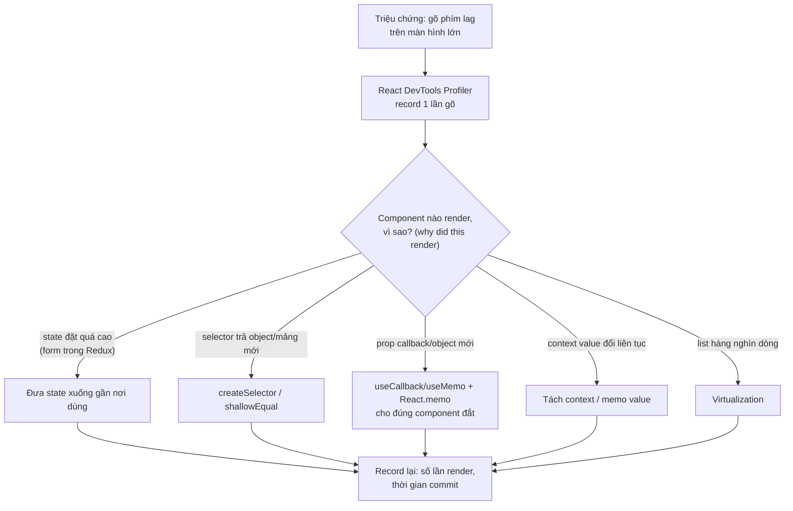
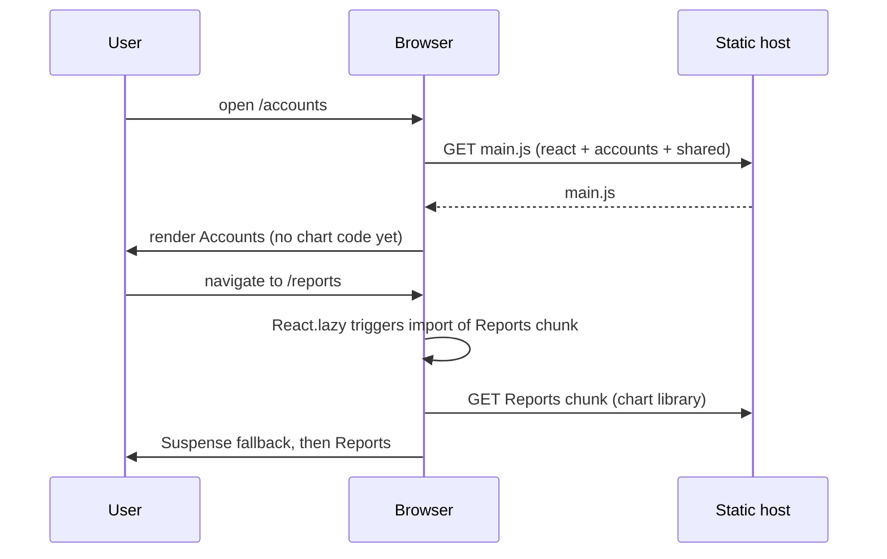

## Bối cảnh & vấn đề

P3 là một banking React SPA với Redux Toolkit và REST; các claim là reusable component architecture, memoization, code splitting, lazy loading, dynamic imports, business logic trong custom hooks và một core component library. Đây là dự án frontend thuần, nên interviewer dùng nó để đo **chiều sâu React**: bạn có đo trước khi tối ưu không, có phân biệt các loại state không, có thiết kế được component API cho nhiều team dùng không.

Rủi ro lớn nhất là trả lời bằng danh sách kỹ thuật: "Em dùng `React.memo`, `useMemo`, `useCallback`, `React.lazy`." Interviewer hỏi tiếp: "Màn hình nào chậm? Đo bằng gì? Component nào render bao nhiêu lần, vì sao? Sau khi sửa còn bao nhiêu?" Câu 039 có red flag "Wrapped every component in React.memo without profiling", và câu 059 yêu cầu **một** kết quả trước/sau cụ thể. Một bẫy khác: CV ghi "memorization" thay vì "memoization"; hãy nói đúng thuật ngữ.

Ràng buộc riêng của domain ngân hàng: không lộ thông tin client (khái quát hoá loại màn hình: dashboard tài khoản, lịch sử giao dịch, form chuyển tiền nhiều bước), và có các mối lo bảo mật đặc thù phía frontend (follow-up câu 005). Bài này cho khung trả lời và ba demo chạy thật. Lý thuyết đầy đủ ở [State management](/tracks/state-management/learn/state-taxonomy), [Memoization](/tracks/react/learn/memoization-compiler) và [Code splitting](/tracks/browser-web-perf/learn/code-splitting-bundles).

## Khái niệm

### Mô tả sản phẩm ở mức khái quát

Câu 005 cần bốn ý: loại màn hình (dashboard tài khoản, giao dịch, chuyển tiền, form nhiều bước), stack (React, Redux Toolkit, REST, component library nội bộ), thách thức kỹ thuật (màn hình dữ liệu lớn, nhất quán UI giữa nhiều team, form phức tạp có validate theo nghiệp vụ, bảo mật phía client), và phần bạn own. Không nêu tên ngân hàng, tên sản phẩm hay số liệu kinh doanh.

**Bảo mật frontend ngân hàng** (follow-up): XSS là rủi ro số một vì nó cho kẻ tấn công hành động thay user trong phiên (CSP chặt, không `dangerouslySetInnerHTML` với dữ liệu không tin cậy); token không nằm ở localStorage; không lưu dữ liệu nhạy cảm (số tài khoản đầy đủ, số dư) trong storage của trình duyệt hay trong Redux persist; timeout phiên khi không hoạt động; chống double submit cho giao dịch; supply chain (dependency, script bên thứ ba); và nhớ rằng mọi validate phía client chỉ là UX, server phải validate lại. Xem [XSS trong React](/tracks/browser-web-perf/learn/xss-react).

### Ba loại state

**Global client state** là dữ liệu do chính app tạo ra và nhiều màn hình cùng dùng: thông tin phiên, feature flag, UI state chia sẻ (tài khoản đang chọn). Đây là chỗ của Redux. **Local state** là dữ liệu chỉ một component (hoặc một cây nhỏ) cần: input của form, toggle, tab đang mở. Đặt nó trong Redux là nguyên nhân phổ biến của re-render thừa. **Server state** là bản sao của dữ liệu nằm trên server (danh sách giao dịch, số dư): nó có thể cũ, cần loading/error, cache, refetch và invalidation. Công cụ chuyên dụng (RTK Query, TanStack Query) xử lý những việc này; để server state trong slice thường thì bạn phải tự làm hết (cờ loading, thời điểm fetch, dedupe request, invalidate sau mutation).

Câu 022 và follow-up "có dùng RTK Query không" cần bạn nói thật dự án làm gì và vấn đề cụ thể nếu dùng slice: dữ liệu stale sau khi chuyển tiền xong (danh sách giao dịch không tự refetch), hai component cùng fetch một endpoint, cờ `isLoading` không đồng bộ. Xem [RTK Query](/tracks/state-management/learn/rtk-query).

### Selector và re-render

`useSelector` re-render component khi giá trị selector trả về **khác theo tham chiếu** (`===`) so với lần trước. Selector như `state => state.tx.items.filter(t => t.flagged)` trả **mảng mới mỗi lần** chạy, nên mọi action (kể cả action không liên quan, như gõ một ký tự vào ô ghi chú lưu trong Redux) làm component re-render. **`createSelector`** (reselect, có sẵn trong Redux Toolkit) memoize theo input: input không đổi thì trả lại cùng tham chiếu. Xem [Selectors và re-render](/tracks/state-management/learn/selectors-rerenders).

### Memoization có chủ đích

`React.memo` bỏ qua render khi props bằng nhau (so sánh nông); `useMemo`/`useCallback` giữ tham chiếu ổn định giữa các lần render. Chúng có **chi phí**: so sánh props mỗi lần, giữ bộ nhớ, code khó đọc hơn, và vô dụng nếu một prop luôn mới (object literal, callback không memo). Quy tắc: profile trước, memo đúng chỗ đắt, đo lại. Follow-up câu 039 "khi nào `useMemo` làm chậm hơn": khi phép tính rẻ hơn chi phí so sánh dependency, khi dependency đổi mỗi lần render (memo không bao giờ hit), hoặc khi nó giữ object lớn trong bộ nhớ. React Compiler (React 19) tự memoize nhiều trường hợp; nói được điều này cho thấy bạn cập nhật (verify trạng thái compiler với version bạn dùng).

### Code splitting và split point

**Code splitting** chia bundle để trình duyệt chỉ tải code cần cho màn hình hiện tại. **Route-based** (`React.lazy` + `Suspense` cho từng route) là điểm bắt đầu tự nhiên; **component/library-based** (dynamic `import()` cho thư viện nặng như chart, PDF, xử lý ngày, editor) nhắm vào những thứ to mà ít dùng. Chi phí: loading state, waterfall (chunk A tải xong mới biết cần chunk B), và quá nhiều chunk nhỏ tăng overhead request. Follow-up câu 059 "chọn split point thế nào": dựa trên bundle analyzer (module nào to), dữ liệu sử dụng (route nào ít người vào), và nguyên tắc "không split thứ hiển thị ngay trên màn hình đầu tiên".

### Component library và API

Một **core component library** tốt có API **nhất quán** (cùng tên prop cho cùng ý nghĩa: `size`, `variant`, `disabled`), ưu tiên **composition** (children, slot, compound component như `<Select><Select.Option/></Select>`) thay vì một component với 40 prop, hỗ trợ cả **controlled** và **uncontrolled**, **forward ref** và truyền `...rest` xuống phần tử DOM, **theming** qua design token, và **accessibility** (label, focus, ARIA, bàn phím). Phân phối dạng package nội bộ có **semver**; breaking change đi kèm deprecation warning, codemod hoặc hướng dẫn migrate, và một khoảng thời gian hỗ trợ song song (follow-up câu 023). Xem [Kiến trúc state, Context và component API](/tracks/react/learn/state-architecture).

### Custom hook chứa business logic

**Custom hook** gom state, effect và hành động của một mảnh nghiệp vụ (`useTransferForm`, `useAccountSummary`) để component chỉ lo hiển thị. Nguyên tắc: hook trả **dữ liệu và action**, không trả JSX; phần tính toán thuần (validate, chuyển đổi tiền, định dạng) tách ra hàm thuần để unit test không cần React; hook test bằng `renderHook` với API được mock. Bẫy: dependency array sai gây stale closure hoặc effect chạy lặp. Với tiền: không bao giờ dùng float (`19.99 * 100` không phải `1999`), parse chuỗi sang minor units.

## Cơ chế hoạt động

### Vòng profile → sửa → đo



Khi kể câu 039, giữ đúng thứ tự: triệu chứng → Profiler → nguyên nhân cụ thể → sửa đúng nguyên nhân → đo lại. Interviewer muốn nghe tên tool và tên nguyên nhân, không phải danh sách hook. Nguyên nhân phổ biến nhất trong app Redux là hai nhánh đầu: form state trong global store, và selector không memo.

### Route-based splitting



Người dùng vào `/accounts` không bao giờ tải thư viện chart. Đổi lại, lần đầu vào `/reports` có một khoảng loading; có thể prefetch chunk khi người dùng hover vào link hoặc khi trình duyệt rảnh để giảm khoảng đó.

## Ví dụ thực tế

### Selector trả mảng mới: 13 phím, 13 re-render (Redux Toolkit 2.13, chạy thật)

Script mô phỏng điều `useSelector` làm: sau mỗi action, chạy selector và "re-render" nếu kết quả khác tham chiếu. 13 lần gõ vào ô ghi chú (lưu trong Redux, một lỗi thiết kế khác).

```ts
// selectors.ts
import { configureStore, createSlice, createSelector } from '@reduxjs/toolkit';
const tx = createSlice({
  name: 'tx', initialState: { items: Array.from({ length: 5000 }, (_, i) => ({ id: i, amountMinor: i * 10, flagged: i % 50 === 0 })), draftNote: '' },
  reducers: { typeNote: (s, a) => { s.draftNote = a.payload; } },
});
const store = configureStore({ reducer: { tx: tx.reducer } });
type S = ReturnType<typeof store.getState>;

const naive = (s: S) => s.tx.items.filter(t => t.flagged);                    // new array every call
let computed = 0;
const memo = createSelector([(s: S) => s.tx.items], items => { computed++; return items.filter(t => t.flagged); });

let rendersNaive = 0, rendersMemo = 0;
let prevN = naive(store.getState()), prevM = memo(store.getState());
store.subscribe(() => {
  const n = naive(store.getState()); if (n !== prevN) rendersNaive++; prevN = n;
  const m = memo(store.getState()); if (m !== prevM) rendersMemo++; prevM = m;
});
for (const ch of 'transfer note') store.dispatch(tx.actions.typeNote(ch));   // 13 keystrokes into a global draft
console.log({ keystrokes: 13, rerendersNaive: rendersNaive, rerendersMemo: rendersMemo, memoRecomputed: computed });
```

```text
{ keystrokes: 13, rerendersNaive: 13, rerendersMemo: 0, memoRecomputed: 1 }
```

Selector naive: mỗi phím gõ, component danh sách giao dịch (5.000 dòng) re-render và lọc lại 5.000 phần tử, dù danh sách không đổi. `createSelector`: 0 re-render, lọc đúng 1 lần. Fix thứ hai, quan trọng không kém: ô ghi chú là local state của form, không thuộc Redux; đưa nó xuống component form thì action thậm chí không được dispatch. Đó là hai câu đầu tiên của câu trả lời 039, kèm số "trước/sau" thật của bạn đo bằng Profiler.

### Tách thư viện chart theo route: 139,5 KB → 69,0 KB gzip (chạy thật)

Một app tối giản: route `/accounts` và `/reports`, `/reports` dùng Chart.js 4.5. Build bằng esbuild 0.28, React 19.3, minify, production.

```tsx
// eager.tsx — everything in one bundle
import { createRoot } from 'react-dom/client';
import Reports from './Reports';
function App({ route }: { route: string }) { return route === '/reports' ? <Reports /> : <h1>Accounts</h1>; }
createRoot(document.getElementById('root')!).render(<App route={location.pathname} />);
```

```tsx
// lazy.tsx — split point at the route
import { lazy, Suspense } from 'react';
import { createRoot } from 'react-dom/client';
const Reports = lazy(() => import('./Reports'));
function App({ route }: { route: string }) {
  return route === '/reports' ? <Suspense fallback={<p>Loading…</p>}><Reports /></Suspense> : <h1>Accounts</h1>;
}
createRoot(document.getElementById('root')!).render(<App route={location.pathname} />);
```

```bash
esbuild eager.tsx --bundle --minify --jsx=automatic --format=esm --outdir=out-eager --define:process.env.NODE_ENV=\"production\"
esbuild lazy.tsx --bundle --minify --splitting --jsx=automatic --format=esm --outdir=out-lazy --define:process.env.NODE_ENV=\"production\"
```

```text
out-eager/eager.js                428695 B  gzip 139544 B
out-lazy/Reports-CMLXBOF6.js      204648 B  gzip  70457 B
out-lazy/chunk-JGCQRCZQ.js          1325 B  gzip    762 B
out-lazy/lazy.js                  222494 B  gzip  69018 B
```

Người dùng vào `/accounts` tải 69,0 KB + 0,8 KB gzip thay vì 139,5 KB: giảm khoảng một nửa JS ban đầu, chỉ bằng một split point. Chunk `Reports` (70,5 KB gzip) chỉ tải khi vào `/reports`. Đây là dạng câu trả lời câu 059 cần, nhưng với **số thật của dự án bạn**: "initial bundle `<trước>` → `<sau>` KB gzip, đo bằng `<bundle analyzer>`, LCP/TTI `<trước/sau>` theo `<Lighthouse / RUM>`". Chi phí phải nói: lần đầu vào `/reports` thêm một request và một loading state.

### Custom hook: logic thuần có test (node:test, chạy thật)

Hook `useTransferForm` của câu 060 gọi các hàm thuần dưới đây; tách chúng ra để test không cần React. `createSubmitter` là logic chặn double submit mà hook giữ trong `useRef` (follow-up câu 060).

```ts
// transfer.ts
export function toMinorUnits(input: string): number {
  const m = /^(\d+)(?:\.(\d{1,2}))?$/.exec(input.trim());
  if (!m) throw new Error('invalid amount');
  return Number(m[1]) * 100 + Number((m[2] ?? '').padEnd(2, '0'));
}
export function validateAmount(input: string, balanceMinor: number): string | null {
  if (input.trim() === '') return 'required';
  let v: number; try { v = toMinorUnits(input); } catch { return 'invalid'; }
  if (v === 0) return 'must be > 0';
  return v > balanceMinor ? 'exceeds balance' : null;
}
export function createSubmitter(send: (k: string) => Promise<void>) {
  let inFlight = false; let key = crypto.randomUUID();      // one idempotency key per intent
  return async () => {
    if (inFlight) return 'ignored';
    inFlight = true;
    try { await send(key); key = crypto.randomUUID(); return 'sent'; } finally { inFlight = false; }
  };
}
```

```ts
// transfer.test.ts
import { test } from 'node:test'; import assert from 'node:assert/strict';
import { toMinorUnits, validateAmount, createSubmitter } from './transfer.ts';
test('minor units without float math', () => {
  assert.equal(toMinorUnits('19.99'), 1999); assert.equal(toMinorUnits('0.1'), 10); assert.equal(19.99 * 100 === 1999, false);
});
test('validation', () => {
  assert.equal(validateAmount('', 1000), 'required'); assert.equal(validateAmount('1e3', 1000), 'invalid');
  assert.equal(validateAmount('10.01', 1000), 'exceeds balance'); assert.equal(validateAmount('10', 1000), null);
});
test('double click sends once with one idempotency key', async () => {
  const keys: string[] = [];
  const submit = createSubmitter(k => new Promise(r => { keys.push(k); setTimeout(r, 20); }));
  const results = await Promise.all([submit(), submit(), submit()]);
  assert.deepEqual(results, ['sent', 'ignored', 'ignored']); assert.equal(keys.length, 1);
});
```

```text
✔ minor units without float math (0.619791ms)
✔ validation (0.126792ms)
✔ double click sends once with one idempotency key (26.963333ms)
ℹ tests 3
ℹ pass 3
ℹ fail 0
```

Hook chỉ còn nối các mảnh: `useState` cho input, `validateAmount` cho lỗi, `useRef` giữ submitter qua các lần render, và gọi API. Test hook bằng `renderHook` chỉ cần kiểm tra phần nối (gọi API đúng tham số, trạng thái submitting) với API được mock (xem [Testing React](/tracks/react/learn/testing)). Chống double submit có hai lớp: client (in-flight guard + nút disabled) và server (idempotency key, xem [bài 8](/tracks/project-deep-dive/learn/p1-checkout-shifts)); client một mình không đủ vì retry mạng và hai tab vẫn gửi trùng.

### Khung trả lời câu 023

"Library có `<số component thật>` component, dùng ở `<số màn hình/team>`. Nguyên tắc API: `<prop nhất quán, composition, controlled/uncontrolled, forwardRef>`. Theming bằng `<token>`, accessibility `<label, focus, keyboard>`, tài liệu bằng `<Storybook>`, test bằng `<tool>`. Phân phối `<package nội bộ / monorepo>` theo semver. Một breaking change tôi xử lý: `<thật, ví dụ đổi API của Select>`: deprecate API cũ một version với warning, viết hướng dẫn/codemod, migrate các màn hình của team mình trước làm mẫu."

## Trade-offs & lựa chọn thay thế

| Quyết định | Phương án A | Phương án B | Khi nào chọn |
|---|---|---|---|
| Server state | Slice Redux + thunk | RTK Query / TanStack Query | B cho dữ liệu từ API; A chỉ khi rất đơn giản |
| Form state | Redux | Local state / form library | Local gần như luôn; Redux chỉ khi form trải nhiều màn hình và phải giữ khi điều hướng |
| Derived data | Tính trong component | `createSelector` | Selector khi dùng ở nhiều nơi hoặc tính đắt |
| Memo | Mọi nơi | Chỉ chỗ Profiler chỉ ra | Luôn B (hoặc để React Compiler lo) |
| Split | Theo route | Theo thư viện nặng | Route trước; thêm theo thư viện khi analyzer chỉ ra module lớn ít dùng |
| Component API | Một component nhiều prop | Compound component | B khi cấu trúc con linh hoạt (Select, Tabs, Table) |
| List lớn | Render hết | Virtualization | B khi hàng nghìn dòng; đổi lại tìm kiếm trong trang và a11y phức tạp hơn |

Lựa chọn quan trọng nhất cho app banking cỡ vừa là tách server state ra khỏi Redux: phần lớn bug "dữ liệu cũ sau khi giao dịch" và "spinner chạy mãi" biến mất khi cache server state có invalidation theo mutation.

## Edge cases & failure modes

- **Chunk load fail sau deploy** (người dùng đang mở app cũ, chunk cũ đã bị xoá): bắt lỗi trong error boundary và reload có kiểm soát; giữ chunk cũ một thời gian trên host.
- **Waterfall**: route chunk tải xong mới tải data rồi mới tải chunk con; prefetch data và chunk song song.
- **Selector có tham số** tạo instance memo dùng chung cho nhiều component với tham số khác nhau, cache size 1 bị đè liên tục; tạo selector theo instance hoặc dùng cache lớn hơn.
- **`React.memo` với prop `children`**: children là element mới mỗi lần render nên memo không bao giờ hit.
- **StrictMode chạy effect hai lần** ở dev làm lộ effect thiếu cleanup (subscribe đôi); đó là bug thật, không phải lỗi của StrictMode.
- **Breaking change trong library** dùng ở nhiều repo: các team nâng version ở tốc độ khác nhau; hỗ trợ hai major song song trong thời gian chuyển.
- **Persist Redux chứa dữ liệu nhạy cảm** vào localStorage: lộ qua XSS hoặc máy dùng chung; không persist dữ liệu tài chính.

## Pitfalls

- ❌ Liệt kê hook thay cho câu chuyện → ✅ triệu chứng → Profiler → nguyên nhân → sửa → đo lại.
- ❌ `React.memo` khắp nơi → ✅ memo đúng component đắt mà Profiler chỉ ra.
- ❌ Form state trong Redux → ✅ local state; Redux cho state dùng chung.
- ❌ Server state trong slice tự quản → ✅ RTK Query/TanStack Query với invalidation.
- ❌ Selector `filter`/`map` không memo → ✅ `createSelector`.
- ❌ "Code splitting làm nhanh hơn" → ✅ initial JS gzip trước/sau, LCP/TTI, và chi phí loading.
- ❌ Tiền dạng float trong form → ✅ parse chuỗi sang minor units, test riêng.
- ❌ Chống double submit chỉ bằng disable nút → ✅ in-flight guard + idempotency key phía server.

## Tóm tắt

- Mô tả P3 ở mức khái quát; nêu thách thức và phần bạn own; biết các mối lo bảo mật frontend ngân hàng.
- Ba loại state: global client (Redux), local (component), server (RTK Query/TanStack Query).
- Demo thật: selector trả mảng mới → 13 re-render cho 13 phím; `createSelector` → 0.
- Memoization có chủ đích sau khi profile; `useMemo` có thể làm chậm khi phép tính rẻ hoặc dependency luôn đổi.
- Demo thật: tách thư viện chart theo route → initial JS từ 139,5 KB xuống 69,0 KB gzip.
- Component library: API nhất quán, composition, controlled/uncontrolled, ref, token, a11y, semver + deprecation.
- Custom hook trả dữ liệu + action; logic thuần tách ra và test riêng (minor units, double submit).
