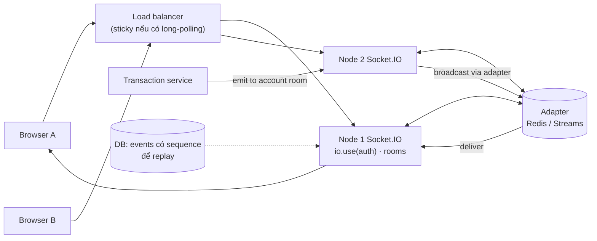
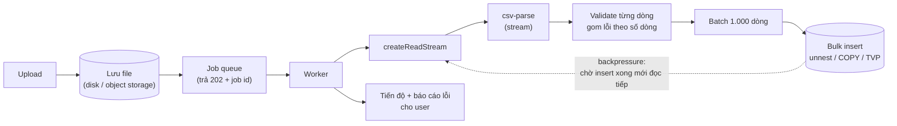

## Bối cảnh & vấn đề

P4 là dự án sớm nhất trên CV: các web app tài chính với Node/Express, SQL Server và PostgreSQL, React class components; claim là reliability, real-time bằng Socket.IO, unit test + load testing, và fix CSV processing bottleneck. Vì là dự án cũ (2022), interviewer thường không đòi chi tiết như P1, nhưng họ dùng nó để kiểm tra những mảng mà P1 không có: **long-lived connection**, **streaming dữ liệu lớn trong Node**, và **đo tải**.

Ba câu chuyện thất bại điển hình. Một: server Socket.IO chạy hai instance sau load balancer, user ở instance A không nhận được event phát từ instance B, và client dùng long-polling liên tục lỗi `400 Session ID unknown`. Hai: user upload file CSV 200 MB, API đọc cả file vào bộ nhớ bằng `readFile`, `split('\n')`, insert từng dòng; process ăn hết heap và crash, các request khác đang chạy trên cùng process chết theo. Ba: claim "load testing" nhưng không nhớ tool, scenario, target hay cái gì hỏng đầu tiên.

Bài này cho khung trả lời và demo chạy thật cho từng cơ chế. Lý thuyết sâu hơn ở [Kafka trong Node.js và realtime với Socket.IO](/tracks/messaging-kafka/learn/nodejs-clients-socketio), [Realtime và chat](/tracks/system-design/learn/realtime-chat), [Stream pipelines trong production](/tracks/nodejs/learn/stream-pipelines). Nhiều khả năng dự án thật chỉ chạy một instance Socket.IO; nếu vậy hãy nói thật, rồi nói bạn sẽ scale thế nào.

## Khái niệm

### "Real-time" cụ thể là gì

Câu 006 cần bạn định nghĩa real-time **cho sản phẩm của mình**: dữ liệu nào cần đẩy (trạng thái giao dịch, số dư, thông báo, giá), độ trễ chấp nhận được (dưới 1 giây? vài giây?), chiều dữ liệu (server → client, hay hai chiều), và hậu quả nếu lỡ một update (hiển thị số dư cũ vài giây khác với mất xác nhận giao dịch). "Real-time" trong app tài chính thường là "user thấy thay đổi trong vài giây mà không phải refresh", không phải hard real-time.

### Polling, SSE, WebSocket, Socket.IO

**Polling**: client hỏi định kỳ; đơn giản, tốn request, độ trễ bằng chu kỳ. **SSE** (Server-Sent Events): HTTP thường, server đẩy một chiều, trình duyệt tự reconnect và gửi `Last-Event-ID`; đủ cho thông báo và cập nhật trạng thái. **WebSocket**: kênh hai chiều, ít overhead mỗi message, nhưng tự lo reconnect, heartbeat, auth. **Socket.IO**: thư viện trên WebSocket (có fallback long-polling), thêm reconnect tự động, rooms/namespaces, ack, middleware auth, và adapter để chạy nhiều node. Follow-up "SSE có đủ không": nếu chỉ cần server → client, SSE thường đủ và đơn giản hơn; Socket.IO đáng khi cần hai chiều, ack, rooms, hoặc team đã quen. Nói rõ ai đã chọn Socket.IO và phần bạn implement.

### Auth và rooms

Socket.IO cho phép **middleware khi connect** (`io.use`) để verify token trước khi chấp nhận kết nối; token hết hạn trong lúc kết nối còn mở cũng phải được xử lý (ngắt hoặc yêu cầu refresh). **Room** là nhóm socket nhận cùng broadcast: join room theo user, account hoặc tenant **sau khi** kiểm tra quyền, để event của tài khoản A chỉ tới đúng người được xem tài khoản A.

### Nhiều node: adapter và sticky session

Mỗi instance Socket.IO chỉ biết socket kết nối với chính nó. **Adapter** (Redis adapter, Redis Streams adapter, hoặc adapter khác) chuyển broadcast giữa các node: `io.to('account:42').emit(...)` ở node B tới được socket nằm ở node A. **Sticky session** cần khi có HTTP long-polling: các request HTTP của một session phải về cùng một node (vì state của session nằm ở node đó). Chỉ dùng transport WebSocket thì không cần sticky, đổi lại mất fallback.

### Message bị lỡ khi reconnect

Khi mạng rớt, event phát trong lúc client offline bị mất nếu không có cơ chế bù. Hai cách. **Connection state recovery** (Socket.IO 4.6+): server giữ id và room của socket cùng các packet đã phát trong một khoảng thời gian; client reconnect trong khoảng đó được khôi phục và nhận phần còn thiếu; chỉ hỗ trợ một số adapter (verify với adapter bạn dùng). **Replay theo sequence**: mỗi event có sequence/timestamp lưu ở DB; client reconnect gửi `lastSeq`, server trả phần thiếu từ DB; bền hơn, chịu được cả server restart. Với dữ liệu tài chính, cách an toàn nhất là coi socket chỉ là **tín hiệu** ("có thay đổi") và client refetch trạng thái từ API khi reconnect.

### Stream, backpressure và batch

**Stream** xử lý dữ liệu từng phần thay vì nạp cả file vào bộ nhớ. **Backpressure** là cơ chế để phía đọc chậm lại khi phía ghi (DB) không theo kịp; `stream.pipeline()` và `for await` trên stream tự xử lý điều này, trong khi `on('data')` không có `pause()` thì không. **Batch insert** gom 500–1.000 dòng một lần ghi (multi-row insert, `unnest`/`COPY` ở Postgres, TVP hoặc bulk copy ở SQL Server) để giảm số round-trip. Xem [Buffer và stream](/tracks/nodejs/learn/buffers-streams).

### Load test

**Load test** đo hệ thống dưới tải mô phỏng để tìm **giới hạn** và **cái hỏng đầu tiên**. Thành phần: tool (k6, JMeter, Artillery, autocannon), **scenario** mô phỏng hành vi thật (login → xem dashboard → giao dịch, có think time), **ramp-up**, **target** có cơ sở (peak hiện tại × hệ số tăng trưởng), và **môi trường đại diện** (dữ liệu cỡ prod, cùng cấu hình pool/instance). Kết quả quan trọng không phải "chịu được X RPS" mà là "ở X RPS thì Y hỏng trước, vì Z". Xem [Back-of-envelope](/tracks/system-design/learn/back-of-envelope) để gắn kết quả với capacity.

### Class component sang hooks

`componentDidMount`/`componentDidUpdate`/`componentWillUnmount` map sang `useEffect` với dependency đúng và **cleanup**; `this.setState` (merge object) sang nhiều `useState` hoặc `useReducer`; instance field (`this.socket`, `this.timer`) sang `useRef`; `componentDidUpdate(prevProps)` so sánh props sang effect phụ thuộc vào đúng prop đó. **Error boundary** vẫn phải là class (`componentDidCatch`, `getDerivedStateFromError` chưa có hook tương đương) hoặc dùng thư viện bọc sẵn. Xem [Effects](/tracks/react/learn/effects).

## Cơ chế hoạt động

### Socket.IO nhiều node



Event phát ở node 2 tới được browser A (kết nối với node 1) nhờ adapter. Đường nét đứt là cơ chế bù bền vững: event có sequence trong DB để client reconnect lấy phần thiếu, kể cả khi node restart. Follow-up câu 024 "deploy version mới thì message đang bay ra sao": node bị tắt đóng mọi socket, client reconnect sang node khác; message phát trong khoảng đó mất nếu không có recovery hoặc replay; graceful shutdown nên ngừng nhận kết nối mới, báo client reconnect, rồi mới tắt (xem [Graceful shutdown](/tracks/nodejs/learn/graceful-shutdown)).

### CSV import bằng stream + batch



Ba quyết định tạo nên khác biệt. Không xử lý trong request HTTP: lưu file, trả `202` cùng job id, worker xử lý nền và báo tiến độ (request không treo, process API không bị CPU/memory của import kéo theo). Đọc bằng stream và `await` mỗi batch insert: stream tự dừng đọc khi DB chậm, nên bộ nhớ không phụ thuộc kích thước file. Validate từng dòng và gom lỗi theo số dòng để user sửa file. Follow-up câu 040 "dòng 40.000/100.000 lỗi: partial hay all-or-nothing": là quyết định business; partial cần idempotency (import lại không nhân đôi, ví dụ unique key theo `(file_id, row_number)` hoặc theo khoá nghiệp vụ), all-or-nothing cần staging table rồi swap/insert một lần khi toàn bộ hợp lệ.

## Ví dụ thực tế

### Rớt mạng và connection state recovery (Socket.IO 4.8, chạy thật)

```ts
// recovery.ts
import { createServer } from 'node:http';
import { Server } from 'socket.io';
import { io as connect } from 'socket.io-client';
const sleep = (ms: number) => new Promise(r => setTimeout(r, ms));

const http = createServer();
const io = new Server(http, { connectionStateRecovery: { maxDisconnectionDuration: 2 * 60_000 } });
io.use((socket, next) => socket.handshake.auth.token === 'ok' ? next() : next(new Error('unauthorized')));
io.on('connection', s => { if (!s.recovered) s.join('account:42'); console.log('server: connection, recovered =', s.recovered); });
await new Promise<void>(r => http.listen(0, r));
const port = (http.address() as any).port;

const got: number[] = [];
const c = connect(`http://localhost:${port}`, { auth: { token: 'ok' }, transports: ['websocket'] });
c.on('balance', (m: { seq: number }) => got.push(m.seq));
await new Promise(r => c.on('connect', r));
let seq = 0; const emit = () => io.to('account:42').emit('balance', { seq: ++seq });
emit(); emit(); await sleep(100);
c.io.engine.close();                         // simulate a network drop (not a clean disconnect)
await sleep(50); emit(); emit(); emit();     // emitted while the client is offline
await new Promise(r => c.once('connect', r));
await sleep(200); emit(); await sleep(100);
console.log('client received seq:', got.join(','), '| recovered on client:', c.recovered);

const bad = connect(`http://localhost:${port}`, { auth: { token: 'nope' }, transports: ['websocket'], reconnection: false });
await new Promise(r => bad.on('connect_error', e => { console.log('bad token:', e.message); r(null); }));
c.close(); io.close();
```

```text
server: connection, recovered = false
server: connection, recovered = true
client received seq: 1,2,3,4,5,6 | recovered on client: true
bad token: unauthorized
```

Event 3, 4, 5 được phát khi client offline; sau khi tự reconnect, client nhận đủ 1–6, đúng thứ tự, và vẫn ở room `account:42` mà không cần join lại (`recovered = true`). Token sai bị middleware chặn trước khi có kết nối. Giới hạn cần nói: recovery chỉ trong `maxDisconnectionDuration`, chỉ với adapter hỗ trợ (in-memory adapter ở demo này; Redis Streams adapter có hỗ trợ, Redis adapter cổ điển thì không, verify), và mất khi server restart. Vì vậy với số dư và giao dịch, sau reconnect không recovered, client nên refetch từ API.

### CSV: readFile vs stream (chạy thật)

File minh hoạ: 1,5 triệu dòng giao dịch, 98 MB. So sánh peak RSS và thời gian, rồi chạy lại cả hai với heap giới hạn 128 MB.

```ts
// mem-readfile.ts
import { readFileSync } from 'node:fs';
const t0 = Date.now(); let peak = 0; const tick = () => (peak = Math.max(peak, process.memoryUsage().rss));
const text = readFileSync('tx.csv', 'utf8'); tick();
const rows = text.split('\n').slice(1).filter(Boolean).map(l => l.split(',')); tick();
console.log(`readFile+split: ${rows.length} rows, ${Date.now() - t0} ms, peak RSS ${(peak / 1048576).toFixed(0)} MB`);
```

```ts
// mem-stream.ts
import { createReadStream } from 'node:fs';
import { pipeline } from 'node:stream/promises';
import { parse } from 'csv-parse';
const t0 = Date.now(); let peak = 0, rows = 0, batches = 0;
await pipeline(createReadStream('tx.csv'), parse({ columns: true }), async function* (src) {
  let batch: unknown[] = [];
  for await (const r of src) {
    batch.push(r); rows++;
    if (batch.length === 1000) { batches++; batch = []; await new Promise(setImmediate); peak = Math.max(peak, process.memoryUsage().rss); }
  }
  if (batch.length) batches++;
});
console.log(`stream+batch : ${rows} rows, ${batches} batches, ${Date.now() - t0} ms, peak RSS ${(peak / 1048576).toFixed(0)} MB`);
```

```text
readFile+split: 1500000 rows, 1127 ms, peak RSS 674 MB
stream+batch : 1500000 rows, 1500 batches, 6551 ms, peak RSS 103 MB
--- với --max-old-space-size=128
FATAL ERROR: Reached heap limit Allocation failed - JavaScript heap out of memory
stream+batch : 1500000 rows, 1500 batches, 6626 ms, peak RSS 89 MB
```

Kết quả đáng nói cả hai chiều. `readFile` + `split` **nhanh hơn** (1,1 giây so với 6,6 giây; csv-parse xử lý quote/escape đúng nên chậm hơn `split`) nhưng bộ nhớ tỷ lệ với kích thước file: 98 MB file thành 674 MB RSS, và với heap 128 MB thì process chết. Stream giữ khoảng 90–100 MB bất kể kích thước file. Bài học cho câu 040: bottleneck "crash" là bộ nhớ; bottleneck "chậm" thường nằm ở phía DB, như demo tiếp theo.

### Insert từng dòng vs batch (Postgres 17, chạy thật)

```ts
// insert.ts
import pg from 'pg';
const pool = new pg.Pool({ connectionString: 'postgres://postgres:pw@localhost:55432/postgres', max: 4 });
const rows = Array.from({ length: 20000 }, (_, i) => [`A${i % 5000}`, i % 10000, 'USD', '2026-03-01T10:00:00Z', `ref ${i}`]);
await pool.query('TRUNCATE tx_import');
let t0 = Date.now();
for (const r of rows) await pool.query('INSERT INTO tx_import VALUES ($1,$2,$3,$4,$5)', r);
console.log(`row-by-row : ${rows.length} rows, ${Date.now() - t0} ms`);
await pool.query('TRUNCATE tx_import');
t0 = Date.now();
for (let i = 0; i < rows.length; i += 1000) {
  const b = rows.slice(i, i + 1000);
  await pool.query(`INSERT INTO tx_import SELECT * FROM unnest($1::text[], $2::bigint[], $3::text[], $4::timestamptz[], $5::text[])`,
    [0, 1, 2, 3, 4].map(c => b.map(r => r[c])));
}
console.log(`batch 1000 : ${rows.length} rows, ${Date.now() - t0} ms`);
await pool.end();
```

```text
row-by-row : 20000 rows, 23497 ms
batch 1000 : 20000 rows, 235 ms
```

Gần 100 lần nhanh hơn, vì 20.000 round-trip (mỗi cái khoảng 1 ms qua mạng của Docker trên máy demo, cộng một lần commit cho mỗi câu) thành 20 round-trip. Trên mạng thật giữa app và DB khác máy, khoảng cách còn lớn hơn. Với SQL Server, tương đương là table-valued parameter hoặc bulk copy (`mssql` có `Table` + `bulk`; verify API với version driver bạn dùng). Câu 061 cần chính dạng số này nhưng của dự án bạn: "file `<kích thước/số dòng>`, trước `<thời gian, memory>`, sau `<thời gian, memory>`, tìm bằng `<đo từng giai đoạn / --cpu-prof / đếm query>`".

### Load test: cái hỏng đầu tiên là DB pool (autocannon, chạy thật)

Server HTTP tối giản, mỗi request chạy một query 20 ms qua pool `pg`; `connectionTimeoutMillis: 2000` nên request chờ connection quá 2 giây trả 503. Chạy autocannon 8 giây ở 5, 50 và 200 connection, với pool 5 rồi pool 20.

```ts
// server.ts
import { createServer } from 'node:http';
import pg from 'pg';
const pool = new pg.Pool({ connectionString: 'postgres://postgres:pw@localhost:55432/postgres', max: Number(process.env.POOL ?? 5), connectionTimeoutMillis: 2000 });
createServer(async (_req, res) => {
  try { await pool.query('SELECT pg_sleep(0.02)'); res.end('ok'); }
  catch (e) { res.statusCode = 503; res.end((e as Error).message); }
}).listen(4801);
```

```text
--- pool 5
conns   5: 35 req/s | p50 78 ms | p99 1886 ms | non-2xx 0 | errors 0 | timeouts 0
conns  50: 46 req/s | p50 936 ms | p99 1793 ms | non-2xx 0 | errors 0 | timeouts 0
conns 200: 112 req/s | p50 1752 ms | p99 2310 ms | non-2xx 215 | errors 0 | timeouts 0
--- pool 20
conns   5: 65 req/s | p50 36 ms | p99 707 ms | non-2xx 0 | errors 0 | timeouts 0
conns  50: 201 req/s | p50 149 ms | p99 1517 ms | non-2xx 0 | errors 0 | timeouts 0
conns 200: 220 req/s | p50 693 ms | p99 2004 ms | non-2xx 173 | errors 0 | timeouts 0
```

Con số tuyệt đối trên máy demo thấp (Docker Desktop thêm độ trễ, pg_sleep trong VM không chính xác), nên chỉ đọc **xu hướng**: với pool 5, tăng connection từ 5 lên 50 gần như không tăng throughput mà p50 nhảy từ 78 ms lên 936 ms, tức request đang **xếp hàng chờ connection DB**, không phải chờ CPU Node. Ở 200 connection, hàng đợi vượt 2 giây và 215 request bị 503. Tăng pool lên 20 tăng throughput khoảng 4 lần ở 50 connection. Đây là dạng câu trả lời câu 041 cần: "tool `<thật>`, scenario `<thật>`, target `<thật>`; cái hỏng đầu tiên là `<thật: pool, query chậm, CPU do JSON lớn, memory, số socket>`; tôi sửa `<…>` và đo lại `<…>`". Lưu ý autocannon là closed model (chờ response mới gửi tiếp), nên dưới tải nó gửi ít hơn và có thể đánh giá thấp latency (coordinated omission); k6 với `constant-arrival-rate` tránh được điều này. Follow-up "môi trường đại diện": dữ liệu cỡ prod (index và plan phụ thuộc kích thước bảng), cùng cấu hình pool/instance, không chạy load test từ cùng máy với server.

### Câu 062: một class component có socket sang hooks

```tsx
// minh hoạ (không chạy): `subscribe` là API giả định trả về { close() }
// Before (class): subscribe in didMount, re-subscribe when accountId changes, clean up in willUnmount
class BalanceTicker extends React.Component<{ accountId: string }, { balance?: number }> {
  state: { balance?: number } = {};
  componentDidMount() { this.sub = subscribe(this.props.accountId, b => this.setState({ balance: b })); }
  componentDidUpdate(prev: { accountId: string }) {
    if (prev.accountId !== this.props.accountId) { this.sub.close(); this.sub = subscribe(this.props.accountId, b => this.setState({ balance: b })); }
  }
  componentWillUnmount() { this.sub.close(); }
  sub!: { close(): void };
  render() { return <span>{this.state.balance ?? '…'}</span>; }
}

// After (hooks): one effect keyed on accountId; cleanup runs before re-subscribe and on unmount
function BalanceTicker({ accountId }: { accountId: string }) {
  const [balance, setBalance] = useState<number>();
  useEffect(() => {
    const sub = subscribe(accountId, setBalance);
    return () => sub.close();
  }, [accountId]);
  return <span>{balance ?? '…'}</span>;
}
```

Ba lifecycle method gộp thành một effect có dependency `[accountId]`: React chạy cleanup trước khi chạy lại effect với `accountId` mới và khi unmount, nên không còn nhánh `componentDidUpdate` so sánh `prevProps` dễ quên. Cạm bẫy: thiếu cleanup làm listener nhân đôi (StrictMode ở dev chạy effect hai lần để lộ đúng lỗi này); dependency thiếu làm subscribe vào account cũ. Quy trình an toàn: viết test hành vi bằng Testing Library **trước** khi đổi (render, đổi prop `accountId`, unmount, kiểm tra subscribe/close được gọi đúng), migrate từng component, giữ error boundary là class. Follow-up "vì sao error boundary vẫn cần class": React chưa có hook tương đương `getDerivedStateFromError`/`componentDidCatch` (verify với version React bạn dùng), nên dùng một class boundary dùng chung hoặc thư viện `react-error-boundary`.

## Trade-offs & lựa chọn thay thế

| Quyết định | Phương án | Ưu | Nhược |
|---|---|---|---|
| Đẩy dữ liệu | Polling | Đơn giản, qua mọi proxy | Tốn request, trễ bằng chu kỳ |
| Đẩy dữ liệu | SSE | HTTP thường, tự reconnect + Last-Event-ID | Một chiều, giới hạn kết nối/host trên HTTP/1.1 |
| Đẩy dữ liệu | Socket.IO | Hai chiều, rooms, ack, adapter | Thư viện riêng ở cả client và server, cần adapter khi nhiều node |
| Bù message | Connection state recovery | Có sẵn, không cần code | Giới hạn thời gian, adapter, mất khi restart |
| Bù message | Replay theo sequence từ DB | Bền | Phải lưu event, tự viết |
| CSV | Xử lý trong request | Đơn giản | Timeout, chiếm process API |
| CSV | Job nền + stream + batch | Ổn định, có tiến độ | Hạ tầng queue, UX bất đồng bộ |
| Import lỗi giữa chừng | Partial + idempotent | User sửa phần lỗi | Cần khoá dedupe |
| Import lỗi giữa chừng | All-or-nothing (staging) | Dữ liệu nhất quán | File lớn phải làm lại từ đầu |
| Load test tool | Closed model (autocannon, JMeter mặc định) | Dễ dùng | Coordinated omission |
| Load test tool | Open model (k6 arrival-rate) | Mô phỏng tải thật hơn | Cấu hình phức tạp hơn |

Với app tài chính nhỏ chạy một instance, Socket.IO một node cộng refetch khi reconnect là đủ; adapter và replay chỉ đáng khi có nhiều node hoặc yêu cầu không lỡ event. Nói được ngưỡng nào thì cần nâng cấp là judgment.

## Edge cases & failure modes

- **Token hết hạn khi socket còn mở**: middleware chỉ chạy lúc connect; cần kiểm tra định kỳ hoặc ngắt khi token hết hạn.
- **Hàng nghìn client reconnect cùng lúc** sau deploy (thundering herd): Socket.IO client có randomized backoff; server nên giới hạn tốc độ chấp nhận kết nối.
- **Proxy/load balancer cắt kết nối idle**: cần heartbeat (ping) ngắn hơn idle timeout của proxy.
- **Hai user upload cùng một file cùng lúc** (follow-up câu 061): hash file để phát hiện trùng, khoá theo `(tenant, file_hash)`, hoặc dedupe ở tầng dòng bằng khoá nghiệp vụ.
- **CSV với encoding/BOM, dấu phân cách khác, dòng có xuống dòng trong quote**: `split('\n')` sai; dùng parser đúng chuẩn và cấu hình encoding.
- **Một dòng CSV rất dài** làm parser giữ buffer lớn; đặt giới hạn kích thước record.
- **Load test trên môi trường nhỏ hơn prod** cho kết luận sai về cái hỏng đầu tiên; ghi rõ cấu hình khi báo cáo.
- **Effect cleanup không chạy** vì component bị giữ trong cache (Activity/keep-alive): kiểm tra hành vi subscribe khi ẩn/hiện.

## Pitfalls

- ❌ "Real-time" không định nghĩa → ✅ dữ liệu nào, độ trễ chấp nhận được, chiều dữ liệu, hậu quả khi lỡ.
- ❌ Chạy nhiều node Socket.IO không adapter → ✅ adapter + sticky session nếu có long-polling.
- ❌ Coi socket là nguồn dữ liệu duy nhất → ✅ socket là tín hiệu; refetch hoặc replay khi reconnect.
- ❌ `readFile` + `split` cho file upload → ✅ stream + parser + batch, chạy như job nền.
- ❌ Insert từng dòng → ✅ batch 500–1.000 dòng (`unnest`/`COPY`/TVP).
- ❌ "Đã load test" không có tool/scenario/target → ✅ nêu cả ba và cái hỏng đầu tiên.
- ❌ Đọc throughput của load test mà không nhìn latency → ✅ throughput đứng yên + latency tăng = đang xếp hàng ở đâu đó.
- ❌ Migrate class sang hooks rồi mới test → ✅ test hành vi trước, migrate từng component, effect có cleanup.

## Tóm tắt

- Real-time phải được định nghĩa theo sản phẩm; SSE đủ cho một chiều, Socket.IO khi cần hai chiều/rooms/ack.
- Nhiều node: adapter cho broadcast, sticky session cho long-polling, auth trong `io.use`, room theo quyền.
- Demo thật: rớt mạng, connection state recovery giao đủ 6/6 event; với tài chính vẫn refetch khi không recovered.
- Demo thật: CSV 98 MB, `readFile` 674 MB RSS và chết ở heap 128 MB; stream ~90–100 MB.
- Demo thật: 20.000 dòng insert từng dòng 23,5 giây, batch 1.000 dòng 0,24 giây.
- Load test: tool, scenario, target, môi trường; demo cho thấy DB pool hỏng trước (latency tăng, throughput đứng).
- Class → hooks: một effect có dependency và cleanup thay ba lifecycle; error boundary vẫn là class.
